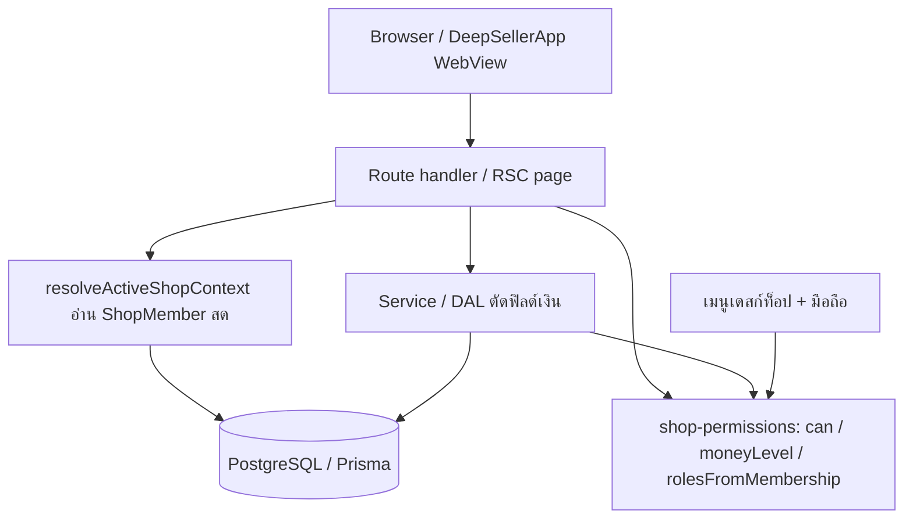
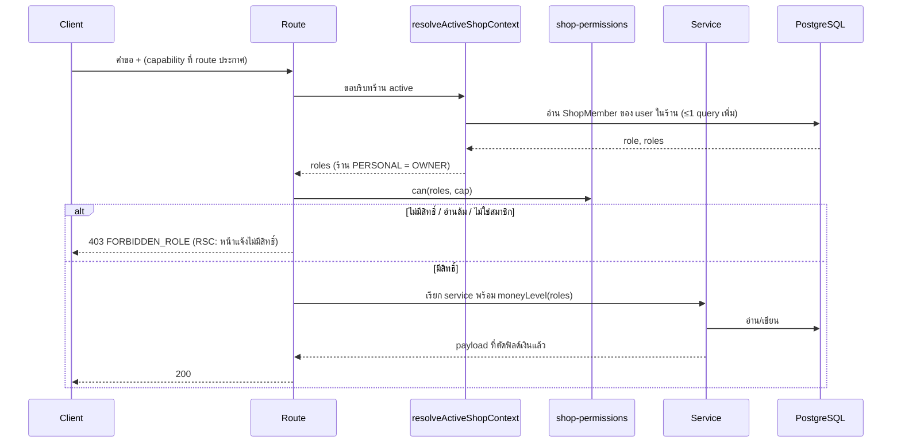

> **โมดูล:** 00071 - Shop Member Roles & Permissions
> **ประเภทเอกสาร:** System Design Spec (SDS)
> **เวอร์ชัน:** 1.0
> **วันที่จัดทำ:** 2026-10-10
> **สถานะ:** Draft (ออกแบบก่อน implement)
> **เจ้าของเอกสาร:** SA (ดู [[Feature-Docs-Ownership]])

# SDS: บทบาทและสิทธิ์สมาชิกร้าน (System Design Spec)

---

## 1. บทนำ & References

### 1.1 วัตถุประสงค์
ออกแบบการ implement ตัวตัดสินสิทธิ์กลาง ระดับเงิน และโมเดลบทบาท ตาม [[SRS]] สำหรับ DEV/QA/DevOps

### 1.2 ขอบเขตการออกแบบ
- เปลี่ยน: `src/lib/shop-permissions.ts` (ใหม่) · guard ของ route/RSC · service/DAL ที่คืนฟิลด์เงิน · `*-access` services · `shop-member.service` · invite services · schema 3 ตาราง (P2) · เมนู
- ไม่เปลี่ยน: สูตรยอดขาย/กำไร · โควตา/กติกาเจ้าของหลัก (00012) · ฝั่งผู้ซื้อ

### 1.3 เอกสารอ้างอิง
| เอกสาร | ความสัมพันธ์ |
|--------|-------------|
| [[SRS]] ของโมดูลนี้ | TFR-001..007 |
| [[BRD]] ของโมดูลนี้ | §8.3 ตารางสิทธิ์ SSOT · §8.5 เมนู |
| [[PRD]] ของโมดูลนี้ | เป้าหมายและ KPI |
| `docs/conventions/rule-must-be-enforced-not-described.md` | ทุกกฎต้องมีเทสที่แดงเมื่อละเมิด |
| `docs/conventions/session-exists-is-not-identity.md` | มี session ≠ รู้ว่าเป็นใคร |

---

## 2. Architecture Overview

### 2.1 มุมมองสถาปัตยกรรม
แยก "ตัดสิน" (pure) ออกจาก "บังคับ" (guard ที่ route) และ "ตัดข้อมูล" (service/DAL) ให้ตารางสิทธิ์อยู่ที่เดียว ตามแพตเทิร์นเดียวกับ `shop-member-rules.ts` ของ 00012 (กฎ pure + service เป็น I/O)

### 2.2 มุมมองการ Deploy (ถ้าจำเป็น)
ไม่มี topology ใหม่ — Next.js บน Vercel + Supabase เดิม · deploy P2 รัน `prisma migrate deploy` ในตัว (HR15)

---

## 3. Component Design

| Component | หน้าที่ (Responsibility) | Dependency (Submodule / Stack / Store) |
|-----------|--------------------------|-----------------------------------------|
| **`shop-permissions`** | ตาราง capability × บทบาท · `can` · `moneyLevel` · `rolesFromMembership` · ไม่มี I/O | TypeScript pure (`src/lib`) |
| **Guard (route/RSC)** | อ่านบทบาทสด → ถาม `can` → 403 `FORBIDDEN_ROLE` หรือหน้าแจ้งไม่มีสิทธิ์ | `resolveActiveShopContext` → Prisma `ShopMember` |
| **Money-level slicing** | ตัดฟิลด์เงินใน service/DAL ตาม `moneyLevel` | `src/services/*` |
| **Finance access (`expense/agent-report/product-report`)** | เลิกอ่าน `staffCanViewFinance` ใช้ "การเงินเต็ม = เจ้าของ" | `src/services/*-access.service` |
| **`shop-member.service`** | เปลี่ยน `role`/`roles` (เจ้าของเท่านั้น) · validate ชุดบทบาท | Prisma `ShopMember` |
| **Invite services** | เก็บ/ส่งต่อ `roles` จากคำเชิญ/ลิงก์ไปสู่ `ShopMember` ตอนยอมรับ | Prisma `ShopInvite`/`ShopInviteLink` |
| **Menu layer** | คำนวณเมนู/FAB/หน้าแรกจาก union ของบทบาท | `src/lib/seller-menu.ts` และจุดเมนูมือถือ — กำหนดตอน implement P3 |
| **Route inventory test** | แดงเมื่อพบ route ฝั่งร้านที่ไม่ประกาศ capability | Vitest (P3 S-12) |

---

## 4. Data Flow

### 4.1 Flow หลัก: ตัดสินสิทธิ์ต่อคำขอ

### 4.2 Flow กรณีล้มเหลว / ชดเชย (ถ้ามี)
- อ่านบทบาทล้ม → ปฏิเสธ (fail-closed) ไม่มี fallback เป็นเจ้าของ (P3 S-17)
- เปลี่ยนบทบาทระหว่างใช้งาน: คำขอถัดไปอ่านสดจึงได้สิทธิ์ใหม่ทันที (ไม่ต้อง invalidate cache)
- migration P2 ล้ม = deploy ไม่ขึ้น (HR15 ข้อ 3) ย้อนด้วยการไม่ใช้คอลัมน์ใหม่ (โค้ด P1 ไม่อ่าน `roles`)

---

## 5. Integration Points

| จุดเชื่อม | ประเภท (internal/external/3rd-party) | Protocol / Contract | ความเสี่ยงเมื่อล่ม |
|-----------|--------------------------------------|----------------------|---------------------|
| **กล่องแชทรวม 00037 / unread / แจ้งเตือน / ความคิดเห็น** | internal | กรองรายร้านตาม H1 | ร้านที่ไม่มี H1 รั่วเข้ากล่องรวม |
| **แดชบอร์ด 00069 / Command Center** | internal | ตัดวิดเจ็ตเงินตาม `moneyLevel` (ห้ามเปลี่ยนสูตร) | กราฟยอดขายรั่ว |
| **00067 แท็บการเงินร้านบริการ / 00016 P&L** | internal | F1 เจ้าของเท่านั้น | กำไรรั่ว |
| **00019-ext-mem** | internal | OOS-17 ปิดโดยอ้าง H1 (S-18) | — |
| **iShip** | external | S1 สร้างพัสดุ · S2 ตั้งค่า (OWNER) | — |

- **Timeout / Retry / Idempotency:** ไม่มีการเรียกภายนอกใหม่ · `PATCH members` ส่งซ้ำด้วยค่าเดิมได้ผลเดิม
- **สัญญา API เต็ม:** ดู [[API]]

---

## 6. Technical Decisions

### TD-001: เก็บ `role` เดิมและเพิ่ม `roles String[]` (แทนการเปลี่ยนค่า `role`)
- **ตัดสินใจ:** คง `ShopMember.role` = `'OWNER'|'ADMIN'` (เจ้าของ vs พนักงาน) เพิ่ม `roles` = หน้าที่ของพนักงาน
- **เหตุผล:** กติกา 00012 (BR-MR-01..08), `staffCountWhere()`, `canAccessShop`, โค้ดที่เช็ค `role==='OWNER'` ใช้ต่อได้ · migration additive ย้อนกลับได้
- **ทางเลือกที่ตัดทิ้ง:** แทนที่ `role` ด้วยรหัสบทบาทใหม่ — กระทบทุกที่ที่เช็ค role และ DROP/แก้ค่า ผิดกติกา additive
- **ผลกระทบ:** ต้องรักษา invariant `role='OWNER' ⇒ roles=[]` และ `role='ADMIN' ⇒ 1-4 ค่า` ที่ service (ไม่มี DB constraint — กำหนดตอน implement P2 ว่าจะเพิ่ม CHECK additive หรือไม่)

### TD-002: ตารางสิทธิ์เป็นโมดูล pure ตัวเดียว
- **ตัดสินใจ:** `src/lib/shop-permissions.ts` ไม่มี I/O · unknown cap = OWNER เท่านั้น
- **เหตุผล:** เทสได้ตรง (ทุกคู่ + mutation) · ทุกที่ (route, service, เมนู) อ่านที่เดียว (BRD §6.1)
- **ทางเลือกที่ตัดทิ้ง:** กระจายเช็ค role ตามไฟล์ — ตกหล่นและเมนูกับ API ไม่ตรงกัน
- **ผลกระทบ:** ทุก route ต้องประกาศ capability (P3) และมี inventory test

### TD-003: P1 ปิดการเงินก่อนมีโมเดลบทบาท
- **ตัดสินใจ:** P1 ใช้ `rolesFromMembership('OWNER'|'ADMIN')` → `['OWNER']`|`['MANAGER']` โดยไม่แตะ schema
- **เหตุผล:** แก้ "ทุกคนเห็นกำไรขาดทุน" ได้ทันทีโดยไม่ต้อง migrate · P2 แทนที่แหล่งบทบาทเป็น `roles` โดยผลต้องเท่าเดิม (S-9)
- **ทางเลือกที่ตัดทิ้ง:** รอทำพร้อม P2 — เงินรั่วนานขึ้น
- **ผลกระทบ:** ADMIN เสีย F1-F3/P3 ตั้งแต่ P1 (ผลข้างเคียงที่ตั้งใจ)

### TD-004: ตัดเงินที่ service/DAL ไม่ใช่ที่ UI
- **ตัดสินใจ:** ฟิลด์เงินเต็มไม่ออกจาก service ให้ผู้ที่ไม่ใช่เจ้าของ
- **เหตุผล:** ซ่อน UI ไม่กัน flight payload/API (กฎ 00016: "ต้องไม่อยู่ใน flight payload")
- **ทางเลือกที่ตัดทิ้ง:** ซ่อนเฉพาะ UI — รั่วทาง RSC payload
- **ผลกระทบ:** ทุก DAL ที่มีฟิลด์เงินต้องรับ `moneyLevel` หรือถูกครอบด้วย guard — รายชื่อผิวกำหนดตอน implement P1 (S-3)

### TD-005: ปฏิเสธด้วย 403 `FORBIDDEN_ROLE` และหน้าแจ้งไม่มีสิทธิ์
- **ตัดสินใจ:** API → 403 `{ error: 'FORBIDDEN_ROLE' }` · RSC → หน้าแจ้งว่าต้องขอบทบาทไหนจากเจ้าของ
- **เหตุผล:** แยกจาก `FORBIDDEN`/`NOT_OWNER` เดิม ให้ client แสดงข้อความถูก · ไม่ใช้ 404 เงียบ
- **ทางเลือกที่ตัดทิ้ง:** reuse `NOT_OWNER` — ความหมายไม่ตรง (บทบาทอื่นก็เป็นสมาชิก)
- **ผลกระทบ:** error code ใหม่ต้องมี route-catch map และข้อความไทย

---

## 7. Traceability

| SRS Requirement (TFR/NFR) | SDS Element (component / decision / flow) | สถานะ |
|---------------------------|-------------------------------------------|-------|
| TFR-001 | `shop-permissions` / TD-002 | Draft |
| TFR-002 | Guard / Flow 4.1 / TD-005 | Draft |
| TFR-003 | Money-level slicing / TD-004 | Draft |
| TFR-004 | Finance access / TD-003 | Draft |
| TFR-005 | `shop-member.service` + Invite services / TD-001 | Draft |
| TFR-006 | Guard + route inventory / Flow 4.1 | Draft |
| TFR-007 | Menu layer | Draft |
| NFR Performance | Flow 4.1 (≤1 query) | Draft |

---

## 8. สรุป (Summary)

เอกสาร SDS นี้กำหนด **การออกแบบเชิงระบบ** ของ **บทบาทและสิทธิ์สมาชิกร้าน (00071)** เพื่อให้ DEV นำไป implement, QA นำความเสี่ยงไปวางแผนทดสอบ, และ DevOps ประเมินผลกระทบ migration ได้ตรงกับข้อกำหนดใน [[SRS]]

**ลำดับการ build ที่แนะนำ:**
- P1: `shop-permissions` + เทส (S-2) → ตัดเงิน service/DAL (S-3) → guard ผิวการเงินเต็ม (S-4) → ยกเลิก `staffCanViewFinance` (S-5) → เมนูการเงิน (S-6)
- P2: schema + migration (S-8) → อ่านบทบาทจาก `roles` (S-9) → UI เชิญ/ตารางสมาชิก (S-10)
- P3: inventory + guard ทุก route (S-12) → แชท (S-13) → บิล/ออเดอร์ (S-14) → ฝ่ายช่าง (S-15) → เมนู (S-16) → fail-closed auth (S-17)

**Open Questions:**
- ต้องเพิ่ม DB CHECK additive เพื่อบังคับ invariant `roles` หรือไม่ — กำหนดตอน implement P2
- รายชื่อผิวการเงินที่ต้องตัด — กำหนดตอน implement P1 (S-3) จากผล `rg`
