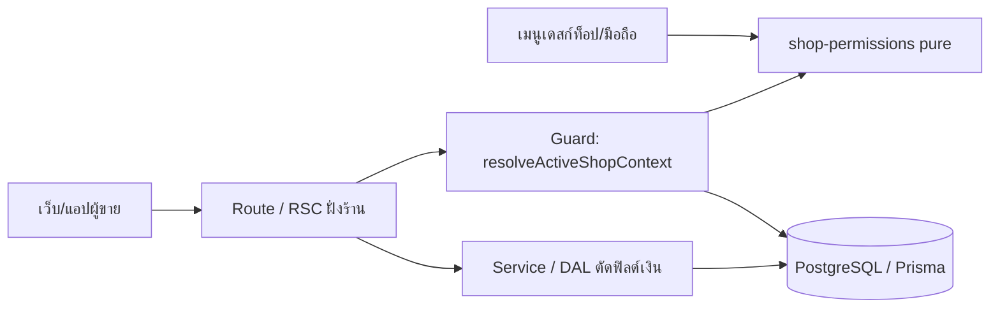
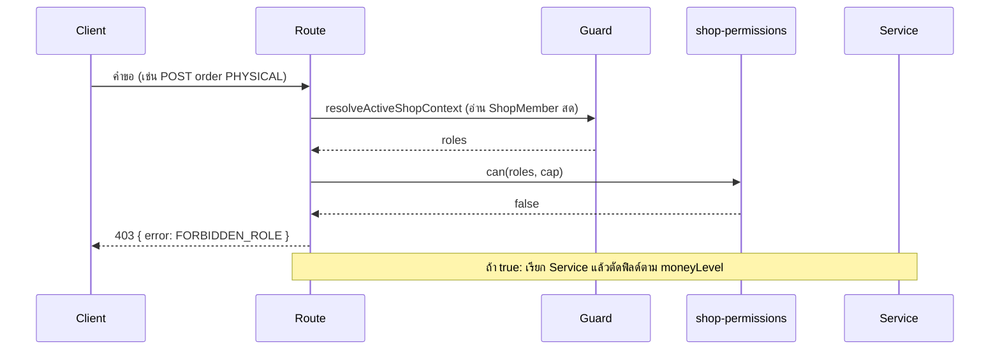
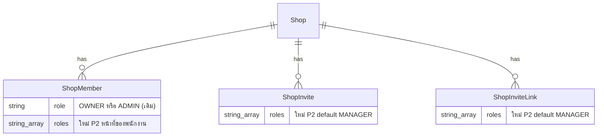

> **โมดูล:** 00071 - Shop Member Roles & Permissions
> **ประเภทเอกสาร:** Software Requirements Specification (SRS) - TECHNICAL
> **เวอร์ชัน:** 1.0
> **วันที่จัดทำ:** 2026-10-10
> **สถานะ:** P1 implement แล้ว (branch `feat/00071-member-roles`) · **P2 implement แล้ว** (branch `feat/00071-p2-roles` · P2+P3 ขึ้น main พร้อมกัน — มติ 0.1) · P3 ยังเป็นสเปก (ยังไม่มีโค้ด)
> **เจ้าของเอกสาร:** SA (ดู [[Feature-Docs-Ownership]])

# SRS: บทบาทและสิทธิ์สมาชิกร้าน (Software Requirements Specification — Technical)

---

## 1. บทนำ (Introduction)

### 1.1 วัตถุประสงค์ของเอกสาร
กำหนดข้อกำหนดเชิงเทคนิคของบทบาทสมาชิกร้าน 5 บทบาท ตัวตัดสินสิทธิ์กลาง ระดับการเห็นตัวเลขเงิน และการเปลี่ยน data model ให้ DEV/QA นำไป implement และทดสอบได้ตรงกับ [[BRD]] (ตารางสิทธิ์ SSOT = BRD §8.3)

### 1.2 ขอบเขตเชิงระบบ (System Scope)
- **ในขอบเขต:** โมดูลบริสุทธิ์ `src/lib/shop-permissions.ts` · ชั้น guard ของ route/RSC ฝั่งร้าน · การตัดฟิลด์เงินที่ service/DAL · คอลัมน์ `roles` ของ `ShopMember`/`ShopInvite`/`ShopInviteLink` · UI เชิญ/ตารางสมาชิก · เมนูเดสก์ท็อป+มือถือที่อ่านกฎเดียวกัน
- **นอกขอบเขต:** ตาม baseline OOS-1..OOS-15 (มอบหมายงานรายคน · บทบาทกำหนดเอง · audit log · PERSONAL มีสมาชิก · ฝั่งผู้ซื้อ `/api/app/*` · DROP คอลัมน์) — ดู `docs/scope/2026-10-10-00071-scope-baseline.md`
- **ลำดับส่งมอบ (ขึ้น prod ได้ทีละ phase):** P1 ปิดการเงิน → P2 โมเดลบทบาท → P3 บังคับรายบทบาท

### 1.3 เอกสารอ้างอิง (References)
| เอกสาร | ความสัมพันธ์ |
|--------|-------------|
| [[PRD]] ของโมดูลนี้ | เป้าหมายธุรกิจ · ขอบเขต · มติ Q-1..Q-7 |
| [[BRD]] ของโมดูลนี้ | FR-RP-01..10 · BR-RP-01..16 · §8.2 ระดับเงิน · §8.3 ตารางสิทธิ์ · §8.5 เมนูมือถือ |
| `docs/20 - Features/00012 - Shop Staff Invite Links/EXTENSIONS-2026-10-05-member-roles.md` | กติกาสมาชิก/เจ้าของหลัก/โควตา BR-MR-01..08 ที่ต้องคงเดิม |
| `docs/scope/2026-10-10-00071-scope-baseline.md` | S-1..S-18 · OOS · Definition of Done ต่อ phase |
| `docs/SRS.md` (root) | §6.71 data model · §7.27 API · §8.14 enum · §9.11 authorization |

### 1.4 นิยามและตัวย่อ (Definitions & Acronyms)
| คำ/ตัวย่อ | ความหมาย |
|-----------|----------|
| **ShopRole** | รหัสบทบาทใน `roles`/capability: `OWNER` · `MANAGER` (ผู้ดูแล) · `CHAT` (ตอบแชท) · `BILLING` (เปิดบิล) · `TECHNICIAN` (ฝ่ายช่าง) |
| **`ShopMember.role`** | คอลัมน์เดิม String `'OWNER'\|'ADMIN'` — ความหมายคงเดิม = เจ้าของ vs พนักงาน (ไม่เปลี่ยนค่า) |
| **`ShopMember.roles`** | คอลัมน์ใหม่ `String[]` = ชุดหน้าที่ของพนักงาน (1-4 ค่าจาก MANAGER/CHAT/BILLING/TECHNICIAN) · เจ้าของ = ว่าง |
| **capability id** | รหัสสิทธิ์ตาม BRD §8.3: H1-H3, O1-O7 (รวม O2s), D1, S1-S2, P1-P3, Q1-Q2, C1-C3, F1-F3, T1-T4 (ระวัง: `P1-P3` ที่นี่คือรหัส capability สินค้า ไม่ใช่ phase) |
| **MoneyLevel** | `FULL` (เจ้าของ) · `PER_ORDER` (ผู้ดูแล ตอบแชท เปิดบิล) · `NONE` (ฝ่ายช่าง) |
| **FORBIDDEN_ROLE** | error code ของการไม่มีสิทธิ์ตามบทบาท — HTTP 403 `{ error: 'FORBIDDEN_ROLE' }` |
| **เจ้าของหลัก** | `Shop.userId` (BR-MR-02) |

---

## 2. ภาพรวมสถาปัตยกรรม (Architecture Overview)

### 2.1 บริบทระบบ (System Context)



### 2.2 องค์ประกอบหลัก (Components)
| Component | หน้าที่ | Submodule / Stack |
|-----------|---------|-------------------|
| **`src/lib/shop-permissions.ts`** | ตารางสิทธิ์ §8.3 · `can` · `moneyLevel` · `rolesFromMembership` — pure ไม่มี I/O | TypeScript (src/lib) |
| **Guard ชั้น route/RSC** | อ่านบทบาทสด → ถาม `can` → 403 `FORBIDDEN_ROLE` / หน้าแจ้งไม่มีสิทธิ์ | Next.js route handler + RSC |
| **Service/DAL ตัดเงิน** | ตัดฟิลด์ตาม `moneyLevel` ก่อนส่งออก (BR-RP-09) | `src/services/*` |
| **เมนู** | ซ่อน/แสดงตาม capability (§8.5) | `src/lib/seller-menu.ts` และจุดเมนูมือถือ — กำหนดตอน implement P3 (S-16) |
| **สมาชิก/เชิญ** | บันทึก/ตรวจ `roles` | `shop-member.service` และ invite service |

### 2.3 มุมมองการ Deploy (Deployment View)
ไม่เพิ่ม service/infra ใหม่ — รันใน Next.js บน Vercel เดิม · P2 มี migration (push `main` = `prisma migrate deploy` บน prod, HR15)

---

## 3. ข้อกำหนดเชิงฟังก์ชันเชิงเทคนิค (Technical Functional Requirements)

### TFR-001: ตารางสิทธิ์และตัวตัดสินกลาง
- **Trace to:** FR-RP-02, BR-RP-03, BR-RP-11, §8.3
- **คำอธิบายเชิงเทคนิค:** `src/lib/shop-permissions.ts` เป็น SSOT ของตาราง capability × 5 บทบาท (ตรง BRD §8.3 ทุกเซลล์) · `can(roles, cap)` = มีบทบาทใดบทบาทหนึ่งที่ได้ cap (union) · `moneyLevel(roles)` = ระดับสูงสุดของทุกบทบาท (FULL > PER_ORDER > NONE) · cap ที่ไม่อยู่ในตาราง = OWNER เท่านั้น · T4 = เจ้าของหลัก (ตัดสินที่ guard ด้วย `Shop.userId` ไม่ใช่ที่ตาราง) · `rolesFromMembership('OWNER'|'ADMIN')` ใช้ใน P1 → `['OWNER']` | `['MANAGER']`
- **Precondition:** ไม่มี (pure)
- **Postcondition:** ผลเดียวกันทุกครั้งสำหรับ input เดียวกัน · ไม่ throw กับ input ว่าง (`roles=[]` → `can` เป็น false, `moneyLevel` เป็น NONE)
- **Error / Edge cases:** บทบาทที่ไม่รู้จักใน `roles` ถูกข้าม (ไม่ให้สิทธิ์) · **P1 implement แล้ว:** export จริง = `ShopRole` · `MoneyLevel` · `Capability` · `CAPABILITY_ROLES` · `can` · `moneyLevel` · `rolesFromMembership` (`role` ที่ไม่ใช่ OWNER/ADMIN → `[]` fail-closed) · helper คู่กัน: `src/lib/forbidden-role.ts` (`forbiddenRoleResponse()` → 403 `{error:'FORBIDDEN_ROLE'}`) · `src/lib/shop-owner.ts` (`isShopOwnerRole`, `isShopOwnerOfShop(shopId,userId,cap='F3')` สำหรับ route ที่ร้านมาจากเธรด) · `src/lib/dashboard-money.ts` · `src/lib/order-cost-redact.ts` · `src/lib/agent-revenue-redact.ts` · เทส `src/lib/shop-permissions.test.ts`

### TFR-002: Guard ฝั่งเซิร์ฟเวอร์ (fail-closed)
- **Trace to:** FR-RP-02, S-4, S-12, S-17
- **คำอธิบายเชิงเทคนิค:** ทุก route ฝั่งร้านประกาศ capability แล้วถามตัวตัดสินกลางด้วยบทบาทที่อ่านสดจาก `ShopMember` (ผ่าน `resolveActiveShopContext` ≤ 1 query เพิ่ม) · ไม่มีสิทธิ์ → API 403 `{ error: 'FORBIDDEN_ROLE' }` · RSC แสดงหน้าแจ้งไม่มีสิทธิ์ (ไม่ใช่ 404 เงียบ) · ร้าน PERSONAL = เจ้าของเสมอ
- **Precondition:** มี session และร้าน active
- **Postcondition:** เปลี่ยนบทบาทแล้วคำขอถัดไปใช้สิทธิ์ใหม่ (ไม่อาศัยค่าใน JWT)
- **Error / Edge cases:** อ่านบทบาทล้ม/ไม่ใช่สมาชิก → ปฏิเสธ · เลิก fallback `activeShopRole="OWNER"` สำหรับร้าน BUSINESS ใน `src/lib/auth.ts` (P3 S-17) · เทส inventory แดงเมื่อพบ route ที่ไม่ประกาศ capability (P3 S-12)

### TFR-003: ตัดฟิลด์เงินที่ต้นทาง
- **Trace to:** FR-RP-03, BR-RP-08, BR-RP-09, S-3
- **คำอธิบายเชิงเทคนิค:** service/DAL คืน payload ตาม `moneyLevel` — `NONE`: ไม่มีฟิลด์ราคา ยอด การชำระ ต้นทุน · `PER_ORDER`: มีราคาขาย/ยอด/การชำระรายใบ ไม่มีต้นทุน กำไร ยอดรวมหลายใบ ยอดสะสมลูกค้า ยอดกระเป๋า · `FULL`: เท่าเดิม · ห้ามซ่อนที่ UI อย่างเดียว · ห้ามเปลี่ยนนิยาม/สูตร ยอดขาย/กำไร (OOS-10, HR16)
- **Precondition:** ผู้เรียกผ่าน guard ของ capability นั้นแล้ว
- **Postcondition:** คีย์การเงินเต็มไม่อยู่ใน payload ของผู้ที่ไม่ใช่เจ้าของ (รวมใน RSC flight payload)
- **Error / Edge cases:** ผิวที่ไม่ได้ไล่ = ความเสี่ยง R-1 → แนบผล `rg` ผิวเงินใน PR (S-3)
- **P1 implement แล้ว (วิธีตัด):** "ไม่มีคีย์" ไม่ใช่ `null`/`0` ยกเว้น `revenue` ของรายงานแอดมินโหมด SELF และ `balance` ของ `/api/chat/ai-quota` ที่เป็น `null` (สัญญาเดิมเป็นตัวเลข) · `Product.cost` → `serializeProduct(…,{canSeeCost})` + `exportStockToCsv({includeCost})` · `items[].cost` → `stripOrderItemCost` + `updateOrder` `keepLineCosts` · ยอดสะสมลูกค้า → `redactCustomerSpend` · แดชบอร์ด/Command Center → `dashboardMoney` + `redactCommandCenterData` · รายละเอียด endpoint ดู [[API]] §4.4

### TFR-004: ผิวการเงินเต็มเจ้าของเท่านั้น และยกเลิก `staffCanViewFinance`
- **Trace to:** FR-RP-03, FR-RP-04, BR-RP-10
- **คำอธิบายเชิงเทคนิค:** `/sales` `/expenses` `/reports/*` `/wallet` และ API การเงิน = F1/F2/F3 (เจ้าของเท่านั้น) · ตัดสินสิทธิ์ของ `expense/agent-report/product-report access` เลิกอ่าน `Shop.staffCanViewFinance` ใช้กฎ "การเงินเต็ม = เจ้าของ" · ถอดสวิตช์หน้าสมาชิก · ลบ `PATCH /api/business/shops/[shopId]/finance-visibility` (P1) · คอลัมน์ยังอยู่ใน schema (deprecated ไม่ drop — OOS-9)
- **Precondition:** —
- **Postcondition:** `rg "staffCanViewFinance" src` ไม่เหลือที่ตัดสินสิทธิ์ · ธง `true` แล้ว ADMIN ยังถูกปฏิเสธ
- **Error / Edge cases:** ผู้ใช้เก่าที่ยิง endpoint ที่ลบแล้ว → **ลบไฟล์ route ทิ้ง (ไม่ทำ 410)** จึงได้ 404 ตามปกติของ Next · **P1 implement แล้ว:** `resolveExpenseAccess` / `resolveAgentReportAccess` / `resolveProductReportAccess` ใช้ F1 (ผู้ไม่ใช่เจ้าของ → `STAFF_NOT_ALLOWED` / `SELF` / ปฏิเสธ) · เหลือ `staffCanViewFinance` ในโค้ดเฉพาะคอมเมนต์ · ด่านกันลืมผิวเงินใหม่: `src/lib/__tests__/finance-surface-guard.test.ts`

### TFR-005: โมเดลข้อมูลบทบาท (P2 — **implement แล้ว**)
- **Trace to:** FR-RP-01, FR-RP-08, FR-RP-10, BR-RP-02, BR-RP-04, BR-RP-12, BR-RP-16
- **สถานะจริง (P2):** migration `20261010120000_shop_member_roles` + DB CHECK 3 ตัว (`ShopMember_roles_check` · `ShopInvite_roles_check` · `ShopInviteLink_roles_check` — ดู [[DATABASE]] §3.5) · `STAFF_ROLES` + `rolesFromMembership(role, roles)` ใน `src/lib/shop-permissions.ts` · `validateAssignableRoles` / `planMemberRoleChange` ใน `src/lib/shop-role-assignment.ts` · `StaffRolesSchema` / `ChangeMemberRoleSchema` ใน `src/lib/validations.ts` · UI ตัวเลือกบทบาท `src/lib/shop-role-picker.ts` · ศัพท์: `role` = ประเภทสมาชิก (เจ้าของ/พนักงาน) · "ผู้ดูแล" = บทบาท MANAGER
- **คำอธิบายเชิงเทคนิค:** เพิ่ม `ShopMember.roles String[] @default([])` · `ShopInvite.roles String[] @default(["MANAGER"])` · `ShopInviteLink.roles String[] @default(["MANAGER"])` · migration backfill แถว `role='ADMIN'` → `roles=['MANAGER']` (รวมคำเชิญ/ลิงก์ค้าง) · `ShopMember.role` ไม่เปลี่ยน · validation: 1-4 ค่า ไม่ซ้ำ ต้องอยู่ใน {MANAGER, CHAT, BILLING, TECHNICIAN} · เจ้าของ (`role='OWNER'`) → `roles=[]` (เลื่อนเป็นเจ้าของ = ล้างชุด) · เชิญเป็นเจ้าของผ่าน invite ไม่ได้ · ร้าน PERSONAL ไม่มีบทบาท
- **Precondition:** ผู้เรียกเป็นเจ้าของ (T2)
- **Postcondition:** ถือ 3 บทบาทนับเป็น 1 คนในโควตา `staffCountWhere()` เดิม
- **Error / Edge cases:** `BILLING` ในร้านที่ไม่มีบริการ → 400 `BILLING_NOT_AVAILABLE` (BR-RP-07; **เกณฑ์ตัดสินแล้ว = `canUseAppointments(shop)`** คือ vertical `SERVICE_QUEUE`) · ชุดว่าง → 400

### TFR-006: บังคับรายบทบาท (P3)
- **Trace to:** FR-RP-05, FR-RP-06, FR-RP-07, S-13, S-14, S-15
- **คำอธิบายเชิงเทคนิค:** แชท H1-H3 (รวมกล่องรวม 00037/unread/แจ้งเตือน/ความคิดเห็น กรองรายร้านตาม H1) · BILLING สร้างเฉพาะ `Order.type=SERVICE` ทุกทาง (POST ประเภทอื่น → 403) แก้เฉพาะบริการที่ยังไม่ชำระ รับชำระได้ ยกเลิก/คืนเงินไม่ได้ · TECHNICIAN เห็นงานทั้งร้านโดยไม่มีเงิน เปลี่ยนสถานะ/ผลเข้ารับบริการได้ แก้รายการ/ราคา/ลูกค้า/ชำระ → 403 · iShip ตั้งค่า (S2) + ต้นทุน (P3) = OWNER
- **Precondition:** โมเดลบทบาทจาก P2 พร้อม
- **Postcondition:** ผู้ดูแลทำได้เท่า ADMIN วันนี้ ยกเว้น F1-F3 และ P3
- **Error / Edge cases:** พบสิ่งที่ ADMIN ทำได้วันนี้แต่ตารางไม่ให้ → รายงาน Controller ก่อนตัดสิน · ถอด CHAT ระหว่างใช้งาน → ข้อความถัดไป 403

### TFR-007: เมนูเดสก์ท็อป + มือถือจากกฎเดียว
- **Trace to:** FR-RP-09, BR §8.5, S-6, S-16
- **คำอธิบายเชิงเทคนิค:** sidebar · ChatNavRail · แถบล่าง · FAB · Command Center · ทางลัดปักหมุด · หน้า "ร้าน" อ่านกฎจาก `shop-permissions` (หลายบทบาท = union) · ทางลัดที่ปักหมุดแต่ไม่มีสิทธิ์ซ่อนอัตโนมัติ · การซ่อนเมนูไม่ใช่ตัวกั้น (กั้นที่ TFR-002/003) · รายละเอียด hook/ฟังก์ชันกำหนดตอน implement P1 (S-6) และ P3 (S-16)
- **Precondition:** —
- **Postcondition:** `rg` เมนูมือถือที่ไม่อ่านกฎกลาง = 0 (P3)
- **Error / Edge cases:** —

---

## 4. ข้อกำหนดส่วนต่อประสาน (Interface / API Specification)

### 4.1 API Endpoints
| Method | Path | คำอธิบาย | Auth |
|--------|------|----------|------|
| PATCH | `/api/business/shops/[shopId]/members/[memberId]` | (P2 ✅) body ขยายเป็น `{ role?: 'OWNER'\|'ADMIN', roles?: StaffRole[] }` → `200 { role, roles }` | เจ้าของ |
| POST | `/api/business/shops/[shopId]/invites` | (P2 ✅) รับ `roles` (ค่าตั้งต้น `['MANAGER']`) | เจ้าของ |
| POST | `/api/shops/current/invite-links` | (P2 ✅) รับ `roles` (ค่าตั้งต้น `['MANAGER']`) | เจ้าของ |
| PATCH | `/api/business/shops/[shopId]/finance-visibility` | **ลบใน P1** | — |

ผู้ไม่ใช่เจ้าของได้ `403 NOT_OWNER` (ไม่ใช่ `FORBIDDEN_ROLE`) — รายละเอียดเต็มใน [[API]]

### 4.2 รายละเอียดต่อ Endpoint

#### PATCH `/api/business/shops/[shopId]/members/[memberId]`
- **Request:**
```json
{ "role": "OWNER | ADMIN (optional)", "roles": ["MANAGER", "CHAT", "BILLING", "TECHNICIAN"] }
```
- **Response (success):** `200 { "role": "ADMIN", "roles": [...] }`
- **Error codes:** `403 NOT_OWNER` (ไม่ใช่เจ้าของ) · `400 INVALID_INPUT` (schema: ชุดว่าง / เกิน 4 / ซ้ำ / ค่าไม่รู้จัก / ไม่ส่งอะไรเลย) · `400 INVALID_ROLES` (OWNER+roles) · `400 BILLING_NOT_AVAILABLE` · error เดิมของ 00012 (`PRIMARY_OWNER_LOCKED` ฯลฯ) คงเดิม
- **Idempotency / Rate limit:** ส่งซ้ำด้วยค่าเดิม = ผลเดิม

### 4.3 Events / Messaging (ถ้ามี)
ไม่มี event/queue ใหม่

### 4.4 Sequence ของ flow สำคัญ



---

## 5. ข้อกำหนดด้านข้อมูล (Data Requirements)

### 5.1 Data Model / Entities
| Entity | คำอธิบาย | Owner store |
|--------|----------|-------------|
| **ShopMember** | + `roles String[] @default([])` (P2) · `role` เดิมคงไว้ | PostgreSQL (Supabase) |
| **ShopInvite** | + `roles String[] @default(["MANAGER"])` (P2) | PostgreSQL |
| **ShopInviteLink** | + `roles String[] @default(["MANAGER"])` (P2) | PostgreSQL |
| **Shop** | `staffCanViewFinance` deprecated (ไม่อ่านแล้ว ไม่ drop) | PostgreSQL |

### 5.2 ความสัมพันธ์ (ERD)



### 5.3 Migration / Data Lifecycle
P1 ไม่มี migration · P2 migration additive + backfill (ไม่ DROP/TRUNCATE) · ลบคอลัมน์ `staffCanViewFinance`/`ShopMember.role` ต้องขออนุมัติ user แยก (OOS-9) · รายละเอียดใน [[DATABASE]]

---

## 6. ข้อกำหนดที่ไม่ใช่ฟังก์ชัน (Non-Functional Requirements)

| ด้าน | ข้อกำหนด | เป้าหมายที่วัดได้ |
|------|----------|-------------------|
| **Performance** | อ่านบทบาทรวมกับที่ `resolveActiveShopContext` อ่าน `ShopMember` อยู่แล้ว | เพิ่ม ≤ 1 query ต่อคำขอ |
| **Scalability** | ตัวตัดสินเป็น pure O(จำนวนบทบาท) | ไม่มี I/O |
| **Availability** | ไม่เพิ่มจุดพึ่งพาใหม่ | — |
| **Security** | fail-closed · ตัดเงินที่ต้นทาง · บทบาทอ่านสดไม่ใช้ค่า cache ใน JWT | การเงินเต็มรั่ว 0 (DoD ข้อ 4) |
| **Observability** | การปฏิเสธคืน `FORBIDDEN_ROLE` ชัดเจน | log ชนิด error ไม่ log เนื้อหา — รายละเอียดกำหนดตอน implement P1 |
| **Maintainability** | ตารางสิทธิ์มีที่เดียว · เทสทุกคู่ + mutation | เทสแดงเมื่อพลิกหนึ่งเซลล์ |

---

## 7. ข้อจำกัดทางเทคนิคและการพึ่งพา (Technical Constraints & Dependencies)

### 7.1 ข้อจำกัดทางเทคนิค
- migration ต้อง additive · ห้ามสั่ง migrate ชี้ prod เอง (HR14/HR15)
- route จำนวนมากใช้ `requireActiveShop`/`requireShopMember`/`canAccessShop` ที่เช็คแค่ความเป็นสมาชิก ต้องไล่จัดหมวดทั้งหมด (P3)
- แอป DeepSellerApp ห่อเว็บเดียวกัน ไม่แก้แยก

### 7.2 การพึ่งพาภายนอก/ภายใน
| Dependency | ประเภท | ความเสี่ยง |
|------------|--------|------------|
| **`resolveActiveShopContext`** (`src/lib/auth` และที่เกี่ยวข้อง) | internal | อ่านบทบาทผิด = สิทธิ์ผิดทั้งระบบ → fail-closed |
| **`staffCountWhere()` / `shop-member-rules`** | internal | ต้องไม่เปลี่ยนผลโควตา (BR-MR-06) |
| **00037 กล่องแชทรวม / 00069 แดชบอร์ด / 00019-ext-mem** | internal | ต้องกรองรายร้าน/ตัดเงินตามกฎนี้ |

### 7.3 สมมติฐานทางเทคนิค (Assumptions)
- P1 ใช้ `rolesFromMembership`: เจ้าของหลัก + `role='OWNER'` → OWNER · `role='ADMIN'` → MANAGER (ระดับ PER_ORDER)
- `Order.type=SERVICE` รวมการจองคิว/นัดหมายจากบิลนั้น — planner ยืนยันกับ schema ตอน P3 (HR16)

---

## 8. ความเสี่ยงเชิงสถาปัตยกรรม (Architectural Risks)

| ความเสี่ยง | ผลกระทบ | แนวทางลด |
|-----------|---------|----------|
| **R-1 เงินรั่วในผิวที่ไม่ได้ไล่** | ผู้ไม่ใช่เจ้าของเห็นกำไร/ต้นทุน | S-3 เทส DAL ไล่คีย์ + แนบผล `rg` |
| **R-2 route เช็คแค่สมาชิก** | ข้ามสิทธิ์รายบทบาท | S-12 inventory เทส |
| **R-3 ผู้ดูแลเดิมถูกตัดการเงินกะทันหัน** | ผู้ใช้สับสน | แจ้งก่อนขึ้น P1 |
| **R-4 เมนูมือถือประกอบเอง 4 จุด** | เมนูไม่ตรงกฎ | S-16 grep-gate |
| **R-5 cache JWT ทำให้ "มีผลทันที" ไม่จริง** | บทบาทเก่าค้าง | อ่านสดจาก DB + เทสเปลี่ยนบทบาท (S-9) |
| **R-6 migration prod** | deploy ล้ม | additive + แจ้ง HR15 3 ข้อ |

---

## 9. Traceability Matrix

| BRD FR-ID | SRS TFR-ID | Component | สถานะ |
|-----------|------------|-----------|-------|
| FR-RP-01 | TFR-005 | `shop-member.service` / validation | Implemented (P2) |
| FR-RP-02 | TFR-001, TFR-002 | `shop-permissions` + guard | Draft |
| FR-RP-03 | TFR-003, TFR-004 | service/DAL | Draft |
| FR-RP-04 | TFR-004 | `*-access` services | Draft |
| FR-RP-05 | TFR-006 | chat routes | Draft |
| FR-RP-06 | TFR-006 | order routes | Draft |
| FR-RP-07 | TFR-006 | order/appointment routes | Draft |
| FR-RP-08 | TFR-005 | invite + members UI/API | Implemented (P2) |
| FR-RP-09 | TFR-007 | เมนู | Draft |
| FR-RP-10 | TFR-005 | migration | Implemented (P2) |

---

## 10. สรุป (Summary)

เอกสาร SRS นี้กำหนดข้อกำหนดเชิงเทคนิคของ **บทบาทและสิทธิ์สมาชิกร้าน (00071)** เพื่อให้ DEV/QA/DevOps นำไป implement และทดสอบได้ตรงกับเจตนาธุรกิจใน [[PRD]] และ [[BRD]]

**ขอบเขตที่ครอบคลุม:**
- ตัวตัดสินสิทธิ์บริสุทธิ์ + guard fail-closed + ตัดเงินที่ต้นทาง (P1)
- คอลัมน์ `roles` + migration additive + เลือกบทบาทตอนเชิญ (P2)
- บังคับรายบทบาททุก route + เมนูกฎเดียว (P3)

**ประเด็นที่ต้องตัดสินใจเพิ่ม (Open Questions):**
- ~~signature/ชนิด export ของ `shop-permissions`~~ — ตัดสินแล้วใน P1 (ดู TFR-001)
- ~~endpoint เก่า finance-visibility ตอบ 404 หรือ 410~~ — ตัดสินแล้ว: ลบ route ทิ้ง = 404
- ~~เกณฑ์ "ร้านขายบริการได้" สำหรับ BILLING~~ — ตัดสินแล้ว: `canUseAppointments(shop)`
