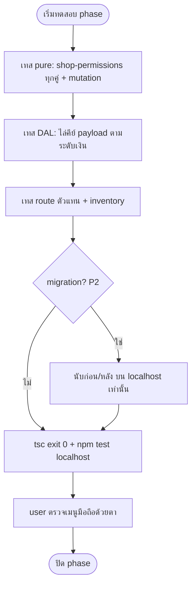

> **โมดูล:** 00071 - Shop Member Roles & Permissions
> **ประเภทเอกสาร:** Test Case
> **เวอร์ชัน:** 1.0
> **วันที่จัดทำ:** 2026-10-10
> **สถานะ:** P1 มีไฟล์เทสแล้ว (§2.1) · P2 มีไฟล์เทสแล้ว (§2.2) · **P3 มีไฟล์เทสแล้ว (§2.3)** — ผลรันยังไม่บันทึกที่นี่
> **เจ้าของเอกสาร:** QA (ดู [[Feature-Docs-Ownership]])

# Test Case: บทบาทและสิทธิ์สมาชิกร้าน

---

## 1. Overview

ชุดทดสอบนี้ครอบคลุมสิทธิ์ 5 บทบาท ตัวตัดสินกลาง ระดับเงิน การเชิญ/เปลี่ยนบทบาท migration และเมนู ตาม [[BRD]] ทุก AC · ประเภท: unit (Vitest) สำหรับ `shop-permissions` และ DAL · integration route (ตัวแทน) · inventory test · browser QA เมนูมือถือ = **user ตรวจด้วยตาเอง** (มติถาวร)

- **เอกสารต้นทาง:** [[BRD]] ของโมดูลนี้ (AC อ้างเป็น `FR-RP-0x-<ข้อ>` ตามลำดับ checkbox ใน BRD §2 และ `AC-3.1-x`/`AC-3.2-x` จาก BRD §3)
- **ขอบเขตชุดทดสอบ (Scope):** in = P1/P2/P3 ตาม baseline · out = OOS-1..OOS-15 (มอบหมายงานรายคน · บทบาทกำหนดเอง · audit log · ฝั่งผู้ซื้อ)
- **สภาพแวดล้อม:** localhost เท่านั้น (HR13/HR14) — `npm test` ต้อง override `DATABASE_URL` เป็นฐาน local · ข้อมูลเทสสร้างเอง scope ด้วย id ที่สร้าง ห้าม `deleteMany()` เปล่า
- **กติกาเทส:** ทุกกฎบังคับต้องมี mutation (ถอดเงื่อนไข/พลิกหนึ่งเซลล์ → เทสแดง) · ตัวอย่างตัวละคร: เจ้าของ O · ผู้ดูแล M · ตอบแชท C · เปิดบิล B · ช่าง T

---

## 2. Test Scenarios

### TC-001: ตารางสิทธิ์ทุกคู่ตรง BRD §8.3
- **Linked to:** AC-3.1-a, FR-RP-02
- **Precondition:** โมดูล `shop-permissions` พร้อม
- **Steps:**
  1. ไล่ทุก capability (H1..T4) × 5 บทบาท เรียก `can`
  2. เทียบกับตารางใน BRD §8.3 ทีละเซลล์
- **Expected Result:** ทุกเซลล์ตรง · mutation พลิกหนึ่งเซลล์ → เทสแดง

### TC-002: union ของบทบาท และระดับเงินสูงสุด
- **Linked to:** AC-3.1-c, BR-RP-03
- **Precondition:** —
- **Steps:**
  1. `can(['CHAT','TECHNICIAN'], 'O4')` และ `'O2'`
  2. `moneyLevel(['CHAT','TECHNICIAN'])`, `moneyLevel(['TECHNICIAN'])`, `moneyLevel(['OWNER'])`
- **Expected Result:** สิทธิ์เป็น union · ระดับ = PER_ORDER / NONE / FULL ตามลำดับ

### TC-003: capability ที่ไม่จัดหมวด = เจ้าของเท่านั้น
- **Linked to:** BR-RP-11, FR-RP-02
- **Precondition:** —
- **Steps:**
  1. เรียก `can` กับ capability id ที่ไม่มีในตาราง ด้วยทุกบทบาท
  2. เรียกด้วย `roles=[]` และบทบาทไม่รู้จัก
- **Expected Result:** เฉพาะ OWNER เป็น true · `roles=[]`/บทบาทแปลก = false และไม่ throw

### TC-004: ไม่มีสิทธิ์ → 403 FORBIDDEN_ROLE / หน้าแจ้งไม่มีสิทธิ์
- **Linked to:** FR-RP-02-a
- **Precondition:** ผู้ใช้ B (เปิดบิล) เป็นสมาชิกร้าน
- **Steps:**
  1. B เรียก API แชท
  2. B เปิดหน้าการเงิน (RSC)
- **Expected Result:** API 403 `{ error: 'FORBIDDEN_ROLE' }` · หน้า RSC แสดงหน้าแจ้งไม่มีสิทธิ์บอกว่าต้องขอบทบาทไหน (ไม่ใช่ 404)

### TC-005: เปลี่ยนบทบาทแล้วมีผลทันที
- **Linked to:** FR-RP-02-b, Scenario 3
- **Precondition:** C ถือ [CHAT] ส่งข้อความได้
- **Steps:**
  1. เจ้าของถอด CHAT ออก
  2. C ส่งข้อความถัดไปโดยไม่ login ใหม่
- **Expected Result:** 403 `FORBIDDEN_ROLE` · รีเฟรชแล้วเมนูแชทหาย

### TC-006: fail-closed เมื่ออ่านบทบาทล้ม/ไม่ใช่สมาชิก
- **Linked to:** FR-RP-02-c
- **Precondition:** จำลองการอ่าน `ShopMember` ล้ม / user ไม่ใช่สมาชิก
- **Steps:**
  1. เรียก route ของร้าน BUSINESS
  2. ร้าน PERSONAL: เจ้าของเรียก route เดียวกัน
- **Expected Result:** BUSINESS ไม่ได้ OWNER (ปฏิเสธ) · PERSONAL เข้าได้เสมอ (S-17)

### TC-007: inventory เทสแดงเมื่อ route ไม่ประกาศ capability
- **Linked to:** FR-RP-02-d
- **Precondition:** P3 (มีเทสแล้ว — `src/lib/__tests__/route-capability-inventory.test.ts`)
- **Steps:**
  1. รัน inventory บน tree จริง
  2. เพิ่ม route ปลอมที่ไม่ประกาศ capability แล้วรันซ้ำ
- **Expected Result:** (1) เขียว (2) แดง

### TC-008: payload ระดับ NONE ไม่มีฟิลด์เงิน
- **Linked to:** FR-RP-03-a, FR-RP-07-a
- **Precondition:** T ถือ [TECHNICIAN]
- **Steps:**
  1. เรียก DAL/API รายการออเดอร์ นัดหมาย สินค้า ในฐานะ T
  2. ไล่คีย์ทั้ง payload
- **Expected Result:** ไม่มีราคา ยอด การชำระ ต้นทุน

### TC-009: payload ระดับ PER_ORDER
- **Linked to:** FR-RP-03-b
- **Precondition:** M/C/B
- **Steps:**
  1. เรียกหน้า/API ออเดอร์ แดชบอร์ด รายชื่อลูกค้า กระเป๋า
  2. ไล่คีย์
- **Expected Result:** มีราคา/ยอด/การชำระรายใบ · ไม่มี `profit`/`cost`/`totalRevenue`/`lifetimeSpend`/`walletBalance` และยอดรวมหลายใบ

### TC-010: payload ระดับ FULL เท่าเดิม
- **Linked to:** FR-RP-03-c
- **Precondition:** O
- **Steps:**
  1. เทียบ payload ของเจ้าของก่อน/หลังการเปลี่ยน
- **Expected Result:** เท่าเดิมทุกคีย์ · mutation ถอดการตัดหนึ่งจุด → เทสแดง

### TC-011: ผิวการเงินเต็มเฉพาะเจ้าของ
- **Linked to:** FR-RP-03-d, AC-3.1-b
- **Precondition:** ตัวแทน route: `/sales` `/expenses` `/reports/*` `/wallet` และ API การเงิน
- **Steps:**
  1. O เรียก → 200
  2. เจ้าของร่วม เรียก → 200
  3. M, C, B, T เรียก
- **Expected Result:** M/C/B/T = 403 `FORBIDDEN_ROLE` (หน้า = หน้าแจ้งไม่มีสิทธิ์) · mutation ถอด guard → แดง

### TC-012: ยกเลิก staffCanViewFinance
- **Linked to:** FR-RP-04-a, FR-RP-04-b
- **Precondition:** ตั้ง `Shop.staffCanViewFinance=true`
- **Steps:**
  1. เปิดหน้าสมาชิก
  2. ยิง endpoint finance-visibility
  3. M เรียก `expense/agent-report/product-report access`
  4. `rg "staffCanViewFinance" src`
- **Expected Result:** ไม่มีสวิตช์ · endpoint ถูกลบ (route ไม่มี = 404) · M ยังถูกปฏิเสธ · rg ไม่พบที่ตัดสินสิทธิ์ (เหลือเฉพาะคอมเมนต์)

### TC-013: ตอบแชท C
- **Linked to:** FR-RP-05-a, FR-RP-05-b, FR-RP-05-c
- **Precondition:** C ถือ [CHAT] ไม่ใช่เจ้าของหลัก · ร้านมีหลายห้อง/หลายร้าน
- **Steps:**
  1. เปิดกล่องรวม ตัวเลขยังไม่อ่าน แจ้งเตือน
  2. ส่งข้อความในห้อง
  3. สร้างออเดอร์ทุกประเภทจากแชทและหน้าสร้างออเดอร์
- **Expected Result:** เห็นทุกห้องของร้านที่มี H1 · ส่งได้ · สร้างได้ทุกประเภท · กล่องรวมไม่คืนร้านที่ไม่มี H1 (BR-RP-15)

### TC-014: เปิดบิล B สร้างได้เฉพาะ SERVICE
- **Linked to:** FR-RP-06-a, FR-RP-06-b, Scenario 1
- **Precondition:** B ถือ [BILLING] ในร้านบริการ
- **Steps:**
  1. POST ออเดอร์ `PHYSICAL` (ทุกทาง: API หน้าสร้าง สร้างด่วน)
  2. POST ออเดอร์ `SERVICE`
  3. เปิดหน้าสร้างออเดอร์
- **Expected Result:** (1) 403 (2) สำเร็จ (3) แสดงเฉพาะสินค้า/บริการประเภทบริการ · mutation เงื่อนไข type → แดง

### TC-015: B เข้าแชทไม่ได้ พิมพ์ใบเสร็จได้ แก้ได้เฉพาะที่ยังไม่ชำระ
- **Linked to:** FR-RP-06-c, FR-RP-06-d, §8.3 O3/O5/O6/D1
- **Precondition:** B มีบิลบริการ 2 ใบ (ยังไม่ชำระ / ชำระแล้ว)
- **Steps:**
  1. เรียก API แชท/กล่องรวม/แจ้งเตือนแชท
  2. พิมพ์ใบเสร็จ
  3. แก้รายการบิลที่ยังไม่ชำระ / ที่ชำระแล้ว
  4. บันทึกการชำระ / ยกเลิก / คืนเงิน
- **Expected Result:** (1) 403 (2) ได้ (3) ยังไม่ชำระได้ ชำระแล้ว 403 (4) บันทึกชำระได้ ยกเลิก/คืนเงิน 403

### TC-016: ฝ่ายช่างทำงานในขอบเขต
- **Linked to:** FR-RP-07-a, FR-RP-07-b, FR-RP-07-c
- **Precondition:** T ถือ [TECHNICIAN]
- **Steps:**
  1. ดูรายการออเดอร์/นัดหมายทั้งร้าน
  2. เปลี่ยนสถานะ บันทึกสถานะ/ผลเข้ารับบริการ
  3. PATCH รายการ ราคา ลูกค้า การชำระ · เรียก API ลูกค้า · ยกเลิก/คืนเงิน
- **Expected Result:** (1) เห็นทั้งร้านไม่มีเงิน (2) 200 (3) 403 ทุกข้อ

### TC-017: ถือ [CHAT, TECHNICIAN] = ระดับ PER_ORDER
- **Linked to:** AC-3.1-c, Scenario 2
- **Precondition:** ร้านเล็ก "ซี" ถือสองบทบาท
- **Steps:**
  1. ตอบแชท สร้างออเดอร์ อัปเดตสถานะงาน
  2. เปิด `/sales` `/expenses` กำไร
- **Expected Result:** (1) ทำได้ ระดับเงิน PER_ORDER (2) ไม่เห็น

### TC-018: เชิญและเปลี่ยนบทบาท (เจ้าของเท่านั้น)
- **Linked to:** FR-RP-08-a, FR-RP-08-b, FR-RP-08-c, FR-RP-01-a, FR-RP-01-b
- **Precondition:** P2
- **Steps:**
  1. เจ้าของสร้างคำเชิญอีเมลและลิงก์ ด้วย `roles=['BILLING']` และโดยไม่ส่ง `roles`
  2. ผู้รับยอมรับ
  3. เจ้าของแก้ชุดบทบาทในตารางสมาชิก
  4. ส่ง `roles=[]`, 5 ค่า, ค่าซ้ำ, `OWNER+MANAGER`, และตั้ง `role:'OWNER'`
  5. M/C เรียก PATCH members และ invite create
- **Expected Result:** (1)(2) ได้ชุดที่เชิญ / ค่าตั้งต้น [MANAGER] (3) สำเร็จ + แสดงคำอธิบายบรรทัดเดียว (4) ชุดว่าง/เกิน/ซ้ำ = 400 (`INVALID_INPUT` ที่ PATCH · `VALIDATION_ERROR` ที่ invite) · เจ้าของ+roles = 400 `INVALID_ROLES` · ตั้งเป็นเจ้าของ = ล้าง `roles` (5) **403 `NOT_OWNER`** (มติ P2 0.4 — ไม่ใช่ `FORBIDDEN_ROLE`)

### TC-019: BILLING ในร้านที่ไม่มีบริการ
- **Linked to:** FR-RP-01-c, BR-RP-07
- **Precondition:** ร้านไม่ขายบริการ
- **Steps:**
  1. เลือก "เปิดบิล" ใน UI เชิญ
  2. ยิง API ด้วย `roles=['BILLING']`
- **Expected Result:** UI ซ่อนตัวเลือก · API ปฏิเสธ 400 `BILLING_NOT_AVAILABLE` · เกณฑ์ "ร้านขายบริการ" = `canUseAppointments(shop)` (vertical `SERVICE_QUEUE`)

### TC-020: กติกา 00012 และโควตาไม่เปลี่ยน
- **Linked to:** BR-RP-13, BR-RP-14, FR-RP-08-c
- **Precondition:** `shop-member-rules.test.ts` เดิม
- **Steps:**
  1. รันเทสเดิมทั้งชุด
  2. สมาชิกถือ 3 บทบาท นับโควตา
  3. เจ้าของลบตัวเอง / แตะเจ้าของหลัก
- **Expected Result:** เทสเดิมผ่านทั้งหมด · ถือ 3 บทบาทนับ 1 คน · `CANNOT_REMOVE_SELF` / `PRIMARY_OWNER_LOCKED` คงเดิม

### TC-021: migration ADMIN → MANAGER และ additive
- **Linked to:** FR-RP-10-a, FR-RP-10-b, BR-RP-16
- **Precondition:** ฐาน local มีสมาชิก ADMIN, คำเชิญค้าง, ลิงก์ค้าง (ปักหมุด localhost ตาม HR14)
- **Steps:**
  1. นับแถวก่อน `migrate deploy`
  2. apply migration
  3. นับหลัง + ตรวจ `roles`
  4. `rg -i "DROP|TRUNCATE" <ไฟล์ migration>`
- **Expected Result:** จำนวนแถวเท่ากัน · ทุก `role='ADMIN'` → `roles=['MANAGER']` · คำเชิญ/ลิงก์ค้าง = `['MANAGER']` · ไม่มี DROP/TRUNCATE

### TC-022: ผู้ดูแลเดิมทำงานได้เท่าเดิม ยกเว้นการเงิน
- **Linked to:** AC-3.2-b, Scenario 4
- **Precondition:** M (เดิม ADMIN) หลัง P2/P3
- **Steps:**
  1. ทำงานออเดอร์ สินค้า ลูกค้า แชท ตั้งค่าร้าน
  2. เปิดเมนูยอดขาย ค่าใช้จ่าย รายงาน แดชบอร์ด บัตรกำไรหน้าออเดอร์ ต้นทุนสินค้า
- **Expected Result:** (1) ทำได้เท่า ADMIN วันนี้ (2) ไม่มี/403 · รายงานเทียบสิทธิ์ ADMIN ก่อน/หลัง ไม่มีสิทธิ์งานหายนอกจาก F1-F3/P3

### TC-023: เมนูเดสก์ท็อป/มือถือตามบทบาท
- **Linked to:** FR-RP-09-a, FR-RP-09-b, FR-RP-09-c, AC-3.2-a
- **Precondition:** ฟังก์ชัน pure ของเมนู
- **Steps:**
  1. ต่อบทบาท × (แถบล่าง, FAB, หน้าแรก) เทียบ BRD §8.5
  2. ถือหลายบทบาท = union
  3. ทางลัดที่ปักหมุดแต่ไม่มีสิทธิ์
  4. `rg` เมนูมือถือที่ไม่อ่านกฎกลาง
  5. หน้าแรกของ PER_ORDER/NONE
- **Expected Result:** ตรง §8.5 · union ถูก · ทางลัดถูกซ่อน · rg = 0 · ไม่มีกราฟยอดขาย ยอดกระเป๋า สินค้าขายดีมีเงิน · mutation → แดง · การดูบนจอมือถือจริง = user ตรวจเอง

### TC-024: ไม่มีเงินรั่วใน flight payload
- **Linked to:** AC-3.1-b, BR-RP-09
- **Precondition:** ผู้ใช้ที่ไม่ใช่เจ้าของ
- **Steps:**
  1. เปิดหน้าที่เคยแสดงเงิน (ออเดอร์ สินค้า ลูกค้า แดชบอร์ด กระเป๋า ร้านบริการ)
  2. ตรวจ payload ที่ส่งมากับ RSC
- **Expected Result:** ไม่มี profit/cost/totalRevenue/lifetimeSpend/walletBalance ใน payload (ไม่ใช่แค่ไม่ render)

### 2.1 ไฟล์เทส P1 (ที่มีอยู่จริงใน repo)

| TC | ไฟล์เทส |
|----|---------|
| TC-001, TC-002, TC-003 | `src/lib/shop-permissions.test.ts` |
| TC-004, TC-011 | `src/app/api/wallet/wallet-routes.test.ts` · `src/app/api/seller/sales-series/route.test.ts` · `src/lib/__tests__/finance-page-gate-order.test.ts` · `src/lib/__tests__/wallet-owner-gate.guards.test.ts` · `src/lib/__tests__/finance-surface-guard.test.ts` (ด่านสแกนซอร์ส กันผิวเงินใหม่ที่ลืม guard — ครอบ S-3/S-5/S-7) |
| TC-009, TC-010 (ส่วนต้นทุน) | `src/services/__tests__/product-cost-redaction.test.ts` · `src/lib/__tests__/order-cost-redact.test.ts` · `src/app/api/orders/[token]/route.cost.test.ts` · `src/app/api/products/cost-guard.test.ts` · `src/app/api/inventory/csv/cost-guard.test.ts` · `src/lib/__tests__/order-form-line-cost.test.ts` · `src/services/__tests__/order-keep-line-costs.db.test.ts` |
| TC-009, TC-024 (ยอดรวม/ยอดสะสม/กระเป๋า) | `src/lib/__tests__/dashboard-money.test.ts` · `src/lib/__tests__/customer-directory.test.ts` · `src/lib/__tests__/customer-spend-inbox-gate.test.ts` · `src/services/__tests__/ai-suggest-quota-balance.test.ts` · `src/app/api/chat/conversations/[id]/ai-suggest/route.test.ts` |
| TC-012 | `src/services/expense-access.service.test.ts` · `src/services/agent-report-access.service.test.ts` · `src/services/product-report-access.service.test.ts` · `src/lib/__tests__/product-report-guards.test.ts` |
| รายงานแอดมิน SELF ไม่มี `revenue` (TC-009) | `src/app/api/seller/reports/agents/route.test.ts` · `src/services/agent-report-access.service.test.ts` |
| เมนูการเงินเจ้าของเท่านั้น (ส่วน P1 ของ TC-023) | `src/lib/seller-menu.test.ts` (`applyOwnerOnlyFinanceMenu`) |

TC-005, TC-007, TC-013..017, TC-022 (ส่วน P3), TC-023 (เมนูเต็ม) เป็นของ P3 — ดู §2.3

### 2.2 ไฟล์เทส P2 (ที่มีอยู่จริงใน repo)

| TC | ไฟล์เทส | ครอบคลุม |
|----|---------|----------|
| TC-018, TC-019 (กติกา pure) | `src/lib/__tests__/shop-role-assignment.test.ts` | `validateAssignableRoles` · `planMemberRoleChange` |
| TC-018, TC-019, TC-020 (service) | `src/services/__tests__/shop-member-roles.service.test.ts` · `src/services/__tests__/invite-link.service.test.ts` | เลื่อนเป็น OWNER ล้าง roles · OWNER→ADMIN ไม่ส่ง roles = MANAGER · ชุดเดิมที่มี BILLING ไม่ถูกตีกลับ · เชิญ/ลิงก์เก็บ roles + ค่าตั้งต้น · accept คัดลอก roles · สมาชิกเดิมไม่ถูกเขียนทับ · non-owner = NOT_OWNER |
| TC-018 (route) | `src/app/api/business/shops/[shopId]/members/[memberId]/roles.route.test.ts` | non-owner 403 `NOT_OWNER` · `INVALID_ROLES`/`BILLING_NOT_AVAILABLE` = 400 ไม่ใช่ 500 · schema ปัด roles ผิดรูป · ส่ง roles ต่อ service |
| TC-018 (UI logic) | `src/lib/__tests__/shop-role-picker.test.ts` | ซ่อน BILLING · ปุ่มบันทึก · ลำดับมาตรฐาน · ข้อความ error |
| TC-021 (migration) | `src/lib/__tests__/shop-roles-db-constraint.test.ts` | source: มี 4 role + 3 constraint + ไม่มี DROP/TRUNCATE/DELETE · DB local เท่านั้น (skip ถ้า URL ไม่ใช่ localhost:5434): CHECK ปฏิเสธ/รับตามกติกา |
| TC-018 (roles ใน context) | `src/lib/__tests__/shop-context.roles.test.ts` · `src/lib/shop-permissions.test.ts` (`rolesFromMembership`) | select `roles` + ส่งต่อ · ADMIN ว่าง = `[]` |
| TC-006 (ส่วน session, S-17 ที่ลงมาในรอบนี้) | `src/lib/__tests__/session-active-shop.test.ts` | อ่านสมาชิกล้ม ⇒ ไม่เป็น OWNER ของร้านนั้น |
| TC-020 (กติกา 00012 เดิม) | `src/lib/__tests__/shop-member-rules.test.ts` | คงเดิม |

ยังไม่ครอบคลุมใน P2: browser QA ตัวเลือกบทบาทใน UI (user ตรวจเอง) · การบังคับรายบทบาทที่ route (อยู่ใน P3 — §2.3)

### 2.3 ไฟล์เทส P3 (ที่มีอยู่จริงใน repo)

| TC | ไฟล์เทส | ครอบคลุม |
|----|---------|----------|
| TC-004, TC-006 (ด่านกลาง) | `src/lib/__tests__/shop-capability.test.ts` | `requireShopCapability` บทบาท × cap ผ่านกฎสมาชิกจริง · ไม่ใช่สมาชิก/ไม่มีตัวตน · `gatePage` · `canAccessShopWith` · `listAccessibleShopIds(userId, cap)` · `ForbiddenRoleError` |
| TC-006 (S-17) | `src/lib/__tests__/session-active-shop.test.ts` | อ่านสมาชิกล้ม/ไม่พบ ⇒ ไม่เป็น OWNER ของร้าน BUSINESS · ถอยร้านส่วนตัว/null |
| TC-007 | `src/lib/__tests__/route-capability-inventory.test.ts` | ต้นไม้จริง: ทุกไฟล์ที่ resolve ร้านมีรายการ · key มีไฟล์จริง · literal cap ตรงทะเบียนต่อเมธอด · PENDING = 0 · คลาส/prefix (admin cron webhook) เรียกด่านของตัวเอง · หน้าแอดมินเรียก `requireAdmin()` ก่อนดึงข้อมูล · mutation M1-M20 ฉีดซอร์สปลอมแล้วแดง |
| TC-004, TC-013 (แชท H1-H3/X2) | `src/app/api/chat/__tests__/role-gate.test.ts` · `src/app/api/chat/conversations/[id]/messages/__tests__/role-gate-send.test.ts` · `src/app/api/chat/conversations/[id]/route.test.ts` · `src/services/__tests__/chat-role-gate.test.ts` | ตัวแทนกลุ่ม route × 5 บทบาท · เปลี่ยนบทบาทระหว่างเทสแล้วผลเปลี่ยนทันที (อ่านสดไม่เชื่อ JWT) · ส่งข้อความ · service guard |
| TC-005, TC-013 (ขอบเขต/กล่องรวม/แจ้งเตือน) | `src/lib/__tests__/chat-scope.test.ts` · `src/lib/__tests__/chat-cap-required.test.ts` · `src/services/__tests__/seller-push-role-audience.test.ts` · `src/services/__tests__/notification-pref.service.test.ts` · `src/services/follow-up-reminder.service.test.ts` | `resolveChatScope` (BILLING/TECHNICIAN ไม่เข้าขอบเขตแชท) · `resolveOutboundContext` cap บังคับ ไม่มีค่าตั้งต้น · ผู้รับ push ตาม H1/H3 · สวิตช์แจ้งเตือนตาม H1 |
| TC-014, TC-015 (บิล) | `src/services/__tests__/order-billing-only.test.ts` · `src/app/api/orders/__tests__/role-gates.route.test.ts` · `src/lib/__tests__/order-payment-state.test.ts` · `src/lib/__tests__/record-payment-void-gate.test.ts` · `src/app/api/orders/[token]/cancel/route.test.ts` · `src/lib/__tests__/orders-header-create-gate.test.ts` · `src/app/(paces)/seller/(dashboard)/orders/[token]/components/__tests__/order-action-set.test.ts` | บังคับ `type=SERVICE` + ปฏิเสธสินค้าไม่ใช่บริการ (ไม่มีการเขียนเมื่อปฏิเสธ) · แก้ได้เฉพาะ SERVICE ที่ยังไม่ชำระ (`isOrderUnpaid` ทุกขา) · void/ยกเลิก = O6 · ปุ่มตามบทบาท |
| TC-008, TC-016 (ช่าง) | `src/lib/__tests__/order-view-by-level.test.ts` · `src/app/api/orders/__tests__/technician-no-money.route.test.ts` · `src/app/(paces)/seller/(dashboard)/orders/__tests__/technician-no-money.page.test.tsx` · `…/orders/__tests__/technician-no-money.ui.test.tsx` · `src/app/(paces)/seller/(dashboard)/bookings/__tests__/technician-no-money.page.test.tsx` · `src/app/(paces)/seller/(dashboard)/queues/__tests__/technician-caps.test.tsx` | allow-list `toNoMoneyOrder`/`toNoMoneyAppointmentDay` · ไล่คีย์ payload ของ route จริงด้วย session ช่าง · หน้า orders/bookings/queues ไม่ส่งเงินลง flight payload |
| TC-009, TC-010, TC-024 (ระดับฟิลด์ทุกบทบาท) | `tests/integration/role-contract.test.ts` (Postgres localhost:5434 เท่านั้น) | route ตัวแทน × 5 บทบาท ไล่คีย์ต้องห้ามตามระดับเงินทุกชั้น · บวกหน้าแรก `redactCommandCenterData` · **มี `knownLeaks`: `soldCount` จาก `GET /api/products?sort=best` ถึง PER_ORDER** (ดูหนี้ในแผน P3) |
| TC-010 (ต้นทุน) | `src/lib/__tests__/cost-optin-guard.test.ts` | Prisma global omit ตัดต้นทุนโดยค่าตั้งต้น — ผู้อ่านต้นทุนฝั่งหน้า (เช่น `/sales`) ต้อง opt-in |
| TC-022 (ผู้ดูแลเท่า ADMIN ยกเว้นการเงิน) | `src/lib/__tests__/shop-domain-route-roles.test.ts` · `tests/integration/role-contract.test.ts` | handler จริงของกลุ่มร้าน/ธุรกิจ/ตั้งค่า × บทบาท (ผ่านด่านเมื่อ status ไม่ใช่ 401/403 · ไม่ผ่านต้อง 403 และ service ไม่ถูกเรียก) · `finance-leak-regressions.test.ts` เป็นของช่องรั่วเดิมปลาย P1 ไม่ใช่ TC-022 |
| TC-002, TC-017 (union) | `src/lib/shop-permissions.test.ts` · `src/lib/__tests__/role-nav.test.ts` | `can`/`moneyLevel` union · เมนู union |
| TC-023 (เมนูเดสก์ท็อป/มือถือ) | `src/lib/__tests__/role-nav.test.ts` · `src/lib/seller-menu.test.ts` · `src/services/__tests__/shortcut-role.test.ts` · `src/app/(paces)/seller/(dashboard)/_shared/__tests__/SellerBottomNav.test.tsx` | `canSeePage` · `applyCapabilityMenu` · `resolveMobileNav` (แถบล่าง/FAB) · `shopQuickLinks` · ทางลัดปักหมุดที่ไม่มีสิทธิ์ถูกซ่อน |
| ข้อความ/หน้าไม่มีสิทธิ์ (critique P3) | `src/lib/__tests__/no-permission-copy.test.ts` · `src/lib/__tests__/p3-critique-fixes.test.ts` | หน้า fullscreen ใช้ `NoPermissionScreen` (มีทางกลับ) ไม่ใช่การ์ดเปล่า |

**ช่องว่างของ P3 ที่ยังไม่มีเทส/ยังไม่ได้ทำ (จากโค้ด):**
- TC-017 ระดับ route สำหรับผู้ถือ `[CHAT, TECHNICIAN]` — มีเทส union ระดับ pure/เมนูเท่านั้น (`shop-permissions.test.ts`, `role-nav.test.ts`) ไม่มีเทส route ที่ใช้ชุดนี้โดยเฉพาะ
- TC-022 รายงานเทียบสิทธิ์ ADMIN "ก่อน/หลัง" — ไม่พบไฟล์รายงานนี้ใน repo
- TC-023 การดูบนจอมือถือจริง = user ตรวจเอง (มติถาวร)
- `knownLeaks` ใน `role-contract.test.ts` (`soldCount`) และคีย์ที่ `NONE_FORBIDDEN` ไม่ครอบ (`pricePerNight`/`depositValue`) — ดูหนี้ในแผน `docs/superpowers/plans/2026-10-10-00071-p3-plan.md`

---

## 3. Traceability Matrix

| AC / FR ใน [[BRD]] | Test Case | ครอบคลุมหรือไม่ |
|---------------------|-----------|------------------|
| FR-RP-01-a ชุดว่างบันทึกไม่ได้ | TC-018 | Yes |
| FR-RP-01-b เจ้าของ+บทบาทอื่นไม่ได้ / เลื่อนเป็นเจ้าของล้างชุด | TC-018 | Yes |
| FR-RP-01-c BILLING ร้านไม่มีบริการ | TC-019 | Yes |
| FR-RP-02-a 403 FORBIDDEN_ROLE / หน้าแจ้ง | TC-004 | Yes |
| FR-RP-02-b มีผลทันที | TC-005 | Yes |
| FR-RP-02-c fail-closed | TC-006 | Yes |
| FR-RP-02-d inventory แดง | TC-007 | Yes |
| FR-RP-03-a ระดับ NONE | TC-008 | Yes |
| FR-RP-03-b ระดับ PER_ORDER | TC-009 | Yes |
| FR-RP-03-c ระดับ FULL | TC-010 | Yes |
| FR-RP-03-d ผิวการเงินเจ้าของเท่านั้น | TC-011 | Yes |
| FR-RP-04-a สวิตช์หาย/410 | TC-012 | Yes |
| FR-RP-04-b access ใช้กฎเจ้าของ | TC-012 | Yes |
| FR-RP-05-a/b/c ตอบแชท | TC-013 | Yes |
| FR-RP-06-a/b SERVICE เท่านั้น | TC-014 | Yes |
| FR-RP-06-c/d ไม่เข้าแชท / พิมพ์ใบเสร็จ | TC-015 | Yes |
| FR-RP-07-a/b/c ฝ่ายช่าง | TC-008, TC-016 | Yes |
| FR-RP-08-a/b/c เชิญ/เปลี่ยนบทบาท เจ้าของเท่านั้น | TC-018, TC-020 | Yes |
| FR-RP-09-a/b/c เมนู | TC-023 | Yes |
| FR-RP-10-a/b ย้ายข้อมูล additive | TC-021 | Yes |
| AC-3.1-a ทุกคู่ผ่านเทส | TC-001 | Yes |
| AC-3.1-b ไม่มีบทบาทอื่นเรียกการเงินเต็มได้ | TC-011, TC-024 | Yes |
| AC-3.1-c union + เงินสูงสุด | TC-002, TC-017 | Yes |
| AC-3.2-a เมนูมือถือตาม §8.5 | TC-023 | Yes |
| AC-3.2-b ผู้ดูแลเดิมทำงานได้ยกเว้นการเงิน | TC-022 | Yes |
| BR-RP-11 cap ไม่จัดหมวด = เจ้าของ | TC-003 | Yes |
| BR-RP-14/15 โควตา / กรองรายร้าน | TC-020, TC-013 | Yes |

> ทุก AC ใน [[BRD]] §2-§3 ปรากฏในตารางนี้และมี TC อย่างน้อย 1 รายการ

---

## 4. Flow (ถ้ามี)

---

## 5. ผลล่าสุด

| Run | วันที่ | ผล (Pass/Fail/Blocked) | ผู้ทดสอบ (Tester) |
|-----|--------|--------------------------|---------------------|
| - | - | P1/P2/P3: ไฟล์เทสเขียนแล้ว (§2.1, §2.2, §2.3) — ผลรันยังไม่บันทึกที่นี่ (ผู้เขียนเอกสารไม่ได้รัน) | - |

---

## 6. สรุป (Summary)

เอกสาร Test Case นี้กำหนด **ชุดเคสทดสอบ** ของ **บทบาทและสิทธิ์สมาชิกร้าน (00071)** ที่ trace กลับ Acceptance Criteria ใน [[BRD]] ทุกข้อ เพื่อให้มั่นใจว่าทุกข้อกำหนดเชิงธุรกิจถูกทดสอบครบ

**Open Questions:**
- ชื่อไฟล์เทสและตำแหน่งจริง — ตัดสินแล้ว P1 (§2.1) · P2 (§2.2) · P3 (§2.3)
- ~~เกณฑ์ "ร้านขายบริการได้" ที่ TC-019~~ — ตัดสินแล้ว: `canUseAppointments`
