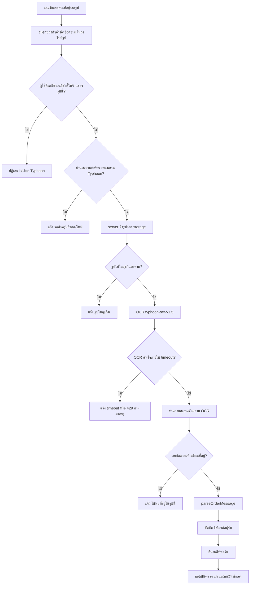
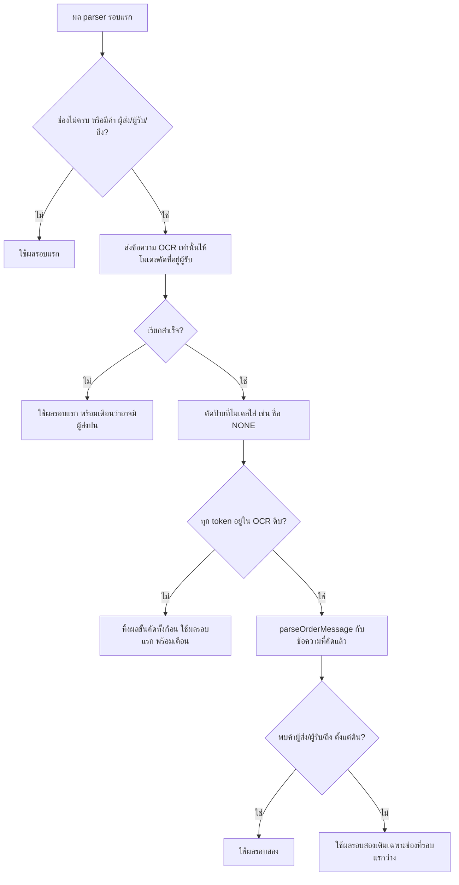
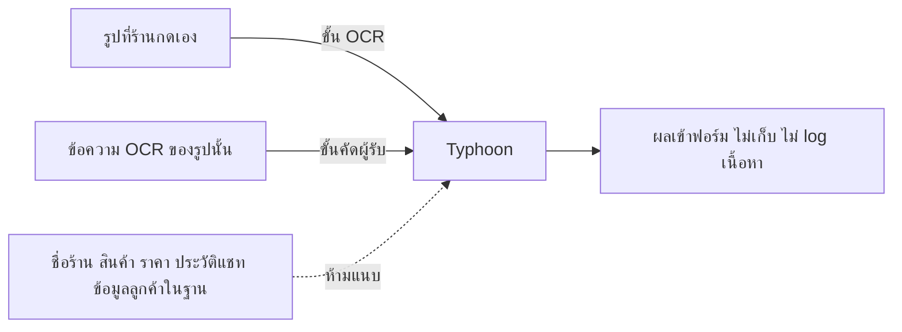

> **โมดูล:** M70-AddressFromImage (00072)
> **ประเภทเอกสาร:** Business Requirements Document (BRD) - NON-TECHNICAL
> **เวอร์ชัน:** 0.1
> **วันที่จัดทำ:** 2026-10-09
> **สถานะ:** พักไว้ 2026-10-09 (มติ user) — Typhoon API ฟรีห้ามส่งข้อมูลส่วนบุคคล (tac ข้อ 2/4/7) · กลับมาทำเมื่อได้ผู้ให้บริการที่ส่งข้อมูลส่วนตัวได้ (ผลทดสอบ Gemini ส่งรูปตรง: ผู้รับถูกฝั่ง 10/10)
> **เจ้าของเอกสาร:** BA (ดู [[Feature-Docs-Ownership]])

# BRD: อ่านที่อยู่จากรูป (Address From Image · OCR) (Business Requirements Document)

---

## 1. บทนำ

### 1.1 วัตถุประสงค์ของเอกสาร

เอกสารนี้มีวัตถุประสงค์เพื่อ:
1. อธิบายความต้องการหลัก: ให้แอดมินร้านสั่ง AI อ่านรูปที่อยู่ที่ลูกค้าส่งในแชทแล้วได้ช่องข้อมูลที่ตรวจก่อนใช้
2. กำหนดขอบเขต: กดเองต่อรูป ไม่อ่านอัตโนมัติ ผลเข้าฟอร์มเดิม ช่องที่อ่านไม่ได้ว่าง
3. กำหนดกฎความเป็นส่วนตัวที่ขยายจากข้อยกเว้น BR-AI-09-EX ของ 00019 และเพดานของผู้ให้บริการ
4. สร้างความเข้าใจร่วมกันระหว่างทีมธุรกิจและทีมพัฒนา และกำหนดชุดรูปทดสอบเป็นเกณฑ์ผ่าน

### 1.2 ขอบเขตของระบบ

**อ่านที่อยู่จากรูป** คือความสามารถในห้องแชทของ seller ที่อ่านตัวอักษรจากรูปที่ลูกค้าส่ง แยกเป็นช่องที่อยู่จัดส่ง และส่งเข้าฟอร์มคำสั่งซื้อที่มีอยู่ให้แอดมินตรวจ

**เข้าสู่ระบบ (Input):**
- รูปในข้อความของลูกค้าที่แอดมินเลือกกด (ตัวอ้างอิงข้อความ/ไฟล์ — ไม่ใช่ไบต์ของรูป)

**ออกจากระบบ (Output):**
- ช่อง ชื่อ · เบอร์ · ที่อยู่ · ตำบล · อำเภอ · จังหวัด · รหัสไปรษณีย์ (ช่องที่หาไม่ได้ = ว่าง)
- ข้อความสถานะ/คำเตือนที่บอกว่าช่องไหนไม่ครบ ผลมีผู้ส่งปน หรืออ่านไม่สำเร็จ

**ระบบที่เกี่ยวข้อง:**
- ห้องแชท seller · ร่างคำสั่งซื้อ (`DraftOrderProvider`) · ชีต/แผงกระจายที่อยู่ (`PasteParseSheet`, `PasteParsePanel`, `CustomerQuickBlock`) · `parseOrderMessage` · storage ไฟล์แชท · Typhoon API · 00019 (ข้อยกเว้น PII)

### 1.3 กลุ่มผู้ใช้งาน

| กลุ่มผู้ใช้ | บทบาท | สิทธิ์การใช้งาน |
|-----------|--------|----------------|
| **แอดมินร้าน / เจ้าของร้าน** | กดอ่านรูป ตรวจและแก้ผล แล้วบันทึกออเดอร์ | ใช้ได้กับรูปในบทสนทนาของร้านที่ตนมีสิทธิ์เปิดออเดอร์เท่านั้น (ขอบเขตสิทธิ์ละเอียดตรวจกับ SRS/00071 ตอนทำ SRS) |
| **ลูกค้าของร้าน** | ผู้ส่งรูป (ไม่ใช่ผู้ใช้ระบบ) | ไม่มีสิทธิ์/ไม่เห็นฟีเจอร์ |
| **ทีมปฏิบัติการ Deep** | ดูแล key/เพดาน/สถานะผู้ให้บริการ | เห็นเฉพาะสถิติเชิงสถานะ ไม่เห็นเนื้อหา |

---

## 2. ความต้องการหลัก (Functional Requirements)

> สัญลักษณ์ "บังคับที่" ระบุว่ากฎต้องถูกบังคับที่ชั้นไหน/ไฟล์ไหน (HR: AC ต้องชี้บรรทัดที่บังคับ + เทสที่แดง) ไฟล์ที่ระบุว่า "(ใหม่)" ยังไม่มีในโค้ด ชื่อเป็นข้อเสนอ ให้ SRS เป็นผู้ยืนยัน ส่วนไฟล์ที่ไม่มี "(ใหม่)" มีอยู่แล้วและเปิดตรวจแล้ว

### 2.1 ทางเข้าในห้องแชท

#### FR-AFI-01: กดค้างที่รูปบนมือถือ → "อ่านที่อยู่จากรูป"

**User Story:**
> ในฐานะแอดมินร้านบนมือถือ ฉันต้องการกดค้างที่รูปที่ลูกค้าส่งแล้วเลือก "อ่านที่อยู่จากรูป" เพื่อเปิดออเดอร์โดยไม่ต้องพิมพ์ที่อยู่เอง

**Acceptance Criteria:**
- [ ] กดค้างที่รูปที่เข้าเงื่อนไข (FR-AFI-03) → เมนูกดค้างเดิมมีรายการ "อ่านที่อยู่จากรูป"
- [ ] รายการนี้อยู่ร่วมกับรายการเดิม (ตอบกลับ · สติกเกอร์ · เก็บเข้าคลัง · บันทึกรับเงิน · คัดลอก) โดยไม่ทำให้รายการเดิมหาย/เปลี่ยนพฤติกรรม
- [ ] บนรูปที่ไม่เข้าเงื่อนไข (สติกเกอร์ รูปถูกลบ รูปกำลังส่ง) ไม่มีรายการนี้
- [ ] กดรายการแล้วเมนูปิดและเห็นสถานะรอทันที (ไม่ต้องรอ response แรก)

**บังคับที่:** เสียบรายการใน `actionTargetActions` ของ `src/app/(paces)/seller/(chat)/inbox/[conversationId]/components/ChatThread.tsx` (ฟังก์ชันที่ประกอบเมนู เริ่มบรรทัด 1854; รายการ "บันทึกรับเงิน" เป็นแบบอย่างที่ `:1960-1974`) · gesture ใช้ `useLongPress` ตัวเดิม (`:1817`) ห้ามสร้างตัวใหม่ · เทสของฟังก์ชันตัดสินเงื่อนไขอยู่ใน `src/lib` (ใหม่)

#### FR-AFI-02: เอาเมาส์ชี้ที่รูปบน desktop → ปุ่ม "อ่านที่อยู่จากรูป"

**User Story:**
> ในฐานะแอดมินร้านบน desktop ฉันต้องการเห็นปุ่มอ่านที่อยู่เมื่อเอาเมาส์ชี้ที่รูป เพื่อกดได้ทันทีเหมือนปุ่มตอบกลับ/สร้างคำสั่งซื้อ

**Acceptance Criteria:**
- [ ] ชี้เมาส์ที่บับเบิลรูปที่เข้าเงื่อนไข (หน้าจอ ≥ 1024px) → มีปุ่มข้างบับเบิลในแถวเดียวกับปุ่ม hover เดิม
- [ ] ปุ่มมี `aria-label` และ `title` เป็น "อ่านที่อยู่จากรูป" (ต้องมี role รองรับ — convention `aria-name-requires-supporting-role`)
- [ ] ไม่โผล่บนรูปที่ไม่เข้าเงื่อนไข และไม่โผล่ที่ความกว้างต่ำกว่า 1024px (มือถือใช้ FR-AFI-01)
- [ ] ปุ่มไม่บังหรือดันปุ่มเดิมจนตกบรรทัด

**บังคับที่:** คอมโพเนนต์ปุ่มใหม่ในรูปแบบเดียวกับ `CreateOrderFromMessageButton` (`ChatThread.tsx:614`) และเรียกใช้ในจุดเดียวกับ `ThreadMessageList.tsx:571` · ตัวเลือก icon ผ่าน `safepay-ux` (HR8/HR12)

#### FR-AFI-03: เงื่อนไขว่ารูปไหนอ่านได้ (นิยามเดียว)

**User Story:**
> ในฐานะแอดมินร้าน ฉันต้องการเห็นปุ่มเฉพาะรูปที่อ่านได้จริง เพื่อไม่กดแล้วไม่เกิดอะไร

**Acceptance Criteria:**
- [ ] รูปอ่านได้เมื่อ: ชนิดข้อความเป็นรูป · มีตัวอ้างอิงไฟล์ใน storage · ไม่ใช่สติกเกอร์ · ไม่ถูกลบ · ไม่ใช่ข้อความชั่วคราว/กำลังส่ง/ส่งไม่สำเร็จ
- [ ] ทั้ง FR-AFI-01 และ FR-AFI-02 เรียกฟังก์ชันตัดสินตัวเดียวกัน
- [ ] มีเทสที่ถอดทีละเงื่อนไขแล้วแดง (mutation: ถอดเงื่อนไข "ไม่ใช่สติกเกอร์" แล้วเทสต้องแดง)
- [ ] รูปที่อยู่ในอัลบั้มหลายใบ: ปุ่มอยู่ที่รูปแต่ละใบ ไม่ใช่ทั้งอัลบั้ม (ยืนยันกับ UI กลุ่มรูปตอน SRS)

**บังคับที่:** ฟังก์ชันใน `src/lib` (ใหม่) + เทสใน `__tests__` (ใหม่) · เงื่อนไขใกล้เคียงของเดิมอยู่ที่ `ChatThread.tsx:1960-1967` (ใช้อ้างอิง ไม่คัดลอกเงื่อนไขซ้ำ — HR16)

### 2.2 อ่านรูปและแยกช่อง

#### FR-AFI-04: server ดึงรูปจาก storage เอง และตรวจสิทธิ์

**User Story:**
> ในฐานะเจ้าของร้าน ฉันต้องการให้ระบบอ่านได้เฉพาะรูปในห้องแชทของร้านที่ผู้กดมีสิทธิ์ เพื่อไม่ให้ใครอ่านรูปของร้านอื่นได้

**Acceptance Criteria:**
- [ ] client ส่งเพียงตัวอ้างอิง (id ข้อความ) ไม่ส่งไบต์ของรูปใน body ใด ๆ
- [ ] server หารูปจากข้อความ → บทสนทนา → ร้าน แล้วตรวจว่าผู้กดมีสิทธิ์ในร้านนั้น ไม่เชื่อ fileId/storage key ที่ client ส่งมาตรง ๆ
- [ ] ขอรูปของข้อความที่ไม่ใช่ของร้านตน → ถูกปฏิเสธ (403/404) และไม่มีการเรียก Typhoon
- [ ] ข้อความที่ไม่ใช่รูป / รูปไม่มีไฟล์ → ปฏิเสธด้วยข้อความที่อธิบายได้ ไม่ใช่ 500
- [ ] รูปที่ใหญ่เกินเพดานที่กำหนด (OQ-4) → ข้อความ "รูปใหญ่เกิน" ไม่เรียก Typhoon

**บังคับที่:** route ใหม่ที่ `src/app/api/orders/` (ใหม่ — ชื่อและรูปแบบสัญญาให้ SRS กำหนด) · ใช้การตรวจสิทธิ์ผู้ใช้แบบเดียวกับ `parse-address` (`getServerSession`, ต้องใช้ `sessionUserId()` ตาม convention `session-exists-is-not-identity`) และด่านสิทธิ์ร้านแบบเดียวกับ `src/app/api/files/[...fileId]/route.ts` · ห้ามให้ client ส่งรูปผ่าน body (convention `upload-body-size-limit`; มีเทสสแกนซอร์สกันอยู่แล้ว `upload-no-multipart-callers.test.ts`)

#### FR-AFI-05: OCR รูป แล้วทำความสะอาดข้อความ

**User Story:**
> ในฐานะแอดมินร้าน ฉันต้องการให้ระบบอ่านตัวอักษรจากรูปได้ทั้งรูปแคปข้อความ กระดาษพิมพ์ ลายมือ และใบปะหน้า เพื่อใช้ได้กับรูปที่ลูกค้าส่งจริง

**Acceptance Criteria:**
- [ ] ใช้โมเดล `typhoon-ocr-v1.5`
- [ ] ถ้า OCR คืนรูปแบบ `**OCR Detected Words:** a, b, c` บรรทัดเดียว (พบกับรูปแคปข้อความ) → ตัดหัวออก แล้วแตก ", " เป็นบรรทัด
- [ ] การแตก ", " ไม่ทำให้ที่อยู่ที่มีจุลภาคอยู่จริง (เช่น เลขที่บ้านที่มี "," คั่น) พังจนช่องผิด — ต้องมีเทสกรณีนี้ด้วยข้อความสังเคราะห์ (เกณฑ์เสียหาย: ช่องที่อยู่/ตำบล/อำเภอ/จังหวัด/รหัสไปรษณีย์ต้องตรงกับกรณีไม่มีจุลภาค)
- [ ] ข้อความ OCR ดิบถูกเก็บไว้ใน memory ของคำขอเดียวนั้นเพื่อใช้เป็นเกณฑ์ของด่านกันแต่งคำ (FR-AFI-08) แล้วทิ้งเมื่อจบคำขอ ไม่เขียนลง log/DB
- [ ] ผลคือข้อความล้วนที่ parser รับได้

**บังคับที่:** ฟังก์ชันทำความสะอาดข้อความ OCR เป็น pure function ใน `src/lib` (ใหม่) มีเทสด้วยข้อความ OCR สังเคราะห์ · client ของ Typhoon (ใหม่ — ไม่ใช้ `src/lib/gemini.ts` ซึ่งผูก `GEMINI_API_KEY`) · timeout ตาม NFR (§6.2)

#### FR-AFI-06: แยกช่องด้วย parser เดิมก่อนเสมอ

**User Story:**
> ในฐานะเจ้าของระบบ ฉันต้องการให้ใช้ตัวแยกที่อยู่เดิมที่ผ่านการใช้งานจริง เพื่อให้ชื่อจังหวัดสะกดตรงชุดข้อมูล iShip และไม่มีนิยามที่อยู่สองชุด

**Acceptance Criteria:**
- [ ] ข้อความที่สะอาดแล้วถูกส่งเข้า `parseOrderMessage` ก่อนทุกครั้ง
- [ ] ผลที่ parser จับได้ ไม่ถูกทับด้วยค่าที่โมเดลสะกดเอง
- [ ] ช่องที่ parser จับไม่ได้ = ว่าง (ไม่เดา ไม่เติมจากข้อมูลลูกค้าในฐาน)
- [ ] ไม่มีตัวแยกที่อยู่ใหม่ในโค้ดของฟีเจอร์นี้ (ตรวจด้วย grep ว่าไม่มี regex ชื่อจังหวัด/ตำบลซ้ำ — HR16)

**บังคับที่:** `src/lib/parse-order-message.ts` (มีอยู่แล้ว ไม่แก้ในฟีเจอร์นี้ ยกเว้นพบบั๊กจากชุดรูป — ถ้าต้องแก้ ต้องแจ้ง Controller เป็นงานแยกพร้อมเทสเดิมไม่แดง)

#### FR-AFI-07: เรียกขั้นคัดผู้รับเมื่อจำเป็น

**User Story:**
> ในฐานะแอดมินร้าน ฉันต้องการให้ใบปะหน้าได้ที่อยู่ของผู้รับ ไม่ใช่ของผู้ส่ง เพื่อไม่ส่งพัสดุไปที่อยู่ตัวเอง/ที่อยู่ผิดฝั่ง

**Acceptance Criteria:**
- [ ] เรียกขั้นคัดผู้รับเมื่อเข้าอย่างน้อยหนึ่งข้อ: (ก) ผลจาก parser ไม่ครบ (ข) ข้อความ OCR มีคำ "ผู้ส่ง" / "ผู้รับ" / "ถึง" (รวมรูปสะกดที่พบจริงในชุดรูป)
- [ ] ไม่เรียกเมื่อผล parser ครบและไม่มีคำเหล่านั้น (ประหยัดโควตา — รูป 02 กระดาษพิมพ์และ 05 ลายมือในชุดทดสอบไม่ต้องเรียกขั้นนี้ ถ้าผลครบจริง)
- [ ] ขั้นนี้ส่งเฉพาะ **ข้อความ OCR** (ไม่ส่งรูปซ้ำ) ใช้โมเดล `typhoon-v2.5-30b-a3b-instruct` temperature 0
- [ ] คำสั่งให้โมเดล "คัดเฉพาะที่อยู่ผู้รับตามตัวอักษรเดิม ห้ามแก้ ห้ามเติม ห้ามแปล"
- [ ] ผลของขั้นนี้ถูกตัดป้ายที่โมเดลใส่มา (เช่น "ชื่อ: NONE") ก่อนส่งเข้า parser รอบสอง
- [ ] ผลของขั้นนี้ผ่านด่าน FR-AFI-08 ก่อนใช้
- [ ] ผล parser รอบสอง (จากข้อความผู้รับที่คัด) ใช้แทนผลรอบแรกเฉพาะในกรณี (ข) ที่พบคำผู้ส่ง/ผู้รับ/ถึง; ในกรณี (ก) อย่างเดียว ใช้เติมเฉพาะช่องที่รอบแรกว่าง

**บังคับที่:** ตรรกะตัดสินเรียก/ไม่เรียกเป็น pure function ใน `src/lib` (ใหม่) + เทส · ตัวเรียกโมเดลอยู่ใน route/service ใหม่ (SRS กำหนด)

#### FR-AFI-08: ด่านกันแต่งคำ

**User Story:**
> ในฐานะเจ้าของร้าน ฉันต้องการมั่นใจว่าระบบไม่แต่งชื่อตำบลหรือคำอื่นที่ไม่มีในรูป เพื่อไม่ให้ที่อยู่ที่ดูถูกต้องแต่ผิดหลุดเข้าออเดอร์

**Acceptance Criteria:**
- [ ] ทุก token (หลัง normalize ช่องว่าง/เครื่องหมาย ตามกฎที่ SRS กำหนด) ของข้อความที่ขั้นคัดผู้รับคืนมา ต้องปรากฏในข้อความ OCR ดิบ
- [ ] token ใดไม่ปรากฏ = ทิ้งผลของขั้นคัดผู้รับทั้งก้อน (ไม่ใช่ตัดเฉพาะ token) ใช้ผลขั้น parser รอบแรก และแสดงคำเตือน "คัดที่อยู่ผู้รับไม่ได้อย่างมั่นใจ ตรวจจากรูปด้วยตัวเอง"
- [ ] เทสป้อนผลโมเดลสังเคราะห์ที่มีตำบลแต่งขึ้น → ผลสุดท้ายต้องไม่มีตำบลนั้น
- [ ] mutation: ถอดด่านนี้ออก → เทสต้องแดง (convention `rule-must-be-enforced-not-described`, `mutation-silence-means-weak-corpus`)
- [ ] เทส mutation ต้องมี input ที่ "อ่อน" พอ (ผลโมเดลที่ผิดแค่ 1 token ใน 20) ไม่ใช่เฉพาะผิดทั้งก้อน

**บังคับที่:** ฟังก์ชัน `src/lib` (ใหม่) ที่ route เรียกก่อนใช้ผลโมเดลเสมอ และเทสใน `__tests__` (ใหม่) — ห้ามแยกให้ route ใช้ผลโมเดลได้โดยไม่ผ่านฟังก์ชันนี้

### 2.3 ผลไหลเข้าฟอร์มและการตรวจ

#### FR-AFI-09: ผลเข้าฟอร์มคำสั่งซื้อที่มีอยู่ ให้แอดมินตรวจ/แก้

**User Story:**
> ในฐานะแอดมินร้าน ฉันต้องการเห็นผลอ่านในฟอร์มที่ฉันคุ้นเคยพร้อมเทียบกับรูปได้ เพื่อตรวจและแก้ก่อนบันทึก

**Acceptance Criteria:**
- [ ] ผลลงในฟอร์มคำสั่งซื้อ/ชีตกระจายที่อยู่ที่มีอยู่ ไม่มีฟอร์มใหม่
- [ ] ช่องที่อ่านไม่ได้เห็นเป็นช่องว่างชัดเจน (ไม่ใช่ placeholder ที่ดูเหมือนค่า)
- [ ] ข้อความผล "อ่านได้บางช่อง ช่องที่ว่างอ่านไม่ได้จากรูป" แสดงเมื่อช่องไม่ครบ
- [ ] แอดมินดูรูปต้นฉบับได้ขณะตรวจ โดยไม่ต้องออกจากฟอร์ม (วิธีให้ ux กำหนด — OQ ที่ผูก PRD §11 OQ-3)
- [ ] ไม่มีการบันทึกออเดอร์/ที่อยู่โดยอัตโนมัติ — ต้องมีการกดยืนยันของแอดมินเหมือนเดิม
- [ ] ถ้ามีร่างออเดอร์เปิดอยู่แล้วและกรอกที่อยู่ไปแล้ว ผลอ่านไม่ทับค่าที่กรอกโดยไม่ถาม (ใช้พฤติกรรมเดียวกับ `prefillText` ที่ไม่ทับร่างเดิม)
- [ ] วันที่สั่งซื้อ: ถ้าเปิดร่างใหม่จากรูป ให้เวลาของข้อความรูปเป็นฐานวันที่เหมือนเมนู "สร้างคำสั่งซื้อ" (feature 00033 `messageCreatedAt`) — ยืนยันตอน SRS ว่าใช้กับกรณีรูปได้โดยไม่มีผลข้างเคียง

**บังคับที่:** `src/app/(paces)/seller/(chat)/_components/DraftOrderProvider.tsx` (`openDraft` รับ `prefillText` ที่ `:75`/`:540`, ส่งต่อเป็น `prefillParseText` ที่ `:796`) → `CustomerQuickBlock.tsx` (`pasteInitialText` `:51`, `PasteParseSheet initialText` `:471-474`) · ถ้าเลือกวิธีส่งช่องแยกแล้วตรง ๆ (ตัวเลือก (ข) ของ OQ-3) ต้องเพิ่มฟิลด์ใน `DraftOrderProvider` และแก้ `CustomerQuickBlock`/ฟอร์ม desktop พร้อมกัน (HR17: ไล่ทั้งสอง surface — มือถือ `PasteParseSheet` กับ desktop `PasteParsePanel` ต้องไม่หลุดจากกัน)

### 2.4 สถานะผิดปกติและเพดาน

#### FR-AFI-10: ข้อความสำหรับทุกสถานะที่ไม่สำเร็จ

**User Story:**
> ในฐานะแอดมินร้าน ฉันต้องการรู้ว่าทำไมอ่านไม่ได้และควรทำอะไรต่อ เพื่อไม่กดซ้ำสิ่งที่ไม่มีทางสำเร็จ

**Acceptance Criteria:**
- [ ] แยกข้อความตามสาเหตุ (ไม่รวมเป็น "เกิดข้อผิดพลาด" ข้อความเดียว): ไม่ใช่ที่อยู่ · 429/คิวเต็ม · timeout · รูปใหญ่เกิน · ผู้ให้บริการไม่พร้อม/ไม่ได้ตั้งค่า · ผลโมเดลอ่านไม่ได้ · ไม่มีสิทธิ์ · เชื่อมต่อไม่สำเร็จ
- [ ] 429 จาก Typhoon คืนสถานะ/ข้อความให้ client รู้ว่า "รอแล้วลองใหม่" (ไม่ใช่ 502 ทั่วไป) และ **ไม่ retry ซ้ำที่ server อัตโนมัติ**
- [ ] ทุกข้อความมีทางออก: พิมพ์/วางที่อยู่เองได้เสมอ (ฟอร์มเดิมใช้ได้ตามปกติ)
- [ ] ข้อความที่ไม่ใช่ error ที่แท้จริง (รูปไม่ใช่ที่อยู่) ไม่แสดงเป็นสีแดง/error (ความหมายต่างกัน — ux กำหนด)
- [ ] ปุ่มกดซ้ำไม่ได้ระหว่างรอ
- [ ] ข้อความทั้งหมดอยู่ในที่เดียวและใช้ถ้อยคำตาม PRD §3.7 (HR16)

**บังคับที่:** ตารางสถานะ→ข้อความอยู่ที่เดียวใน `src/lib` (ใหม่) ทั้ง route และ UI ใช้ตัวเดียวกัน (ไม่เขียนประโยคซ้ำหลายที่ — แนวเดียวกับ `oversizeMessage` ใน `chat-attachment.ts`) · เทสว่า 429/timeout/ไม่ใช่ที่อยู่ ไม่ตกไปข้อความ fallback เดียวกัน

#### FR-AFI-11: เพดานการใช้งานต่อร้าน/ผู้ใช้ และเคารพเพดาน Typhoon

**User Story:**
> ในฐานะทีม Ops ฉันต้องการให้ร้านหนึ่งใช้โควตารวมของ Deep จนหมดไม่ได้ เพื่อให้ร้านอื่นยังอ่านรูปได้

**Acceptance Criteria:**
- [ ] มี rate limit ต่อผู้ใช้/ร้านที่บังคับฝั่ง server (ตัวเลขเสนอใน OQ — ไม่ใช่มติ) ไม่ใช่แค่ปิดปุ่มบนหน้าจอ
- [ ] การเรียก Typhoon ทั้งระบบไม่เกิน 2 req/วินาที และ 20 req/นาที: เมื่อใกล้เพดานให้ปฏิเสธด้วยข้อความ "รอสักครู่" แทนการยิงแล้วโดน 429 (หรือจัดคิวสั้น ๆ — SRS เลือก)
- [ ] 1 ครั้งที่ร้านกด ใช้ได้ 1–2 request (นับทั้งสองขั้น) และต้องนับรวมกับเพดาน
- [ ] มีการจำกัดจำนวนคำขอที่รอพร้อมกันต่อผู้ใช้ (กันกดหลายรูปรัว ๆ)
- [ ] เพดานต่อร้านถูกบังคับด้วยเทส (ยิงเกินแล้วได้ปฏิเสธ)

**บังคับที่:** route ใหม่ + กลไก rate limit ที่โปรเจกต์ใช้อยู่ (ตัวอย่างเดิม: `guardApi` ซึ่งมี mutation 30/นาทีต่อผู้ใช้ — ต้องตรวจว่าเพียงพอ/เหมาะหรือไม่ตอนทำ SRS; ระวัง bucket รวมที่ทำให้ร้านโดนปฏิเสธโดยไม่เกี่ยวกับตน) · ตัวนับเพดานรวมบัญชี: ที่เก็บเลือกตอน SRS (ระวัง serverless หลาย instance — `globalThis` อย่างเดียวไม่พอข้ามแต่ละ instance)

### 2.5 ความเป็นส่วนตัว

#### FR-AFI-12: ข้อยกเว้น PII ขยายให้ครอบรูป และบังคับที่โค้ดจุดเดียว

**User Story:**
> ในฐานะเจ้าของระบบ ฉันต้องการให้การส่งรูปที่มีข้อมูลลูกค้าไปผู้ให้บริการ AI อยู่ใต้ข้อยกเว้นที่ชัดเจนและตรวจสอบได้ เพื่อไม่ขยายการส่งข้อมูลโดยไม่รู้ตัว

**Acceptance Criteria:**
- [ ] เส้นทางอ่านรูปทำงานเมื่อมีคำขอจากการกดของผู้ใช้ที่ล็อกอินเท่านั้น: ไม่มี cron / webhook / event ของแชท ที่เรียกอ่านรูปเอง (ตรวจด้วย grep ว่าไม่มีผู้เรียกฟังก์ชันอ่านรูปนอก route นี้ และเทสสแกนซอร์สแบบ `upload-no-multipart-callers.test.ts`)
- [ ] ข้อมูลที่ส่งออกไป Typhoon มีเฉพาะ: รูปนั้น (ขั้น OCR) และข้อความ OCR ของรูปนั้น (ขั้นคัดผู้รับ) — ไม่มีชื่อร้าน ชื่อลูกค้า สินค้า ราคา ประวัติแชท หรือข้อมูลจากฐาน
- [ ] ไม่เรียกผ่าน `ai-context.service.ts`
- [ ] ไม่ log รูป ข้อความ OCR ผลที่แยกได้ หรือ error message ที่มีเนื้อหาติดมา (log เฉพาะประเภทสาเหตุ + เวลา; สอดคล้องรูปแบบ `console.error` ใน `parse-address/route.ts:108-109`)
- [ ] ไม่มีการเก็บรูป/ข้อความ OCR/ผลไว้ในฐานข้อมูล แคช หรือ storage ใหม่ (ข้อความรูปต้นทางอยู่ในแชทอยู่แล้ว ไม่นับ)
- [ ] การเรียก Typhoon ไร้สถานะ (ไม่ใช้ไฟล์/session/thread ฝั่งผู้ให้บริการ)
- [ ] เอกสาร 00019 (BRD BR-AI-09-EX, PRD บรรทัด 168-171 และ 211) และคอมเมนต์ใน `parse-address/route.ts` ถูกแก้ให้ตรงกับขอบเขตใหม่ **ใน commit/รอบเดียวกับโค้ด** (HR11, convention `feedback_spec_conflict_must_be_fixed_same_round`)
- [ ] กลุ่มที่ปิดสวิตช์ AI ของร้าน (ถ้ามีสวิตช์ในระบบ) ไม่ขัดกับฟีเจอร์นี้ — ตัดสินว่าฟีเจอร์นี้ผูกสวิตช์ไหนตอน SRS (OQ-6/OQ-10 ใน PRD)

**บังคับที่:** route ใหม่ (จุดเดียวที่เรียก Typhoon; คอมเมนต์หัวไฟล์ระบุขอบเขตข้อยกเว้นเหมือน `parse-address/route.ts:12-19`) · เอกสาร 00019 (ไฟล์ตามข้างบน) · เทสสแกนผู้เรียก (ใหม่)

---

## 3. Acceptance Criteria สรุป

### 3.1 ชุดรูปทดสอบ 10 รูป (acceptance corpus)

เก็บที่ `~/ocr-samples-safepay/` **นอก repo** (มี PII จริง — ห้าม commit, ห้ามแนบใน PR, ห้ามวางเนื้อหาในเอกสาร/ข้อความ commit/ log) ผลของแต่ละรูปตรวจเป็นช่อง โดยคาดผลไว้ในไฟล์เทียบนอก repo (`expected` ของแต่ละรูปเก็บข้าง ๆ รูป) ผู้ตรวจ (QA) ต้องรันกับ **ของจริง** ก่อนปล่อย; เทสใน repo ใช้ข้อความ OCR สังเคราะห์ที่ไม่มี PII จริง

| รูป | ประเภท | ผลที่ต้องได้ | หมายเหตุ |
|-----|--------|---------------|----------|
| **01** | แคปข้อความ | OCR คืนรูปแบบบรรทัดเดียว (`**OCR Detected Words:** ...`) → ตัดหัวและแตกบรรทัดแล้ว ช่องที่ข้อความมีต้องถูกเติมครบ | ตรวจจุลภาคในที่อยู่ด้วย (FR-AFI-05) |
| **02** | กระดาษพิมพ์ | ครบทุกช่อง | ไม่ควรต้องเรียกขั้นคัดผู้รับ ถ้าผลครบ |
| **03** | ลายมือ + ใบปะหน้าปนในรูปเดียว | ได้ที่อยู่ **ผู้รับ** ไม่ใช่ผู้ส่ง | ต้องผ่านขั้นคัดผู้รับ |
| **04** | สติกเกอร์เบลอ | ครบ | ใช้เวลาได้ถึง ~12 วินาที — ต้องไม่ timeout (≥ 15 วินาที) |
| **05** | ลายมือ | ครบ | |
| **06–10** | ใบปะหน้า 5 ใบ (มีผู้ส่ง+ผู้รับปน) | ได้ที่อยู่ **ผู้รับ** ทั้ง 5 ใบ | ใบที่ปิดบังเบอร์/ชื่อมาแต่ต้น (TikTok) ได้ไม่ครบ = **ถูกต้อง** ไม่นับว่าแพ้; ช่องที่ถูกปิดต้องว่าง ไม่ถูกเดา (ผู้ตรวจจดว่าใบไหนเป็นของ TikTok ในไฟล์คาดผลนอก repo) |

**เกณฑ์ผ่านรวม:**
- ใบปะหน้า/รูปผสม (03 + 06–10 = 6 รูป): ที่อยู่ผู้รับถูก 6/6 และ **ไม่มีครั้งไหนหยิบฝั่งผู้ส่ง**
- ทุกรูป: ผลสุดท้ายไม่มี token ที่ไม่อยู่ใน OCR ดิบ (เท่ากับ 0 คำที่แต่งขึ้น)
- ทุกรูป: ไม่มี log ใดมีเนื้อรูป/ข้อความ/ผล (ตรวจ log ของรอบรันทดสอบ)
- ทุกรูป: เวลาตอบอยู่ในเพดาน timeout; รูปที่เกินเวลาแสดงข้อความ timeout ไม่ใช่ค้าง
- ผลต่อรูปต้องเสถียร: รัน 3 รอบ ผลช่องที่อยู่ผู้รับต้องไม่เปลี่ยน (temperature 0; ถ้าเปลี่ยน บันทึกเป็นข้อค้นพบ ไม่ใช่ปล่อยผ่าน) — เว้นระยะรอบรันให้อยู่ในเพดาน 20 req/นาที

### 3.2 ทางเข้าและสิทธิ์

**เมื่อระบบทำงานถูกต้อง:**
- ✅ รูปจริงที่ลูกค้าส่งมีทางเข้าทั้งบนมือถือ (กดค้าง) และ desktop (ชี้เมาส์)
- ✅ สติกเกอร์ รูปที่ถูกลบ รูปที่ยังส่งไม่สำเร็จ ไม่มีทางเข้า
- ✅ ขอรูปของร้านอื่น → ปฏิเสธ ไม่มีการเรียก Typhoon
- ✅ client ไม่ส่งไบต์รูปใน body (ทดสอบรูปขนาดเกิน 4.5MB ยังอ่านได้ผ่านการดึงจาก storage โดย server หรือได้ข้อความ "รูปใหญ่เกิน" ตามเพดานที่กำหนด — ห้ามได้ 413 เงียบ)

### 3.3 ผลและการตรวจ

**เมื่อระบบทำงานถูกต้อง:**
- ✅ ช่องที่อ่านไม่ได้ว่าง ไม่มีค่าเดา
- ✅ ผลไม่บันทึกอัตโนมัติ แอดมินต้องกดยืนยันเอง
- ✅ ผลไม่ทับค่าที่แอดมินกรอกไว้แล้วโดยไม่ถาม
- ✅ มือถือ (`PasteParseSheet`) และ desktop (`PasteParsePanel`) ได้ผลเดียวกัน

### 3.4 ข้อผิดพลาด

**เมื่อ Typhoon ตอบ 429:**
- ✅ แอดมินเห็นข้อความ "รอสักครู่แล้วลองใหม่" (ไม่ใช่ error ทั่วไป) และยังพิมพ์ที่อยู่เองได้

**เมื่อ timeout:**
- ✅ แอดมินเห็นข้อความ timeout และไม่มีสถานะรอค้าง

**เมื่อรูปไม่ใช่ที่อยู่ (เช่น รูปสินค้า):**
- ✅ แจ้ง "ไม่พบที่อยู่ในรูปนี้" ไม่เปิดร่างออเดอร์เปล่า ๆ

**เมื่อยังไม่ได้ตั้งค่า `TYPHOON_API_KEY`:**
- ✅ แจ้ง "ยังไม่ได้ตั้งค่า AI ในระบบ" (เหมือนพฤติกรรม `GEMINI_API_KEY` ของ route เดิม) ไม่ใช่ 500

### 3.5 ความเป็นส่วนตัว

**เมื่อระบบทำงานถูกต้อง:**
- ✅ ไม่มีเส้นทางใดอ่านรูปโดยที่ผู้ใช้ไม่ได้กด
- ✅ ข้อมูลที่ส่งออกมีแค่รูปนั้น/ข้อความ OCR ของรูปนั้น
- ✅ ไม่มี log เนื้อหา
- ✅ เอกสาร 00019 และคอมเมนต์ใน `parse-address/route.ts` ตรงกับขอบเขตใหม่

---

## 4. Business Flows (กระบวนการทำงาน)

### 4.1 Flow หลัก: กดอ่านที่อยู่จากรูปจนได้ผลในฟอร์ม

### 4.2 ขั้นคัดผู้รับและด่านกันแต่งคำ

### 4.3 ข้อมูลที่ออกนอกระบบ (ขอบเขตข้อยกเว้น PII)

---

## 5. Use Case Scenarios (สถานการณ์การใช้งานจริง)

### Scenario 1: Best Case — กระดาษพิมพ์ ครบทุกช่อง

**ผู้เกี่ยวข้อง:** แอดมินร้าน (มือถือ)

**เงื่อนไขเริ่มต้น:**
- ลูกค้าส่งรูปกระดาษพิมพ์ที่อยู่ครบในแชท; ยังไม่มีร่างออเดอร์ของห้องนี้

**ขั้นตอน:**
1. แอดมินกดค้างที่รูป เลือก "อ่านที่อยู่จากรูป"
2. เห็นสถานะรอ 2–5 วินาที
3. ฟอร์มเปิดพร้อมช่อง ชื่อ/เบอร์/ที่อยู่/ตำบล/อำเภอ/จังหวัด/รหัสไปรษณีย์
4. แอดมินตรวจเทียบรูปและบันทึกเอง

**ผลลัพธ์:**
- ที่อยู่ครบ ไม่เรียกขั้นคัดผู้รับ (ใช้ 1 request)

### Scenario 2: ใบปะหน้าที่มีผู้ส่งและผู้รับ

**ผู้เกี่ยวข้อง:** แอดมินร้าน (desktop)

**เงื่อนไขเริ่มต้น:**
- ลูกค้าส่งรูปใบปะหน้าพัสดุเก่า

**ขั้นตอน:**
1. แอดมินชี้เมาส์ที่รูป กดปุ่ม "อ่านที่อยู่จากรูป"
2. ระบบ OCR → parser หยิบได้ แต่พบคำ "ผู้ส่ง/ผู้รับ" → เรียกขั้นคัดผู้รับ
3. ผลผ่านด่านกันแต่งคำ → ใช้ที่อยู่ผู้รับ

**ผลลัพธ์:**
- ได้ที่อยู่ของผู้รับ ไม่ใช่ผู้ส่ง (ใช้ 2 request, +0.5–0.9 วินาที)

### Scenario 3: โมเดลแต่งคำ — ด่านทิ้งผล

**ผู้เกี่ยวข้อง:** แอดมินร้าน, ระบบ

**เงื่อนไขเริ่มต้น:**
- ขั้นคัดผู้รับคืนตำบลที่ไม่มีใน OCR ดิบ

**ขั้นตอน:**
1. ด่านพบ token ที่ไม่อยู่ใน OCR ดิบ
2. ทิ้งผลขั้นคัดทั้งก้อน ใช้ผล parser รอบแรก
3. แสดงคำเตือนให้ตรวจจากรูปด้วยตัวเอง

**ผลลัพธ์:**
- ไม่มีตำบลที่แต่งขึ้นอยู่ในฟอร์ม

### Scenario 4: ใบปะหน้า TikTok ที่ปิดชื่อ/เบอร์

**ผู้เกี่ยวข้อง:** แอดมินร้าน

**ขั้นตอน:**
1. อ่านรูป → ได้ที่อยู่แต่ชื่อ/เบอร์ว่าง (ถูกปิดบังมาในรูป)
2. แสดง "อ่านได้บางช่อง"
3. แอดมินถามลูกค้าหรือกรอกเอง

**ผลลัพธ์:**
- ไม่มีชื่อ/เบอร์ที่เดามา; ถือว่าถูกต้องตามที่คาดไว้

### Scenario 5: ชนเพดาน 429

**ผู้เกี่ยวข้อง:** แอดมินร้าน

**ขั้นตอน:**
1. ร้านอื่นใช้โควตารวมเต็ม; แอดมินกดอ่าน
2. ได้ข้อความ "ตอนนี้มีคนใช้อ่านรูปหลายคน รอสักครู่แล้วลองใหม่ หรือพิมพ์ที่อยู่เอง"
3. แอดมินพิมพ์ที่อยู่เองหรือรอแล้วกดใหม่

**ผลลัพธ์:**
- ไม่ค้าง ไม่ error ทั่วไป ไม่ retry รัว

### Scenario 6: รูปที่ไม่ใช่ที่อยู่

**ขั้นตอน:**
1. แอดมินกดค้างผิดรูป (รูปสินค้า) แล้วกดอ่าน
2. ได้ "ไม่พบที่อยู่ในรูปนี้ ลองรูปอื่นหรือพิมพ์เอง"

**ผลลัพธ์:**
- ไม่เปิดร่างออเดอร์เปล่า; ไม่เก็บอะไร

---

## 6. ความต้องการด้านคุณภาพ (Quality Requirements)

### 6.1 ความถูกต้องของข้อมูล
- ช่องที่อ่านไม่ได้ = ว่าง ไม่เดา
- ทุก token ที่ AI คัดต้องมีใน OCR ดิบ (ด่านบังคับด้วยโค้ด)
- ชื่อจังหวัดตามชุดสะกด iShip (ผ่าน parser เดิม)
- ผลต้องเสถียรเมื่อรูปเดิมถูกอ่านซ้ำ (temperature 0)

### 6.2 ความรวดเร็ว
- ปกติ 1.5–4 วินาทีต่อการอ่านรูป · ขั้นคัดผู้รับเพิ่ม 0.5–0.9 วินาที · รูปเบลอถึง ~12 วินาที
- timeout ฝั่ง server ≥ 15 วินาที (ตั้งค่าตามเวลาจริง ไม่ต่ำกว่านี้)
- ต้องมีสถานะรอทันทีที่กด; ฟังก์ชัน route ต้องมีเพดานเวลาเรียก (`maxDuration`) ไม่ต่ำกว่า timeout ที่ตั้ง (ยืนยันตอน SRS)

### 6.3 ความน่าเชื่อถือ
- Typhoon ล้ม/ช้า/429 → ฟอร์มเดิมยังใช้ได้ตามปกติ (วาง/พิมพ์ที่อยู่เอง)
- ไม่มีผู้ให้บริการสำรองอัตโนมัติ
- ขั้นคัดผู้รับล้ม → ลดระดับเป็นผลจากรอบแรก ไม่ล้มทั้งงาน
- จัดการ 429 แยกจาก error อื่น

### 6.4 ความปลอดภัยและความเป็นส่วนตัว
- ร้านกดเองเท่านั้น · ไม่แนบบริบท · ไม่ log เนื้อหา · ไร้สถานะที่ผู้ให้บริการ (ดู §8.1)
- ตรวจสิทธิ์รูป: ข้อความ → บทสนทนา → ร้าน ที่ผู้กดมีสิทธิ์ ไม่เชื่อ ID ที่ client ส่ง
- `TYPHOON_API_KEY` อยู่ฝั่ง server เท่านั้น ไม่ส่งออก client ไม่ลงใน log
- ใช้ `sessionUserId()` ตรวจตัวตน ไม่ cast session (convention `session-exists-is-not-identity`)
- รูปชุดทดสอบมี PII ห้ามเข้า repo / PR / log / issue

### 6.5 ความสะดวกในการใช้งาน (Usability)
- ปุ่มบนมือถือต้องเป็นรายการในเมนูกดค้างเดิม พื้นที่แตะ ≥ 44px เหมือนรายการอื่น
- ปุ่ม desktop เป็นปุ่ม hover แบบเดียวกับที่มี (ซ่อนที่จอ < 1024px)
- ข้อความทั้งหมดภาษาไทย ไม่มี emoji ใช้ icon จริงตามที่ `safepay-ux` กำหนด
- ชื่อแบรนด์ใน UI ใช้ "Deep"
- ทำตาม skill `safepay-ux` + `docs/system/ui-guideline/README.md` ก่อนทำ UI (HR1, HR8) · ปุ่มเมนูกดค้างใช้ component เดิม ไม่ประกอบใหม่ (HR1)
- ทุก surface ผ่าน `/impeccable critique` + `clarify` ก่อน mark complete (HR8)

---

## 7. ข้อจำกัด (Constraints)

### 7.1 ข้อจำกัดทางธุรกิจ
- ข้อยกเว้น PII ต้องคงเงื่อนไขเดิมครบ ห้ามหย่อน; ขยายได้เฉพาะ "รูปที่ร้านกดอ่านเอง" ตามมติ user
- ไม่มีผู้ให้บริการสำรองจนกว่า user อนุมัติ
- เงื่อนไขเก็บ/เทรนข้อมูลของ Typhoon API ฟรียังไม่ได้อ่าน — ต้องปิดก่อนเปิดบน prod (PRD OQ-1)
- รอบแรกรับเฉพาะรูปในแชท; ไม่รับ PDF

### 7.2 ข้อจำกัดทางเทคนิค
- Typhoon ฟรี: 2 req/s · 20 req/นาที รวมทั้งบัญชี
- Vercel Function body จำกัด 4.5MB → ห้ามส่งไฟล์ผ่าน body; server ดึงรูปจาก storage เอง
- รูปจากช่องทางภายนอกอาจไม่ถูกบีบก่อน (บีบก่อนอัปโหลดของระบบ `prepareUploadFile` ครอบเฉพาะไฟล์ที่ผู้ใช้ Deep อัปโหลดเอง) → ขนาดรูปในแชทแปรผัน ต้องมีเพดานฝั่งอ่าน
- `src/lib/gemini.ts` ผูก `GEMINI_API_KEY` ใช้กับ Typhoon ไม่ได้ → ต้องมี client ใหม่
- ต้องมี `TYPHOON_API_KEY` ใน env ของ prod (ปัจจุบันมีใน `.env.local` เท่านั้น — ยืนยันบน Vercel ก่อนปล่อย)
- รูปที่เก็บใน storage ผ่านด่านสิทธิ์ของ `/api/files`; ห้ามเปิดคีย์รูปโดยไม่ผ่านด่าน

---

## 8. กฎทางธุรกิจ (Business Rules)

### 8.1 กฎความเป็นส่วนตัว (ขยายจาก BR-AI-09-EX ของ 00019)
- **BR-AFI-01:** อ่านรูปได้เฉพาะเมื่อคนในร้านกดต่อครั้ง ห้ามเป็นระบบอัตโนมัติ ห้ามเป็น fallback เมื่อ parser ข้อความพลาด ห้ามอ่านทุกรูป
- **BR-AFI-02:** ผู้ให้บริการที่รับข้อมูลได้มีเฉพาะ Typhoon (ตามมติ user); ผู้ให้บริการรายอื่น/สำรอง ต้องอนุมัติแยก
- **BR-AFI-03:** รูปที่อ่านได้ต้องเป็นรูปในข้อความของบทสนทนาที่เป็นของร้านที่ผู้กดมีสิทธิ์ — server ตัดสินจากข้อความ ไม่ใช่จาก ID ที่ client ส่งมา
- **BR-AFI-04:** ส่งไปผู้ให้บริการได้เฉพาะรูปนั้น (ขั้น OCR) และข้อความ OCR ของรูปนั้น (ขั้นคัดผู้รับ) — ห้ามแนบชื่อร้าน สินค้า ราคา ประวัติแชท ข้อมูลลูกค้าจากฐาน; ห้ามเรียกผ่าน `ai-context.service.ts`
- **BR-AFI-05:** ห้าม log หรือเก็บรูป ข้อความ OCR ผลที่แยกได้ (รวมถึงใน error message); เก็บได้เฉพาะสถานะผลลัพธ์/เวลา; ข้อความ OCR ที่ส่งเข้าขั้นคัดผู้รับจำกัดความยาวตามเพดานเดิมของ 00019 (2,000 ตัวอักษร) — ถ้าข้อความ OCR ยาวกว่า ให้ตัดตามกฎที่ SRS กำหนดโดยไม่ตัดกลางที่อยู่
- **BR-AFI-06:** การเรียกผู้ให้บริการไร้สถานะ ไม่ฝากไฟล์/session/thread ไว้ฝั่งผู้ให้บริการ

### 8.2 กฎความถูกต้องของผล
- **BR-AFI-07:** ช่องที่หาไม่ได้ = ว่าง ห้ามเดา ห้ามเติมจากประวัติลูกค้า ห้ามเติมจากค่าสะสม ห้ามเติมรหัสไปรษณีย์จากชื่อตำบล
- **BR-AFI-08:** ลำดับบังคับ: parser เดิมกับข้อความดิบก่อน → ถ้าช่องไม่ครบ หรือพบคำ ผู้ส่ง/ผู้รับ/ถึง ค่อยเรียกขั้นคัดผู้รับ; ทุก token ที่ขั้นคัดผู้รับคืนมาต้องปรากฏในข้อความ OCR ดิบ ไม่ผ่าน = ทิ้งผลขั้นคัดทั้งก้อน; ต้องตัดป้าย "ชื่อ: NONE" และป้ายลักษณะเดียวกันที่โมเดลใส่มาก่อนส่งเข้า parser
- **BR-AFI-09:** ชื่อจังหวัดและชื่อช่องอื่นผ่านตัวสะกดของ parser เดิมเท่านั้น ห้ามใช้คำที่โมเดลสะกดเองแทนค่าที่ parser จับได้
- **BR-AFI-10:** แอดมินตรวจ/แก้ทุกครั้งก่อนบันทึก; ห้ามมีเส้นทางสร้างออเดอร์/บันทึกที่อยู่อัตโนมัติจากผลอ่านรูป

### 8.3 กฎเพดานและความทนทาน
- **BR-AFI-11:** เพดานรวมบัญชีของ Typhoon ฟรี (2 req/s · 20 req/นาที) ต้องไม่ถูกยิงเกินโดยเจตนา; 1 ครั้งที่กดนับ 1–2 request
- **BR-AFI-12:** ต้องมี rate limit ต่อร้าน/ผู้ใช้ที่ server และจำกัดจำนวนคำขอที่รอพร้อมกันต่อผู้ใช้ (ตัวเลขกำหนดตอน SRS หลัง user เคาะ — PRD OQ-2/OQ-8)
- **BR-AFI-13:** 429 และ timeout แยกเป็นสถานะของตัวเองที่มีข้อความเฉพาะ; ห้าม retry อัตโนมัติรัว ๆ ฝั่ง server; การลองใหม่เป็นการกดของผู้ใช้
- **BR-AFI-14:** timeout ≥ 15 วินาที เพราะรูปเบลอใช้ถึง ~12 วินาที (ผลทดสอบ 2026-10-09)
- **BR-AFI-15:** ถ้าขั้นคัดผู้รับล้ม ให้คืนผลรอบแรกพร้อมคำเตือน ไม่ล้มทั้งงาน
- **BR-AFI-16:** รูปที่ไม่มีข้อความที่เหมือนที่อยู่ → แจ้งว่าไม่พบ ไม่เปิดร่างออเดอร์เปล่า

### 8.4 กฎการขยาย/เอกสาร
- **BR-AFI-17:** ฟีเจอร์นี้ขยายข้อยกเว้นของ 00019 — เอกสาร 00019 (BRD BR-AI-09-EX, PRD §ข้อยกเว้น และตารางกฎ "ข้อมูลติดต่อลูกค้าไม่ออกนอกระบบ") และคอมเมนต์ที่ `src/app/api/orders/parse-address/route.ts` ต้องแก้ให้ตรงกับเอกสารนี้ในรอบเดียวกับโค้ด
- **BR-AFI-18:** ขยายเกินนี้ (เช่น อ่านอัตโนมัติ, ผู้ให้บริการรายอื่น, เก็บรูปเพื่อพัฒนา) ต้องกลับมาแก้ PRD/BRD และขอ user อนุมัติใหม่ ไม่ใช่แก้ที่โค้ด
- **BR-AFI-19:** ศัพท์ที่แสดงให้ผู้ใช้ ("อ่านที่อยู่จากรูป", ข้อความสถานะ) นิยามที่เดียวใน `src/lib` (HR16)

---

## 9. อภิธานศัพท์ (Glossary)

| คำศัพท์ | ความหมาย |
|---------|----------|
| **OCR** | การอ่านตัวอักษรจากรูป (`typhoon-ocr-v1.5`) |
| **OCR ดิบ** | ข้อความที่ OCR คืนมาก่อนตัด/แยกใด ๆ ใช้เป็นเกณฑ์ของด่านกันแต่งคำ |
| **ขั้นคัดผู้รับ** | ขั้นที่ 2 ส่งข้อความ OCR เข้าโมเดลภาษาให้คัดเฉพาะที่อยู่ผู้รับ |
| **ด่านกันแต่งคำ** | ตรวจว่าทุก token ของผลขั้นคัดผู้รับอยู่ใน OCR ดิบ |
| **ใบปะหน้า** | ใบแปะพัสดุที่มีทั้งผู้ส่งและผู้รับ |
| **prefillText** | ข้อความตั้งต้นที่ส่งเข้าร่างออเดอร์ให้ชีตกระจายที่อยู่เปิดมาพร้อมข้อความ |
| **ชีต/แผงกระจายที่อยู่** | `PasteParseSheet` (มือถือ) / `PasteParsePanel` (desktop) |
| **BR-AI-09-EX** | ข้อยกเว้นของ 00019 ที่ user อนุมัติ 2026-08-04 ซึ่งฟีเจอร์นี้ขยาย |
| **acceptance corpus** | ชุดรูปทดสอบ 10 รูป เก็บนอก repo มี PII |
| **Typhoon** | ผู้ให้บริการ AI ภาษาไทย (opentyphoon.ai) |

---

## 10. สรุป

เอกสาร BRD นี้อธิบายความต้องการหลักของ **อ่านที่อยู่จากรูป (Address From Image · OCR)** แบบไม่ใช่เทคนิค

**จุดเด่นของระบบ:**
- ทางเข้าอยู่ที่รูปในห้องแชท (กดค้าง/ชี้เมาส์) เสียบเข้ากลไกเดิม ไม่สร้างท่าใหม่
- ใช้ตัวแยกที่อยู่เดิม ฟอร์มเดิม และระบบ storage เดิม ไม่สร้างขนาน
- ใบปะหน้าได้ที่อยู่ผู้รับด้วยขั้นคัดผู้รับ พร้อมด่านที่บังคับให้ทุกคำต้องมีใน OCR ดิบ
- ช่องที่อ่านไม่ได้ว่าง แอดมินตรวจและบันทึกเองทุกครั้ง
- ขยายข้อยกเว้น PII เดิมโดยไม่หย่อนเงื่อนไข และบังคับที่โค้ดจุดเดียว

**ผลลัพธ์ที่คาดหวัง:**
- ผ่านชุดรูป 10 รูป รวมที่อยู่ผู้รับถูก 6/6 โดยไม่มีคำที่แต่งขึ้น
- แอดมินเปิดออเดอร์จากรูปที่อยู่ได้ในไม่กี่วินาที แทนการพิมพ์ทีละช่อง
- ก่อนเปิด prod ต้องปิดเรื่องเงื่อนไขเก็บ/เทรนข้อมูลของ Typhoon (PRD OQ-1)

---

**หมายเหตุ:**
สำหรับความต้องการทางธุรกิจระดับภาพรวม/personas/KPI/Open Questions ดู [[PRD]] ของโมดูลนี้
สำหรับ technical specification (architecture/API/data/NFR) ดู [[SRS]] ของโมดูลนี้ (ยังไม่เขียน)
