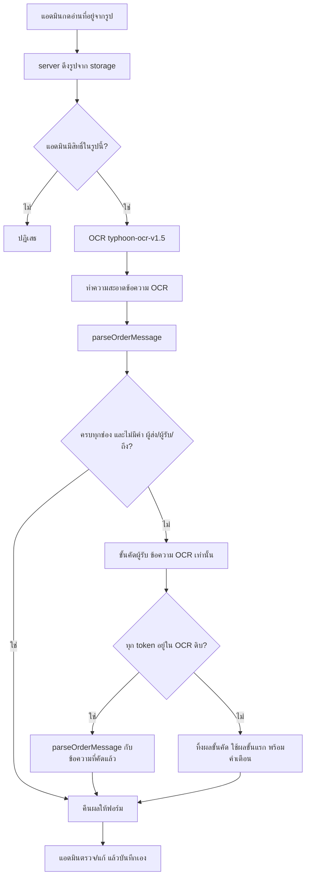

> **โมดูล:** M70-AddressFromImage (00072) — รหัสโมดูลชั่วคราว ตรวจชนกับ index ก่อน commit
> **ประเภทเอกสาร:** Product Requirements Document (PRD)
> **เวอร์ชัน:** 0.1
> **วันที่จัดทำ:** 2026-10-09
> **สถานะ:** พักไว้ 2026-10-09 (มติ user) — Typhoon API ฟรีห้ามส่งข้อมูลส่วนบุคคล (tac ข้อ 2/4/7) · กลับมาทำเมื่อได้ผู้ให้บริการที่ส่งข้อมูลส่วนตัวได้ (ผลทดสอบ Gemini ส่งรูปตรง: ผู้รับถูกฝั่ง 10/10)
> **เจ้าของเอกสาร:** BA + PO + PM (ดู [[Feature-Docs-Ownership]])

# PRD: อ่านที่อยู่จากรูป (Address From Image · OCR)

---

## Executive Summary

ลูกค้าจำนวนมากไม่พิมพ์ที่อยู่จัดส่งเป็นตัวอักษร แต่ส่งมาเป็น **รูป** ในแชท ได้แก่ แคปหน้าจอข้อความ กระดาษพิมพ์ ลายมือบนกระดาษ หรือใบปะหน้าพัสดุเก่า แอดมินร้านต้องเปิดรูป พิมพ์ชื่อ เบอร์ ที่อยู่ ตำบล อำเภอ จังหวัด รหัสไปรษณีย์ใหม่ทีละช่อง ซึ่งช้าและพิมพ์ผิดง่าย ผลคือพัสดุส่งผิดที่

ฟีเจอร์นี้เพิ่มปุ่ม **"อ่านที่อยู่จากรูป"** บนรูปในห้องแชทของ seller (มือถือ = กดค้างที่รูป, desktop = เอาเมาส์ชี้ที่รูป) เมื่อร้านกด ระบบให้ AI อ่านรูปนั้นแล้วแยกเป็น ชื่อ · เบอร์ · ที่อยู่ · ตำบล · อำเภอ · จังหวัด · รหัสไปรษณีย์ ส่งเข้า **ฟอร์มสร้างคำสั่งซื้อที่มีอยู่แล้ว** ให้แอดมินตรวจและแก้ก่อนบันทึกทุกครั้ง ช่องที่อ่านไม่ได้ปล่อยว่าง ไม่เดา

ผลทดสอบจริง 10 รูป (2026-10-09) พบว่าไม่ต้องสร้างตัวแยกที่อยู่ใหม่ ตัวแยกเดิม `parseOrderMessage` (ชุดสะกดตาม iShip) ใช้ต่อได้ สิ่งที่ต้องเพิ่มคือ (1) ขั้นอ่านตัวอักษรจากรูป (OCR) และ (2) ขั้น "คัดเฉพาะที่อยู่ผู้รับ" สำหรับรูปใบปะหน้าที่มีทั้งผู้ส่งและผู้รับปนกัน โดยขั้นที่ 2 ต้องมีด่านกันโมเดลแต่งคำขึ้นเอง

**ประเด็นที่ต้องระวังที่สุดมี 2 เรื่อง** เรื่องแรกคือความเป็นส่วนตัว ที่อยู่/เบอร์ลูกค้าห้ามถูกส่งเข้า AI ตามข้อตกลง 00019 (BR-AI-09) ฟีเจอร์นี้ต้องขยายข้อยกเว้นเดิม (อนุมัติ 2026-08-04) ให้ครอบ "รูปที่ร้านกดสั่งอ่านเอง" ภายใต้เงื่อนไขเดิมครบ ซึ่ง user อนุมัติหลักการแล้ว เรื่องที่สองคือผู้ให้บริการ Typhoon ฟรีมีเพดาน 20 request/นาที รวมทั้งบัญชี ส่วนเงื่อนไขการเก็บ/เทรนข้อมูลของ API ฟรียังไม่ได้อ่าน จึงยังเป็นความเสี่ยงเปิดอยู่

---

## 1. Business Goals & KPIs

### 1.1 เป้าหมายทางธุรกิจ

| เป้าหมาย | รายละเอียด |
|----------|-----------|
| **ลดเวลาและความผิดพลาดตอนคีย์ที่อยู่จากรูป** | แอดมินไม่ต้องพิมพ์ใหม่ทีละช่อง ลดพัสดุตีกลับเพราะที่อยู่พิมพ์ผิด |
| **ทางเข้าอยู่ที่รูป ไม่ต้องออกจากห้องแชท** | กดที่รูปที่ลูกค้าส่งมาได้เลย (1 จังหวะ) ไม่ต้องเซฟรูปแล้วไปพิมพ์เอง |
| **ไม่แต่งข้อมูลที่ไม่มีในรูป** | ช่องที่อ่านไม่ได้ = ว่าง ทุกคำที่ AI คัดมาต้องปรากฏในข้อความที่ OCR อ่านได้จริง ไม่งั้นทิ้ง |
| **ไม่ขยายการส่งข้อมูลลูกค้าเข้า AI เกินที่ user อนุมัติ** | ร้านกดเองเท่านั้น ไม่อ่านอัตโนมัติ ไม่แนบบริบท ไม่เก็บเนื้อหา/รูปใน log |
| **ใช้ของที่มี ไม่สร้างขนาน** | ใช้ `parseOrderMessage` เดิม ฟอร์มสร้างออเดอร์เดิม ระบบอัปโหลด/storage เดิม |

### 1.2 ตัวชี้วัดความสำเร็จ (KPIs)

> ตัวเลขเป้าหมายเป็นค่าตั้งต้นเพื่อวางแผน ยังไม่ใช่มติ ชุดทดสอบมีเพียง 10 รูป จึงใช้เป็นเกณฑ์ผ่านขั้นต่ำ ไม่ใช่การรับรองความแม่นยำใน production

| KPI | คำอธิบาย | เป้าหมาย |
|-----|----------|---------|
| **ผ่านชุดรูปทดสอบ** | รูปใน acceptance corpus ที่ช่องผลลัพธ์ตรงกับค่าที่คาดไว้ ÷ 10 (BRD §3.1) | ครบทั้ง 10 รูป ตามเกณฑ์ต่อรูป |
| **ที่อยู่ผู้รับถูกฝั่ง** | ใบปะหน้า/รูปผสม (6 รูปในชุดทดสอบ) ที่ได้ที่อยู่ "ผู้รับ" ไม่ใช่ผู้ส่ง | 6/6 และต้องเป็น 0 ครั้งที่หยิบผู้ส่ง |
| **คำที่แต่งขึ้น** | จำนวนครั้งที่ผลสุดท้ายมีคำที่ไม่ปรากฏใน OCR ดิบ | **ต้องเป็น 0 เสมอ** (บังคับด้วยโค้ดและเทส ไม่ใช่วัดภายหลัง) |
| **ความเร็ว** | เวลากดจนเห็นผล (ไม่นับเวลาแอดมินตรวจ) | p50 ≤ 5 วินาที · รูปเบลอยอมได้ถึง ~12 วินาที โดยต้องมีสถานะรอ |
| **อัตราได้ผลที่ใช้ได้** | ครั้งที่ได้อย่างน้อย ชื่อ/เบอร์/ที่อยู่ 1 ช่อง ÷ ครั้งที่ร้านกด (ยกเว้นรูปที่ไม่ใช่ที่อยู่) | baseline หลังเปิด · ยังไม่มีเป้า |
| **เวลาประหยัดต่อออเดอร์** | เวลาจากกดสร้างออเดอร์ถึงที่อยู่ครบ เทียบรูปที่คีย์เอง | baseline หลังเปิด · ยังไม่มีเป้า |

---

## 2. User Personas (กลุ่มผู้ใช้งาน)

### 2.1 แอดมินร้าน / เจ้าของร้าน (ผู้กดอ่านและตรวจ)

**ข้อมูลพื้นฐาน:**
- ผู้ใช้ฝั่ง seller ที่ตอบแชทลูกค้าและเปิดออเดอร์ ทั้งเจ้าของและสมาชิกร้านที่มีสิทธิ์เปิดออเดอร์จากแชท
- ใช้ทั้งมือถือ (ส่วนใหญ่) และ desktop

**เป้าหมาย:**
- เปิดออเดอร์จากที่อยู่ที่ลูกค้าส่งเป็นรูปให้เร็วและไม่พิมพ์ผิด

**ความต้องการ:**
- กดที่รูปแล้วได้ช่องข้อมูลที่กรอกให้ ตรวจและแก้ได้
- รู้ว่าช่องไหนอ่านไม่ได้ (ว่าง) ไม่ใช่ถูกเดาให้
- รู้ชัดเจนเมื่อระบบอ่านไม่ได้/ช้า/คิวเต็ม และรู้ว่าควรทำอะไรต่อ

**จุดปวด (Pain Points):**
- ลูกค้าแคปข้อความที่อยู่ ถ่ายกระดาษ หรือเขียนมือ ต้องเปิดรูปสลับกับฟอร์มแล้วพิมพ์ทีละช่อง
- ใบปะหน้าเก่ามีทั้งผู้ส่งและผู้รับ พิมพ์สลับฝั่งได้ง่าย

### 2.2 ลูกค้าของร้าน (ผู้ส่งรูป — ไม่ใช่ผู้ใช้ระบบ)

**ข้อมูลพื้นฐาน:**
- ส่งรูปที่อยู่ในแชท (Messenger/Instagram/LINE/อื่น ๆ ที่ Deep เชื่อมอยู่) ไม่รู้ว่าร้านใช้ AI อ่าน

**ข้อกำหนด:**
- ข้อมูลของลูกค้า (ชื่อ เบอร์ ที่อยู่ ซึ่งอยู่ในรูป) ถูกส่งไปผู้ให้บริการ AI เฉพาะเมื่อร้านตัดสินใจกดเองต่อรูป ไม่มีการส่งเงียบ ๆ (ดู §3.5)

### 2.3 ทีมปฏิบัติการ Deep (Ops)

**ความต้องการ:**
- เพดานของ Typhoon ฟรี (2 req/s · 20 req/นาที ทั้งบัญชี) ถูกบังคับที่ server ไม่ใช่แค่ซ่อนปุ่ม
- รู้อัตราสำเร็จ/ล้ม/ชนเพดาน โดยไม่ต้องเก็บเนื้อหารูป

---

## 3. Business Requirements

### 3.1 ทางเข้า: ปุ่ม "อ่านที่อยู่จากรูป" บนรูปในแชท (มติ user)

**ความต้องการ:**
- มือถือ: กดค้างที่รูป → เมนูกดค้างเดิมมีรายการ "อ่านที่อยู่จากรูป"
- desktop: เอาเมาส์ชี้ที่รูป → มีปุ่ม "อ่านที่อยู่จากรูป" ข้างบับเบิล ในแถวเดียวกับปุ่ม ตอบกลับ/คัดลอก/รีแอ็กชัน/สร้างคำสั่งซื้อจากข้อความ
- ปุ่มโผล่เฉพาะรูปจริงที่ลูกค้าส่ง ไม่ใช่สติกเกอร์ ไม่ใช่รูปที่ถูกลบ ไม่ใช่รูปที่ยังส่งไม่สำเร็จ/ยังเป็นข้อความชั่วคราว

**Business Rules:**
- ใช้ของเดิมในห้องแชท ห้ามสร้างกลไก long-press/hover ใหม่ขนาน: มือถือเสียบใน `actionTargetActions` (`src/app/(paces)/seller/(chat)/inbox/[conversationId]/components/ChatThread.tsx:1854`) ข้างรายการ "บันทึกรับเงิน" (`:1960-1974`) ส่วน desktop เสียบข้าง `CreateOrderFromMessageButton` (`ChatThread.tsx:614`, ใช้ที่ `ThreadMessageList.tsx:571`)
- เงื่อนไข "รูปที่อ่านได้" ต้องเป็นฟังก์ชันเดียวใน `src/lib` ที่มีเทส ทั้ง 2 ทางเข้าเรียกตัวเดียวกัน (convention `ui-boolean-needs-a-testable-home`, HR16)
- ปุ่มที่กดแล้วไม่เกิดอะไรแย่กว่าไม่มีปุ่ม: ซ่อนปุ่มเมื่อรูปไม่มี storage key หรือรูปยังไม่พร้อม

**เหตุผล:**
- user สั่งให้ทางเข้าอยู่ที่รูปในห้องแชท และห้องแชทมีกลไก "กดค้าง/ชี้" เป็นมาตรฐานแล้ว (user สั่ง 2026-08-02/03/04) การเสียบเข้าที่เดิมทำให้ผู้ใช้ไม่ต้องเรียนรู้ท่าใหม่

### 3.2 อ่านรูปแล้วแยกช่องที่อยู่ ตรวจก่อนใช้

**ความต้องการ:**
- ระบบอ่านตัวอักษรจากรูปแล้วแยกเป็น ชื่อ · เบอร์ · ที่อยู่ (บ้านเลขที่/หมู่/ซอย/ถนน) · ตำบล · อำเภอ · จังหวัด · รหัสไปรษณีย์
- รองรับรูป 4 แบบ: แคปข้อความ · กระดาษพิมพ์ · ลายมือ · ใบปะหน้าพัสดุ
- ผลต้องผ่านการตรวจโดยแอดมินก่อนใช้ทุกครั้ง ไม่มีการบันทึกออเดอร์อัตโนมัติ

**Business Rules:**
- ใช้ตัวแยกเดิม `parseOrderMessage` (`src/lib/parse-order-message.ts`) กับข้อความที่อ่านได้ก่อนเสมอ (ผลทดสอบ: ใช้ต่อได้เลย) ห้ามสร้างตัวแยกที่อยู่ชุดที่สอง
- ช่องที่หาไม่ได้ = ว่าง ไม่เดา ไม่เติมจากค่าสะสม ไม่เติมจากประวัติลูกค้า
- ชื่อจังหวัดสะกดตามชุดข้อมูล 77 จังหวัดของ iShip (ผ่าน parser เดิม) ไม่ใช้คำที่โมเดลสะกด

**เหตุผล:**
- ที่อยู่ที่ผิดคือพัสดุที่ส่งผิด ราคาของความผิดสูงกว่าราคาของช่องว่าง จึงเลือกว่างดีกว่าผิด

### 3.3 รูปใบปะหน้า/รูปผสม: คัดเฉพาะที่อยู่ผู้รับ

**ความต้องการ:**
- เมื่อรูปมีทั้งผู้ส่งและผู้รับ (ใบปะหน้าพัสดุ รูปลายมือที่มีใบปะหน้าอยู่ด้วย) ต้องได้ที่อยู่ **ผู้รับ** ไม่ใช่ผู้ส่ง

**Business Rules:**
- ลำดับ: (1) parser กับข้อความดิบก่อน → (2) ถ้าช่องไม่ครบ **หรือ** เจอคำ "ผู้ส่ง / ผู้รับ / ถึง" ค่อยเรียกขั้นคัดผู้รับ
- ขั้นคัดผู้รับส่ง "ข้อความที่ OCR อ่านได้" (ตัวอักษร ไม่ใช่รูป) เข้าโมเดลภาษา อุณหภูมิ 0 ให้คัดเฉพาะส่วนของผู้รับตามตัวอักษรเดิม ไม่แก้ ไม่แปล ไม่เติม
- 🛑 **ด่านกันแต่งคำ (บังคับ):** ทุก token ที่โมเดลคัดมาต้องปรากฏในข้อความ OCR ดิบ ไม่ผ่านด่าน = ทิ้งผลของขั้นนี้ทั้งก้อนแล้วใช้ผลจากขั้น 1 พร้อมแจ้งแอดมิน และต้องตัดป้ายที่โมเดลใส่มา (เช่น "ชื่อ: NONE") ก่อนส่งต่อ
- ถ้าขั้นคัดผู้รับล้ม (timeout/429) ให้คืนผลขั้น 1 พร้อมคำเตือนว่า "รูปนี้อาจมีผู้ส่งปนอยู่ ตรวจฝั่งผู้รับ" ไม่ใช่ล้มทั้งงาน

**เหตุผล:**
- ผลทดสอบ: ใบปะหน้า 5 ใบ + รูปที่ 03 parser เดี่ยว ๆ หยิบผิดฝั่ง แก้ได้ด้วยขั้นที่ 2 ถูก 6/6 ใน 0.5–0.9 วินาที แต่เคยมี 1 ครั้งที่โมเดลแต่งตำบลที่ไม่มีใน OCR การแต่งคำในที่อยู่เป็นความเสียหายชนิดที่แอดมินตรวจเจอยากที่สุด (ดูสมเหตุสมผล) จึงบังคับด้วยโค้ด

### 3.4 ผลไหลเข้าฟอร์มที่มีอยู่แล้ว

**ความต้องการ:**
- ผลอ่านไปลงฟอร์มสร้างคำสั่งซื้อ/กระจายที่อยู่ที่มีอยู่ ไม่สร้างฟอร์มใหม่
- แอดมินเห็นผลในรูปที่แก้ได้ และเปรียบเทียบกับรูปต้นฉบับได้ขณะตรวจ

**Business Rules:**
- ห้ามบันทึกที่อยู่หรือสร้างออเดอร์โดยไม่ผ่านการกดยืนยันของแอดมิน
- เส้นทางเดิมที่ผลจะไปลง: เมนู "สร้างคำสั่งซื้อ" จากข้อความส่ง `prefillText` เข้า `DraftOrderProvider` (`src/app/(paces)/seller/(chat)/_components/DraftOrderProvider.tsx:75,540,796`) แล้วเปิด `PasteParseSheet` ด้วย `initialText` (`.../orders/new/components/PasteParseSheet.tsx:22`) ให้แก้ต่อ — **ข้อเสนอ:** ส่งข้อความผู้รับที่คัดแล้วเข้า `prefillText` เพื่อใช้เส้นทางเดิมทั้งเส้น (ยังไม่ใช่มติ ดู OQ-3)
- ถ้าห้องแชทยังไม่มีร่างออเดอร์เปิดอยู่ ปุ่มต้องเปิดร่างให้ (เหมือนเมนู "สร้างคำสั่งซื้อ" ที่ทำอยู่) ถ้ามีร่างเปิดค้างอยู่แล้ว ห้ามทับข้อมูลที่แอดมินกรอกไปแล้วโดยไม่ถาม (เหมือนกฎ `prefillText` ที่ไม่ทับร่างเดิม)

**เหตุผล:**
- ระบบนี้มีชีตกระจายที่อยู่ที่แอดมินรู้จักอยู่แล้ว ผลอ่านจากรูปที่ลงช่องเดียวกันทำให้ "ตรวจแล้วแก้" เป็นพฤติกรรมเดิม

### 3.5 ความเป็นส่วนตัว: ขยายข้อยกเว้น PII เดิมให้ครอบ "รูปที่ร้านกดอ่านเอง" (มติ user)

**ความต้องการ:**
- ขยายข้อยกเว้นที่ user อนุมัติ 2026-08-04 (BR-AI-09-EX ของ 00019, บังคับที่ `src/app/api/orders/parse-address/route.ts`) ให้ครอบรูปที่ร้านกดสั่งอ่านเอง โดยคงเงื่อนไขเดิมครบ

**Business Rules (เงื่อนไขเดิมที่คงไว้ + ที่ตีความใหม่ให้ครอบรูป):**
1. กดโดยคนในร้านต่อครั้ง — ห้ามอ่านอัตโนมัติ ห้ามเป็น fallback อัตโนมัติ ห้ามอ่านทุกรูปที่เข้าแชท
2. ส่งได้เฉพาะรูปนั้น (และข้อความ OCR ที่ได้จากรูปนั้น) — ไม่แนบบริบทอื่น: ไม่มีชื่อร้าน สินค้า ราคา ประวัติแชท ข้อมูลลูกค้าจากฐาน; ห้ามเรียกผ่าน `ai-context.service.ts`
3. ไม่เก็บ log เนื้อหา: ห้าม log รูป ข้อความ OCR ผลที่แยกได้ — log ได้เฉพาะผลลัพธ์เชิงสถานะ (สำเร็จ/ว่าง/429/timeout) และเวลา; ข้อเดิม "จำกัด 2,000 ตัวอักษร" ใช้กับข้อความ OCR ที่ส่งเข้าขั้นคัดผู้รับด้วย
4. ผลของ AI ไม่ทับค่าที่ parser rule-based จับได้แน่นอนแล้ว (ถ้าขั้นคัดผู้รับกับขั้น 1 ขัดกัน ให้ขั้นคัดผู้รับชนะเฉพาะเมื่อพบคำ ผู้ส่ง/ผู้รับ/ถึง ซึ่งเป็นเหตุผลที่เรียกขั้นนี้ — รายละเอียดใน BRD BR-AFI-08)
5. ใช้การเรียกแบบไร้สถานะ (stateless) ไม่ฝากไฟล์/session ไว้ที่ผู้ให้บริการ (สอดคล้อง PRD 00019 ข้อ "ไม่เก็บบทสนทนาไว้ที่ผู้ให้บริการ AI")

**ที่ต้องแก้ให้ตรงกันพร้อมกัน (ห้ามแก้ที่เดียว):**
- `docs/20 - Features/00019 - AI Reply Assistant/BRD.md` (BR-AI-09-EX, บรรทัด 466-477) และ `PRD.md` (บรรทัด 168-171, 211) — ระบุว่า 00072 เป็นการขยายครั้งที่ 2
- คอมเมนต์ใน `src/app/api/orders/parse-address/route.ts:12-19` ซึ่งระบุว่าถ้าจะขยายต้องกลับมาแก้ PRD/BRD ก่อน — เอกสารชุดนี้ (เมื่อ user อนุมัติ) คือการแก้นั้น
- `docs/SRS.md` ถ้ามีรายการเส้นทาง/สัญญาของ API ใหม่ (HR11)

**เหตุผล:**
- รูปมีข้อมูลลูกค้าพอ ๆ กับข้อความ (บางรูปมีชื่อคนอื่นหรือแชทอื่นติดมาในแคป) และผู้รับบริการปลายทางเป็นรายใหม่ (Typhoon) จึงต้องเขียนไว้ชัดว่าเงื่อนไขไม่ได้หย่อนลง และต้องมีจุดบังคับที่โค้ดจุดเดียว

### 3.6 ผู้ให้บริการและเพดานการใช้งาน (มติ user)

**ความต้องการ:**
- ผู้ให้บริการ: Typhoon (opentyphoon.ai) API แบบ OpenAI-compatible `POST /v1/chat/completions`, Bearer `TYPHOON_API_KEY` (อยู่ใน `.env.local` แล้ว)
- OCR: `typhoon-ocr-v1.5` · ขั้นคัดผู้รับ: `typhoon-v2.5-30b-a3b-instruct` (temperature 0)
- เพดานฟรี: 2 request/วินาที · 20 request/นาที **รวมทั้งบัญชี** (ทุกร้านใช้ร่วมกัน)

**Business Rules:**
- 1 ครั้งที่ร้านกดใช้ได้ 1–2 request (OCR + คัดผู้รับถ้าจำเป็น) → เพดานระบบ ~10–20 ครั้งอ่านต่อนาทีทุกร้านรวมกัน ต้องมี rate limit ฝั่งเราต่อร้าน/ต่อผู้ใช้ และจัดการ 429 อย่างสุภาพ (ข้อความบอกให้รอ ไม่ใช่ error ทั่วไป)
- timeout ≥ 15 วินาที (ปกติ 1.5–4 วินาที รูปเบลอถึง ~12 วินาที)
- ต้องมีสถานะรอที่ชัดเจน และปุ่มกดซ้ำระหว่างรอไม่ได้
- ไม่มี fallback ไปผู้ให้บริการรายอื่นอัตโนมัติ (การส่งข้อมูลลูกค้าไปรายที่สองต้องผ่านการอนุมัติแยก) — ถ้า Typhoon ใช้ไม่ได้ ร้านกรอกเองหรือวางข้อความเอง

**เหตุผล:**
- เพดานรวมบัญชีหมายความว่าร้านหนึ่งที่กดรัว ๆ ทำให้ร้านอื่นอ่านไม่ได้ จึงต้องแบ่งสัดส่วนที่ server

### 3.7 ข้อความแจ้งผู้ใช้ (UI copy ที่เสนอ)

ภาษาไทย ไม่มี emoji ชื่อแบรนด์ใช้ "Deep" icon เลือกโดย `safepay-ux` (ไม่ระบุชื่อ icon ที่นี่ — HR12)

| สถานการณ์ | ข้อความที่เสนอ |
|-----------|---------------|
| ชื่อปุ่ม/เมนู | อ่านที่อยู่จากรูป |
| ระหว่างรอ | กำลังอ่านรูป อาจใช้เวลาถึง 15 วินาทีถ้ารูปไม่ชัด |
| อ่านได้ครบ | อ่านที่อยู่จากรูปแล้ว ตรวจก่อนใช้ทุกช่อง |
| อ่านได้บางช่อง | อ่านได้บางช่อง ช่องที่ว่างอ่านไม่ได้จากรูป กรอกเพิ่มได้ |
| รูปไม่ใช่ที่อยู่ | ไม่พบที่อยู่ในรูปนี้ ลองรูปอื่นหรือพิมพ์เอง |
| 429 / คิวเต็ม | ตอนนี้มีคนใช้อ่านรูปหลายคน รอสักครู่แล้วลองใหม่ หรือพิมพ์ที่อยู่เอง |
| timeout | อ่านรูปนี้ไม่ทัน ลองอีกครั้ง หรือพิมพ์ที่อยู่เอง |
| รูปใหญ่เกิน | รูปนี้ใหญ่เกินกว่าจะอ่านได้ ขอให้ลูกค้าส่งใหม่หรือพิมพ์ที่อยู่เอง |
| ผู้ให้บริการไม่พร้อม | ยังอ่านรูปไม่ได้ในตอนนี้ พิมพ์ที่อยู่เองได้ตามปกติ |
| เตือนมีผู้ส่งปน (ขั้นคัดผู้รับล้ม) | รูปนี้อาจมีที่อยู่ผู้ส่งปนอยู่ ตรวจว่าเป็นที่อยู่ผู้รับ |
| ด่านกันแต่งคำไม่ผ่าน | คัดที่อยู่ผู้รับไม่ได้อย่างมั่นใจ ตรวจจากรูปด้วยตัวเอง |

---

## 4. Business Rules & Constraints

### 4.1 กฎทางธุรกิจหลัก

| กฎ | คำอธิบาย |
|----|----------|
| **ร้านกดเองเท่านั้น** | ไม่อ่านอัตโนมัติ ไม่อ่านทุกรูป ไม่เป็น fallback (BRD BR-AFI-01) |
| **รูปที่อ่านได้ = รูปจริงในห้องแชทของร้าน** | server ตรวจว่ารูปเป็นของข้อความในบทสนทนาของร้านที่ผู้กดมีสิทธิ์ (BR-AFI-03) |
| **ไม่มีบริบทอื่นแนบ** | ส่งเฉพาะรูป/ข้อความ OCR ของรูปนั้น (BR-AFI-04) |
| **ไม่เก็บเนื้อหา** | ไม่ log รูป/ข้อความ/ผล (BR-AFI-05) |
| **ช่องว่างไม่เดา** | ไม่เติมจากอะไรก็ตามที่ไม่ได้อยู่ในรูป (BR-AFI-07) |
| **ทุก token ที่ AI คัดต้องอยู่ใน OCR ดิบ** | ไม่ผ่าน = ทิ้ง (BR-AFI-08) |
| **แอดมินตรวจ/แก้ทุกครั้งก่อนบันทึก** | ไม่มีเส้นทางบันทึกอัตโนมัติ (BR-AFI-10) |
| **เพดานรวมบัญชีต้องมีที่แบ่งสัดส่วน** | rate limit ต่อร้าน/ผู้ใช้ + จัดการ 429 (BR-AFI-12) |

### 4.2 ข้อจำกัดทางธุรกิจ

| ข้อจำกัด | รายละเอียด |
|---------|-----------|
| **Typhoon ฟรี: 2 req/s · 20 req/นาที ทั้งบัญชี** | ทุกร้านใช้โควตาร่วมกัน; ถ้าฟีเจอร์ได้รับความนิยมต้องตัดสินใจเรื่องแผนจ่าย (ดู OQ-2) |
| **เวลา 1.5–4 วินาที ปกติ, รูปเบลอถึง ~12 วินาที** | จึงต้อง timeout ≥ 15 วินาทีและมีสถานะรอ |
| **เงื่อนไขการเก็บ/เทรนข้อมูลของ API ฟรียังไม่ได้อ่าน** | ข้อมูลลูกค้าที่ส่งไปอาจถูกเก็บหรือใช้เทรน — **ต้องอ่านและตัดสินก่อนเปิดใช้จริง** (ดู OQ-1, §6.1) |
| **TikTok ใบปะหน้าปิดบังเบอร์/ชื่อมาแต่ต้น** | ได้ไม่ครบ = พฤติกรรมที่ถูก ไม่ใช่บั๊ก; ห้ามพยายามกู้ค่าที่ถูกปิด |
| **ไม่มีรูปในชุดทดสอบ commit ได้** | รูปมี PII จริงเก็บนอก repo ที่ `~/ocr-samples-safepay/`; เทสใน repo ใช้ข้อความ OCR สังเคราะห์ที่ไม่มี PII จริง |
| **Vercel Function body 4.5MB** | ห้ามให้ client ส่งรูปผ่าน body ของ API route; รูปแชทอยู่ใน storage แล้ว ให้ server ดึงเอง (convention `upload-body-size-limit`) |

---

## 5. Out of Scope (นอกขอบเขต)

| หัวข้อ | ระยะ | คำอธิบาย |
|--------|------|----------|
| **อ่านอัตโนมัติทุกรูปที่เข้าแชท** | ไม่ทำ | ขัดข้อยกเว้น PII (ต้องกดเองต่อรูป) |
| **อ่านเป็น fallback เมื่อ parser ข้อความพลาด** | ไม่ทำ | ขัดข้อยกเว้น PII ข้อ 1 |
| **PDF / ไฟล์เอกสาร** | Phase 2 | รอบแรกรับเฉพาะรูป |
| **หลายที่อยู่ในรูปเดียวแล้วให้เลือกหลายชุด** | Phase 2 | รอบแรกคืนที่อยู่ผู้รับ 1 ชุดต่อรูป; รูปที่มีหลายที่อยู่ผู้รับ → ดู OQ-5 |
| **อ่านรูปหลายรูปพร้อมกัน (batch)** | Phase 2 | กดทีละรูป เพราะเพดาน 20 req/นาที |
| **อ่านรูปที่ไม่ใช่รูปในแชท** (อัปโหลดจากเครื่องในฟอร์มออเดอร์) | Phase 2 | รอบแรกทางเข้าอยู่ที่รูปในแชทเท่านั้น (มติ user) |
| **แก้ไขที่อยู่ให้ถูกต้องด้วย AI** (เดาตำบล/รหัสไปรษณีย์ที่หายไป) | ไม่ทำ | ขัดกฎ "ไม่เดา" |
| **อ่านสลิป/ตัวเลขเงิน** | ไม่ทำ | เป็นเรื่องของ 00050 และมติ "แนบสลิป ≠ ได้รับเงิน" |
| **ผู้ให้บริการสำรองอัตโนมัติ** | ไม่ทำ | การส่งข้อมูลลูกค้าไปรายที่สองต้องอนุมัติแยก |
| **เก็บรูป/ผล OCR เพื่อพัฒนาโมเดล** | ไม่ทำ | ขัดข้อยกเว้น PII ข้อ 3 |
| **แปลภาษา / อ่านที่อยู่นอกประเทศไทย** | ไม่ทำ | parser และชุดจังหวัดเป็นของไทย |

---

## 6. Risks & Mitigation (ความเสี่ยงและแนวทางแก้ไข)

### 6.1 ความเสี่ยงทางธุรกิจ

| ความเสี่ยง | ผลกระทบ | ระดับความรุนแรง | แนวทางแก้ไข |
|-----------|---------|-----------------|-------------|
| **API ฟรีของ Typhoon อาจเก็บ/เทรนจากข้อมูลที่ส่ง (ยังไม่ได้อ่านเงื่อนไข)** | ข้อมูลลูกค้า (ชื่อ เบอร์ ที่อยู่) หลุดไปอยู่ในเงื่อนไขที่ร้านและลูกค้าไม่รู้ | **สูง** | อ่านเงื่อนไขก่อนเปิดใช้; ถ้าเก็บ/เทรน ต้องเลือก: แผนจ่ายที่ปิดการเก็บ / ไม่เปิดฟีเจอร์ / ขออนุมัติ user ใหม่ — **เป็นเงื่อนไขก่อนเปิด (gate) ไม่ใช่งานตามหลัง** (OQ-1) |
| **ที่อยู่ที่ผิดดูเหมือนถูก** (โมเดลแต่งตำบล/สลับผู้ส่ง-ผู้รับ) | พัสดุส่งผิดที่ ร้านเสียเงิน | สูง | ด่านทุก token ต้องอยู่ใน OCR ดิบ + ช่องว่างไม่เดา + แอดมินตรวจทุกครั้ง + เทสด้วยชุดรูป |
| **ฟีเจอร์ดูเหมือนแม่นจนแอดมินเลิกตรวจ** | ความผิดหลุดเข้าออเดอร์ | กลาง | UI บังคับให้เห็นช่องที่ว่าง/ช่องที่น่าสงสัย และเปิดรูปต้นฉบับเทียบได้ขณะตรวจ; คำว่า "ตรวจก่อนใช้" อยู่ในข้อความผล |
| **รูปมีข้อมูลบุคคลที่สามติดมา** (ชื่อคนอื่นในแคปแชท) | ข้อมูลเกินกว่าที่อยู่ถูกส่งไปผู้ให้บริการ | กลาง | ร้านกดเองต่อรูป (ตัดสินใจรู้ตัว); ส่งเฉพาะรูปนั้น; ไม่เก็บ; ขั้นคัดผู้รับส่งเฉพาะข้อความไม่ใช่รูป |
| **โควตารวมบัญชีหมดเพราะร้านเดียว** | ร้านอื่นอ่านไม่ได้ | กลาง | rate limit ต่อร้าน/ผู้ใช้; ข้อความ 429 ที่บอกให้รอ; ติดตามอัตราชนเพดานเพื่อตัดสินใจแผนจ่าย |
| **ผู้ใช้เข้าใจว่า Deep "อ่านแชทลูกค้าอยู่ตลอด"** | ความเชื่อมั่นลด | กลาง | ไม่มีการอ่านอัตโนมัติ; ข้อความอธิบายสั้น ๆ ตอนกดครั้งแรก (ถ้า ux เห็นว่าจำเป็น — OQ-7) |

### 6.2 ความเสี่ยงทางเทคนิค

| ความเสี่ยง | ผลกระทบ | แนวทางแก้ไข |
|-----------|---------|-------------|
| **OCR คืนบรรทัดเดียว `**OCR Detected Words:** a, b, c` (รูปแคปข้อความ)** | parser อ่านไม่ได้ทั้งก้อน | ตัดหัว แล้วแตก ", " เป็นบรรทัด — ระวังจุลภาคในที่อยู่จริง (เช่น "12/3, ซอย 5") ต้องมีเทสที่มีจุลภาคในที่อยู่ |
| **ใบปะหน้า parser หยิบผิดฝั่ง** | ที่อยู่ผู้ส่งแทนผู้รับ | ขั้นคัดผู้รับ + ด่านกันแต่งคำ |
| **โมเดลแต่งคำ / ใส่ป้าย "ชื่อ: NONE"** | ข้อมูลปลอมในช่อง | ด่านทุก token อยู่ใน OCR ดิบ + ตัดป้ายก่อนส่งต่อ |
| **timeout รูปเบลอ ~12 วินาที** | ผู้ใช้คิดว่าค้าง กดซ้ำ | timeout ≥ 15 วินาที + สถานะรอ + กันกดซ้ำ |
| **429 ของ Typhoon** | อ่านไม่สำเร็จ | จัดการแยกจาก error ทั่วไป (ข้อความ + ปุ่มลองใหม่หลังรอ); ไม่ retry รัว ๆ ที่ server |
| **client ส่งรูปผ่าน body → 413 เงียบ** | อ่านรูปใหญ่ไม่ได้โดยไม่มีสาเหตุ | server ดึงรูปจาก storage เอง; client ส่งแค่ตัวอ้างอิงข้อความ/ไฟล์ |
| **รูปใหญ่เกินที่ Typhoon รับ** | ล้มเงียบหรือช้า | เพดานขนาดรูปที่ server ยอมอ่าน (ยืนยันจากของจริงตอนทำ SRS — OQ-4) + ข้อความ "รูปใหญ่เกิน" |
| **ID รูปถูกส่งมาจากร้านอื่น (IDOR)** | อ่านรูปของร้านอื่น | server resolve รูปจากข้อความ→บทสนทนา→ร้านที่ผู้กดมีสิทธิ์ ไม่เชื่อ fileId ที่ client ส่ง (BR-AFI-03) |
| **ชื่อ env ไม่มีใน production** | อ่านไม่ได้บน prod | ตรวจ `TYPHOON_API_KEY` บน Vercel ก่อนปล่อย; ถ้าขาด → ข้อความ "ยังไม่ได้ตั้งค่า AI" เหมือน route เดิม |
| **เทสเขียวเพราะ fixture ว่าง** | เทสไม่จับบั๊กจริง | AC ผูกกับชุดรูปจริง 10 รูป + mutation ตรวจด่านกันแต่งคำ (convention `mutation-silence-means-weak-corpus`, `rule-must-be-enforced-not-described`) |

---

## 7. Glossary (อภิธานศัพท์)

| คำศัพท์ | ความหมาย |
|---------|----------|
| **OCR** | การอ่านตัวอักษรจากรูป ในฟีเจอร์นี้ใช้ `typhoon-ocr-v1.5` |
| **ข้อความดิบ (OCR ดิบ)** | ข้อความที่ OCR คืนมาก่อนการตัด/แยกใด ๆ ใช้เป็นเกณฑ์ตรวจว่าโมเดลแต่งคำหรือไม่ |
| **ขั้นคัดผู้รับ** | ขั้นที่ 2: ส่งข้อความ OCR เข้าโมเดลภาษาให้คัดเฉพาะที่อยู่ผู้รับตามตัวอักษรเดิม |
| **ด่านกันแต่งคำ** | ตรวจว่าทุก token ที่ขั้นคัดผู้รับคืนมาปรากฏในข้อความ OCR ดิบ |
| **ใบปะหน้า** | ใบแปะพัสดุที่มีทั้งผู้ส่งและผู้รับ |
| **BR-AI-09 / BR-AI-09-EX** | ข้อห้ามส่ง PII ลูกค้าเข้า AI ของ 00019 และข้อยกเว้นที่ user อนุมัติ 2026-08-04 |
| **prefillText** | ข้อความตั้งต้นที่ส่งเข้าร่างออเดอร์เพื่อให้ชีตกระจายที่อยู่เปิดมาพร้อมข้อความ |
| **acceptance corpus** | ชุดรูปทดสอบ 10 รูป เก็บนอก repo ที่ `~/ocr-samples-safepay/` (มี PII ห้าม commit) |
| **Typhoon** | ผู้ให้บริการ AI ภาษาไทย (opentyphoon.ai) ที่ใช้ทั้ง OCR และขั้นคัดผู้รับ |

---

## 8. Success Metrics (ตัวชี้วัดความสำเร็จ)

> วัดโดย **นับเหตุการณ์เชิงสถานะ ไม่เก็บเนื้อหา** (สอดคล้องข้อยกเว้น PII ข้อ 3) ไม่มีระบบ analytics ใหม่ในรอบแรก — ใช้ log บรรทัดผลลัพธ์ + query นับ (ยืนยันวิธีกับ Controller ใน OQ-8)

| ตัวชี้วัด | ค่าที่คาดหวัง | วิธีวัด |
|----------|---------------|--------|
| **ผ่านชุดรูปทดสอบ** | 10/10 ตามเกณฑ์ต่อรูปใน BRD §3.1 | รันสคริปต์ชุดรูปบนเครื่อง dev ก่อนปล่อย (ไม่รันใน CI เพราะรูปมี PII) |
| **คำที่แต่งขึ้นในผลสุดท้าย** | 0 | เทสด่านกันแต่งคำ + mutation + นับ "ถูกทิ้งด้วยด่าน" ต่อสัปดาห์ |
| **ที่อยู่ผู้รับถูกฝั่ง (รูปผสม)** | 6/6 ในชุดทดสอบ | สคริปต์ชุดรูป |
| **ความเร็ว p50 / p95** | p50 ≤ 5 วินาที · p95 ≤ 15 วินาที | เวลาที่ route วัดเอง ใส่ใน Server-Timing/ log สถานะ |
| **สัดส่วนผลต่อการกด** | บันทึกจำนวน ครบ / บางช่อง / ว่าง / 429 / timeout / ผู้ให้บริการล้ม | นับจาก log สถานะ |
| **การชนเพดาน Typhoon** | ติดตามจำนวน 429 ต่อวัน | นับจาก log; ใช้ตัดสินใจเรื่องแผนจ่าย |
| **ร้านใช้งานซ้ำ** | baseline หลังเปิด | ร้านที่กด ≥ 2 ครั้งใน 14 วัน ÷ ร้านที่กด ≥ 1 ครั้ง |

---

## 9. Dependencies & Assumptions

### 9.1 สิ่งที่ต้องพึ่งพา (Dependencies)

| ระบบ/ส่วนประกอบ | ความสัมพันธ์ |
|-----------------|-------------|
| **Typhoon API (`opentyphoon.ai`)** | OCR (`typhoon-ocr-v1.5`) และขั้นคัดผู้รับ (`typhoon-v2.5-30b-a3b-instruct`); ต้องมี `TYPHOON_API_KEY` ทั้ง dev และ prod |
| **`parseOrderMessage`** (`src/lib/parse-order-message.ts`) | ตัวแยกช่องที่อยู่ (ชุดสะกดจังหวัดตาม iShip) |
| **ห้องแชท seller** (`ChatThread.tsx`, `ThreadMessageList.tsx`) | ทางเข้า long-press/hover |
| **`DraftOrderProvider` / `PasteParseSheet` / `PasteParsePanel` / `CustomerQuickBlock`** | ปลายทางของผล |
| **Storage + `/api/files`** | server ดึงรูปแชทเอง; ใช้ด่านสิทธิ์เดิมของ `/api/files` เป็นแนวทางตรวจสิทธิ์ |
| **00019 AI Reply Assistant** | ข้อยกเว้น BR-AI-09-EX ที่ถูกขยาย; อาจมีโควตา AI ต่อร้านที่ต้องตัดสินว่านับรวมหรือไม่ (OQ-6) |
| **00022 iShip** | ชุดข้อมูลจังหวัด/ตำบลที่ใช้ตรวจสะกด |
| **`docs/conventions/upload-body-size-limit.md`** | กติกาห้ามส่งไฟล์ผ่าน body |

### 9.2 สมมติฐาน (Assumptions)

- รูปที่ลูกค้าส่งผ่านช่องทางที่ Deep เชื่อม ถูกเก็บไว้ใน storage แล้ว และข้อความรูปมีตัวอ้างอิงไฟล์ (`imageUrl` เป็น storage key) — ยืนยันกับโค้ดตอนทำ SRS
- ผลทดสอบ 10 รูปแทนรูปจริงส่วนใหญ่ได้ในระดับพอใช้ ไม่ได้รับรองความแม่นยำทั่วไป
- ร้านไทยรับได้กับเวลารอ 2–15 วินาทีถ้ามีสถานะรอชัดเจน
- แอดมินตรวจผลก่อนบันทึกจริง (เป็นพฤติกรรมเดิมของชีตกระจายที่อยู่)
- ใบปะหน้า TikTok ที่ปิดชื่อ/เบอร์ ไม่ใช่เคสที่ต้องแก้

---

## 10. Appendix

### 10.1 ตัวอย่าง User Journey

**Scenario: ลูกค้าส่งรูปกระดาษที่อยู่ แอดมินเปิดออเดอร์บนมือถือ**

1. ลูกค้าส่งรูปกระดาษพิมพ์ที่อยู่เข้าแชท Messenger ของร้าน
2. แอดมินกดค้างที่รูป → เมนูกดค้างขึ้นรายการ "อ่านที่อยู่จากรูป"
3. แอดมินกด → เห็นสถานะ "กำลังอ่านรูป" (ปกติ 2–5 วินาที)
4. ระบบ OCR อ่านรูป → parser แยกช่องได้ครบ → ไม่ต้องเรียกขั้นคัดผู้รับ
5. เปิดร่างออเดอร์พร้อมชีตกระจายที่อยู่ที่ใส่ข้อความที่อ่านได้ → ช่อง ชื่อ/เบอร์/ที่อยู่/ตำบล/อำเภอ/จังหวัด/รหัสไปรษณีย์ถูกเติมให้
6. แอดมินตรวจเทียบกับรูป แก้ช่องที่ผิด แล้วบันทึกออเดอร์เองตามขั้นเดิม

### 10.2 ภาพรวมการทำงาน

### 10.3 ชุดรูปทดสอบ (acceptance corpus)

เก็บที่ `~/ocr-samples-safepay/` นอก repo — มี PII จริง **ห้าม commit ห้ามแนบใน PR ห้ามวางเนื้อหาในเอกสาร** ตารางสรุปประเภทและพฤติกรรมที่คาดอยู่ใน BRD §3.1

---

**หมายเหตุ:**
เอกสารนี้เป็นการบันทึกความต้องการทางธุรกิจ (Business Requirements) โดยไม่มีรายละเอียดทางเทคนิคระดับ API/data model
สำหรับ Functional Requirements / User Story / Acceptance Criteria ดู [[BRD]] ของโมดูลนี้
สำหรับ technical specification ดู [[SRS]] ของโมดูลนี้ (ยังไม่เขียน — รอ user อนุมัติ PRD+BRD)

---

## 11. Open Questions (ต้องให้ user/Controller ตัดสิน)

| # | คำถาม | ข้อเสนอ (ยังไม่ใช่มติ) |
|---|-------|-----------------------|
| **OQ-1** | **ตรวจแล้ว 2026-10-09 — ติด:** เงื่อนไข API ของ Typhoon (opentyphoon.ai/tac) ข้อ 2 ผู้ใช้ต้องรับรองว่า Input "ไม่มีข้อมูลส่วนบุคคลหรือข้อมูลอ่อนไหว" (ฝ่าฝืน = ลบ/บล็อกบัญชีได้ทันที) และข้อ 4 ให้สิทธิ์ใช้ Input แบบถาวรเพื่อ "พัฒนาและเทรนโมเดล" ไม่มีข้อยกเว้นแผนจ่าย · รูปที่อยู่ลูกค้า = ข้อมูลส่วนบุคคลโดยตรง | ห้ามใช้ API ของ opentyphoon.ai กับรูปลูกค้าจริง · ทางเลือก: (ก) Gemini แบบจ่ายเงิน (ผู้ประมวลผลที่อนุมัติไว้แล้วสำหรับข้อความที่อยู่) (ข) โมเดล Typhoon OCR แบบ open-weight ผ่านผู้ให้บริการที่ไม่เก็บ/ไม่เทรน หรือตั้งเครื่องเอง — รอ user เลือก |
| **OQ-2** | ถ้าใช้งานจริงเกินเพดาน 20 req/นาที จะอัปเกรดแผนจ่ายหรือปล่อยให้ร้านรอ | รอรอบแรกก่อน นับ 429 แล้วตัดสิน |
| **OQ-3** | ผลลงที่ไหน: (ก) ส่งข้อความผู้รับที่คัดแล้วเข้า `prefillText` ใช้เส้นทางกระจายที่อยู่เดิมทั้งเส้น หรือ (ข) ส่งช่องที่แยกแล้วเข้าฟอร์มตรง ๆ ผ่านฟิลด์ใหม่ | (ก) เพราะไม่มีเส้นทางใหม่ และแอดมินเห็นข้อความแก้ได้ในชีต; ข้อเสีย: parser ทำงานซ้ำอีกรอบบนข้อความที่คัดแล้ว (ผลควรเท่าเดิม ต้องเทส) |
| **OQ-4** | เพดานขนาดรูปที่ server ยอมอ่าน และ Typhoon รับรูปใหญ่สุดเท่าไร | วัดจากของจริงตอนทำ SRS; รูปที่เกินแจ้งผู้ใช้ ไม่ล้มเงียบ |
| **OQ-5** | รูปมี "ที่อยู่ผู้รับ" มากกว่า 1 ชุด (เช่น รูปรวมสองออเดอร์) ทำอย่างไร | รอบแรกคืนชุดแรกที่พบ + คำเตือน "พบมากกว่าหนึ่งที่อยู่"; เลือกหลายชุด = Phase 2 |
| **OQ-6** | การอ่านรูปนับรวมโควตา AI ต่อร้านของ 00019 (`EXTENSIONS-2026-07-29-usage-limit.md`) หรือแยก | แยก (คนละงาน คนละผู้ให้บริการ) แต่ต้องมีเพดานของตัวเอง |
| **OQ-7** | ต้องมีข้อความแจ้งความเป็นส่วนตัวตอนกดครั้งแรก และต้องปรับนโยบายความเป็นส่วนตัวของ Deep เรื่องผู้ประมวลผลรายใหม่ (Typhoon) หรือไม่ | ให้ `safepay-ux` และ user ตัดสิน; อย่างน้อยต้องตรวจนโยบายความเป็นส่วนตัวว่าครอบการส่งข้อมูลให้ผู้ประมวลผล AI |
| **OQ-8** | วิธีนับ metric โดยไม่เก็บเนื้อหา: log บรรทัดสถานะ หรือตารางนับ | log บรรทัดสถานะก่อน (ไม่เพิ่ม schema) |
| **OQ-9** | ตำแหน่งรายการในเมนูกดค้างของรูป เมื่อรูปเป็นสลิปที่ใช้ "บันทึกรับเงิน" ได้ด้วย | แสดงทั้งสองรายการ (ร้านตัดสินเองว่ารูปคือสลิปหรือที่อยู่) ลำดับให้ ux กำหนด |
| **OQ-10** | จะให้ร้านทั้งหมดใช้ได้ หรือเฉพาะบางแพ็กเกจ | ทุกร้านที่เปิดออเดอร์จากแชทได้ (ไม่มีมติเรื่องแพ็กเกจ) |
