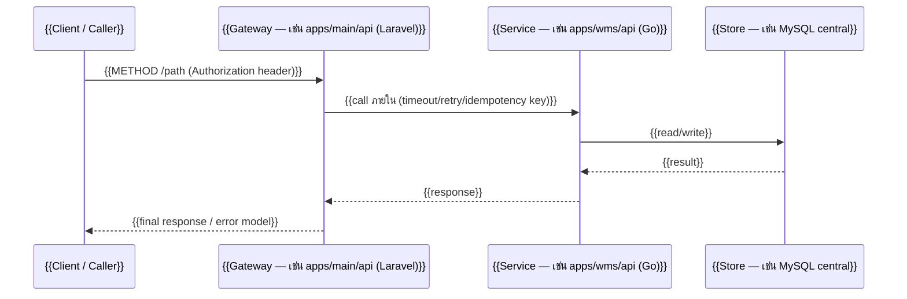

> **โมดูล:** {{MODULE_ID — เช่น M2-UpSell}}
> **ประเภทเอกสาร:** API Contract
> **เวอร์ชัน:** {{VERSION — เช่น 1.0}}
> **วันที่จัดทำ:** {{YYYY-MM-DD}}
> **สถานะ:** {{STATUS — เช่น Draft / Reviewed / Approved}}
> **เจ้าของเอกสาร:** SA (ดู [[Feature-Docs-Ownership]])

<!--
TEMPLATE GUIDE — อ่านก่อนใช้
- API Contract เป็นเอกสาร "สัญญาเชื่อมต่อ" เจ้าของคือ SA เท่านั้น (ดู [[Feature-Docs-Ownership]] ตารางข้อ 2)
- input ของ API.md คือ [[SDS]] ของโมดูลเดียวกัน — ทุก endpoint ต้อง trace กลับ component/decision ใน SDS ได้
- ลำดับ: PRD → BRD → SRS → SDS → (API.md + DATABASE.md แตกจาก SDS) → Tests/
- สัญญาต้องชัดพอที่ DEV นำไป implement ได้โดยไม่ต้องตัดสินใจรูปร่าง request/response ใหม่
- ระบบ polyglot: ระบุ submodule + stack ของ provider เสมอ ห้ามสมมติว่าใช้ stack/DB เดียว
- ทุก flow / sequence diagram "ต้องใช้ Mermaid เท่านั้น" ห้าม ASCII art, ห้ามรูปภาพ,
  ห้าม external tool (ดู [[Feature-Docs-Ownership]] §4)
- ลบ comment ทั้งหมดและแทน {{PLACEHOLDER}} ทุกตัวก่อนส่ง WRITER gate
-->

# API Contract: {{ชื่อระบบ/ฟีเจอร์}}

---

## 1. Overview

<!-- ระบุว่า API นี้รองรับการออกแบบส่วนใดใน SDS และใครเป็นผู้บริโภคสัญญานี้ -->

{{อธิบายภาพรวมว่า API ชุดนี้ให้บริการอะไร, provider คือ submodule/stack ใด (เช่น apps/main/api (Laravel)),
ผู้บริโภคคือใคร (frontend / service อื่น / 3rd-party)}}

- **เอกสารออกแบบต้นทาง:** [[SDS]] ของโมดูลนี้ (ทุก endpoint ต้อง trace กลับ component/decision ใน SDS)
- **Base URL:** `{{BASE_URL — เช่น https://api.example.com/tenant/api/v2}}`
- **Content-Type:** `{{เช่น application/json}}`
- **Convention:** {{อ้าง convention ของ submodule provider — เช่น response envelope ของ apps/main/api}}

---

## 2. Authentication

<!-- ระบุวิธี auth ของ provider submodule ตาม convention เดิม ห้ามยัด pattern ข้าม stack -->

| รายการ | ค่า |
|--------|-----|
| **วิธี (Auth Method)** | {{เช่น Bearer JWT / API Key / Tenant Token}} |
| **Header** | `{{เช่น Authorization: Bearer <token>}}` |
| **Token / Scope** | {{ที่มาของ token, scope/permission ที่ต้องมี, อายุ token}} |
| **กรณีไม่ผ่าน** | {{เช่น 401 พร้อม error model ตามข้อ 5}} |

---

## 3. Endpoint List

<!-- สรุปทุก endpoint ในตารางเดียวเพื่อดูภาพรวมก่อนลงรายละเอียดข้อ 4 -->

| Method | Path | คำอธิบาย |
|--------|------|----------|
| `{{GET}}` | `{{/resource}}` | {{ดึงรายการ ...}} |
| `{{POST}}` | `{{/resource}}` | {{สร้าง ...}} |
| `{{PUT/PATCH}}` | `{{/resource/{id}}}` | {{แก้ไข ...}} |
| `{{DELETE}}` | `{{/resource/{id}}}` | {{ลบ ...}} |

---

## 4. Endpoint Detail

<!-- หนึ่ง block ต่อหนึ่ง endpoint; ทำซ้ำ block 4.x ตามจำนวน endpoint -->

### 4.1 `{{METHOD}} {{/path}}`

{{คำอธิบายสั้นว่า endpoint นี้ทำอะไร + idempotency/timeout/retry policy ถ้าเป็นจุดเชื่อมข้าม submodule}}

**Request**

| ส่วน | ฟิลด์ | ชนิด | บังคับ | คำอธิบาย |
|------|-------|------|--------|----------|
| Path Param | `{{id}}` | `{{string}}` | {{yes}} | {{...}} |
| Query | `{{page}}` | `{{int}}` | {{no}} | {{ค่าเริ่มต้น ...}} |
| Body | `{{field}}` | `{{type}}` | {{yes}} | {{...}} |

**Response — Success ({{200/201}})**

| ฟิลด์ | ชนิด | คำอธิบาย |
|-------|------|----------|
| `{{data}}` | `{{object/array}}` | {{...}} |
| `{{meta}}` | `{{object}}` | {{เช่น pagination}} |

**Response — Error**

{{ระบุ error code ที่ endpoint นี้คืนได้ (อ้างตารางข้อ 5) + เงื่อนไขที่ทำให้เกิด}}

**ตัวอย่าง JSON**

```json
// Request
{
  "{{field}}": "{{value}}"
}

// Response 200
{
  "{{data}}": { "{{id}}": "{{value}}" },
  "{{meta}}": {}
}
```

<!-- ทำซ้ำหัวข้อ 4.2, 4.3, ... สำหรับ endpoint อื่น โดยคงโครงเดิม -->

---

## 5. Error Code Table

<!-- error model กลางของโมดูลนี้ — DEV และ QA ใช้ตารางนี้ร่วมกัน -->

| Error Code | HTTP Status | ความหมาย / เงื่อนไข |
|------------|-------------|----------------------|
| `{{VALIDATION_ERROR}}` | `{{422}}` | {{ข้อมูล request ไม่ผ่าน validation}} |
| `{{UNAUTHORIZED}}` | `{{401}}` | {{token หาย/หมดอายุ}} |
| `{{FORBIDDEN}}` | `{{403}}` | {{ไม่มีสิทธิ์/scope}} |
| `{{NOT_FOUND}}` | `{{404}}` | {{ไม่พบ resource}} |
| `{{CONFLICT}}` | `{{409}}` | {{ชนกับสถานะปัจจุบัน / idempotency}} |
| `{{UPSTREAM_ERROR}}` | `{{502/504}}` | {{submodule ปลายทางล่ม/timeout}} |

**โครง error response มาตรฐาน**

```json
{
  "error": {
    "code": "{{ERROR_CODE}}",
    "message": "{{ข้อความสำหรับ debug}}",
    "details": {}
  }
}
```

---

## 6. Sequence (ถ้า flow ซับซ้อน)

<!-- ใส่เฉพาะเมื่อ flow ข้าม submodule/หลาย call; ถ้าไม่ซับซ้อนให้ระบุว่า "ไม่มี" -->

> **บังคับ:** ถ้ามี flow/diagram ใด ๆ ในหัวข้อนี้ **ต้องใช้ Mermaid เท่านั้น**
> ห้าม ASCII art, ห้ามรูปภาพ, ห้าม external tool (ดู [[Feature-Docs-Ownership]] §4)



---

## 7. Traceability

<!-- map ทุก endpoint กลับไปยัง component ใน SDS และ FR ใน BRD ของโมดูลเดียวกัน -->

| Endpoint | SDS Component / Decision | BRD FR |
|----------|--------------------------|--------|
| `{{METHOD /path}}` | {{component A / TD-001}} | {{FR-001}} |
| `{{METHOD /path}}` | {{Flow 4.1 ใน SDS}} | {{FR-002}} |

---

## 8. สรุป (Summary)

เอกสาร API Contract นี้กำหนด **สัญญาการเชื่อมต่อ** ของ **{{ชื่อระบบ}}** ให้ชัดพอที่ DEV
นำไป implement ได้โดยไม่ต้องตัดสินใจรูปร่าง request/response ใหม่, QA ใช้ตาราง error
ในข้อ 5 วางแผนทดสอบ negative case และทุก endpoint trace กลับ [[SDS]] ได้

**Open Questions:**
- {{ถ้ามี}}
