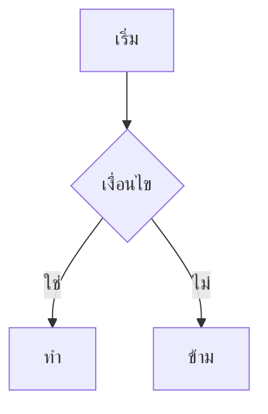

> **โมดูล:** {{MODULE_ID — เช่น M2-UpSell}}
> **ประเภทเอกสาร:** Business Requirements Document (BRD) - NON-TECHNICAL
> **เวอร์ชัน:** {{VERSION — เช่น 1.0}}
> **วันที่จัดทำ:** {{YYYY-MM-DD}}
> **สถานะ:** {{STATUS — เช่น Draft / As-Is Documentation / Approved}}
> **เจ้าของเอกสาร:** BA (ดู [[Feature-Docs-Ownership]])

<!--
TEMPLATE GUIDE
- Template นี้สกัดจาก ground truth จริง: `20 - Features/00001 - UpSell/SRS.md`
  (หมายเหตุ: ไฟล์ใน UpSell ตั้งชื่อว่า "SRS.md" แต่เนื้อหาจริงคือ BRD —
   Functional Requirements / User Story / Acceptance Criteria / Business Flow / Business Rules
   เป็นเอกสาร non-technical เจ้าของคือ BA. SRS เชิง technical ดู template SRS แยกต่างหาก)
- คงลำดับ section 1-10 ตามต้นแบบ
- ลบ comment ทั้งหมดก่อนส่ง WRITER gate
- ทุก Flowchart/diagram/flow ในเอกสารนี้ "ต้องใช้ Mermaid เท่านั้น" (ดู [[Feature-Docs-Ownership]])
- เปลี่ยน {{PLACEHOLDER}} ทุกตัวเป็นเนื้อหาจริง
-->

# BRD: {{ชื่อระบบ/ฟีเจอร์ภาษาไทย}} (Business Requirements Document)

---

## 1. บทนำ

### 1.1 วัตถุประสงค์ของเอกสาร

เอกสารนี้มีวัตถุประสงค์เพื่อ:
1. {{อธิบายความต้องการหลักของระบบ}}
2. {{กำหนดขอบเขตการทำงานและข้อจำกัด}}
3. {{อธิบายเงื่อนไขการใช้งานและกฎทางธุรกิจ}}
4. {{สร้างความเข้าใจร่วมกันระหว่างทีมธุรกิจและทีมพัฒนา}}

### 1.2 ขอบเขตของระบบ

**{{ชื่อระบบ}}** คือ {{นิยามสั้นว่าระบบทำอะไร}}

**เข้าสู่ระบบ (Input):**
- {{ข้อมูลเข้า}}

**ออกจากระบบ (Output):**
- {{ผลลัพธ์ที่ระบบสร้าง}}

**ระบบที่เกี่ยวข้อง:**
- {{ระบบ/โมดูลที่เชื่อมต่อ}}

### 1.3 กลุ่มผู้ใช้งาน

| กลุ่มผู้ใช้ | บทบาท | สิทธิ์การใช้งาน |
|-----------|--------|----------------|
| **{{กลุ่มผู้ใช้}}** | {{บทบาท}} | {{สิทธิ์}} |

---

## 2. ความต้องการหลัก (Functional Requirements)

<!--
จัดกลุ่ม FR เป็นหัวข้อย่อย (2.1, 2.2, ...) ตาม domain ของฟีเจอร์
แต่ละ FR ใช้รหัส FR-XXX และต้องมีอย่างน้อย: User Story + Acceptance Criteria
มี Business Flow / Example เพิ่มเมื่อช่วยให้เข้าใจ (ตาม ground truth UpSell)
-->

### 2.1 {{ชื่อกลุ่มความต้องการ 1}}

#### FR-001: {{ชื่อความต้องการ}}

**User Story:**
> ในฐานะ{{บทบาทผู้ใช้}} ฉันต้องการ{{สิ่งที่ต้องการ}} เพื่อ{{คุณค่า/เหตุผล}}

**Acceptance Criteria:**
- [ ] {{เกณฑ์ที่ตรวจวัดได้}}
- [ ] {{เกณฑ์ที่ตรวจวัดได้}}

**Business Flow:**
1. {{ขั้นตอน}}
2. {{ขั้นตอน}}

<!-- หาก flow ซับซ้อนพอที่ต้องวาดเป็นแผนภาพ ต้องใช้ Mermaid เท่านั้น:

-->

**Example:**
```
{{ตัวอย่างเคสจริงพร้อมตัวเลข/ผลลัพธ์ที่คาดหวัง}}
```

#### FR-002: {{ชื่อความต้องการถัดไป}}

**User Story:**
> ในฐานะ{{...}} ฉันต้องการ{{...}} เพื่อ{{...}}

**Acceptance Criteria:**
- [ ] {{...}}

### 2.2 {{ชื่อกลุ่มความต้องการ 2}}

#### FR-00X: {{...}}

**User Story:**
> {{...}}

**Acceptance Criteria:**
- [ ] {{...}}

---

## 3. Acceptance Criteria สรุป

<!-- รวบยอด AC ต่อกลุ่มงาน แบบ checklist ภาพรวม (ใช้ ✅) ตามต้นแบบ -->

### 3.1 {{ชื่อกลุ่มงาน 1}}

**เมื่อระบบทำงานถูกต้อง:**
- ✅ {{ผลลัพธ์ที่ต้องเป็นจริง}}
- ✅ {{ผลลัพธ์ที่ต้องเป็นจริง}}

### 3.2 {{ชื่อกลุ่มงาน 2}}

**เมื่อ{{เงื่อนไข}}:**
- ✅ {{ผลลัพธ์}}

---

## 4. Business Flows (กระบวนการทำงาน)

<!--
กฎเหล็ก: flow / flowchart / diagram ทุกตัวต้องเป็น Mermaid เท่านั้น
ห้าม ASCII art, ห้ามรูปภาพ, ห้าม tool อื่น (ดู [[Feature-Docs-Ownership]])
-->

### 4.1 Flow หลัก: {{ชื่อ flow}}

```mermaid
flowchart TD
    A[{{จุดเริ่ม}}] --> B[{{ขั้นตอน}}]
    B --> C{{{เงื่อนไข}}}
    C -- {{ใช่}} --> D[{{ผลลัพธ์}}]
    C -- {{ไม่}} --> E[{{ผลลัพธ์อื่น}}]
```

### 4.2 {{ชื่อ flow ย่อยอื่น (ถ้ามี)}}

```mermaid
flowchart TD
    A[{{...}}] --> B[{{...}}]
```

---

## 5. Use Case Scenarios (สถานการณ์การใช้งานจริง)

### Scenario 1: {{ชื่อสถานการณ์ — เช่น Best Case}}

**ผู้เกี่ยวข้อง:** {{actor}}

**เงื่อนไขเริ่มต้น:**
- {{state ก่อนเริ่ม}}

**ขั้นตอน:**
1. {{ขั้นตอน}}
2. {{ขั้นตอน}}

**ผลลัพธ์:**
- {{ผลลัพธ์สุดท้าย}}

### Scenario 2: {{ชื่อสถานการณ์ถัดไป}}

**ผู้เกี่ยวข้อง:** {{actor}}

**เงื่อนไขเริ่มต้น:**
- {{...}}

**ขั้นตอน:**
1. {{...}}

**ผลลัพธ์:**
- {{...}}

---

## 6. ความต้องการด้านคุณภาพ (Quality Requirements)

### 6.1 ความถูกต้องของข้อมูล
- {{ข้อกำหนด}}

### 6.2 ความรวดเร็ว
- {{ข้อกำหนด}}

### 6.3 ความน่าเชื่อถือ
- {{ข้อกำหนด}}

### 6.4 ความปลอดภัย
- {{ข้อกำหนด}}

### 6.5 ความสะดวกในการใช้งาน (Usability)
- {{ข้อกำหนด}}

---

## 7. ข้อจำกัด (Constraints)

### 7.1 ข้อจำกัดทางธุรกิจ
- {{ข้อจำกัด}}

### 7.2 ข้อจำกัดทางเทคนิค
- {{ข้อจำกัด}}

---

## 8. กฎทางธุรกิจ (Business Rules)

<!-- จัดกลุ่มกฎตาม domain เช่น 8.1 กฎการสร้างงาน, 8.2 กฎการมอบหมาย ... -->

### 8.1 {{ชื่อกลุ่มกฎ 1}}
- {{กฎ}}

### 8.2 {{ชื่อกลุ่มกฎ 2}}
- {{กฎ}}

---

## 9. อภิธานศัพท์ (Glossary)

| คำศัพท์ | ความหมาย |
|---------|----------|
| **{{คำศัพท์}}** | {{ความหมาย}} |

---

## 10. สรุป

เอกสาร BRD นี้อธิบายความต้องการหลักของ **{{ชื่อระบบ}}** แบบไม่ใช่เทคนิค

**จุดเด่นของระบบ:**
- {{จุดเด่น}}

**ผลลัพธ์ที่คาดหวัง:**
- {{ผลลัพธ์เชิงธุรกิจที่วัดได้}}

---

**หมายเหตุ:**
สำหรับความต้องการทางธุรกิจระดับภาพรวม/personas/KPI ดู [[PRD]] ของโมดูลนี้
สำหรับ technical specification (architecture/API/data/NFR) ดู [[SRS]] ของโมดูลนี้
