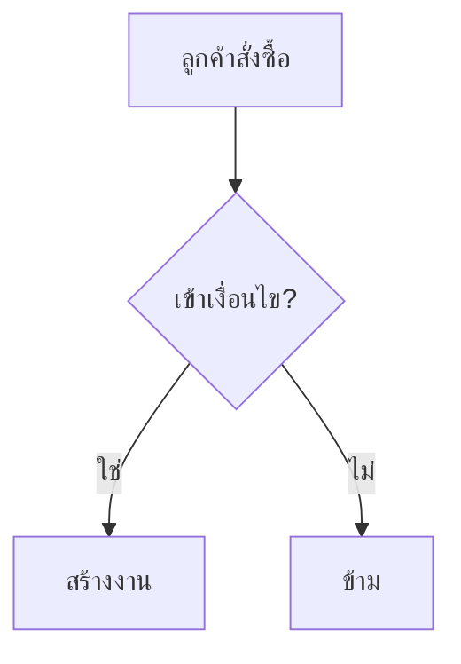

> **โมดูล:** {{MODULE_ID — เช่น M2-UpSell}}
> **ประเภทเอกสาร:** Product Requirements Document (PRD)
> **เวอร์ชัน:** {{VERSION — เช่น 1.0}}
> **วันที่จัดทำ:** {{YYYY-MM-DD}}
> **สถานะ:** {{STATUS — เช่น Draft / As-Is Documentation / Approved}}
> **เจ้าของเอกสาร:** BA + PO + PM (ดู [[Feature-Docs-Ownership]])

<!--
TEMPLATE GUIDE
- Template นี้สกัดจาก ground truth จริง: `20 - Features/00001 - UpSell/PRD.md`
- คงลำดับ section 0-10 ตามต้นแบบ ห้ามสลับลำดับ ห้ามตัด section หลักออกโดยไม่มีเหตุผล
- ลบ comment <!-- ... --> ทั้งหมดก่อนส่ง WRITER gate
- ทุก Flowchart/diagram/flow ในเอกสารนี้ "ต้องใช้ Mermaid เท่านั้น" (ดู [[Feature-Docs-Ownership]])
- เปลี่ยน {{PLACEHOLDER}} ทุกตัวเป็นเนื้อหาจริง
-->

# PRD: {{ชื่อระบบ/ฟีเจอร์ภาษาไทย}}

---

## Executive Summary

<!-- 1-2 ย่อหน้า: ระบบนี้คืออะไร แก้ปัญหาอะไร ใครได้ประโยชน์ ผลลัพธ์ทางธุรกิจหลัก -->
{{สรุปภาพรวมว่าระบบทำอะไร ทำงานอย่างไรในระดับธุรกิจ และคุณค่าที่ส่งมอบ}}

---

## 1. Business Goals & KPIs

### 1.1 เป้าหมายทางธุรกิจ

| เป้าหมาย | รายละเอียด |
|----------|-----------|
| **{{เป้าหมาย 1}}** | {{อธิบาย}} |
| **{{เป้าหมาย 2}}** | {{อธิบาย}} |

### 1.2 ตัวชี้วัดความสำเร็จ (KPIs)

| KPI | คำอธิบาย | เป้าหมาย |
|-----|----------|---------|
| **{{KPI 1}}** | {{สูตร/วิธีวัด}} | {{ค่าเป้าหมาย}} |
| **{{KPI 2}}** | {{สูตร/วิธีวัด}} | {{ค่าเป้าหมาย}} |

---

## 2. User Personas (กลุ่มผู้ใช้งาน)

<!-- ทำซ้ำ block ต่อ persona 1 กลุ่ม — ต้นแบบ UpSell มี 4 กลุ่ม -->

### 2.1 {{ชื่อกลุ่มผู้ใช้ 1}}

**ข้อมูลพื้นฐาน:**
- {{ข้อมูลพื้นฐาน}}

**เป้าหมาย:**
- {{เป้าหมายของผู้ใช้กลุ่มนี้}}

**ความต้องการ:**
- {{สิ่งที่ผู้ใช้ต้องการจากระบบ}}

**จุดปวด (Pain Points):**
- {{ปัญหาที่ผู้ใช้เจออยู่ทุกวันนี้}}

### 2.2 {{ชื่อกลุ่มผู้ใช้ 2}}

**ข้อมูลพื้นฐาน:**
- {{...}}

**เป้าหมาย:**
- {{...}}

**ความต้องการ:**
- {{...}}

**จุดปวด (Pain Points):**
- {{...}}

---

## 3. Business Requirements

<!--
ทำซ้ำ block ต่อกลุ่มความต้องการ 1 หัวข้อ (3.1, 3.2, ...)
แต่ละหัวข้อต้องมี 3 ส่วน: ความต้องการ / Business Rules / เหตุผล (ตาม ground truth)
ถ้ามีตารางสถานะ/การตั้งค่า ให้แทรกในหัวข้อที่เกี่ยวข้องตามต้นแบบ
-->

### 3.1 {{ชื่อกลุ่มความต้องการ 1}}

**ความต้องการ:**
- {{สิ่งที่ระบบต้องทำได้ — เขียนเชิงธุรกิจ ไม่ลงเทคนิค}}

**Business Rules:**
- {{กฎทางธุรกิจที่ระบบต้องบังคับ}}

**เหตุผล:**
- {{ทำไมต้องมีกฎ/ความต้องการนี้ — เชื่อมโยงคุณค่าธุรกิจ}}

### 3.2 {{ชื่อกลุ่มความต้องการ 2}}

**ความต้องการ:**
- {{...}}

**Business Rules:**
- {{...}}

**เหตุผล:**
- {{...}}

<!--
ตัวอย่าง section ที่มีตารางสถานะ (ใช้เมื่อฟีเจอร์มี state machine):

**สถานะที่ต้องรองรับ:**

| สถานะ | ชื่อภาษาไทย | คำอธิบาย | การใช้งาน |
|-------|------------|----------|----------|
| **{{State}}** | {{ชื่อไทย}} | {{คำอธิบาย}} | {{เมื่อไหร่}} |
-->

---

## 4. Business Rules & Constraints

### 4.1 กฎทางธุรกิจหลัก

| กฎ | คำอธิบาย |
|----|----------|
| **{{ชื่อกฎ}}** | {{คำอธิบาย}} |

### 4.2 ข้อจำกัดทางธุรกิจ

| ข้อจำกัด | รายละเอียด |
|---------|-----------|
| **{{ข้อจำกัด}}** | {{รายละเอียด}} |

### 4.3 {{หัวข้อกฎเฉพาะเพิ่มเติม — เช่น เหตุผลความล้มเหลว/การข้ามงาน (ถ้ามี)}}

{{รายการเงื่อนไข/เหตุผล/ตัวเลือกที่ระบบต้องรองรับ}}

---

## 5. Out of Scope (นอกขอบเขต)

สิ่งที่ระบบนี้ **ไม่รองรับ** หรือ **ไม่รับผิดชอบ**:

| หัวข้อ | คำอธิบาย |
|--------|----------|
| **{{สิ่งที่ไม่ทำ}}** | {{เหตุผล/ขอบเขต}} |

---

## 6. Risks & Mitigation (ความเสี่ยงและแนวทางแก้ไข)

### 6.1 ความเสี่ยงทางธุรกิจ

| ความเสี่ยง | ผลกระทบ | ระดับความรุนแรง | แนวทางแก้ไข |
|-----------|---------|-----------------|-------------|
| **{{ความเสี่ยง}}** | {{ผลกระทบ}} | {{สูง/กลาง/ต่ำ}} | {{แนวทางลดความเสี่ยง}} |

### 6.2 ความเสี่ยงทางเทคนิค

| ความเสี่ยง | ผลกระทบ | แนวทางแก้ไข |
|-----------|---------|-------------|
| **{{ความเสี่ยง}}** | {{ผลกระทบ}} | {{แนวทางลดความเสี่ยง}} |

---

## 7. Glossary (อภิธานศัพท์)

| คำศัพท์ | ความหมาย |
|---------|----------|
| **{{คำศัพท์}}** | {{ความหมาย}} |

---

## 8. Success Metrics (ตัวชี้วัดความสำเร็จ)

เมื่อระบบทำงานได้ดี ควรมีผลลัพธ์ดังนี้:

| ตัวชี้วัด | ค่าที่คาดหวัง | วิธีวัด |
|----------|---------------|--------|
| **{{ตัวชี้วัด}}** | {{ค่าที่คาดหวัง}} | {{วิธีวัด}} |

---

## 9. Dependencies & Assumptions

### 9.1 สิ่งที่ต้องพึ่งพา (Dependencies)

| ระบบ/ส่วนประกอบ | ความสัมพันธ์ |
|-----------------|-------------|
| **{{ระบบที่พึ่งพา}}** | {{ใช้ทำอะไร}} |

### 9.2 สมมติฐาน (Assumptions)

- {{สมมติฐานที่ต้องเป็นจริงเพื่อให้ระบบทำงานได้}}

---

## 10. Appendix

### 10.1 ตัวอย่าง User Journey

<!-- เล่าเป็น scenario เป็นขั้น 1..n ตามต้นแบบ -->
**Scenario: {{ชื่อสถานการณ์}}**

1. {{ขั้นตอน}}
2. {{ขั้นตอน}}

### 10.2 {{ตัวอย่างการตั้งค่า/เคสเสริม (ถ้ามี)}}

{{รายละเอียดเคสตัวอย่าง}}

<!--
หากต้องอธิบาย flow ของ user journey เป็นแผนภาพ ให้ใช้ Mermaid เท่านั้น:

-->

---

**หมายเหตุ:**
เอกสารนี้เป็นการบันทึกความต้องการทางธุรกิจ (Business Requirements) โดยไม่มีรายละเอียดทางเทคนิค
สำหรับ Functional Requirements / User Story / Acceptance Criteria ดู [[BRD]] ของโมดูลนี้
สำหรับ technical specification ดู [[SRS]] ของโมดูลนี้
