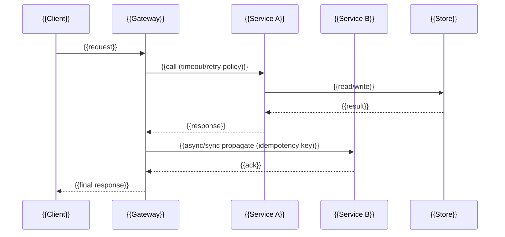

> **โมดูล:** {{MODULE_ID — เช่น M2-UpSell}}
> **ประเภทเอกสาร:** System Design Spec (SDS)
> **เวอร์ชัน:** {{VERSION — เช่น 1.0}}
> **วันที่จัดทำ:** {{YYYY-MM-DD}}
> **สถานะ:** {{STATUS — เช่น Draft / Reviewed / Approved}}
> **เจ้าของเอกสาร:** SA (ดู [[Feature-Docs-Ownership]])

<!--
TEMPLATE GUIDE — อ่านก่อนใช้
- SDS เป็น "design spec เชิงระบบ" เจ้าของคือ SA เท่านั้น (ดู [[Feature-Docs-Ownership]] ตารางข้อ 2)
- input ของ SDS คือ [[SRS]] ของโมดูลเดียวกัน (ซึ่ง trace กลับ [[BRD]] → [[PRD]])
  ทุก design ต้อง trace กลับ requirement ใน SRS ได้
- ลำดับ: PRD → BRD → SRS → SDS → (API.md + DATABASE.md แตกจาก SDS) → Tests/
- ทุก architecture / component / data-flow / sequence diagram "ต้องใช้ Mermaid เท่านั้น"
  ห้าม ASCII art, ห้ามรูปภาพ, ห้าม external tool (ดู [[Feature-Docs-Ownership]] §4)
- ระบบ polyglot: อย่าสมมติว่าใช้ stack/DB เดียว — ระบุ submodule + stack + store จริงทุกจุด
- ลบ comment ทั้งหมดและแทน {{PLACEHOLDER}} ทุกตัวก่อนส่ง WRITER gate
-->

# SDS: {{ชื่อระบบ/ฟีเจอร์}} (System Design Spec)

---

## 1. บทนำ & References

<!-- ระบุว่าเอกสารนี้ออกแบบ "อะไรจะถูกสร้างอย่างไร" และ trace กลับชั้น requirement -->

### 1.1 วัตถุประสงค์
{{อธิบายว่า SDS นี้ออกแบบการ implement ของฟีเจอร์ใด ใครเป็นผู้อ่าน (DEV/QA/DevOps)}}

### 1.2 ขอบเขตการออกแบบ
{{boundary ของการออกแบบ: submodule ที่เปลี่ยน, สิ่งที่อยู่ในและนอกขอบเขต}}

### 1.3 เอกสารอ้างอิง
| เอกสาร | ความสัมพันธ์ |
|--------|-------------|
| [[SRS]] ของโมดูลนี้ | ที่มาของข้อกำหนดเชิงเทคนิคที่ SDS ต้อง realize |
| [[BRD]] ของโมดูลนี้ | ที่มาของ Functional Requirements / AC |
| [[PRD]] ของโมดูลนี้ | ที่มาของเป้าหมายธุรกิจและ KPI |
| {{ADR / มาตรฐานอื่น}} | {{ความสัมพันธ์}} |

---

## 2. Architecture Overview

<!-- ภาพรวมสถาปัตยกรรมระดับ component/C4 — Mermaid บังคับเด็ดขาดในหัวข้อนี้ -->

### 2.1 มุมมองสถาปัตยกรรม
{{อธิบาย style ที่เลือก: เข้ากับ convention เดิมของแต่ละ submodule อย่างไร}}

```mermaid
graph TD
    Client[{{Client / Caller}}]
    GW[{{API Gateway — เช่น apps/main/api (Laravel)}}]
    SVCA[{{Service A — เช่น apps/wms/api (Go)}}]
    SVCB[{{Service B — เช่น apps/omni/api (Node)}}]
    DBA[({{Store A — เช่น MySQL central}})]
    DBB[({{Store B — เช่น MongoDB omni}})]

    Client --> GW
    GW --> SVCA
    GW --> SVCB
    SVCA --> DBA
    SVCB --> DBB
    SVCA -. {{sync/async contract}} .-> SVCB
```

### 2.2 มุมมองการ Deploy (ถ้าจำเป็น)
{{runtime topology: service ใดรันที่ไหน, scaling, dependency runtime — ใช้ Mermaid หากต้องวาด}}

---

## 3. Component Design

<!-- รายละเอียดแต่ละ component: หน้าที่เดียว + dependency ที่ชัดเจน -->

| Component | หน้าที่ (Responsibility) | Dependency (Submodule / Stack / Store) |
|-----------|--------------------------|-----------------------------------------|
| **{{component A}}** | {{ทำอะไรหน้าที่เดียว}} | {{เช่น apps/main/api (Laravel) → MySQL central}} |
| **{{component B}}** | {{responsibility}} | {{เช่น apps/wms/api (Go) → MySQL R/W split}} |
| **{{component C}}** | {{responsibility}} | {{เช่น apps/omni/api (Node) → MongoDB}} |

<!-- หนึ่ง component = หนึ่งความรับผิดชอบ; ระบุ stack จริงเสมอ ห้ามรวม pattern ข้าม stack -->

---

## 4. Data Flow

<!-- ลำดับการไหลของข้อมูล/คำสั่งข้าม component — Mermaid sequence บังคับเด็ดขาดในหัวข้อนี้ -->

### 4.1 Flow หลัก: {{ชื่อ flow}}



### 4.2 Flow กรณีล้มเหลว / ชดเชย (ถ้ามี)
{{อธิบาย failure isolation, compensating action, consistency ข้าม store — ใช้ Mermaid หากต้องวาด}}

---

## 5. Integration Points

<!-- จุดเชื่อมข้าม submodule / 3rd-party พร้อมสัญญาเบื้องต้น (สัญญาเต็มอยู่ใน API.md) -->

| จุดเชื่อม | ประเภท (internal/external/3rd-party) | Protocol / Contract | ความเสี่ยงเมื่อล่ม |
|-----------|--------------------------------------|----------------------|---------------------|
| **{{ระบบ/บริการ}}** | {{internal}} | {{เช่น REST/JSON, queue}} | {{impact}} |
| **{{3rd-party}}** | {{external}} | {{เช่น webhook/SDK}} | {{impact}} |

- **Timeout / Retry / Idempotency:** {{ระบุ policy ของแต่ละจุดเชื่อม}}
- **สัญญา API เต็ม:** ดู `API.md` ของโมดูลนี้

---

## 6. Technical Decisions

<!-- ทุก decision ต้องมีเหตุผล + ทางเลือกที่ตัดทิ้งและเหตุผลที่ตัด -->

### TD-001: {{หัวข้อการตัดสินใจ}}
- **ตัดสินใจ:** {{สิ่งที่เลือก}}
- **เหตุผล:** {{ทำไมเลือกอันนี้ — เข้ากับ convention/stack เดิมอย่างไร}}
- **ทางเลือกที่ตัดทิ้ง:** {{ตัวเลือกอื่น + เหตุผลที่ไม่เลือก}}
- **ผลกระทบ:** {{ต่อ DEV / QA / DevOps / consistency ข้าม store}}

### TD-002: {{หัวข้อการตัดสินใจ}}
- **ตัดสินใจ:** {{...}}
- **เหตุผล:** {{...}}
- **ทางเลือกที่ตัดทิ้ง:** {{...}}
- **ผลกระทบ:** {{...}}

---

## 7. Traceability

<!-- map การออกแบบใน SDS กลับไปยังข้อกำหนดใน SRS ของโมดูลเดียวกัน -->

| SRS Requirement (TFR/NFR) | SDS Element (component / decision / flow) | สถานะ |
|---------------------------|-------------------------------------------|-------|
| {{TFR-001}} | {{component A / TD-001}} | {{Draft/Done}} |
| {{TFR-002}} | {{Flow 4.1}} | {{Draft/Done}} |
| {{NFR-xxx}} | {{Deployment view 2.2}} | {{Draft/Done}} |

---

## 8. สรุป (Summary)

เอกสาร SDS นี้กำหนด **การออกแบบเชิงระบบ** ของ **{{ชื่อระบบ}}** เพื่อให้ DEV นำไป implement,
QA นำความเสี่ยงไปวางแผนทดสอบ, และ DevOps ประเมินผลกระทบ infra ได้ตรงกับข้อกำหนดใน [[SRS]]

**ลำดับการ build ที่แนะนำ:**
- {{task 1 + interface ที่ส่งมอบ}}
- {{task 2 + interface ที่ส่งมอบ}}

**Open Questions:**
- {{ถ้ามี}}
