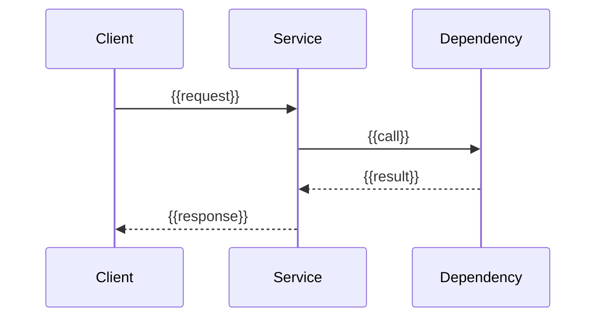

> **โมดูล:** {{MODULE_ID — เช่น M2-UpSell}}
> **ประเภทเอกสาร:** Software Requirements Specification (SRS) - TECHNICAL
> **เวอร์ชัน:** {{VERSION — เช่น 1.0}}
> **วันที่จัดทำ:** {{YYYY-MM-DD}}
> **สถานะ:** {{STATUS — เช่น Draft / Reviewed / Approved}}
> **เจ้าของเอกสาร:** SA (ดู [[Feature-Docs-Ownership]])

<!--
TEMPLATE GUIDE — อ่านก่อนใช้
- นี่คือ template "ใหม่" ที่ออกแบบขึ้นโดยไม่มี ground truth ในระบบ (UpSell ยังไม่มี SRS เชิง technical จริง)
  ไฟล์ที่ UpSell เรียก "SRS.md" จริง ๆ คือ BRD — ห้ามนำมาเป็นต้นแบบของไฟล์นี้
- เอกสารนี้เป็น TECHNICAL spec เจ้าของคือ SA เท่านั้น (ดู [[Feature-Docs-Ownership]])
- ต้น input ของ SRS คือ [[PRD]] + [[BRD]] ของโมดูลเดียวกัน — ต้อง trace กลับได้ทุก requirement
- ทุก diagram / flowchart / sequence / architecture diagram "ต้องใช้ Mermaid เท่านั้น"
  ห้าม ASCII art, ห้ามรูปภาพ, ห้าม tool อื่น (ดู [[Feature-Docs-Ownership]])
- ลบ comment ทั้งหมดก่อนส่ง WRITER gate และเปลี่ยน {{PLACEHOLDER}} ทุกตัวเป็นเนื้อหาจริง
-->

# SRS: {{ชื่อระบบ/ฟีเจอร์}} (Software Requirements Specification — Technical)

---

## 1. บทนำ (Introduction)

### 1.1 วัตถุประสงค์ของเอกสาร
{{อธิบายว่าเอกสารนี้กำหนดข้อกำหนดเชิงเทคนิคอะไร ใครเป็นผู้อ่าน (DEV/QA/DevOps)}}

### 1.2 ขอบเขตเชิงระบบ (System Scope)
{{ระบุ boundary ของระบบ: service/submodule ที่เกี่ยวข้อง, สิ่งที่อยู่ในและนอกขอบเขตทางเทคนิค}}

### 1.3 เอกสารอ้างอิง (References)
| เอกสาร | ความสัมพันธ์ |
|--------|-------------|
| [[PRD]] ของโมดูลนี้ | ที่มาของเป้าหมายธุรกิจและ KPI |
| [[BRD]] ของโมดูลนี้ | ที่มาของ Functional Requirements / User Story / AC |
| {{ADR / มาตรฐานอื่น}} | {{ความสัมพันธ์}} |

### 1.4 นิยามและตัวย่อ (Definitions & Acronyms)
| คำ/ตัวย่อ | ความหมาย |
|-----------|----------|
| **{{ตัวย่อ}}** | {{ความหมายเชิงเทคนิค}} |

---

## 2. ภาพรวมสถาปัตยกรรม (Architecture Overview)

### 2.1 บริบทระบบ (System Context)

```mermaid
flowchart LR
    Client[{{Client / Caller}}] --> SVC[{{This Service}}]
    SVC --> DEP1[{{Dependency 1}}]
    SVC --> DEP2[{{Dependency 2}}]
```

### 2.2 องค์ประกอบหลัก (Components)
| Component | หน้าที่ | Submodule / Stack |
|-----------|---------|-------------------|
| **{{component}}** | {{responsibility}} | {{เช่น apps/wms/api (Go)}} |

### 2.3 มุมมองการ Deploy (Deployment View)
{{อธิบาย runtime topology: service ใดรันที่ไหน, scaling, dependency runtime — ใช้ Mermaid หากต้องวาด}}

---

## 3. ข้อกำหนดเชิงฟังก์ชันเชิงเทคนิค (Technical Functional Requirements)

<!--
แต่ละ TFR ต้อง trace กลับไปยัง FR-XXX ใน [[BRD]] ของโมดูลเดียวกัน
ระบุ "ระบบทำอย่างไร" ในเชิงเทคนิค (ไม่ใช่ "ทำอะไร" ซึ่งอยู่ใน BRD แล้ว)
-->

### TFR-001: {{ชื่อ}}
- **Trace to:** {{FR-00X ใน BRD}}
- **คำอธิบายเชิงเทคนิค:** {{logic/algorithm/state transition ที่ต้อง implement}}
- **Precondition:** {{สถานะที่ต้องเป็นจริงก่อน}}
- **Postcondition:** {{ผลลัพธ์ที่รับประกันหลังทำงานสำเร็จ}}
- **Error / Edge cases:** {{พฤติกรรมเมื่อ fail, race condition, idempotency}}

### TFR-002: {{ชื่อ}}
- **Trace to:** {{...}}
- **คำอธิบายเชิงเทคนิค:** {{...}}

---

## 4. ข้อกำหนดส่วนต่อประสาน (Interface / API Specification)

### 4.1 API Endpoints
| Method | Path | คำอธิบาย | Auth |
|--------|------|----------|------|
| {{GET/POST}} | {{/api/...}} | {{ทำอะไร}} | {{JWT/scope}} |

### 4.2 รายละเอียดต่อ Endpoint

#### {{METHOD}} {{/path}}
- **Request:**
```json
{ "{{field}}": "{{type/desc}}" }
```
- **Response (success):**
```json
{ "{{field}}": "{{type/desc}}" }
```
- **Error codes:** {{เช่น 400/401/409/422 + ความหมาย}}
- **Idempotency / Rate limit:** {{ระบุถ้ามี}}

### 4.3 Events / Messaging (ถ้ามี)
| Event / Queue | Producer | Consumer | Payload |
|---------------|----------|----------|---------|
| {{event}} | {{service}} | {{service}} | {{schema}} |

### 4.4 Sequence ของ flow สำคัญ



---

## 5. ข้อกำหนดด้านข้อมูล (Data Requirements)

### 5.1 Data Model / Entities
| Entity | คำอธิบาย | Owner store |
|--------|----------|-------------|
| **{{entity}}** | {{ความหมาย}} | {{เช่น MySQL central / MongoDB omni}} |

### 5.2 ความสัมพันธ์ (ERD)

```mermaid
erDiagram
    ENTITY_A ||--o{ ENTITY_B : "{{relation}}"
    ENTITY_A {
        string id
        string {{field}}
    }
```

### 5.3 Migration / Data Lifecycle
{{ผลกระทบต่อ schema, migration strategy, retention, backfill}}

---

## 6. ข้อกำหนดที่ไม่ใช่ฟังก์ชัน (Non-Functional Requirements)

| ด้าน | ข้อกำหนด | เป้าหมายที่วัดได้ |
|------|----------|-------------------|
| **Performance** | {{เช่น latency p95}} | {{ค่าเป้าหมาย}} |
| **Scalability** | {{throughput/concurrency}} | {{ค่าเป้าหมาย}} |
| **Availability** | {{SLA/uptime}} | {{ค่าเป้าหมาย}} |
| **Security** | {{authn/authz, data protection}} | {{มาตรฐาน}} |
| **Observability** | {{logging/metrics/tracing}} | {{ต้องมีอะไร}} |
| **Maintainability** | {{มาตรฐานโค้ด/test coverage}} | {{ค่าเป้าหมาย}} |

---

## 7. ข้อจำกัดทางเทคนิคและการพึ่งพา (Technical Constraints & Dependencies)

### 7.1 ข้อจำกัดทางเทคนิค
- {{เช่น ต้องใช้ stack เดิมของ submodule, ข้อจำกัด client ที่ไม่มี timeout}}

### 7.2 การพึ่งพาภายนอก/ภายใน
| Dependency | ประเภท | ความเสี่ยง |
|------------|--------|------------|
| **{{ระบบ}}** | {{internal/external}} | {{impact ถ้าล่ม}} |

### 7.3 สมมติฐานทางเทคนิค (Assumptions)
- {{สิ่งที่ถือว่าจริงในการออกแบบ}}

---

## 8. ความเสี่ยงเชิงสถาปัตยกรรม (Architectural Risks)

| ความเสี่ยง | ผลกระทบ | แนวทางลด |
|-----------|---------|----------|
| **{{ความเสี่ยง}}** | {{impact เชิงระบบ}} | {{mitigation}} |

---

## 9. Traceability Matrix

| BRD FR-ID | SRS TFR-ID | Component | สถานะ |
|-----------|------------|-----------|-------|
| {{FR-001}} | {{TFR-001}} | {{component}} | {{Draft/Done}} |

---

## 10. สรุป (Summary)

เอกสาร SRS นี้กำหนดข้อกำหนดเชิงเทคนิคของ **{{ชื่อระบบ}}** เพื่อให้ DEV/QA/DevOps นำไป implement และทดสอบได้ตรงกับเจตนาธุรกิจใน [[PRD]] และ [[BRD]]

**ขอบเขตที่ครอบคลุม:**
- {{สรุปขอบเขตเทคนิค}}

**ประเด็นที่ต้องตัดสินใจเพิ่ม (Open Questions):**
- {{ถ้ามี}}
