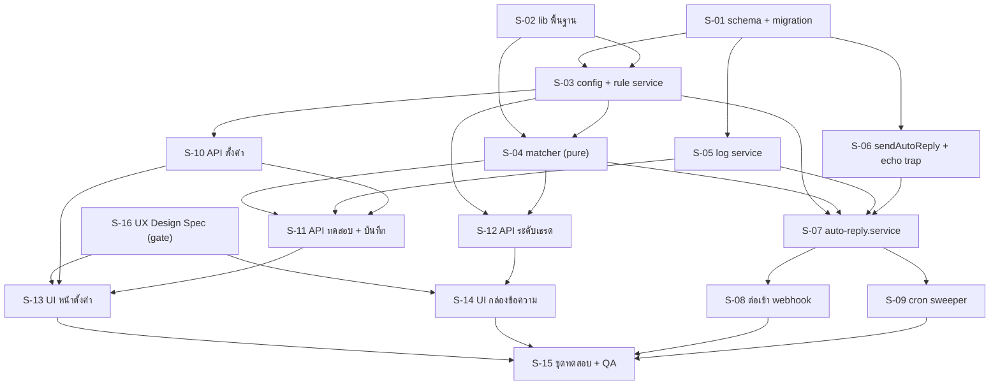

# Scope Baseline — feature 00023 Chat Auto-Reply (ตอบแชทอัตโนมัติจาก Keyword)

> **สถานะ:** `ACTIVE`
> **Phase:** Implementation Phase 1 — Chat Auto-Reply (template-only, ไม่มี AI)
> **Branch:** `feature/auto-reply`
> **Commit ตั้งต้น:** `e16e4f2d`
> **วันที่ตั้ง baseline:** 2026-07-29
> **เจ้าของ scope:** `safepay-product` (Gate 0 ของ skill `agent-team-phase`)
> **แหล่งงานหลัก (ห้ามขยายเกิน):** `docs/20 - Features/00023 - Chat Auto-Reply/SDS.md` §11 (T-01..T-15)
> **สัญญาที่ freeze แล้ว:** `DATABASE.md` v1.0 (FROZEN CONTRACT) — ห้ามตั้งชื่อ model/field/ค่าคงที่ใหม่
> **เอกสารอ้างอิงครบชุด:** PRD · BRD (FR-001..FR-024) · SRS (TFR-001..TFR-030) · SDS · DATABASE · API (29 endpoint) · TestCase

---

## 1. Goal ของ phase

ส่ง feature 00023 เฟสแรกแบบ **template-only** ขึ้น production ได้โดย **ไม่ทำให้ระบบแชทเดิม (feature 00018) ที่ร้านใช้ทุกวันเสียหาย** — ร้านตั้งกลุ่มคำ/คำตอบตามบริบท (เพจ/โฆษณา/สินค้า) ได้เอง, ระบบตอบให้อัตโนมัติโดยรับประกัน "หนึ่งข้อความ หนึ่งคำตอบ", หยุดเองเมื่อพนักงานเข้ามาตอบ, ทดสอบได้ก่อนเปิดจริง และตรวจย้อนหลังได้ว่าทำไมตอบ/ไม่ตอบ

**เกณฑ์ตัดสินความสำเร็จเชิงลบที่สำคัญกว่าเชิงบวก:** ปิด `AutoReplyConfig.isEnabled` ทุกร้านแล้วระบบต้องทำงานเหมือนก่อนมีฟีเจอร์นี้ทุกประการ (SDS §7.5)

---

## 2. In-Scope — S-id list

> **กติกา CREEP:** ทุก commit ของ phase นี้ต้อง map กับ S-id อย่างน้อย 1 ตัว. ไม่ map = CREEP (hard block).
> ทุก S-id มี "ขอบเขตที่ไม่ทำ" กำกับ — สิ่งที่อยู่ในช่องนั้นคือเกณฑ์จับ CREEP ที่ชัดที่สุด

### ภาพรวม dependency

---

### S-01 — Schema + Migration (6 model ใหม่ + 10 คอลัมน์)

| หัวข้อ | รายละเอียด |
|---|---|
| **ทำ** | เพิ่ม 6 model (`AutoReplyConfig`, `AutoReplyKeyword`, `AutoReplyPhrase`, `AutoReplyRule`, `AutoReplyJob`, `AutoReplyLog`) + 9 คอลัมน์ใน `Conversation` + 1 คอลัมน์ใน `ChatMessage` + relation ฝั่งตรงข้ามใน `Shop`/`Conversation`/`ChatMessage`/`ShopChannel`/`Product`/`User` + index ตาม DATABASE §4 + เขียน `migration.sql` **ด้วยมือ** (มี `UNIQUE NULLS NOT DISTINCT` ที่ Prisma ประกาศไม่ได้) |
| **ไม่ทำ** | ห้ามแตะชนิด/ชื่อ/nullable ของ field เดิมแม้แต่ตัวเดียว (additive 100%) · ห้ามตั้งชื่อ model/field/ค่าคงที่นอก DATABASE.md · ห้ามเพิ่ม Prisma enum (convention = String) · ห้าม index เพิ่มนอก DATABASE §4 (รวม index สำหรับ sweeper fallback pass — ดู GAP-06) |
| **FR/AC** | รองรับทุก FR — ไม่มี AC ของตัวเอง (เป็นฐานของทุก S-id) |
| **T map** | T-01 |
| **ไฟล์** | `prisma/schema.prisma`, `prisma/migrations/20260729000000_auto_reply/migration.sql` |
| **user-facing** | ไม่ (ไม่ต้อง QA browser — QA = query เดิมของแชทยังทำงาน) |
| 🛑 **ข้อบังคับพิเศษ** | **DB dev/prod เป็นตัวเดียวกัน (Supabase)** — ① **ห้าม `prisma migrate dev` เด็ดขาด** (reset = ลบข้อมูล production จริง) ② ใช้ `npx prisma migrate deploy -e .env.local` เท่านั้น ③ **ต้องขอ user ยืนยันก่อน apply ทุกครั้ง** ④ หลัง migrate ต้อง **restart dev server** (stale Prisma client → session 500 — บทเรียน 2026-06-16) ⑤ ห้าม `prisma db pull` (เคยทับ schema.prisma) |
| **เจ้าของ** | `safepay-database` |
| **Rollback** | `DROP TABLE` 6 ตาราง + `DROP COLUMN` ที่เพิ่ม (ไม่มีตารางเดิมพึ่งพา) |

---

### S-02 — lib พื้นฐาน (normalize + constants + cache)

| หัวข้อ | รายละเอียด |
|---|---|
| **ทำ** | `normalizeMessage(text)` (NFC → trim → ยุบช่องว่าง → lowercase อังกฤษ → ตัดเครื่องหมายท้าย) · ค่าคงที่ 8 กลุ่มจาก DATABASE §3.8 เป็น `as const` · `computeSpecificity()` + mapping `specificity → resolutionLevel` · rule cache บน `globalThis` (TTL 60 วิ) + `invalidateShop(shopId)` |
| **ไม่ทำ** | ห้าม I/O ใน normalize/constants (ต้อง pure ทดสอบได้โดยไม่มี DB) · **ห้าม cache `AutoReplyConfig`** (TD-004 — สวิตช์ต้องสด) · ห้ามใส่ Prisma ใน `auto-reply-cache.ts` · ห้ามประกาศค่าคงที่ซ้ำที่อื่นในโค้ดเบส |
| **FR/AC** | FR-010 (AC-010-01..05), FR-011 (พื้นฐาน tie-break), TFR-007 |
| **T map** | T-02 |
| **ไฟล์** | `src/lib/auto-reply-normalize.ts`, `src/lib/auto-reply-constants.ts`, `src/lib/auto-reply-cache.ts` |
| **user-facing** | ไม่ |
| **หมายเหตุ** | ต้องมี comment เตือนบนหัว `normalizeMessage`: แก้ฟังก์ชันนี้เมื่อไหร่ **ต้องเขียน migration re-normalize `AutoReplyPhrase.normalizedPhrase` ทั้งตาราง** (TD-011) |

---

### S-03 — Config service + Rule service (CRUD + invariant)

| หัวข้อ | รายละเอียด |
|---|---|
| **ทำ** | `getConfig` (lazy default ไม่ backfill), `upsertConfig`, `setTestMode`, `expireTestMode` · CRUD `AutoReplyKeyword`/`AutoReplyPhrase`/`AutoReplyRule` · รักษา invariant `specificity` + `normalizedPhrase` · กฎ "กลุ่มที่เปิดต้องมีคำ + มีคำตอบอย่างน้อย 1 ระดับ" · duplicate detection (ในกลุ่ม = block, ข้ามกลุ่ม = warn) · เรียก `invalidateShop` ทุกครั้งที่เขียน |
| **ไม่ทำ** | **ห้าม service รับ role มาตัดสินสิทธิ์เอง** (route ตัดสิน — SDS §3.2) · ห้ามแตะ session ใน service · ห้ามรับ `specificity` จากภายนอก · ห้าม query ที่ไม่มี `shopId` ใน `WHERE` (ห้าม post-filter ใน JS) · ห้ามรวม config เข้า rule service (คนละความถี่การอ่าน) |
| **FR/AC** | FR-001 (AC-001-01..05,08), FR-002 (AC-002-01..05), FR-003, FR-005 (AC-005-01..04), FR-006..FR-008, TFR-001..TFR-004, TFR-006 |
| **T map** | T-03 |
| **ไฟล์** | `src/services/auto-reply-config.service.ts`, `src/services/auto-reply-rule.service.ts` |
| **user-facing** | ไม่ (ผ่าน S-10) |

---

### S-04 — Matcher / Resolver (pure function)

| หัวข้อ | รายละเอียด |
|---|---|
| **ทำ** | `matchKeywords(normalizedText, ruleSet)` + `resolveRule(keyword, ctx, ruleSet)` + ประกอบ `matchTrace` + tie-break ที่กำหนดได้แน่นอน (`priority DESC → specificity → EXACT ก่อน CONTAINS → ความยาว phrase DESC → id ASC`) + การถอยระดับ 9 ขั้นตาม AC-009-01 |
| **ไม่ทำ** | 🛑 **ห้ามมี side effect เด็ดขาด** — ไม่เขียน DB, ไม่ส่งข้อความ, ไม่อ่าน session (ถ้า matcher เขียน DB ได้เมื่อไหร่ หน้าทดสอบ FR-020 จะสร้างผลข้างเคียงทันที) · ห้าม fuzzy match/สะกดผิด (เฟส 2) · ห้ามเดาสินค้าจากข้อความลูกค้า (AC-014-04) · ห้ามมี logic คู่ขนานสำหรับหน้าทดสอบ |
| **FR/AC** | FR-009 (AC-009-01..05), FR-011 (AC-011-01..04), FR-013, FR-014 (AC-014-02/03), TFR-008..TFR-012 |
| **T map** | T-04 |
| **ไฟล์** | `src/services/auto-reply-match.service.ts` |
| **user-facing** | ไม่ |

---

### S-05 — Log service (จุดเขียนบันทึกจุดเดียว)

| หัวข้อ | รายละเอียด |
|---|---|
| **ทำ** | `writeLog(entry)` = **จุดเขียน `AutoReplyLog` จุดเดียวของทั้งฟีเจอร์** · `searchLogs(shopId, filter)` ครบตาม AC-024-03 · mask/ตัด PII ที่ server boundary + `select` allow-list |
| **ไม่ทำ** | ห้ามเขียน `AutoReplyLog` จากไฟล์อื่น (ต้อง grep ตรวจได้จุดเดียว) · ห้ามให้ `writeLog` อยู่ในทรานแซกชันเดียวกับการส่งข้อความ (พังแล้วต้องไม่ rollback การส่ง) · ห้าม return raw PII ออกจาก server boundary · **ไม่ทำ dashboard/กราฟสถิติ** (PRD §5 เฟส 2) |
| **FR/AC** | FR-024 (AC-024-01..06), TFR-025, TFR-026 |
| **T map** | T-05 |
| **ไฟล์** | `src/services/auto-reply-log.service.ts` |
| **user-facing** | ไม่ (ผ่าน S-11/S-13) |

---

### S-06 — `sendAutoReply` + แก้กับดัก echo 🛑 ความเสี่ยงสูงสุดของ phase

| หัวข้อ | รายละเอียด |
|---|---|
| **ทำ** | เพิ่ม export `sendAutoReply({ jobId, conversationId, shopId, replyText, kind })` (TD-005) · เพิ่มพารามิเตอร์ `autoReplyKind` + `systemActor` ในเส้นทางเขียนแถว · **แก้ branch unique-violation บรรทัด 879-885 ให้ `UPDATE autoReplyKind` แทนคืนแถวเดิมเฉย ๆ** (TD-006) · เพิ่ม `reconcileShopEcho()` + `markHumanTakeover()` · `ingestInboundMessage` คืน `{ status, conversationId, headMessageId, senderRole, hasCustomerText }` |
| **ไม่ทำ** | 🛑 **ห้ามผ่อน `canAccessShop` / ทำ `actorUserId` เป็น optional ใน `sendOutboundMessage` เดิม** (= ช่องข้าม authz) · ห้ามใช้ `shop.userId` เป็นตัวแทนระบบ (audit trail โกหก) · ห้ามเปลี่ยนลำดับ send → mid → write · ห้ามแตะ guard `WINDOW_CLOSED`/`CHANNEL_NOT_ACTIVE` · ห้ามเปลี่ยนพฤติกรรมของ caller เดิมทุกตัว (field ใหม่ optional + default ต้องให้ SQL เหมือนเดิม) · `sendAutoReply` ห้ามรับ `actorUserId` และห้าม `kind = null` |
| **FR/AC** | FR-012 (AC-012-01..03), FR-016 (AC-016-01/05), FR-017 (AC-017-04), BRD §6.4, TFR-016, TFR-018 |
| **T map** | T-06 |
| **ไฟล์** | `src/services/channel-chat.service.ts` |
| **user-facing** | ทางอ้อม (ต้อง regression QA: ตอบด้วยมือ / ส่งรูป / การ์ดออเดอร์ / reply-quote) |
| 🛑 **ข้อบังคับพิเศษ** | **ต้องผ่าน `safepay-security` review** · reviewer gate: `rg "sendAutoReply\(" src/` ต้องมี call-site เดียวคือ `auto-reply.service.ts` |

---

### S-07 — auto-reply.service (คิว + processor)

| หัวข้อ | รายละเอียด |
|---|---|
| **ทำ** | `enqueueAutoReplyJob` (**ไม่ throw ทุกกรณี** คืน `{ enqueued, reason }`) · `claimJob` (conditional `updateMany WHERE status='PENDING'` ตัดสินจาก `count`) · `processJob` (gate 9 ข้อตามลำดับ PRD §4.3 → resolve → send → log) · `processPendingForConversation` · `sweepStuckJobs` · retry ในตัว `after()` สูงสุด 3 ครั้ง backoff 1s→2s→4s |
| **ไม่ทำ** | ห้ามสลับลำดับ gate (test-mode ต้องอยู่ก่อนงานที่มีต้นทุน — AC-021-09) · ห้าม network call ในทรานแซกชัน · ห้ามใช้ `findFirst` แล้วค่อย update (race = ตอบซ้ำ) · ห้ามใช้ `pg_advisory_lock`/in-memory lock · **ห้ามเพิ่ม queue/Redis/QStash/BullMQ** (ล็อกแล้วโดยเจ้าของระบบ) · ห้ามให้ sweeper คืนงาน `PROCESSING` เป็น `PENDING` โดยไม่ตรวจก่อนว่าส่งไปแล้วหรือยัง (AC-017-03) |
| **FR/AC** | FR-017 (AC-017-01..05), FR-018 (AC-018-01..05), FR-019 (AC-019-01..03/05), FR-021 (AC-021-03/09/10), FR-022, FR-023 (AC-023-01..04), TFR-013..TFR-015, TFR-017, TFR-019, TFR-020, TFR-023 |
| **T map** | T-07 |
| **ไฟล์** | `src/services/auto-reply.service.ts` |
| **user-facing** | ไม่ (แต่เป็นจุดที่ "ตอบซ้ำ" จะเกิด — QA integration บังคับ) |

---

### S-08 — ต่อเข้ากับ webhook 🛑 จุดที่พังแล้วกระทบทั้งระบบแชท

| หัวข้อ | รายละเอียด |
|---|---|
| **ทำ** | รับค่าที่ `ingestInboundMessage` คืนเพิ่ม · เรียก `enqueueAutoReplyJob` **หลัง `ingestAdReferral` เสมอ** ใน try/catch ของตัวเอง · `after()` เรียก `processPendingForConversation` (มี try/catch ครอบทั้ง callback, เพดาน 5 งานต่อการเรียก) · `export const maxDuration = 60` · opportunistic sweep ชั้น 3(ข) ใน `after()` ของ `api/chat/conversations/route.ts` |
| **ไม่ทำ** | 🛑 **ห้ามแตะ:** การตรวจลายเซ็น · การ parse `rawBody` เป็น text ก่อน · การ `return 200` เมื่อ payload parse ไม่ผ่าน · `isInfraError → 503` (เส้นทาง 503 ต้องเกิดจาก `ingestInboundMessage` เท่านั้น) · ลำดับ event · การจัดการ referral · **ห้าม `await sweepStuckJobs` ในเส้นทางตอบ response ของหน้ากล่องข้อความ** · ห้ามแก้ `src/proxy.ts` (webhook + cron ถูกยกเว้น CSRF อยู่แล้ว) |
| **FR/AC** | FR-022 (AC-022-01..04), FR-023, BRD §6.3, TFR-013, TFR-024 |
| **T map** | T-08 |
| **ไฟล์** | `src/app/api/channels/facebook/webhook/route.ts`, `src/app/api/chat/conversations/route.ts`, `src/services/channel-chat.service.ts` (return type) |
| **user-facing** | ทางอ้อม — **ต้องรัน regression list SDS §7.5 ครบ 8 ข้อก่อน merge** |
| **Rollback** | revert commit เดียว → ระบบกลับเป็น 00018 เป๊ะ |

---

### S-09 — Cron sweeper + entry ใน vercel.json

| หัวข้อ | รายละเอียด |
|---|---|
| **ทำ** | route + auth `CRON_SECRET` (คัดลอกโครงจาก `api/cron/chat-response-metrics/route.ts`) · 4 phase แยก try/catch: กวาดงานค้าง → ปิด test mode ที่หมดอายุ → ลบ `AutoReplyLog` > 90 วัน → ลบ `AutoReplyJob` (`DONE` > 7 วัน, `FAILED` > 30 วัน) · เพิ่ม 1 entry ใน `vercel.json` `crons` |
| **ไม่ทำ** | ห้ามแตะ `buildCommand`/`regions`/cron entry เดิมใน `vercel.json` · **ห้ามเพิ่ม env ใหม่** (ใช้ `CRON_SECRET` เดิม) · ห้ามอัปเกรด Vercel plan เพื่อ cron ถี่ขึ้น (เจ้าของระบบตัดสินแล้ว — cron รายวัน) · ห้ามทำ GitHub Actions schedule ในเฟสนี้ (SDS ระบุว่า "ไม่ทำในเฟสแรก") · ห้ามทำ sweeper fallback pass ที่สแกนจาก `Conversation.lastInboundAt` (ยังไม่มี index — ดู GAP-06) |
| **FR/AC** | FR-023 (AC-023-02), FR-021 (AC-021-08 ส่วน expiry), FR-024 (AC-024-05), TFR-024 |
| **T map** | T-09 |
| **ไฟล์** | `src/app/api/cron/auto-reply-sweeper/route.ts`, `vercel.json` |
| **user-facing** | ไม่ |

---

### S-10 — API ตั้งค่า (config / keywords / phrases / rules / ads)

| หัวข้อ | รายละเอียด |
|---|---|
| **ทำ** | route handlers ตาม API.md §4.1–4.17 + §4.28 · Valibot schema ใน `src/lib/validations.ts` · gate role ที่ route (OWNER/ADMIN เขียน, STAFF อ่าน) · `resolveActiveShopContext` + `canAccessShop` · rate limit |
| **ไม่ทำ** | ห้ามให้ Valibot รับ `specificity` จาก client · ห้ามให้ service ตัดสิน role · ห้ามสร้างตารางใหม่สำหรับรายการโฆษณา (อ่านจาก `ConversationAdReferral` เดิม) · ห้ามดึงชื่อแคมเปญ/ชุดโฆษณาจาก Marketing API (PRD §5 นอกขอบเขต) · ไม่มี endpoint ใดที่เกี่ยวกับ AI |
| **FR/AC** | FR-001..FR-008 (ฝั่ง API), FR-004 (AC-004-01..05), AC-007-05, TFR-005, TFR-027, TFR-028 |
| **T map** | T-10 |
| **ไฟล์** | `src/app/api/shops/auto-reply/config/route.ts`, `keywords/route.ts`, `keywords/[id]/route.ts`, `keywords/[id]/phrases/route.ts`, `keywords/[id]/phrases/[phraseId]/route.ts`, `rules/route.ts`, `rules/[id]/route.ts`, `ads/route.ts`, `src/lib/validations.ts` |
| **user-facing** | ทางอ้อม (curl/API test พอในชั้นนี้; browser QA อยู่ที่ S-13) |
| ⚠️ **ต้องตัดสินก่อนเริ่ม** | API.md มี `keywords/bulk` + `keywords/{id}/duplicate` ที่ SDS §3.3 ไม่ได้ระบุไฟล์ไว้ — ดู **GAP-01** |

---

### S-11 — API หน้าทดสอบกฎ + บันทึก

| หัวข้อ | รายละเอียด |
|---|---|
| **ทำ** | `POST` ทดสอบกฎแบบกรอกเอง — เรียก matcher ตัวเดียวกับเส้นทางจริง, **ไม่แตะคิว ไม่เขียน DB ไม่ส่งข้อความ**, ใช้ได้แม้ `isEnabled = false` · `GET /logs` ค้นบันทึกครบตาม AC-024-03 พร้อม mask PII |
| **ไม่ทำ** | ห้าม simulate เขียนแถวใด ๆ (QA ต้องพิสูจน์ด้วยการนับแถวก่อน/หลัง) · ห้ามทำ logic คู่ขนานกับ `processJob` · ห้าม return `rawText` ดิบให้ผู้ที่ไม่ใช่สมาชิกร้าน (AC-024-06) · **ไม่ทำหน้ารายงาน/กราฟ** |
| **FR/AC** | FR-020 (AC-020-01..06), FR-024 (AC-024-03/04/06), TFR-022, TFR-026 |
| **T map** | T-11 |
| **ไฟล์** | `src/app/api/shops/auto-reply/simulate|test/route.ts`, `src/app/api/shops/auto-reply/logs/route.ts` |
| **user-facing** | ทางอ้อม |
| ⚠️ **ต้องตัดสินก่อนเริ่ม** | path ขัดกัน: SDS §3.3 = `/simulate` แต่ API.md §4.18 = `/test` — ดู **GAP-02**; และ `logs/{id}` มีใน API.md แต่ไม่มีใน SDS — ดู **GAP-01** |

---

### S-12 — API คุมระดับเธรด

| หัวข้อ | รายละเอียด |
|---|---|
| **ทำ** | เปิด/ปิด auto-reply รายเธรด (FR-015) · เพิ่ม/ถอด allowlist โหมดทดสอบ (FR-021) · ล้างสถานะหยุด (AC-016-04) · ล้าง handoff (AC-016-04 / TD-012) · กำหนด/ล้างบริบทสินค้าเอง (FR-014, `MANUAL` ชนะเสมอ) |
| **ไม่ทำ** | ห้ามให้ endpoint นี้ส่งข้อความถึงลูกค้า · ห้ามให้ STAFF แก้ค่าระดับร้านผ่านเส้นทางนี้ · ห้ามข้ามการยืนยันตอนเพิ่มเธรดเข้า allowlist (AC-021-06 — UI บังคับ, API ต้องรับ flag ยืนยัน) |
| **FR/AC** | FR-014 (AC-014-02/05), FR-015 (AC-015-03), FR-016 (AC-016-04), FR-019, FR-021 (AC-021-01/02/06), TFR-021, TFR-029 |
| **T map** | T-12 |
| **ไฟล์** | `src/app/api/chat/conversations/[id]/auto-reply/route.ts` (+ sub-route ตามที่ Controller ตัดสินใน GAP-01) |
| **user-facing** | ทางอ้อม |

---

### S-13 — UI หน้าตั้งค่า (seller, Paces)

| หัวข้อ | รายละเอียด |
|---|---|
| **ทำ** | หน้าตั้งค่าหลัก (สวิตช์ร้าน + ค่าจำกัด + `handoffPhrases` + โหมดหยุด) · ตารางกลุ่มคำ/คำตรวจจับ · ตัวจัดการกฎทุกระดับ · หน้าทดสอบกฎแบบกรอกเอง · หน้าบันทึก · สวิตช์โหมดทดสอบ + dialog ยืนยันที่แสดงชื่อเธรด · copy "การเปลี่ยนแปลงมีผลภายใน 1 นาที" (บังคับ ไม่ใช่ nice-to-have — SDS §9.2) |
| **ไม่ทำ** | 🛑 ห้ามเขียน UI จาก scratch (Hard Rule 1 — copy จาก Paces theme + `Base:` line) · ห้าม arbitrary Tailwind value ใน `(paces)/**` (Hard Rule 7) · ห้าม `react-toastify` — ใช้ `pacesToast` เท่านั้น (Hard Rule 9) · **ห้าม emoji** (Hard Rule 12) · ห้ามใช้สีม่วง `#7367F0` (= buyer/Vuexy) · ห้ามเริ่มเขียนโค้ดก่อนได้ Design Spec จาก `safepay-ux` (Hard Rule 8) · **ไม่ทำแดชบอร์ดสถิติ/กราฟ** (PRD §5) |
| **FR/AC** | FR-001 (AC-001-06/07/08), FR-003 (AC-003-04), FR-004 (AC-004-02), FR-005 (AC-005-04), FR-007 (AC-007-05), FR-020, FR-021 (AC-021-07), FR-024, TFR-027 |
| **T map** | T-13 |
| **ไฟล์** | `src/app/(paces)/seller/(dashboard)/settings/auto-reply/**` |
| **user-facing** | ✅ **ใช่ — บังคับ QA 3-level (Chrome DevTools MCP) + `/impeccable critique` + `/impeccable clarify`** |
| **Dependency** | S-10, S-11, **S-16 (Design Spec)** |

---

### S-14 — UI ในหน้ากล่องข้อความ (seller, Paces)

| หัวข้อ | รายละเอียด |
|---|---|
| **ทำ** | ป้าย "ระบบตอบ"/"ทดสอบ" บนบับเบิล (AC-012-02, AC-021-05) · แถบสถานะโหมดทดสอบค้างไว้ + ปุ่มปิดคลิกเดียว (AC-021-07) · สถานะหยุด + เวลาที่จะกลับมาทำงาน (AC-016-03) · ปุ่มเปิด/ปิดรายเธรด · แสดงเหตุผลที่ระบบหยุด + กลุ่มคำที่ match ล่าสุด + บริบทโฆษณา/สินค้า (AC-019-04) |
| **ไม่ทำ** | ห้าม regress inbox เดิมของ 00018 · Hard Rule 1/7/8/9/12 เหมือน S-13 · ห้าม render ค่าดิบของ field ใหม่ใน `Conversation` โดยไม่ตั้งใจ (RSC flight payload — SDS §7.4) · ห้ามแสดง PII ของบันทึกโดยไม่ mask ที่ server boundary |
| **FR/AC** | FR-012 (AC-012-02/04), FR-016 (AC-016-03), FR-019 (AC-019-04), FR-021 (AC-021-05/07), TFR-029, TFR-030 |
| **T map** | T-14 |
| **ไฟล์** | `src/app/(paces)/seller/(chat)/**` (รวม `_components/**`) |
| **user-facing** | ✅ **ใช่ — บังคับ QA 3-level + Impeccable gate** |
| **Dependency** | S-12, **S-16 (Design Spec)** |

---

### S-15 — ชุดทดสอบ + QA

| หัวข้อ | รายละเอียด |
|---|---|
| **ทำ** | unit (normalize / specificity / matcher tie-break / claim race) · integration (webhook → job → send) · **Playwright E2E ตามเมนูจริง** (บังคับตาม memory `feedback_qa_playwright_e2e_mandatory`) · รัน regression list SDS §7.5 ครบ 8 ข้อ · เดินตาม `TestCase.md` |
| **ไม่ทำ** | ห้ามลง dev dependency ใหม่เพื่อทดสอบ component (repo ไม่มี jsdom/testing-library — pattern เดิมคือ pure-module test) · **ห้าม QA agent รัน `prisma db pull`** (เคยทับ schema.prisma) · ห้ามทดสอบด้วย `localhost` — ใช้ `*.deepth.local:4000` · ห้าม start dev server เอง (user รันเอง) |
| **FR/AC** | ครอบ AC ทุกข้อในกลุ่ม BRD §3.3 "ความปลอดภัยของการตอบ" 100% + §3.1/3.2/3.4/3.5 |
| **T map** | T-15 |
| **ไฟล์** | `src/**/__tests__/**`, `e2e/**`, `docs/20 - Features/00023 - Chat Auto-Reply/TestCase.md` (อัปเดตผล) |
| **user-facing** | ✅ (เป็นตัว QA เอง) |
| **เจ้าของ** | `safepay-qa` |

---

### S-16 — Design Spec จาก `safepay-ux` (mandatory gate, ไม่มี T map)

| หัวข้อ | รายละเอียด |
|---|---|
| **ทำ** | Design Spec (read-only) ของ S-13 + S-14 อิง **Paces docs `theme/paces/Docs/index.html`** + `docs/system/ui-guideline/paces-component-reference.md` + หัวข้อ `### Impeccable compliance` (อ่าน `DESIGN.md` + `PRODUCT.md` + `.impeccable/design.json` ก่อนเสมอ) พร้อม Theme Source Mapping ให้ developer copy ได้ทันที |
| **ไม่ทำ** | ux ไม่แก้โค้ด ไม่ออกแบบ from scratch ไม่รัน CLI (tools = Read/Glob/Grep) |
| **FR/AC** | ครอบ AC ฝั่ง UI ของ S-13/S-14 |
| **T map** | **ไม่มี T map — โดยเจตนา** SDS §11 ระบุ `safepay-ux` เป็น **Dependency** ของ T-13/T-14 (ไม่ใช่ task) แต่ Hard Rule 8 บังคับให้เป็น gate ที่ต้องเกิดก่อนโค้ด จึงต้องมี S-id เพื่อให้ track ได้ว่าเกิดขึ้นจริง — **ไม่ใช่การเพิ่มงานใหม่** |
| **ไฟล์** | `docs/superpowers/specs/2026-07-**-00023-auto-reply-*.md` (+ HTML mockup 3 devices ตาม memory `feedback_spec_html_mockup` / `feedback_mockup_3_devices`) |
| **user-facing** | ไม่ (เอกสาร) |

---

## 3. Mapping table — T-01..T-15 ↔ S-id

| T (SDS §11) | ชื่อ task | S-id | Coverage |
|---|---|---|---|
| T-01 | Schema + Migration | **S-01** | 1:1 |
| T-02 | lib พื้นฐาน | **S-02** | 1:1 |
| T-03 | Config + Rule service | **S-03** | 1:1 |
| T-04 | Matcher / Resolver | **S-04** | 1:1 |
| T-05 | Log service | **S-05** | 1:1 |
| T-06 | `sendAutoReply` + echo trap | **S-06** | 1:1 |
| T-07 | auto-reply.service | **S-07** | 1:1 |
| T-08 | ต่อเข้ากับ webhook | **S-08** | 1:1 |
| T-09 | Cron sweeper | **S-09** | 1:1 |
| T-10 | API ตั้งค่า | **S-10** | 1:1 |
| T-11 | API ทดสอบ + บันทึก | **S-11** | 1:1 |
| T-12 | API คุมระดับเธรด | **S-12** | 1:1 |
| T-13 | UI หน้าตั้งค่า | **S-13** | 1:1 |
| T-14 | UI ในหน้ากล่องข้อความ | **S-14** | 1:1 |
| T-15 | ชุดทดสอบ + QA | **S-15** | 1:1 |
| — | (ไม่มี T) | **S-16** | **S-id ที่ไม่มี T map** — เหตุผลอยู่ในตาราง S-16: SDS วางไว้เป็น Dependency ไม่ใช่ task แต่ Hard Rule 8 บังคับให้มีอยู่จริงและตรวจได้ |

✅ **T ที่ map ไม่ได้: 0 รายการ** — T-01..T-15 มี S-id ครอบครบทุกตัว
✅ **S-id ที่ไม่มี T map: 1 รายการ (S-16)** — ระบุเหตุผลแล้ว ไม่ใช่งานใหม่

---

## 4. Out-of-Scope ของ phase นี้

> แตะของในนี้ = **CREEP (hard block)** ถ้าจำเป็นต้องทำ → Controller ตัดสิน + ย้ายขึ้น In-Scope พร้อมจด Change Log

### 4.1 ยกจาก PRD §5 (Out of Scope ระดับ product)

| ID | รายการ | เหตุผล |
|---|---|---|
| OOS-01 | **AI Enhance (ปรับข้อความให้เป็นธรรมชาติ)** | เฟส 2 โดยเจตนา — 🛑 **เจอ task/PR ไหนพา AI เข้าเส้นทางการส่ง = CREEP ทันที** เฟสแรกไม่มีการเรียกผู้ให้บริการภายนอกใดนอกจาก Meta Send API |
| OOS-02 | การตั้งค่าบุคลิก/น้ำเสียง AI | ตามมากับ OOS-01 |
| OOS-03 | การตรวจสอบผลลัพธ์ AI | ตามมากับ OOS-01 |
| OOS-04 | Broadcast / ส่งข้อความหาลูกค้าหลายคน | มติเดิมของ 00018 — ตอบเฉพาะเมื่อลูกค้าทักมาก่อน |
| OOS-05 | Fuzzy match / ตรวจคำสะกดผิด | เฟส 2 — ต้องมีข้อมูลจริงก่อนตั้งเกณฑ์ |
| OOS-06 | Debounce (รวบข้อความหลายข้อความก่อนตอบ) | เฟส 2 |
| OOS-07 | ช่องทาง LINE / TikTok | ยังไม่เชื่อมต่อบน production (00020/00021 ยังไม่จบ) |
| OOS-08 | ชื่อแคมเปญ/ชุดโฆษณา จาก Facebook Marketing API | ต้องขอสิทธิ์เพิ่มที่ยังไม่ได้ยื่น — เฟสแรกใช้รหัสโฆษณา + ชื่อกำกับที่ร้านตั้งเอง |
| OOS-09 | แดชบอร์ดสถิติเต็มรูปแบบ / กราฟ / รายงานรวม | เฟสแรกมีแค่บันทึกที่ค้นหาได้ |
| OOS-10 | แชทในแอป (DEEP) | เฟสแรกทำเฉพาะช่องทางภายนอกที่มาจากโฆษณา |

### 4.2 เพิ่มจากการอ่าน SDS/SRS (นอกขอบเขตเชิงเทคนิค)

| ID | รายการ | เหตุผล |
|---|---|---|
| OOS-11 | **Vercel Queues / QStash / Redis / BullMQ** ทุกรูปแบบ | เจ้าของระบบล็อกแล้ว — กลไกคิว = `after()` + `AutoReplyJob` + cron |
| OOS-12 | **อัปเกรด Vercel plan เพื่อ cron ถี่ขึ้น** | เจ้าของระบบตัดสิน 2026-07-29 — อยู่ plan เดิม cron รายวัน |
| OOS-13 | GitHub Actions `schedule` ยิง sweeper ทุก 5 นาที | SDS TD-001 ระบุชัด "ไม่ทำในเฟสแรก" (กันไว้เป็นของแถม เพิ่มได้ภายหลังโดยไม่แตะโค้ด) |
| OOS-14 | Redis-backed rate limit / distributed lock | known-gap เดิมของโปรเจกต์ (`api-rate-limit.ts`) ไม่ใช่งานของ phase นี้ |
| OOS-15 | **แก้ `src/proxy.ts`** | `/api/cron/*` + webhook ถูกยกเว้น CSRF อยู่แล้ว — SDS §3.4 บันทึกไว้เพื่อกันคนเผลอแก้ |
| OOS-16 | **UI ที่ยังไม่มี Design Spec จาก `safepay-ux`** | Hard Rule 8 — เขียนโค้ด frontend ก่อนได้ Design Spec = ละเมิด ไม่ใช่แค่ CREEP |
| OOS-17 | index ใหม่ที่ไม่อยู่ใน DATABASE §4 (รวม index สำหรับ sweeper fallback pass บน `Conversation.lastInboundAt`) | schema freeze แล้ว — SDS Open Question 4 ให้ประเมินหลัง T-09 แล้วค่อยตัดสินรอบถัดไป |
| OOS-18 | เพิ่ม/เปลี่ยน env ใหม่ | ใช้ `CRON_SECRET` เดิม — TD-015 ระบุว่า `isEnabled` **คือ** feature flag ไม่มี flag ซ้อนสองชั้น |
| OOS-19 | ปรับปรุง/refactor โค้ด 00018 ที่ไม่ได้อยู่ในรายการ SDS §3.4 | แชทเป็นระบบ production ที่ร้านใช้ทุกวัน — แตะเกินรายการ = ความเสี่ยงที่ไม่ได้ประเมิน |
| OOS-20 | เขียนข้อความอัตโนมัติแจ้งลูกค้าตอน handoff | AC-019-05 ห้ามไว้ตรงตัว (TD-012 — handoff = เปลี่ยนสถานะ ไม่ใช่ส่งข้อความ) |

---

## 5. ช่องว่างที่พบ (ต้องให้ Controller ตัดสิน)

> 🛑 **รายการเหล่านี้ไม่ได้ถูกใส่เข้า S-id ใด ๆ โดยเจตนา** — เป็นสิ่งที่ BRD/API บังคับหรือระบุไว้ แต่ SDS §11 ไม่ได้ครอบ หน้าที่ของ Gate 0 คือ "ตีกรอบ" ไม่ใช่ "เพิ่มงาน" Controller ต้องตัดสินก่อน dispatch developer

| ID | ช่องว่าง | หลักฐาน | ผลถ้าไม่ตัดสิน |
|---|---|---|---|
| **GAP-01** | **API.md มี 29 endpoint แต่ SDS §3.3 ระบุไฟล์ครอบไม่ครบ 6 endpoint** — `POST keywords/bulk` · `POST keywords/{id}/duplicate` (AC-001-08) · `PUT test-mode` · `GET/POST test-mode/threads` · `DELETE test-mode/threads/{id}` (AC-021-01/02/06) · `GET logs/{id}` (AC-011-04 `matchTrace` เต็ม) · `PUT conversations/{id}/auto-reply/context-product` (AC-014-05) | SDS §3.3 vs API.md §3.1–3.7 | developer จะเดาเองว่าทำหรือไม่ทำ → หรือถูก reviewer จับเป็น CREEP ทั้งที่ AC บังคับ. **ต้องตัดสินว่า: (ก) ขยาย S-10/S-11/S-12 ให้ครอบ API.md ทั้งหมด (แนะนำ — API.md ใหม่กว่า SDS) หรือ (ข) เลื่อนออกและแก้ API.md** |
| **GAP-02** | **path ของหน้าทดสอบกฎขัดกัน** — SDS §3.3 = `api/shops/auto-reply/simulate` แต่ API.md §4.18 = `POST /api/shops/auto-reply/test` | SDS §3.3 บรรทัด `simulate/route.ts` vs API.md §3.5 | สร้างไฟล์ผิด path = FE เรียกไม่เจอ. ต้อง freeze ชื่อเดียวก่อน dispatch (`feedback_lock_contract_before_parallel`) |
| **GAP-03** | **AC-021-08 "โหมดทดสอบหมดอายุแล้วต้องแจ้งให้ร้านทราบ"** — SDS T-09 ทำแค่ `expireTestMode()` ไม่มีการสร้าง `Notification` | BRD AC-021-08 vs SDS §11 T-09 scope | ร้านไม่รู้ว่าโหมดทดสอบปิดไปแล้ว = ความเสี่ยง PRD §6.1 "ร้านลืมปิดโหมดทดสอบ" กลับด้าน. ตัดสินว่าจะเพิ่มเข้า S-09 หรือรับเป็น known-gap |
| **GAP-04** | **AC-023-05 "จำนวนงานค้างและงานล้มเหลวต้องตรวจสอบได้"** — SDS §10.2 บอกให้เฝ้า 4 ตัวเลข แต่ไม่มี T ใดสร้างช่องทางให้ดูตัวเลขนั้น (ไม่มี endpoint/หน้า/query ที่กำหนดไว้) | BRD AC-023-05 vs SDS §11 | AC ปิดไม่ได้จริงตอน QA. ตัดสินว่า "ตรวจสอบได้" = query DB มือ (รับได้) หรือต้องมี surface |
| **GAP-05** | **AC-019-01 ครอบ "ลูกค้าร้องเรียน/ถามเรื่องคืนเงิน" กว้างกว่าที่เฟสนี้ทำได้** — เฟสนี้จับได้เฉพาะคำที่ตรง `handoffPhrases` ที่ร้านตั้งเอง (ไม่มี AI ตรวจเจตนา) | `TestCase.md` บรรทัด 1031/1733 ระบุเองว่า "ต้องระบุข้อจำกัดนี้ใน SRS ให้ตรงกับความคาดหวัง" | QA จะ fail AC-019-01 ตามตัวอักษร. ตัดสินว่าจะแก้ถ้อยคำ AC (doc-fix) หรือรับเป็นข้อจำกัดที่บันทึกไว้ |
| **GAP-06** | **SDS Open Question 4 — sweeper fallback pass ที่ไล่หาข้อความลูกค้าที่ไม่มีงานผูก ต้องสแกนจาก `Conversation.lastInboundAt` ซึ่งยังไม่มี index** | SDS §13 Open Question 4 + SDS §8 (อ้าง pass สำรองเป็นทางกู้คืนของ TD-008) | TD-008 อ้าง pass นี้เป็นเหตุผลว่า "enqueue พังเงียบยอมรับได้" แต่ pass นี้ยังไม่ถูกออกแบบ → เหตุผลนั้นยังไม่มีของจริงรองรับ. ตัดสินว่ารับความเสี่ยงหรือทำใน S-09 |
| **GAP-07** | **SDS §12 Traceability ยังเป็น `Draft` ทุกแถว และ SDS §13 Open Question 1/2 ยังเขียนว่า "SRS/API ยังไม่จัดทำ"** ทั้งที่ทำเสร็จแล้ว (commit `b27b7e1e` — docs 7/7) | SDS.md บรรทัด 924-925 vs ไฟล์ `SRS.md`/`API.md` ที่มีอยู่จริง | doc drift — คนที่อ่าน SDS ตอน implement จะสรุปว่าไม่มี SRS/API แล้วตัดสินใจเอง. เป็น doc-fix ราคาถูก ตัดสินว่าจะให้ `safepay-docs` เก็บตอนไหน |
| **GAP-08** | **T-15 อ้างโฟลเดอร์ `docs/20 - Features/00023 - Chat Auto-Reply/Tests/` ซึ่งไม่มีอยู่** — ของจริงคือ `TestCase.md` ไฟล์เดียว | SDS §11 T-15 "ไฟล์" vs `ls` ของโฟลเดอร์ feature | QA จะสร้างโฟลเดอร์ซ้ำซ้อนหรือหาไฟล์ไม่เจอ. ตัดสิน path เดียว |
| **GAP-09** | **SDS Open Question 5 — `after` ของ Next 16.1.1** ต้องอ่าน `node_modules/next/dist/docs/` ยืนยัน signature/export path ก่อนเขียนโค้ด (AGENTS.md ห้ามเชื่อความจำ) | SDS §13 Open Question 5 + `AGENTS.md` | ถ้าข้าม = เสี่ยงเขียน `after()` ผิด API แล้วงานไม่เคยรัน โดยไม่มี error. **ต้องเป็นขั้นแรกของ S-08 ไม่ใช่ทางเลือก** |

---

## 5.1 คำตัดสินของ Controller ต่อ GAP-01..GAP-09 (2026-07-29)

> ตัดสินครบทุกข้อ **ก่อน** dispatch developer ตามที่ Gate 0 ของ skill `agent-team-phase` บังคับ — ข้อที่ "รับเข้า scope" ถือว่าขยาย S-id ที่ระบุแล้ว ไม่นับเป็น CREEP ตอน Gate 1

| GAP | คำตัดสิน | เหตุผล | ผลต่อ scope |
|---|---|---|---|
| **GAP-01** | **รับเข้า (ก)** — ขยาย S-10/S-11/S-12 ให้ครอบ endpoint ทั้ง 29 ตัวใน `API.md` | endpoint ทั้ง 6 ที่ขาดล้วน trace กลับ AC ที่ BRD บังคับจริง (AC-001-08, AC-021-01/02/06, AC-011-04, AC-014-05) — ตัดออกคือทำ AC ไม่ครบ. `API.md` เขียนทีหลัง SDS และอิง AC โดยตรง จึงถือเป็นตัวที่ถูกต้องกว่า | S-10/S-11/S-12 ขยาย |
| **GAP-02** | **freeze `simulate`** — path จริงคือ `POST /api/shops/auto-reply/simulate`; แก้ `API.md` §4.18 ให้ตรง | `/auto-reply/test` อยู่ติดกับกลุ่ม `/auto-reply/test-mode/*` จะสับสนทั้งตอนอ่านโค้ดและตอน debug log. `simulate` สื่อความหมาย "ลองโดยไม่เกิดผลจริง" ตรงกว่า | doc-fix `API.md` |
| **GAP-03** | **รับเข้า** — เพิ่มการสร้าง `Notification` ตอน `expireTestMode()` ใน S-09 | AC-021-08 เขียนว่า "ต้องแจ้งให้ร้านทราบ" ตรงตัว และเหตุผลที่มี auto-expire คือกันร้านลืมปิด — ปิดเงียบทำให้ความเสี่ยง PRD §6.1 กลับด้าน (ร้านเข้าใจว่ายังทดสอบอยู่). ระบบมี `Notification` model อยู่แล้ว ต้นทุนต่ำ | S-09 ขยาย |
| **GAP-04** | **รับเข้าแบบน้อยที่สุด** — เพิ่ม `pendingJobCount` / `failedJobCount` ใน response ของ `GET /api/shops/auto-reply/config` ที่มีอยู่แล้ว **ไม่สร้างหน้า/endpoint ใหม่** | AC-023-05 ต้องการแค่ "ตรวจสอบได้" ไม่ได้ต้องการแดชบอร์ด. เกาะ endpoint เดิม = ปิด AC ได้จริงโดยไม่ขยายงาน และ QA มีของให้ assert | S-10 ขยายเล็กน้อย |
| **GAP-05** | **doc-fix `BRD.md`** — แก้ถ้อยคำ AC-019-01 ให้ระบุชัดว่าเฟสนี้ตรวจจับด้วย `handoffPhrases` ที่ร้านตั้งเองเท่านั้น (ไม่มีการตรวจเจตนา) และย้าย "ตรวจเจตนาอัตโนมัติ" ไป Out of Scope เฟส 2 | เฟสแรกไม่มี AI จึงตรวจเจตนาไม่ได้จริง — ปล่อยถ้อยคำเดิมไว้ QA จะ fail ตามตัวอักษรอย่างถูกต้อง. แก้เอกสารให้ตรงความจริงดีกว่าปล่อยให้ AC ปิดไม่ได้ | doc-fix `BRD.md` + `PRD.md` §5 |
| **GAP-06** | **รับเข้า** — เพิ่ม `@@index([shopId, lastInboundAt])` บน `Conversation` เข้าไปใน migration ของ S-01 เลย | TD-008 ใช้ sweeper fallback pass เป็นเหตุผลว่า "enqueue พังเงียบยอมรับได้" ถ้าไม่มี index เหตุผลนั้นไม่มีของจริงรองรับ. ตอนนี้ยังไม่ migrate = เพิ่มฟรี; เพิ่มทีหลังต้อง ALTER ตารางที่ใหญ่ที่สุดตารางหนึ่งบน DB ที่ dev/prod แชร์กัน | **แก้ `DATABASE.md`** (frozen — amend + log ที่นี่) + S-01 ขยาย |
| **GAP-07** | **doc-fix ทันที** — แก้ SDS §12/§13 ที่ยังเขียนว่า "SRS/API ยังไม่จัดทำ" | drift ชัดเจน (commit `b27b7e1e` มีครบ 7/7) คนอ่าน SDS ตอน implement จะสรุปผิดแล้วตัดสินใจเอง. ต้นทุนแก้ ~2 บรรทัด | doc-fix `SDS.md` |
| **GAP-08** | **freeze `TestCase.md` ไฟล์เดียว** — แก้ T-15 ใน SDS ที่อ้างโฟลเดอร์ `Tests/` ซึ่งไม่มีจริง | โปรเจกต์นี้ใช้ `TestCase.md` ไฟล์เดียวทุก feature (ตรวจแล้วจาก 00019/00022) การสร้างโฟลเดอร์ใหม่คือความไม่สอดคล้อง | doc-fix `SDS.md` |
| **GAP-09** | **ปิดแล้ว — ยืนยันด้วยการรันจริง 2026-07-29** | Next `16.1.1`; `require('next/server').after` → `function` ✓ **หมายเหตุ:** `node_modules/next/dist/docs/` ไม่มีอยู่ในเวอร์ชันนี้ (AGENTS.md อ้างถึงแต่ไม่มีจริง) จึงพิสูจน์ด้วยการเรียกจริงแทน ซึ่งแน่นอนกว่า | ไม่ขยาย scope — S-08 ไม่ต้องเสียเวลาขั้นนี้แล้ว |

---

## 6. Definition of Done ระดับ phase

phase นี้ถือว่า **complete** เมื่อครบทุกข้อ — ข้อใดข้อหนึ่งไม่ผ่าน = ยังไม่จบ (ห้าม downgrade ด้วยความเร่งรีบ)

### 6.1 ความครบถ้วนของงาน
- [ ] S-01..S-16 ทุกตัวอยู่ในสถานะ DONE หรือถูกย้ายออกอย่างเป็นทางการพร้อมจด Change Log
- [ ] ทุก commit ของ phase map กับ S-id ได้อย่างน้อย 1 ตัว (ไม่มี commit กำพร้า)
- [ ] GAP-01..GAP-09 ถูกตัดสินครบทุกข้อ (ทำ / ไม่ทำ + เหตุผล) และบันทึกใน Change Log

### 6.2 คุณภาพโค้ด
- [ ] `node node_modules/typescript/lib/tsc.js --noEmit` = 0 error
- [ ] `npm run test` ผ่านทั้งหมด (รวม unit ใหม่ของ S-02/S-03/S-04/S-07)
- [ ] `npm run build` ผ่าน (ก่อน push — `feedback_browser_qa_catches_what_static_misses`)
- [ ] `safepay-reviewer` ผ่าน 8 gate ทุก S-id
- [ ] `safepay-security` ผ่านเฉพาะ S-06 (บังคับ) + S-10/S-11/S-12 (authz)

### 6.3 Reviewer grep gate (ต้องคืนค่าตามที่ระบุ)
- [ ] `rg "sendAutoReply\(" src/` → call-site เดียวคือ `src/services/auto-reply.service.ts`
- [ ] `rg "react-toastify" "src/app/(paces)/"` → 0
- [ ] `grep -rnP '[\x{1F000}-\x{1FAFF}\x{2600}-\x{27BF}\x{2B00}-\x{2BFF}]'` บนไฟล์ UI ที่แตะ → 0
- [ ] ไม่มี `await enqueue...` ที่อยู่นอก try/catch ของตัวเองใน `webhook/route.ts`
- [ ] ทุก query ของ service ใหม่มี `shopId` ใน `WHERE` (ไม่มี post-filter ใน JS)
- [ ] ไม่มี arbitrary Tailwind value ใน `(paces)/**` ที่ไม่มี comment `HR7:` กำกับ
- [ ] commit ที่แตะ UI มี `Base:` line ชี้ไฟล์ theme จริง

### 6.4 Regression ของแชทเดิม (SDS §7.5 — ครบ 8 ข้อ)
- [ ] ลูกค้าทักเข้ามาแล้วข้อความขึ้นใน inbox ตามปกติ (ทั้ง `isEnabled = true` และ `false`)
- [ ] ร้านตอบด้วยมือผ่าน Deep ได้ตามปกติ
- [ ] ร้านตอบจากแอป Messenger แล้ว echo เข้ามาแสดงถูกต้อง ไม่ซ้ำ
- [ ] ส่งรูปหลายใบใน event เดียว → ขึ้นครบทุกใบ และได้คำตอบอัตโนมัติไม่เกิน 1 ครั้ง
- [ ] unsend / reaction / read receipt ยังทำงานเหมือนเดิม
- [ ] referral จากโฆษณายังถูกบันทึกและแบนเนอร์ยังขึ้น
- [ ] บังคับให้ enqueue พัง (`P1001`) → webhook ยังตอบ 200 และข้อความยังเข้า inbox
- [ ] ปิด `isEnabled` ทุกร้าน → ระบบทำงานเหมือนก่อนมีฟีเจอร์นี้ทุกประการ

### 6.5 QA (user-facing S-id: S-13, S-14 + integration ของ S-08)
- [ ] `safepay-qa` 3-level ผ่านบน `*.deepth.local:4000` ผ่าน Chrome DevTools MCP (ไม่ใช่ curl + tsc อย่างเดียว)
- [ ] Playwright E2E ครอบทุกเมนูที่แตะ (บังคับ)
- [ ] `/impeccable critique` + `/impeccable clarify` ผ่านบน S-13/S-14 (`/impeccable audit` ถ้าแตะ a11y/perf)
- [ ] visual-quality judgment: "สวย/เป็น brand ไหม" ไม่ใช่แค่ render-pass
- [ ] AC ในกลุ่ม BRD §3.3 "ความปลอดภัยของการตอบ" ผ่าน **100%** (ข้อนี้ไม่มี partial)
- [ ] พิสูจน์ได้ว่าข้อความลูกค้า 1 รายการ → `AutoReplyLog(decision="REPLIED")` ไม่เกิน 1 แถว เสมอ

### 6.6 การ deploy
- [ ] migration apply ด้วย `migrate deploy -e .env.local` **หลัง user ยืนยัน** + restart dev server
- [ ] `vercel.json` มี cron entry ใหม่และ entry เดิมไม่ถูกแตะ
- [ ] ทุกร้านมี `isEnabled = false` หลัง deploy (ไม่มีร้านใดพฤติกรรมเปลี่ยน)
- [ ] rollout ตาม SDS §10.1 ขั้น 0 → 5 โดยไม่ข้ามขั้น

### 6.7 เอกสาร
- [ ] SDS §12 Traceability อัปเดตจาก `Draft` → สถานะจริง
- [ ] `TestCase.md` มีผลการรันจริง
- [ ] retro ปลาย phase (`phase-retro`) + อัปเดต memory `project_chat_auto_reply_00023`
- [ ] known-gap ที่รับไว้ถูกบันทึกอย่างเปิดเผย ไม่ปล่อยผ่านเงียบ ๆ

---

## 7. Assumptions

- **A-01:** `DATABASE.md` v1.0 คือ FROZEN CONTRACT — ชื่อ model/field/ค่าคงที่ทุกตัวใช้ตามนั้น 100% ไม่ต้องถามซ้ำทุกครั้ง แต่ **การเพิ่ม field/index ใหม่ต้องผ่าน Controller เสมอ**
- **A-02:** เมื่อ SDS กับ API.md ขัดกัน ให้ถือว่า **ยังไม่มีข้อยุติ** จนกว่า Controller ตัดสิน (GAP-01/GAP-02) — ห้าม developer เลือกเอง
- **A-03:** `AutoReplyConfig.isEnabled` default `false` คือ feature flag เดียวของฟีเจอร์ — deploy โค้ดขึ้น production ไม่เปลี่ยนพฤติกรรมร้านใดเลย ดังนั้น **S-01..S-12 merge ได้โดยไม่ต้องรอ UI เสร็จ**
- **A-04:** ลำดับ build ที่ยึด = SDS §13: S-01 → S-02 → S-03 → S-04 → S-05 → **S-06 (security review)** → S-07 → **S-08 (regression เต็มชุด)** → S-09 → S-10/S-11/S-12 → **S-16** → S-13/S-14 → S-15
- **A-05:** S-10 / S-11 / S-12 ทำขนานกันได้ (ไฟล์ไม่ทับกัน) แต่ **S-06 → S-07 → S-08 ต้อง serialize** เพราะแตะ `channel-chat.service.ts` ร่วมกัน; ถ้า dispatch developer ขนาน **ต้องสั่งห้าม commit เอง** (`feedback_parallel_dev_agents_no_commit`)
- **A-06:** dev server รันโดย user ที่ **port 4000** และ QA ผ่าน `*.deepth.local:4000` เท่านั้น (ไม่ใช่ localhost, ไม่ใช่ port 3000-3002 ซึ่งเป็นโปรเจกต์อื่น)
- **A-07:** ไม่มี component-test infra ในโปรเจกต์ (มีแค่ `vitest` + pure-module test) — test ของ phase นี้ต้องเป็น pure-module ทั้งหมด; E2E ใช้ Playwright ที่มีอยู่แล้ว

---

## 8. Change Log

| วันที่ | การเปลี่ยน | เหตุผล | ใครอนุมัติ |
|--------|-----------|--------|-----------|
| 2026-07-29 | baseline สร้าง (`ACTIVE`) — S-01..S-16, map T-01..T-15 ครบ 15/15, OOS-01..OOS-20, GAP-01..GAP-09 | Gate 0 ของ phase implement feature 00023 บน branch `feature/auto-reply` @ `e16e4f2d` | `safepay-product` |
| 2026-07-29 | **ตัดสิน GAP-01..GAP-09 ครบทุกข้อ** (ดู §5.1) — S-09/S-10/S-11/S-12 ขยาย, DATABASE.md เพิ่ม 1 index, BRD AC-019-01 แก้ถ้อยคำ, SDS แก้ doc drift 3 จุด | Controller ตัดสินก่อน dispatch developer ตาม Gate 0 ของ skill `agent-team-phase` | Controller |

> ⬆️ **ทุกการรับงานเพิ่มเข้า scope ระหว่าง Gate 1-5 ต้องเพิ่มแถวที่นี่** พร้อมระบุ S-id ที่ถูกแก้/เพิ่ม เหตุผล และผู้อนุมัติ — การตัดสินใจที่เกิดในแชทแต่ไม่ได้เขียนกลับเข้าเอกสาร = traceability gap (บทเรียน 2026-07-22)
