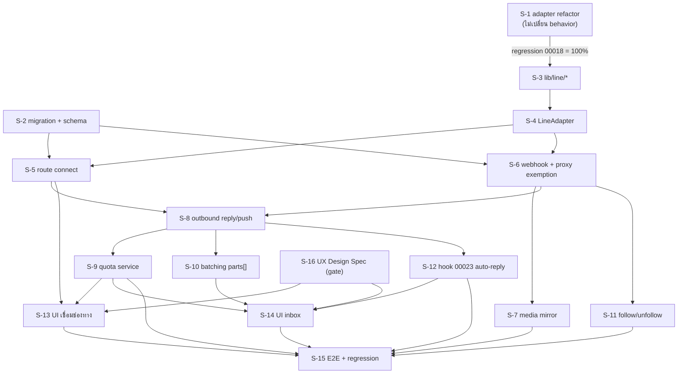

# Scope Baseline — feature 00025 LINE OA Chat Integration

> **สถานะ:** `ACTIVE`
> **Phase:** Implementation Phase 1 — LINE OA Chat Integration (วิธี A: ร้านวาง credential เอง)
> **Branch:** `chats-line`
> **Commit ตั้งต้น:** `a8793078` (rebase บน origin/main แล้ว, ahead 1 commit = เอกสาร 7/7)
> **วันที่ตั้ง baseline:** 2026-08-09
> **เจ้าของ scope:** `safepay-product` (Gate 0 ของ skill `agent-team-phase`)
> **แหล่งงานหลัก (ห้ามขยายเกิน):** `docs/20 - Features/00025 - LINE OA Chat Integration/SDS.md` §7 (Build Order S-1..S-15)
> **เอกสารอ้างอิงครบชุด:** PRD v1.1 · BRD v1.1 (FR-LINE-01..14, BR-LINE-01..23) · SRS v1.1 (TFR-LINE-01..13, NFR-1..10) · SDS v1.1 (TD-001..TD-009) · DATABASE v1.1 (12 คอลัมน์ใน 4 ตารางเดิม) · API v1.1 (7 endpoint) · TestCase v1.1 (35 test case)

---

## 1. Goal ของ phase

เชื่อม **LINE Official Account** เข้า `/inbox` ของ Deep ด้วยวิธีร้านวาง credential เอง (Channel secret + Channel access token) ให้ร้านรับ-ส่งข้อความ LINE จากอินบ็อกซ์รวมได้จริงบน production — โดยระบบต้อง **ประหยัดโควตาโดยค่าเริ่มต้น** (เลือก reply token ก่อนเสมอ), **โปร่งใสเรื่องต้นทุน** (Quota Meter), และ **ไม่ทำให้ระบบแชทเดิม (Deep Chat/Messenger/Instagram) เสียหาย** เพราะเป็นระบบที่ร้านใช้งานจริงทุกวัน

**เกณฑ์ตัดสินความสำเร็จเชิงลบที่สำคัญกว่าเชิงบวก (NFR-8):** ไม่มีการส่ง push message โดยระบบอัตโนมัติแม้แต่ครั้งเดียว — เงินของร้านถูกใช้โดยคนตัดสินใจเท่านั้น

---

## 2. In-Scope — S-id list

> **กติกา CREEP:** ทุก commit ของ phase นี้ต้อง map กับ S-id อย่างน้อย 1 ตัว. ไม่ map = CREEP (hard block).
> S-id ตรงกับเลข S ใน SDS §7 Build Order 1:1 (S-1..S-15) + S-16 เพิ่มสำหรับ UX gate (Hard Rule 8)

### Dependency overview

---

### S-1 — Provider Adapter refactor (`ChannelAdapter` + `MetaAdapter`)

| หัวข้อ | รายละเอียด |
|---|---|
| **ทำ** | ประกาศ `interface ChannelAdapter` (`sendMessages`, `fetchContactProfile`, `downloadContent`, `capabilities`) ใน `src/lib/channels/adapter.ts` · ห่อฟังก์ชันเดิมของ `src/lib/facebook/graph.ts` เข้า `MetaAdapter` (`src/lib/channels/meta-adapter.ts`) โดย**ไม่แก้ logic เดิมแม้แต่บรรทัดเดียว** · `channel-chat.service` เลือก adapter จาก `shopChannel.provider` ที่จุดเดียว (ห้าม `if (provider === 'LINE')` กระจาย) |
| **ไม่ทำ** | ห้ามแตะ Messenger/IG behavior แม้เล็กน้อย · ห้าม implement LineAdapter ในงานนี้ (S-4) · ห้ามลบ/rename export เดิมของ `facebook/graph.ts` |
| **FR/BR** | FR-LINE-14 (TD-008) |
| **T map** | TFR-LINE-13 |
| **ไฟล์** | `src/lib/channels/adapter.ts`, `src/lib/channels/meta-adapter.ts`, `src/services/channel-chat.service.ts` (จุดเรียก dispatch) |
| **Acceptance (ทดสอบได้)** | ชุดทดสอบถดถอยของ `00018` (Playwright + unit เดิม) ผ่าน **100%** ก่อนแตะไฟล์ LINE ใด ๆ — นี่คือ gate ที่ห้ามข้าม ไม่ใช่แค่ acceptance |
| **user-facing** | ไม่ (แต่พังแล้วกระทบ 00018 ที่ user เห็นทันที — ความเสี่ยงสูงสุดของ phase) |
| **เจ้าของ** | `safepay-developer` (+ `safepay-reviewer` gate พิเศษ) |

---

### S-2 — Migration + Schema (12 คอลัมน์ใน 4 ตารางเดิม)

| หัวข้อ | รายละเอียด |
|---|---|
| **ทำ** | เพิ่ม `ShopChannel.channelSecretEnc/basicId/quotaValue/quotaUsed/quotaFetchedAt`, `ExternalContact.isBlocked/profileFetchedAt`, `Conversation.replyToken/replyTokenExpiresAt/replyTokenUsedAt`, `ChatMessage.sendMethod/sendBatchId` — ทุกคอลัมน์ nullable/มี default, ไม่มี backfill · แก้ `prisma/schema.prisma` ให้ตรง · เขียน `migration.sql` **ด้วยมือ** |
| **ไม่ทำ** | ห้ามเพิ่มคอลัมน์ที่ซ้ำกับ 00023 (`autoReply*`, `autoReplyKind` ใช้ของเดิม) · ห้ามเปลี่ยน `ShopChannel.provider` เป็น enum (ยังเป็น `String`) · ห้ามเพิ่ม index ใหม่ (partial unique เดิมพอแล้ว) · ห้าม `prisma migrate dev` เด็ดขาด · ห้าม `prisma db pull` |
| **FR/BR** | FR-LINE-01/03/05/06/07/09/10/13, BR-LINE-01..03/07/09..14/15/16 |
| **T map** | (ฐานของทุก TFR) |
| **ไฟล์** | `prisma/schema.prisma`, `prisma/migrations/<timestamp>_line_oa_chat/migration.sql` |
| **Acceptance (ทดสอบได้)** | `npx prisma generate` ผ่าน 0 error · `npx tsc --noEmit` เต็ม repo = 0 error หลัง generate · แถวเดิมของ 4 ตารางไม่เปลี่ยนค่า (query ก่อน/หลัง เทียบจำนวนแถวเท่ากัน) |
| **user-facing** | ไม่ |
| **เจ้าของ** | `safepay-database` |
| 🛑 **ข้อบังคับพิเศษ (ต่างจากที่ DATABASE.md เขียนไว้ — ดู §6 Debt)** | ① **ห้ามใช้ timestamp `20260726000100`** ที่ DATABASE.md §5.1 เสนอ — ต้องตั้งชื่อไฟล์ด้วย timestamp **มากกว่า `20260809100000`** (migration ล่าสุดจริงในโปรเจกต์ ณ วันตั้ง baseline) ② ใช้ `npx prisma migrate deploy -e .env.local` เท่านั้น (dev DB ปัจจุบันคือ Docker `localhost:5434` — แยกจาก prod แล้ว แต่คำสั่งยังต้องเป็น `deploy` ไม่ใช่ `dev`) ③ **ต้องขอ user ยืนยันก่อน apply** — แม้ dev แยกจาก prod แล้ว แต่ `vercel.json` buildCommand รัน `migrate deploy` อัตโนมัติทุกครั้งที่ push ขึ้น `main` = **แตะ prod จริงตอน merge** ④ หลัง migrate ต้อง **restart dev server** (stale Prisma client → session 500) |

---

### S-3 — `lib/line/*` (signature, client, constants)

| หัวข้อ | รายละเอียด |
|---|---|
| **ทำ** | `line/signature.ts` — `validateSignature(rawBody, secret, header)` ด้วย HMAC-SHA256 + `crypto.timingSafeEqual` · `line/client.ts` — fetch wrapper (Bearer, timeout, `X-Line-Retry-Key`, error mapping) · `line/constants.ts` — `API_BASE`, `DATA_API_BASE`, `REPLY_WINDOW_MS=60_000`, `REPLY_SAFETY_MARGIN_MS=5_000`, `MAX_PARTS=5`, `QUOTA_TTL_MS=300_000`, `AUTO_REPLY_DEADLINE_MS=40_000` · unit test (mock HTTP, ไม่ยิง LINE จริง) |
| **ไม่ทำ** | ห้ามใช้ `===` เทียบ signature (ต้อง timing-safe) · ห้าม log token/secret · ห้ามกระจายค่าคงที่เหล่านี้ไปไฟล์อื่น |
| **FR/BR** | BR-LINE-05 |
| **T map** | TFR-LINE-02 (บางส่วน) |
| **ไฟล์** | `src/lib/line/signature.ts`, `src/lib/line/client.ts`, `src/lib/line/constants.ts` |
| **Acceptance** | unit test พิสูจน์ signature ถูก/ผิดแยกผลถูกต้อง, timing-safe (ไม่ใช้ `===`) |
| **user-facing** | ไม่ |
| **เจ้าของ** | `safepay-developer` |

---

### S-4 — `LineAdapter`

| หัวข้อ | รายละเอียด |
|---|---|
| **ทำ** | implement `ChannelAdapter` interface: `sendMessages` (reply/push), `fetchContactProfile`, `downloadContent`, `capabilities = { echo: false, readReceipt: false, freeWindowMs: 60_000, maxPartsPerRequest: 5 }` · key builder `'LINE:' + messageId` (TD-005) จุดเดียว · unit test mock HTTP |
| **ไม่ทำ** | ห้ามแตะ Prisma โดยตรง (adapter ไม่รู้จัก DB) · ห้ามต่อ route ในงานนี้ (ยังไม่ wire) |
| **FR/BR** | FR-LINE-03/10, BR-LINE-09 |
| **T map** | TFR-LINE-04, TFR-LINE-09, TFR-LINE-10 |
| **ไฟล์** | `src/lib/channels/line-adapter.ts` |
| **Acceptance** | unit test: `capabilities` ตรงตามสเปก, key builder ให้ prefix `LINE:` เสมอ, 404 จาก `/v2/bot/profile` → ไม่ throw คืนชื่อสำรอง |
| **user-facing** | ไม่ |
| **เจ้าของ** | `safepay-developer` |

---

### S-5 — route `connect` + `shop-channel.service` รองรับ LINE

| หัวข้อ | รายละเอียด |
|---|---|
| **ทำ** | `POST /api/channels/line/connect` (verify `GET /v2/bot/info` ก่อนเขียน DB, encrypt ด้วย `token-crypto.ts` เดิม, P2002 → `CHANNEL_TAKEN`) · `PATCH /api/channels/line/[channelId]` (re-verify, `LINE_ACCOUNT_MISMATCH` ถ้า userId ไม่ตรงเดิม) · ขยาย `shop-channel.service` รองรับ `channelSecretEnc`/`basicId` |
| **ไม่ทำ** | ห้ามให้ client ส่ง `externalId` เอง (ต้องมาจาก LINE เท่านั้น) · ห้ามเพิ่มสวิตช์ AI ที่ endpoint นี้ (BR-LINE-17 — ใช้ endpoint ของ 00023) · ห้าม select `accessTokenEnc`/`channelSecretEnc` กลับ client |
| **FR/BR** | FR-LINE-01, BR-LINE-01/02/03/04 |
| **T map** | TFR-LINE-01 (TD-001) |
| **ไฟล์** | `src/app/api/channels/line/connect/route.ts`, `src/app/api/channels/line/[channelId]/route.ts`, `src/services/shop-channel.service.ts` |
| **Acceptance** | TC-01 (เชื่อมสำเร็จ), TC-02 (token ผิด → ไม่บันทึกอะไรเลย, query ยืนยันจำนวนแถวไม่เปลี่ยน), TC-21 (OA ร้านอื่นถืออยู่ → `CHANNEL_TAKEN` 409), TC-22 (mismatch → `LINE_ACCOUNT_MISMATCH`), TC-23 (กู้คืนจาก `TOKEN_INVALID`) |
| **user-facing** | ทางอ้อม (ยังไม่มี UI จนถึง S-13 — ทดสอบด้วย curl/Postman ก่อน) |
| **เจ้าของ** | `safepay-developer` |

---

### S-6 — webhook route + ingest ข้อความ (text) + proxy exemption 🛑 จุดเสี่ยงสูงสุดรองจาก S-1

| หัวข้อ | รายละเอียด |
|---|---|
| **ทำ** | `POST /api/channels/line/webhook`: `raw = await request.text()` → parse `destination` (ยังไม่เชื่อถือ) → หา `ShopChannel` → `validateSignature` → ตอบ 200 → `waitUntil(ingest)` · ingest ข้อความ `text` ก่อน (media = S-7): upsert `ExternalContact`, insert `ChatMessage` (`externalMessageId='LINE:'+id`), เก็บ `replyToken/replyTokenExpiresAt` · **เพิ่ม `/api/channels/line/webhook` เข้ารายการยกเว้น Origin-check ใน `src/proxy.ts`** (บรรทัดเดียวกับที่ยกเว้น `/api/channels/facebook/webhook` อยู่แล้ว ปัจจุบันบรรทัด 22/35) |
| **ไม่ทำ** | ห้ามเขียน DB/เรียก LINE ก่อนผ่าน verify (TD-002) · ห้ามทำงานหนักก่อนตอบ 200 (TD-003) · ห้ามแตะ exemption อื่นใน proxy.ts นอกจากเพิ่ม path นี้ 1 บรรทัด |
| **FR/BR** | FR-LINE-02, BR-LINE-05/06/07/08 |
| **T map** | TFR-LINE-02, TFR-LINE-03, TFR-LINE-04, TFR-LINE-05 (เก็บ token) |
| **ไฟล์** | `src/app/api/channels/line/webhook/route.ts`, `src/proxy.ts` |
| **Acceptance** | TC-03 (ลายเซ็นถูก → บันทึก), TC-04 [ห้ามข้าม] (ลายเซ็นผิด → **ไม่มี write, ไม่มี outbound call ใด ๆ**), TC-05 (ไม่มี header/body ไม่ใช่ JSON → 200 + ไม่บันทึก), TC-06 (destination ไม่มีร้านเชื่อม → 200 + log warn), TC-07 (redelivery ไม่ซ้ำ), TC-20 [ห้ามข้าม] (**curl POST ไม่มี header `Origin` ต้องไม่ได้ 403** — พิสูจน์ proxy exemption ทำงานจริง), TC-26 (event กลุ่ม/ห้อง → ข้ามเงียบ ไม่ crash) |
| **user-facing** | ทางอ้อม (ข้อความขึ้น `/inbox` — QA ต้องเห็นจริงในเธรด) |
| **เจ้าของ** | `safepay-developer` (+ `safepay-security` review บังคับ — เป็น public endpoint ไม่มี session) |
| 🛑 **ข้อควรระวัง** | Controller ยืนยันแล้วว่าถ้าลืมข้อนี้ webhook จะโดน 403 **แบบเงียบสนิท** (ไม่มี error ที่ dev เห็นชัด) — reviewer ต้อง grep ยืนยัน exemption มีจริงก่อนปิดงาน ไม่ใช่แค่เชื่อ commit message |

---

### S-7 — ingest สื่อ (media mirror + placeholder)

| หัวข้อ | รายละเอียด |
|---|---|
| **ทำ** | ดาวน์โหลดจาก `GET api-data.line.me/v2/bot/message/{id}/content` → mirror เข้า Supabase storage เดิม (generalize `mirrorRemoteImage` ของ 00018 ให้รับ MIME อื่น) · ล้มเหลว → บันทึกข้อความ placeholder + log (ห้ามหายเงียบ) · `location` → เก็บเป็นข้อความอ่านออก · `sticker` → เก็บ metadata (ไม่ render ภาพ) |
| **ไม่ทำ** | ห้าม render ภาพสติกเกอร์จริง (นอกขอบเขต MVP — ดู PRD §5) · ห้ามข้ามการ mirror แม้ไฟล์ใหญ่ (ต้องมี placeholder ไม่ใช่ทิ้ง event) |
| **FR/BR** | FR-LINE-03, BR-LINE-09 |
| **T map** | TFR-LINE-09 |
| **ไฟล์** | `src/lib/channels/line-adapter.ts` (downloadContent), `src/services/channel-chat.service.ts` (ingest media) |
| **Acceptance** | TC-08 (สื่อทุกชนิด mirror สำเร็จ), TC-09 [ห้ามข้าม] (mirror ล้มเหลว → placeholder ที่ผู้ใช้เห็น ไม่หายเงียบ), TC-25 (sticker/location แสดงถูกต้อง) |
| **user-facing** | ใช่ (สื่อในเธรด) |
| **เจ้าของ** | `safepay-developer` |

---

### S-8 — outbound reply/push + `sendMethod` + error mapping

| หัวข้อ | รายละเอียด |
|---|---|
| **ทำ** | `channel-chat.service` outbound pipeline: authz → channel ACTIVE → contact ไม่ถูกบล็อก → reply ใช้ได้? (mark `replyTokenUsedAt` ใน transaction ก่อนยิง) → ไม่งั้นเช็คโควตา (S-9) → push · error mapping ครบตาม API.md §5 (`TOKEN_INVALID`, `CONTACT_BLOCKED`, `QUOTA_EXCEEDED`, `CHANNEL_NOT_ACTIVE`, `LINE_UNAVAILABLE`) พร้อม **route catch ครอบทุก error ใหม่** (`feedback_service_error_route_mapping`) |
| **ไม่ทำ** | ห้าม retry อัตโนมัติที่กินโควตา (คนกดส่งซ้ำเองเท่านั้น) · ห้าม fallback เป็น push จากงานอัตโนมัติ (นั่นคืองานของ S-12/BR-LINE-18) |
| **FR/BR** | FR-LINE-04/05/09, BR-LINE-10/11/15/16 |
| **T map** | TFR-LINE-05, TFR-LINE-06 |
| **ไฟล์** | `src/services/channel-chat.service.ts`, `src/app/api/chat/conversations/[id]/messages/route.ts` (ยังไม่ต่อ `parts[]` — งานนั้นคือ S-10) |
| **Acceptance** | TC-10 (หน้าต่างฟรี → reply ไม่กินโควตา), TC-11 (หมดหน้าต่าง → push), TC-12 [ห้ามข้าม] (concurrency: replyToken ใช้ซ้ำไม่ได้), TC-19 (ลูกค้าบล็อก → ปิดการส่ง) |
| **user-facing** | ใช่ (ปุ่มส่งในเธรด) |
| **เจ้าของ** | `safepay-developer` |

---

### S-9 — quota service + route + invalidate

| หัวข้อ | รายละเอียด |
|---|---|
| **ทำ** | `line-quota.service.ts`: อ่าน `GET /v2/bot/message/quota` + `/quota/consumption` → cache บน `ShopChannel` TTL 5 นาที · invalidate ทันทีเมื่อส่ง push สำเร็จ หรือ LINE ปฏิเสธเพราะโควตา · อ่านไม่ได้ → **ไม่บล็อก** (TD-006) · `GET /api/channels/line/[channelId]/quota` |
| **ไม่ทำ** | ห้าม hardcode ตัวเลขแพ็กเกจ (BR-LINE-14) · ห้ามคืน 5xx เมื่ออ่านโควตาไม่ได้ (ต้องคืน 200 + `stale:true`) |
| **FR/BR** | FR-LINE-06, BR-LINE-13/14 |
| **T map** | TFR-LINE-07 |
| **ไฟล์** | `src/services/line-quota.service.ts`, `src/app/api/channels/line/[channelId]/quota/route.ts` |
| **Acceptance** | TC-13 (ค่าจาก LINE ตรง — **ดู §5 หมายเหตุ OA ทดสอบเป็นแพ็กเกจ Free 300/เดือน**), TC-14 (อ่านไม่ได้ → ไม่พัง ไม่บล็อก), TC-15 [ห้ามข้าม] (โควตาหมด → บล็อกก่อนกดส่ง — **แนะนำ mock ไม่ใช้ OA จริง เพราะทำให้โควตาจริงหมดถาวรทั้งเดือน**), TC-28 (โควตาหมดแต่ยังอยู่ในหน้าต่างฟรี → ยังส่งได้) |
| **user-facing** | ใช่ (Quota Meter) |
| **เจ้าของ** | `safepay-developer` |

---

### S-10 — batching (`parts[]` ที่ API + composer)

| หัวข้อ | รายละเอียด |
|---|---|
| **ทำ** | ขยาย `POST /api/chat/conversations/[id]/messages` ให้รับ `parts[]` (1–5) **โดยยังรองรับสัญญาเดิม `{text, imageFileId}`** (ห้าม break Messenger/IG client จริง) · composer ฝั่ง client รวบข้อความด้วย debounce สั้น ๆ (TD-004 — ไม่ใช่ server timer) · `sendBatchId` ร่วมกันต่อ batch |
| **ไม่ทำ** | ห้ามทำ server-side timer/queue สำหรับ batching · เกิน 5 ต้องแบ่งชุดถัดไปแบบ **ไม่ขนาน** (ตามลำดับ) |
| **FR/BR** | FR-LINE-07, BR-LINE-12 |
| **T map** | TFR-LINE-08 |
| **ไฟล์** | `src/app/api/chat/conversations/[id]/messages/route.ts`, composer component ใน inbox (ประสาน S-14) |
| **Acceptance** | TC-16 (≤5 ชิ้น = 1 ข้อความ), TC-17 (เกิน 5 → แบ่งชุดถัดไป), ความเข้ากันได้ย้อนหลัง: request สัญญาเดิม (`{text}`) ยังทำงานถูกต้องกับ Messenger thread |
| **user-facing** | ใช่ |
| **เจ้าของ** | `safepay-developer` |

---

### S-11 — follow / unfollow + `isBlocked`

| หัวข้อ | รายละเอียด |
|---|---|
| **ทำ** | `follow` → upsert contact, `isBlocked=false`, ดึงโปรไฟล์ · `unfollow` → `isBlocked=true` (ไม่ลบข้อมูล) · ส่งไม่สำเร็จด้วย error ที่บ่งชี้ผู้รับไม่รับข้อความแล้ว → ตั้ง `isBlocked=true` ด้วย |
| **ไม่ทำ** | ห้ามลบ `ExternalContact` หรือประวัติเมื่อบล็อก (เป็นสถานะ ไม่ใช่การลบ) |
| **FR/BR** | FR-LINE-13, BR-LINE-15 |
| **T map** | TFR-LINE-11 |
| **ไฟล์** | webhook route (follow/unfollow handler ใน `src/app/api/channels/line/webhook/route.ts`) |
| **Acceptance** | TC-19 (บล็อกแล้วปิดช่องพิมพ์พร้อมเหตุผล), เพิ่มเพื่อนใหม่ → ส่งหาได้อีกครั้งอัตโนมัติ |
| **user-facing** | ใช่ (ช่องพิมพ์ปิด/เปิด) |
| **เจ้าของ** | `safepay-developer` |

---

### S-12 — เสียบ LINE เข้า auto-reply ของ 00023 🛑 ต้องมีหลักฐานวัดจริงก่อนปิดงาน

| หัวข้อ | รายละเอียด |
|---|---|
| **ทำ** | หลังบันทึกข้อความลูกค้าใน S-6 สำเร็จ เรียก `enqueueAutoReplyJob` (try/catch ของตัวเอง ไม่ throw) → `processPendingForConversation` ใน `waitUntil` เดียวกัน → ส่งผ่าน pipeline เดียวกับ S-8 (reply เท่านั้น) · deadline ภายใน **40 วินาที** นับจาก `event.timestamp` · พ้นหน้าต่าง → ยกเลิกงาน + บันทึกเหตุผลลง `AutoReplyLog` ของ 00023 (**ห้าม fallback เป็น push**) |
| **ไม่ทำ** | 🛑 ห้ามสร้างสวิตช์เปิด-ปิดเฉพาะ LINE (ใช้กลไกเดิมของ 00023) · ห้ามเพิ่มฟิลด์ระบุที่มาชุดใหม่ (ใช้ `autoReplyKind` เดิม) · ห้ามแตะตรรกะ matcher/keyword ของ 00023 · **ห้ามระบบส่ง push เองในทุกกรณี** (NFR-8, TD-007) |
| **FR/BR** | FR-LINE-08, BR-LINE-17/18/19/20 |
| **T map** | TFR-LINE-12 |
| **ไฟล์** | webhook route (`waitUntil` block), ไม่แตะไฟล์ของ 00023 นอกจาก call เข้า `enqueueAutoReplyJob`/`processPendingForConversation` |
| **Acceptance** | TC-29 (keyword ตรง + ในหน้าต่างฟรี → ตอบด้วย reply), TC-30 [ห้ามข้าม] (พ้นหน้าต่าง → ห้ามส่งแบบกินโควตา), TC-31 [ห้ามข้าม] (audit: ไม่มี push ที่ไม่มีคนสั่ง — `SELECT COUNT(*) FROM "ChatMessage" WHERE sendMethod='PUSH' AND <actor เป็นระบบ>` ต้อง = 0), TC-32 (ไม่มีสวิตช์ซ้ำซ้อน) · **หลักฐานวัดเวลาจริง (production path):** ใช้ OA ทดสอบจริง (`@502sjent`) + MCP `line-bot` ส่งข้อความจริงเข้า webhook แล้ววัดเวลา webhook→enqueue→ส่งจริง ต้องต่ำกว่า 40s อย่างมีหลักฐาน (screenshot/log timestamp) — ตาม `feedback_spike_must_match_production_path` ห้ามพิสูจน์ด้วย mock/`$executeRaw` |
| **user-facing** | ทางอ้อม (คำตอบอัตโนมัติในเธรด) |
| **เจ้าของ** | `safepay-developer` |

---

### S-13 — UI หน้าเชื่อมช่องทาง (seller, Paces)

| หัวข้อ | รายละเอียด |
|---|---|
| **ทำ** | การ์ด "LINE Official Account" ใน `settings/channels` (ปรับจาก `ChannelsClient.tsx` เดิมที่มี pattern ของ Messenger/IG อยู่แล้ว) + wizard วาง credential + webhook URL พร้อมปุ่มคัดลอก + คู่มือ 5 ขั้นในหน้าเดียว + คำเตือน 2 ข้อบังคับ (กินโควตา + ไม่มี echo) |
| **ไม่ทำ** | 🛑 ห้ามเขียน UI จาก scratch (Hard Rule 1) · ห้าม arbitrary Tailwind value (Hard Rule 7) · ห้าม `react-toastify` — `pacesToast` เท่านั้น (Hard Rule 9) · **ห้าม emoji** (Hard Rule 12) · ห้ามเริ่มโค้ดก่อนมี Design Spec จาก `safepay-ux` (Hard Rule 8) |
| **FR/BR** | FR-LINE-01 (AC ใน BRD §2.1 ครบ 8 ข้อ), FR-LINE-12 (ถอดการเชื่อม) |
| **T map** | TFR-LINE-01 |
| **ไฟล์** | `src/app/(paces)/seller/(dashboard)/settings/channels/page.tsx`, `ChannelsClient.tsx` (แก้ไข ไม่ใช่ไฟล์ใหม่) |
| **Acceptance** | TC-01, TC-02, TC-21, TC-22, TC-23, TC-24 (E2E ครบ) + `/impeccable critique` + `/impeccable clarify` ผ่าน |
| **user-facing** | ✅ ใช่ — บังคับ QA 3-level + Impeccable gate |
| **Dependency** | S-5, S-9, **S-16 (Design Spec)** |
| **เจ้าของ** | `safepay-developer` |

---

### S-14 — UI อินบ็อกซ์ (badge, Quota Meter, สถานะหน้าต่างฟรี, ตัวชี้ AI)

| หัวข้อ | รายละเอียด |
|---|---|
| **ทำ** | badge ช่องทาง LINE บนเธรด · Quota Meter ("เหลือ x/y ข้อความเดือนนี้") · แถบ/ตัวชี้สถานะหน้าต่างตอบฟรี (ข้อมูล ไม่ใช่ countdown ที่สร้างความเครียด — BRD AC-005-05) · ตัวชี้ว่าข้อความไหนตอบด้วยระบบอัตโนมัติ (ใช้ pattern เดิมของ 00023) · หมายเหตุถาวรในเธรด LINE ว่า "ข้อความที่ตอบจากแอป LINE OA จะไม่ปรากฏที่นี่" |
| **ไม่ทำ** | Hard Rule 1/7/8/9/12 เหมือน S-13 · ห้าม regress inbox เดิมของ 00018 · ห้าม render field ดิบของ `Conversation`/`ExternalContact` ใหม่โดยไม่ mask ที่ server boundary (NFR-6) |
| **FR/BR** | FR-LINE-04/05/06/09/10 (ส่วน UI) |
| **T map** | TFR-LINE-06/07/08/10 (ส่วน UI) |
| **ไฟล์** | `src/app/(paces)/seller/(chat)/inbox/**` (รวม `_components/**`) |
| **Acceptance** | TC-18 (สถานะในเธรดถูกต้อง), TC-13/TC-28 (Quota Meter), TC-19 (ปิดช่องพิมพ์เมื่อบล็อก) + Impeccable gate |
| **user-facing** | ✅ ใช่ — บังคับ QA 3-level + Impeccable gate |
| **Dependency** | S-9, S-10, S-12, **S-16 (Design Spec)** |
| **เจ้าของ** | `safepay-developer` |

---

### S-15 — E2E Playwright + regression suite + QA

| หัวข้อ | รายละเอียด |
|---|---|
| **ทำ** | Playwright E2E ครบทุกเมนูที่แตะ (บังคับตาม `feedback_qa_playwright_e2e_mandatory`) · unit/integration ของ signature/reply-push decision/quota/error mapping (Vitest) · รัน `TestCase.md` ทั้ง 35 case แล้วบันทึกผลจริง · regression 00018 + 00011 ครบ |
| **ไม่ทำ** | ห้าม QA agent รัน `prisma db pull` · ห้ามทดสอบด้วย `localhost` — ใช้ `seller.deepth.local:4000` · ห้าม start dev server เอง |
| **FR/BR** | ครอบทุก FR-LINE-01..14 |
| **T map** | ครอบทุก TFR-LINE |
| **ไฟล์** | `e2e/**`, `src/**/__tests__/**`, `docs/20 - Features/00025 - LINE OA Chat Integration/TestCase.md` (อัปเดตผลจริง) |
| **Acceptance** | TC-01..TC-35 ผ่าน (case ที่ต้อง mock เพราะข้อจำกัดโควตาจริง — ดู §5 — ต้องระบุชัดเจนว่า mock ไม่ใช่ของจริง) |
| **user-facing** | ✅ (เป็นตัว QA เอง) |
| **เจ้าของ** | `safepay-qa` |

---

### S-16 — Design Spec จาก `safepay-ux` (mandatory gate, ไม่มี T map)

| หัวข้อ | รายละเอียด |
|---|---|
| **ทำ** | Design Spec (read-only) ของ S-13 (การ์ดเชื่อมช่องทาง + wizard) และ S-14 (badge/Quota Meter/สถานะหน้าต่างฟรี ในอินบ็อกซ์) อิง **Paces docs** `theme/paces/Docs/index.html` + `docs/system/ui-guideline/paces-component-reference.md` + หัวข้อ `### Impeccable compliance` (อ่าน `DESIGN.md` + `PRODUCT.md` + `.impeccable/design.json` ก่อนเสมอ) — **อ่านหน้าพี่น้อง 00018 ChannelsClient.tsx / inbox ก่อนออกแบบใหม่** (`feedback_sibling_surface_parity` — Messenger/IG card pattern มีอยู่แล้ว ให้ใช้โครงเดียวกัน) |
| **ไม่ทำ** | ux ไม่แก้โค้ด ไม่ออกแบบ from scratch ไม่รัน CLI (tools = Read/Glob/Grep) |
| **FR/BR** | ครอบ AC ฝั่ง UI ของ S-13/S-14 |
| **ไฟล์** | `docs/superpowers/specs/2026-08-**-00025-line-oa-*.md` (+ HTML mockup 3 devices ตาม `feedback_spec_html_mockup` / `feedback_mockup_3_devices`) |
| **user-facing** | ไม่ (เอกสาร) |
| **เจ้าของ** | `safepay-ux` |

---

## 3. Mapping table — TFR-LINE-01..13 ↔ S-id

| TFR (SRS) | S-id | Coverage |
|---|---|---|
| TFR-LINE-01 | S-5 | 1:1 |
| TFR-LINE-02 | S-3, S-6 | split (lib ↔ route) |
| TFR-LINE-03 | S-6 | 1:1 |
| TFR-LINE-04 | S-4 | 1:1 |
| TFR-LINE-05 | S-6 (เก็บ token), S-8 (ใช้ token) | split |
| TFR-LINE-06 | S-8 | 1:1 |
| TFR-LINE-07 | S-9 | 1:1 |
| TFR-LINE-08 | S-10 | 1:1 |
| TFR-LINE-09 | S-7 | 1:1 |
| TFR-LINE-10 | S-4 | 1:1 |
| TFR-LINE-11 | S-11 | 1:1 |
| TFR-LINE-12 | S-12 | 1:1 |
| TFR-LINE-13 | S-1 | 1:1 |

TFR ที่ map ไม่ได้: **0 รายการ**

---

## 4. Out-of-Scope ของ phase นี้

> แตะของในนี้ = **CREEP (hard block)**. ถ้าจำเป็นต้องทำ → Controller ตัดสิน + ย้ายขึ้น In-Scope พร้อมจด Change Log

### 4.1 ยกจาก PRD §5 / SDS §1.2 (Out of Scope ระดับ product/system)

| ID | รายการ | เหตุผล |
|---|---|---|
| OOS-01 | **Module Channel (OAuth กดปุ่มเดียว)** | ต้องเป็น LINE Technology Partner ก่อน (gate เดียวกับที่ทำให้ 00020 ค้าง) — Phase 2. สถาปัตยกรรม (S-1/S-4) ต้องเผื่อสลับได้ แต่ **ห้าม implement OAuth flow ในรอบนี้** |
| OOS-02 | แชทกลุ่ม / ห้อง (group, room) | MVP รองรับ 1:1 เท่านั้น (BR-LINE-08) — event จากกลุ่ม/ห้องข้ามเงียบ |
| OOS-03 | Broadcast / multicast / narrowcast | คนละฟีเจอร์ที่มีนัยเรื่องค่าใช้จ่ายและ consent แยกออกแบบ |
| OOS-04 | Rich menu / LIFF / LINE Mini App | คนละโดเมน ไม่เกี่ยวกับอินบ็อกซ์ |
| OOS-05 | LINE Login เป็นวิธีสมัคร/เข้าสู่ระบบ Deep | มีอยู่แล้วเป็น feature 00001 คนละเรื่อง — **แม้ botUserId มาจาก provider "Deep Thailand" เดียวกับ LINE Login channel ก็ไม่รวมการ implement cross-channel identity merge ในรอบนี้** |
| OOS-06 | LINE Pay / LINE Shopping | นอกขอบเขต |
| OOS-07 | สถานะ "อ่านแล้ว" ของลูกค้า LINE (Mark-as-Read) | ต้องขอสิทธิ์เพิ่มจาก LINE — Phase 2 |
| OOS-08 | ส่งสติกเกอร์ออกจาก Deep | รับเข้า+แสดงได้ (S-7) แต่ส่งออกไม่รวมใน MVP |
| OOS-09 | Flex Message / carousel / รูปแบบข้อความขั้นสูง | ส่งได้แค่ text+รูป+วิดีโอ+เสียง+ไฟล์ |
| OOS-10 | รวมโปรไฟล์ลูกค้าข้ามช่องทาง (LINE+FB+Deep = คนเดียวกัน) | หนี้เดิมของ 00018 — ไม่ resolve ในรอบนี้ (แม้ userId ของ OA ทดสอบตั้งใจให้ตรงกับ LINE Login ก็ตาม — เป็นการเตรียมโครงสร้างเฉย ๆ ไม่ใช่ implement) |
| OOS-11 | ดึงข้อความ LINE ย้อนหลัง (backfill) เมื่อพลาด webhook | LINE ไม่มี API — ข้อความที่พลาดคือหายถาวร ยอมรับความเสี่ยงนี้ ไม่สร้างกลไกกู้คืน |

### 4.2 เพิ่มจากการอ่าน SDS/SRS/DATABASE (นอกขอบเขตเชิงเทคนิค)

| ID | รายการ | เหตุผล |
|---|---|---|
| OOS-12 | **AI Enhance / เรียกโมเดล AI ในเส้นทางตอบอัตโนมัติของ LINE** | FR-LINE-08 คือ keyword-matching ของ 00023 เท่านั้น (BR-LINE-19) — Phase 2 ของ 00023 เอง ไม่ใช่ของ feature นี้ |
| OOS-13 | **ตารางใหม่ / model ใหม่ใน Prisma** | DATABASE.md ยืนยันแล้วว่า additive 12 คอลัมน์ใน 4 ตารางเดิมพอ — ห้ามสร้างตารางใหม่ |
| OOS-14 | **เปลี่ยน `ShopChannel.provider` เป็น Prisma enum** | convention เดิมของโปรเจกต์คือ `String` — คงไว้ |
| OOS-15 | **index ใหม่นอกเหนือจาก DATABASE §4** | partial unique index เดิม (`migration 20260722000200`) ครอบ BR-LINE-01 ได้แล้ว |
| OOS-16 | **แก้ `src/proxy.ts` เกินกว่า 1 บรรทัดยกเว้น webhook** | S-6 แตะแค่เพิ่ม path เข้ารายการยกเว้น — ห้ามแตะ rate-limit/allowlist อื่นของ proxy.ts |
| OOS-17 | **เพิ่ม/เปลี่ยน env variable ใหม่** | reuse `CHANNEL_TOKEN_KEY` เดิมของ 00018 สำหรับเข้ารหัส — ไม่มี env ใหม่ |
| OOS-18 | **queue ภายนอก (Redis/QStash/BullMQ)** | ตามสถาปัตยกรรม `waitUntil` เดิม ไม่เพิ่ม infra |
| OOS-19 | **ปรับปรุง/refactor โค้ด 00018 หรือ 00023 ที่ไม่ได้อยู่ใน S-1/S-12** | ระบบ production ที่ร้านใช้ทุกวัน — แตะเกินรายการ = ความเสี่ยงที่ไม่ได้ประเมิน |
| OOS-20 | **UI ที่ยังไม่มี Design Spec จาก `safepay-ux` (S-16)** | Hard Rule 8 — เขียนโค้ด frontend ก่อนมี Design Spec = ละเมิด ไม่ใช่แค่ CREEP |
| OOS-21 | **แก้ `DATABASE.md`/`SDS.md`/`SRS.md` เกินขอบเขต doc-fix ที่ระบุใน §6 Debt** | freeze contract ของ feature — แก้เพิ่มต้องผ่าน Controller |

---

## 5. Assumptions & Risks (รวมผลกระทบจาก LINE OA ทดสอบจริงที่เป็นบัญชี Free)

### 5.1 Assumptions

- **A-01:** OA ทดสอบจริง `Deep Chat & LIVE` (`@502sjent`, Channel ID `2011036363`, bot userId `Uee65ad697de752be32ab09904219db5c`, `chatMode: bot`) พร้อมใช้ตลอด phase — TC ที่เป็น **positive path เดี่ยว** (TC-01 เชื่อมสำเร็จ, TC-13 quota, TC-29 auto-reply, S-12 spike) ใช้ OA จริงนี้ได้ตรง ๆ
- **A-02:** MCP `line-bot` ต่อไว้แล้วและยิง broadcast ทดสอบผ่านจริง — ใช้เป็นเครื่องมือส่ง "ข้อความลูกค้าจำลอง" เข้า webhook สำหรับ S-12 spike (ต้องเป็น production path จริง ไม่ mock ตาม `feedback_spike_must_match_production_path`)
- **A-03:** ทดสอบที่ต้อง **ปลอมแยก 2 ร้าน/2 OA แย่งกัน** (TC-21, TC-22) หรือ **ปลอมลายเซ็นผิด** (TC-04) หรือ **ยิง redelivery ปลอม** (TC-07) **ไม่ต้องใช้ LINE จริง** — ยิง payload ที่คำนวณลายเซ็นเองตรงเข้า webhook route (fixture ตาม TestCase.md §1 "ชุด fixture payload") เพราะไม่มี OA จริงตัวที่สองให้ทดสอบ conflict
- **A-04:** `chatMode: bot` ของ OA จริงตรงกับ path ปกติ — TFR-LINE-01 warning `CHAT_MODE_NOT_BOT` **ต้องทดสอบด้วย mock response** เพราะ OA จริงไม่ตกกรณีนี้
- **A-05:** ผู้ทดสอบ (dev/QA) ต้องมีบัญชี LINE ส่วนตัวที่เพิ่มเพื่อน `@502sjent` แล้วก่อนเริ่ม S-6 เป็นต้นไป (ไม่งั้นไม่มี "ลูกค้า" ให้ทักจริง) — Controller ต้องยืนยันก่อน dispatch S-6/S-8/S-12

### 5.2 Risks จากบัญชี LINE OA เป็น Free/unverified (ผลต่อ acceptance)

| ความเสี่ยง | ผลกระทบต่อ FR/S-id | การปรับ acceptance |
|---|---|---|
| **โควตา 300 ข้อความ/เดือน** | S-9 (TC-13/15/28), S-12 (spike ใช้ push ทดสอบ), S-15 (E2E รวม) | **TC-15 (โควตาหมด → บล็อก) ต้อง mock การตอบของ LINE ไม่ใช่ยิงจริงจนโควตาหมด** (ทำให้ QA รอบถัดไปทดสอบ push ไม่ได้เลยทั้งเดือน) — ทดสอบ path นี้ด้วย unit/integration ที่ mock `GET /v2/bot/message/quota` คืนค่า `remaining:0` แทน · **งบ push จริงสำหรับ E2E ทั้ง phase ต้องประหยัด** เน้นทดสอบผ่าน reply token (ไม่กินโควตา) ให้มากที่สุด และนับจำนวนครั้งที่ยิง push จริงไว้ (ไม่เกิน ~20 ครั้งตลอด phase เป็นเพดานที่ปลอดภัย) |
| **`GET /v2/bot/followers/ids` คืน 403** | **ไม่กระทบ FR ใดของ feature นี้โดยตรง** — ไม่มี FR-LINE ที่เรียก endpoint นี้ (broadcast/multicast อยู่ OOS-03) | ไม่ต้องปรับ acceptance ใด แต่ **ห้าม developer ใช้ endpoint นี้เผื่ออนาคต** เพราะจะพังทันทีบนบัญชี unverified — ถ้ามีความจำเป็นใหม่เกิดขึ้นระหว่างทางต้องกลับมาแจ้ง Controller ไม่ใช่ implement เงียบ ๆ |
| **quota `totalUsage` ไม่ได้เริ่มจาก 0** (ขยับ 0→1 แล้วจากการทดสอบ broadcast ของ Controller) | TC-13 (ค่าจาก LINE ตรง) | assertion ต้อง**เทียบกับค่าที่อ่านจาก API จริง ณ ขณะทดสอบ** ห้าม hardcode ว่า "เหลือ 300" — ต้อง query แล้วเทียบ delta ก่อน/หลังส่งแทน |
| **บัญชี Free ไม่มี custom domain/verified badge** — ไม่กระทบ technical scope แต่ผู้ใช้จริง (ร้าน) อาจเห็น OA "ยังไม่ยืนยัน" ตอน UAT | ไม่กระทบ S-id ใดของ phase นี้ (เป็นเรื่องของบัญชีทดสอบ ไม่ใช่ระบบ) | ไม่ต้องปรับ |

### 5.3 Risks อื่น (จาก SDS §8 Architectural Risks)

- refactor adapter (S-1) ทำ Messenger/IG พัง → mitigate ด้วย commit แยก + regression 100% ก่อนเริ่ม S-3
- ตอบอัตโนมัติไม่ทันหน้าต่าง 40s และไม่มี fallback (cron รายวัน) → mitigate ด้วย spike จริงใน S-12 ก่อนปิดงาน
- ลืม exempt path ใน proxy.ts → webhook 403 เงียบ → TC-20 เป็น test case บังคับ [ห้ามข้าม]
- prefix `LINE:` ถูกลืมในบางเส้นทาง → dedup พัง → สร้าง key ที่ฟังก์ชันเดียวใน `LineAdapter` (S-4) เท่านั้น

---

## 6. Debt / หนี้ที่รับรู้ล่วงหน้า

| # | หนี้ | รายละเอียด | ต้องปิดตอนไหน |
|---|---|---|---|
| D-01 | **DATABASE.md §5.1 timestamp ล้าสมัย** | เสนอ `20260726000100_line_oa_chat` แต่ migration ล่าสุดจริงในโปรเจกต์คือ `20260809100000_chat_message_generic_cards` — ใช้ timestamp เดิมจะชนลำดับ/สร้างความสับสน | **ก่อนเริ่ม S-2** — safepay-database ตั้ง timestamp ใหม่ + doc-fix `DATABASE.md` §5.1 |
| D-02 | **DATABASE.md บรรทัด 33 "DB dev = prod แชร์กัน" ล้าสมัย** | ปัจจุบัน `.env`/`.env.local` ชี้ `localhost:5434` (Docker) แยกจาก prod แล้ว (memory `project_dev_db_separated_from_prod`) แต่ `vercel.json` ยัง auto-migrate prod ตอน push main อยู่ดี — เหตุผลของ "ห้าม migrate dev" เปลี่ยนจาก "กลัวลบข้อมูล prod" เป็น "กลัวลบข้อมูล dev docker + push main = migrate prod อัตโนมัติ" | doc-fix พร้อม S-2 (ไม่ block การ implement แต่ต้องแก้ก่อนปิด phase เพื่อไม่ให้คนอ่านเอกสารทีหลังเข้าใจผิด) |
| D-03 | **cross-channel identity merge (LINE+FB+Deep)** | หนี้เดิมของ 00018 ที่ค้างต่อมาถึง feature นี้ (OOS-10) — ไม่ resolve ในรอบนี้ แม้ botUserId ของ OA ทดสอบตั้งใจให้ตรงกับ LINE Login channel ของ 00001 | Phase 2 (บันทึกไว้ใน retro ปลาย phase) |
| D-04 | **ไม่มี Mark-as-Read / อ่านประวัติย้อนหลัง** | ข้อจำกัดแพลตฟอร์มถาวร (BR §4.2 PRD) ไม่ใช่ของที่ทำได้เพิ่มในเทคนิค | ไม่มีวันปิด — เป็น known-limitation ถาวรที่ต้องสื่อสารกับผู้ใช้ (S-13 คำเตือน) |
| D-05 | **โควตาทดสอบจริงจำกัด (300/เดือน)** | ถ้า E2E รอบใดยิง push เกินงบ อาจกระทบ QA รอบถัดไปในเดือนเดียวกันของทีมอื่นที่ใช้ OA เดียวกัน | ติดตามผ่าน Quota Meter เอง (S-9) ระหว่าง phase — ไม่ใช่ blocker แต่ต้องมีวินัย |

---

## 7. ลำดับที่แนะนำ — Batch (developer ขนานได้สูงสุด 3, ห้ามขนานไฟล์ซ้ำกัน)

| Batch | S-id (ขนานกันได้) | เหตุผลที่ขนานได้ | Gate ก่อนไป batch ถัดไป |
|---|---|---|---|
| **Batch 1** | S-1 (adapter refactor), S-2 (migration+schema), S-16 (UX Design Spec) | ไฟล์ไม่ทับกันเลย (`lib/channels/*` vs `prisma/schema.prisma` vs เอกสาร spec — S-16 เป็น read-only ไม่แตะโค้ด) ไม่มี dependency ระหว่างกัน | 🛑 **S-1 ต้องผ่าน regression 00018 100%** ก่อนแตะ S-3 เป็นต้นไป + **S-2 ต้อง migrate deploy สำเร็จ + restart dev server** (ขอ user ยืนยันก่อน apply) |
| **Batch 2** | S-3 (lib/line/*) เดี่ยว | S-4 ต้องรอ S-3 เสร็จก่อน (dependency ตรง ไม่ใช่แค่ไฟล์คนละไฟล์) — ไม่มีงานอื่นพร้อมขนานในจังหวะนี้ | S-3 unit test ผ่าน |
| **Batch 3** | S-4 (LineAdapter) เดี่ยว | ต้องรอ S-3; S-5/S-6 ยังรอ S-4 | S-4 unit test ผ่าน (mock HTTP) |
| **Batch 4** | S-5 (route connect), S-6 (webhook+proxy) | ไฟล์คนละไฟล์ (`connect/route.ts` vs `webhook/route.ts` + `proxy.ts`) ทั้งคู่พึ่ง S-2+S-4 เท่ากัน ไม่พึ่งกันเอง | S-5: TC-01/02/21/22/23 ผ่าน · S-6: **TC-20 [ห้ามข้าม] ต้องผ่าน** (proxy exemption พิสูจน์ด้วย curl จริง) + `safepay-security` review ผ่าน |
| **Batch 5** | S-7 (media mirror) → S-8 (outbound reply/push) — **serialize ไม่ขนาน** | ทั้งคู่แก้ `channel-chat.service.ts` ไฟล์เดียวกัน → กฎ parallelism ห้ามขนาน | S-8 ต้องรอ S-5 (authz helper) เสร็จด้วย |
| **Batch 6** | S-9 (quota), S-11 (follow/unfollow) | ไฟล์คนละไฟล์ (`line-quota.service.ts` vs webhook follow/unfollow handler) ทั้งคู่พึ่ง S-8 ไม่พึ่งกันเอง | S-9: TC-13/14/28 ผ่าน (TC-15 mock) · S-11: TC-19 ผ่าน |
| **Batch 7** | S-10 (batching) เดี่ยว | พึ่ง S-8 โดยตรง (แก้ endpoint เดียวกับที่ S-8 เพิ่งแก้) — serialize | TC-16/17 ผ่าน + สัญญาเดิม (`{text}`) ยังทำงาน |
| **Batch 8** | S-12 (auto-reply hookup) เดี่ยว 🛑 | พึ่ง S-6 (ingest) + S-8 (send pipeline) ครบ + ต้องมี spike วัดเวลาจริงก่อนปิดงาน | 🛑 **ต้องมีหลักฐานวัด production path จริง ≤40s** ก่อนถือว่า S-12 DONE — ไม่ใช่แค่ code review ผ่าน |
| **Batch 9** | S-13 (UI เชื่อมช่องทาง), S-14 (UI inbox) | ไฟล์คนละ route group (`settings/channels/*` vs `(chat)/inbox/**`) — ขนานได้ **ถ้า S-16 Design Spec ครอบทั้งคู่แล้ว** และ backend dependency พร้อมแล้ว | ทั้งคู่ต้องผ่าน browser QA + `/impeccable critique` + `/impeccable clarify` |
| **Batch 10** | S-15 (E2E + regression + QA เต็ม) | ต้องรองานอื่นทั้งหมดเสร็จก่อน (เป็น final gate) | ครบ 35 TC + regression 00018/00011 ผ่านทั้งหมด |

**หมายเหตุความปลอดภัยของลำดับ:** S-1/S-2/S-16 เป็น batch เดียวที่ปลอดภัยที่สุดสำหรับขนาน 3 ตัวเต็ม เพราะไม่มี shared file และไม่มี dependency ซึ่งกันและกัน — batch ถัดไปเกือบทั้งหมดเป็น pipeline แบบ sequential ตามธรรมชาติของฟีเจอร์นี้ (webhook → outbound → quota/batching → auto-reply → UI → E2E) ไม่ใช่เพราะกฎ ownership แต่เพราะ data-flow จริงบังคับลำดับ

---

## 8. Definition of Done ระดับ phase

- [ ] S-1..S-16 ทุกตัว DONE หรือถูกย้ายออกอย่างเป็นทางการพร้อม Change Log
- [ ] ทุก commit ของ phase map กับ S-id ได้อย่างน้อย 1 ตัว
- [ ] `tsc --noEmit` = 0, `npm run build` ผ่าน, `npm run test` ผ่าน
- [ ] `safepay-reviewer` ผ่านทุก S-id + `safepay-security` ผ่าน S-6 (บังคับ, public endpoint) + S-5/S-8/S-13/S-14 (authz)
- [ ] Reviewer grep gate: `rg "react-toastify" "src/app/(paces)/"` → 0, emoji regex → 0, `rg "/api/channels/line/webhook"` เจอใน `src/proxy.ts` exemption list
- [ ] regression 00018 (Messenger/IG) + 00011 (Deep Chat) ผ่าน 100% (S-1, S-15)
- [ ] TC-01..TC-35 มีผลรันจริงบันทึกใน `TestCase.md` (ระบุชัดว่า case ไหนใช้ OA จริง / case ไหน mock ตาม §5.1 A-03/A-04)
- [ ] S-12 มีหลักฐานวัด production path จริง ≤40s
- [ ] `/impeccable critique` + `/impeccable clarify` ผ่านบน S-13/S-14
- [ ] Migration apply สำเร็จบน `.env.local` + user ยืนยันก่อน push ขึ้น main (touches prod)
- [ ] D-01/D-02 doc-fix ปิดแล้ว (DATABASE.md)
- [ ] retro ปลาย phase (`phase-retro`) + อัปเดต memory (เสนอ `project_line_oa_chat_00025`)

---

## 9. Change Log

| วันที่ | การเปลี่ยน | เหตุผล | ใครอนุมัติ |
|--------|-----------|--------|-----------|
| 2026-08-09 | baseline สร้าง (`ACTIVE`) — S-1..S-16, map TFR-LINE-01..13 ครบ 13/13, OOS-01..OOS-21, Debt D-01..D-05 | Gate 0 ของ phase implement feature 00025 บน branch `chats-line` @ `a8793078` | `safepay-product` |
| 2026-08-09 | **เปลี่ยนวิธีทดสอบเป็น prod-first** — ไม่ใช้อุโมงค์ HTTPS ตามที่ TestCase.md §1 เตรียมไว้ แต่ deploy ขึ้น prod เป็นขั้น ๆ แล้วทดสอบด้วย OA จริงบน `deepthailand.app` (เหมือนที่ทำตอน 00018) | user ตัดสิน — ทดสอบครบ loop บนอุโมงค์ยาก และ **S-12 (deadline 40s) วัดบน local ไม่ได้อยู่แล้ว** เพราะ dev server ไม่มี cold start/ลิมิต serverless. ยอมรับได้เพราะโค้ด LINE ไม่ทำงานจนกว่าจะมีแถว `ShopChannel` provider `LINE` — ความเสี่ยงจริงมีแค่ S-1 ซึ่งผ่านการยืนยันบน prod ด้วยมือแล้ว (Messenger ขาเข้า+ขาออกปกติ) | user |
| 2026-08-09 | **เกณฑ์ "โควตาเหลือน้อย" = `≤20%` ของโควตาทั้งหมด** (มีผลกับ S-9 + S-14) | BRD อ้างว่าเกณฑ์อยู่ใน SRS แต่ตรวจแล้ว **SRS ไม่เคยระบุตัวเลข** — ux เสนอ 20% แล้ว user เคาะตาม. ต้องประกาศเป็นค่าคงที่จุดเดียวใน `line/constants.ts` ห้าม hardcode กระจาย | user |
| 2026-08-09 | **DoD ข้อ "npm run test ผ่าน" → เปลี่ยนเป็น "จำนวนเทสแดงไม่เพิ่มจาก 98"** | origin/main มีเทสแดง 98 ตัวมาก่อน phase นี้ (พิสูจน์ด้วย worktree baseline ที่ HEAD เปล่า ได้ 98 เท่ากันเป๊ะ) — เกณฑ์เดิมเป็นไปไม่ได้ตามที่เขียนและไม่ใช่หนี้ของ phase นี้ | Controller |
