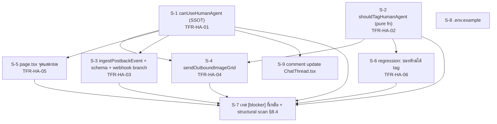

# Scope Baseline — feature 00043 Facebook Human Agent (กอง 1 + กอง 2)

> **สถานะ:** `ACTIVE`
> **Gate 2 Sign-off status:** `SIGNED-OFF` (2026-08-11 โดย `safepay-product` — scope audit = PASS ไม่มี CREEP/GAP, DoD §9 ผ่านครบยกเว้น retro ที่ทำต่อหลัง Gate 2 ตาม workflow)
> **Phase:** Implementation — กอง 1 (แก้บั๊ก postback) + กอง 2 (allow-list + ความสม่ำเสมอของด่านนโยบาย) — **ไม่รวมกอง 3** (เปิดสวิตช์ใหญ่ รอ Meta App Review)
> **วันที่ตั้ง baseline:** 2026-08-10
> **เจ้าของ scope:** `safepay-product` (Gate 0 ของ skill `agent-team-phase`)
> **แหล่งงานหลัก (ห้ามขยายเกิน):** `docs/20 - Features/00043 - Facebook Human Agent/SDS.md` §3 Component Design + §10 ลำดับ build
> **เอกสารอ้างอิงครบชุด:** PRD v1.0 (BR-HA-01..14, Roadmap §11.2) · BRD v1.0 (FR-HA-01..11) · SRS v1.0 (TFR-HA-01..06, NFR §6) · SDS v1.0 (TD-HA-01..04, §7 error-mapping, §8 แผนเทส) · DATABASE v1.0 (ไม่มี migration) · API v1.0 (ไม่มี endpoint ใหม่) · TestCase v1.0 (37 test case — ครอบทั้ง 3 กอง แต่ phase นี้ทำตามเฉพาะเคสของกอง 1+2)

---

## 🔒 ข้อเท็จจริงล่าสุดจากโค้ด (rebase onto origin/main แล้ว — ใช้เลขบรรทัดนี้ ไม่ใช่เลขในเอกสาร 00043)

`origin/main` ล้ำหน้าจากตอนเขียนเอกสาร 00043 ไป 13 คอมมิตจากงาน 00025 (LINE) และแตะไฟล์เป้าหมายของ phase นี้พอดี:

| สิ่งที่อ้างในเอกสาร | เลขบรรทัดในเอกสาร (ล้าสมัย) | เลขบรรทัดจริงบน `origin/main` (ใช้ค่านี้) |
|---|---|---|
| `isHumanAgentEnabled()` | 105 | `channel-chat.service.ts:110` |
| `getWindowState` | — | `channel-chat.service.ts:114` |
| `sendOutboundImageGrid` (จุดเริ่มฟังก์ชัน) | 2336 | `channel-chat.service.ts:2313` |
| `sendOutboundImageGrid` จุดตัดสิน tag | 2339-2341 | `channel-chat.service.ts:2345` |
| `sendOutboundMessage` (จุดเริ่มฟังก์ชัน) | 2965 | `channel-chat.service.ts:2898` |
| `sentByHuman` ใน `sendOutboundMessage` | — | `channel-chat.service.ts:2987` |
| `sendOutboundMessage` จุดตัดสิน tag | — | `channel-chat.service.ts:2993` |
| `page.tsx` จุดแสดงผล | 558-561 | `inbox/[conversationId]/page.tsx:594` |
| `page.tsx` import | — | `:53` |
| `webhook-types.ts` มี field `postback` ไหม | — | **ยังไม่มี ✓** (ตรงกับที่เอกสารสมมติ) |
| จุดเรียก `isHumanAgentEnabled()` ทั้งระบบ | 3 จุด | **ยืนยันแล้ว 3 จุดเป๊ะ ✓** ไม่มีจุดที่ 4 แอบโผล่จาก 00025 |

**developer ที่รับ dispatch ต้องใช้เลขบรรทัดในตารางนี้เป็นจุดอ้างอิง ไม่ใช่เลขในเอกสาร SRS/SDS 00043** (เอกสารเหล่านั้นเขียนก่อน rebase — เนื้อหาตรรกะยังถูกต้อง มีแค่เลขบรรทัดขยับ)

### 🛑 พบใหม่ ไม่มีในเอกสาร 00043 — ตัดสินแล้ว: **นอกขอบเขต (ดู OOS-13)**

`sentByHuman = params.actorUserId !== null && !params.autoReplyKind` เขียนซ้ำเป็น **จุดที่ 3** ที่
`channel-chat.service.ts:2730` ในเส้นทางส่งของ **LINE** (มาจากงาน 00025 ที่เพิ่ง merge) — นิพจน์หน้าตา
เหมือนกันกับของ Messenger/IG เป๊ะ แต่เป็นคนละกฎธุรกิจ: ฝั่ง LINE ตัวแปรนี้ตัดสิน fallback
reply-token→push (BR-LINE-18 ของ 00025) ไม่มีแนวคิด `HUMAN_AGENT` เกี่ยวข้องเลย — เป็นความ
บังเอิญของโครงสร้างโค้ด ไม่ใช่นิยามเดียวกันที่ควรมี SSOT ร่วม

**เหตุผลที่ไม่รับเข้า scope รอบนี้:** ฟีเจอร์ 00043 ทั้งฉบับ (PRD/BRD/SRS/SDS) ไม่มี BR/FR/TFR ข้อไหน
พูดถึง LINE เลยสักคำ (PRD §5 ระบุ LINE เป็น Out of Scope ตรง ๆ ด้วยเหตุผลคนละโปรโตคอล) — การไปแตะ
`channel-chat.service.ts:2730` เพื่อ "รวม SSOT" จะเป็นการรีแฟกเตอร์ระบบ LINE ที่เพิ่ง merge สด ๆ
โดยไม่มี FR รองรับ, ไม่มีเทส regression ของ LINE อยู่ใน TestCase.md ของ 00043 เลย และเสี่ยงพัง
BR-LINE-18 ที่เพิ่งผ่าน Gate ของ phase 00025 มา — เข้าเกณฑ์ CREEP ตรงตัว (HR16 smell จริง แต่คนละ
priority จากการแก้ scope นี้)

**บันทึกเป็นหนี้:** ดู D-01 ในหมวด Debt ด้านล่าง — เสนอให้พิจารณาเป็น task แยกภายใต้ชื่อ
"รวม `sentByHuman` เป็น shared helper ข้าม provider" โดยต้องมี FR/BR ของตัวเองก่อน ไม่ใช่ทำเงียบ ๆ
ระหว่างแก้ 00043

---

## 1. Goal ของ phase

เปิดสิทธิ์ให้พนักงานร้านตอบลูกค้า Facebook/Instagram ที่เงียบไปเกิน 24 ชั่วโมง (สูงสุด 7 วัน) ได้จริง
บน prod สำหรับบัญชีทดสอบที่กำหนดไว้ล่วงหน้าเท่านั้น (allow-list, fail-closed) พร้อมปิดบั๊กที่ทำให้
หน้าต่างเวลาแคบกว่าที่ Meta อนุญาตจริง (`postback` ไม่ยืดหน้าต่าง) และทำให้ทุกช่องทางส่งข้อความออก
ใช้กติกา "คนพิมพ์เองเท่านั้น" ชุดเดียวกันอย่างสม่ำเสมอ — โดย**ไม่เปิดสวิตช์ให้ลูกค้าทั่วไปใช้ได้**
(กอง 3 รอ Meta App Review อนุมัติก่อนเสมอ)

---

## 2. In-Scope — S-id list

> **กติกา CREEP:** ทุก commit ของ phase นี้ต้อง map กับ S-id อย่างน้อย 1 ตัว ไม่ map = CREEP (hard block)

### Dependency overview

> **หมายเหตุ dependency:** S-1/S-2/S-3 ทั้งสามตัวแก้ `channel-chat.service.ts` ไฟล์เดียวกัน — แม้
> S-3 จะไม่พึ่งพา S-1/S-2 ทาง logic (SDS §10 บอกว่า "ขนานได้") แต่ **ต้อง serialize** เพราะเป็นไฟล์
> เดียวกัน (กันการ dev คนละคนแก้ไฟล์เดียวกันพร้อมกัน — กฎเดิมของโปรเจกต์). S-4/S-5 คนละไฟล์กันหลัง
> S-1/S-2 เสร็จแล้ว จึงขนานกันได้จริง (`channel-chat.service.ts` vs `page.tsx`)

---

### S-1 — `canUseHumanAgent(externalUserId)` — SSOT สิทธิ์ Human Agent ต่อ PSID

| หัวข้อ | รายละเอียด |
|---|---|
| **ทำ** | rename `isHumanAgentEnabled()` → `canUseHumanAgent(externalUserId: string \| null \| undefined): boolean` ใน `channel-chat.service.ts:110` — เพิ่ม logic: (1) `META_HUMAN_AGENT_ENABLED==='true'` → `true` ทันที ไม่ต้องพึ่ง allow-list (2) ไม่มี `externalUserId` → `false` (3) parse `META_HUMAN_AGENT_TEST_PSIDS` (split `,` → trim → filter(Boolean)) → `.includes()` · อัปเดต call site ที่ 1 ใน 3 จุด: `sendOutboundMessage` (`:2993`) |
| **ไม่ทำ** | ห้ามแก้ signature ของ `sendOutboundMessage` เพิ่มเติมนอกจากเปลี่ยนชื่อฟังก์ชันที่เรียก · ห้ามเปลี่ยนพฤติกรรม throw `WINDOW_CLOSED` เดิม (ยังต้อง throw เมื่อ `!sentByHuman` และหน้าต่างปิด — ไม่เปลี่ยน) |
| **FR/BR** | BR-HA-05/06/07/08/09, FR-HA-03/04/05/06/07 |
| **T map** | TFR-HA-01 |
| **ไฟล์** | `src/services/channel-chat.service.ts` |
| **Acceptance (ทดสอบได้)** | `rg "isHumanAgentEnabled" src/` → **0 ผลลัพธ์** (rename หมดทุกจุด) · `canUseHumanAgent` คืน `boolean` เท่านั้น ไม่ throw ไม่ว่า input จะเป็นอะไร (พิสูจน์ใน S-7 §8.1) |
| **user-facing** | ไม่ (ยังปิดสวิตช์อยู่บน prod) |
| **เจ้าของ** | `safepay-developer` |

---

### S-2 — `shouldTagHumanAgent(...)` — pure function แยกเงื่อนไข boolean

| หัวข้อ | รายละเอียด |
|---|---|
| **ทำ** | เพิ่มฟังก์ชัน `shouldTagHumanAgent({windowOpen, sentByHuman, eligible, humanAgentWindowOpen}): boolean` ใน `channel-chat.service.ts` (ไฟล์เดียวกับ S-1) — `if(windowOpen) return false; if(!sentByHuman) return false; return eligible && humanAgentWindowOpen` · แทนที่เทอร์นารีเดิมที่ `sendOutboundMessage:2993` ด้วยการเรียกฟังก์ชันนี้ |
| **ไม่ทำ** | ห้ามแก้เงื่อนไข throw `WINDOW_CLOSED` — คนละ concern จาก "จะติด tag ไหม" (SRS TFR-HA-02 ระบุชัด) |
| **FR/BR** | FR-HA-10/11, BR-HA-13/14 + `docs/conventions/ui-boolean-needs-a-testable-home.md` |
| **T map** | TFR-HA-02 |
| **ไฟล์** | `src/services/channel-chat.service.ts` |
| **Acceptance** | export เดี่ยว ใช้ import ตรงในเทส (S-7 §8.2) — ไม่มี logic นี้ฝังในเทอร์นารีที่ `sendOutboundMessage`/`sendOutboundImageGrid` อีกต่อไป (`rg "windowState.humanAgentOpen" src/services/channel-chat.service.ts` ต้องเจอเฉพาะภายใน `shouldTagHumanAgent` + จุดคำนวณ `windowState` เอง ไม่ใช่ในเทอร์นารีกระจาย) |
| **user-facing** | ไม่ |
| **เจ้าของ** | `safepay-developer` |

---

### S-3 — `ingestPostbackEvent` + field `postback` ใน schema + webhook route branch

| หัวข้อ | รายละเอียด |
|---|---|
| **ทำ** | (1) `webhook-types.ts::MessagingEventSchema` เพิ่ม `postback: v.optional(v.object({title: v.optional(v.string()), payload: v.optional(v.string()), referral: v.optional(ReferralSchema)}))` (ทุก sub-field optional ตาม TD-HA-03) (2) `channel-chat.service.ts::ingestPostbackEvent({provider, pageExternalId, contactExternalId, timestamp?})` — ต้นแบบ `ingestReadEvent`/`ingestReactionEvent`: หา channel → guard `contactExternalId===pageExternalId` (BR-HA-11) → หา `ExternalContact` ที่มีอยู่ก่อน (ไม่สร้างใหม่ — TD-HA-01) → หา `Conversation` ที่มีอยู่ก่อน → `updateMany` ด้วย `WHERE OR [{lastInboundAt:null},{lastInboundAt:{lt:at}}]` (BR-HA-04 กันดันเวลาถอยหลัง) — ไม่ throw ในเส้นทางปกติ ไม่สร้าง `ChatMessage`/`Notification` (3) webhook route เพิ่ม branch `else if (event.postback)` ก่อน branch `pass_thread_control` เรียก `ingestPostbackEvent` |
| **ไม่ทำ** | ห้ามสร้าง `ExternalContact`/`Conversation` ใหม่จาก postback ที่ไม่มีเธรดมาก่อน (TD-HA-01) · ห้ามบังคับ sub-field ใดของ `postback` เป็นค่าจำเป็น (TD-HA-03) · ห้ามเขียน `ChatMessage`/noti ใด ๆ |
| **FR/BR** | FR-HA-08/09, BR-HA-10/11/12 |
| **T map** | TFR-HA-03 |
| **ไฟล์** | `src/lib/facebook/webhook-types.ts`, `src/app/api/channels/facebook/webhook/route.ts`, `src/services/channel-chat.service.ts` |
| **Acceptance** | S-7 §8.3 (6 เคส รวม 1 blocker) ผ่านทั้งหมด · webhook ยังตอบ `200 {ok:true}` เสมอไม่ว่ากรณีใด · event ที่มาทาง `standby` ทำงานเหมือนไม่ใช่ standby ทุกประการ (BR-HA-12) |
| **user-facing** | ทางอ้อม (เธรดที่ลูกค้ากดปุ่มจะอยู่ในหน้าต่างเปิดถูกต้อง — QA ต้องเห็นจริงผ่าน dev DB fixture) |
| **เจ้าของ** | `safepay-developer` |

---

### S-4 — `sendOutboundImageGrid` ใช้ SSOT + เลิก throw `WINDOW_CLOSED` ก่อนลอง

| หัวข้อ | รายละเอียด |
|---|---|
| **ทำ** | แทนที่ branch เดิมที่ `channel-chat.service.ts:2345` (`if(!windowState.open){ if(isHumanAgentEnabled()&&windowState.humanAgentOpen) tag='HUMAN_AGENT'; else throw Error('WINDOW_CLOSED') }`) ด้วยเรียก `shouldTagHumanAgent({windowOpen, sentByHuman:true, eligible:canUseHumanAgent(...), humanAgentWindowOpen})` — **ถอด throw `WINDOW_CLOSED` ออกทั้งหมด** ปล่อยให้พยายามส่งเสมอแล้วให้ Meta ตัดสิน (BR-HA-14, สอดคล้องมติ 2026-08-03 ของ `sendOutboundMessage`) |
| **ไม่ทำ** | ห้ามแตะ guard เดิม (`canAccessShop`/`NOT_EXTERNAL_CHANNEL`/`CHANNEL_NOT_ACTIVE`/`IMAGE_GRID_COUNT_OUT_OF_RANGE`) · ห้ามเพิ่ม parameter ใหม่ (`systemShopId`/`autoReplyKind`) ตาม TD-HA-04 — `sentByHuman` hardcode `true` เพราะไม่มี caller อัตโนมัติเรียกฟังก์ชันนี้เลย |
| **FR/BR** | FR-HA-10/11, BR-HA-13/14 |
| **T map** | TFR-HA-04 |
| **ไฟล์** | `src/services/channel-chat.service.ts` |
| **Acceptance** | เมื่อหน้าต่างปิด+ไม่มีสิทธิ์ → ยิงไปแบบไม่ติด tag ให้ Meta ปฏิเสธ → catch เดิม fallback ส่งทีละใบผ่าน `sendOutboundMessage` ทำงานเหมือนเดิม (path ไม่แตะ) → บันทึก `deliveryStatus=FAILED` พร้อมเหตุผลให้เห็นในเธรด · ยืนยันจาก SDS §7 ว่า route (`mapChatServiceError`) ไม่มี branch พิเศษผูกกับ `WINDOW_CLOSED` เฉพาะเส้นทาง `IMAGE_GRID` — ต้อง grep ยืนยันซ้ำหลัง diff จริงก่อนปิดงาน (เลขบรรทัดอาจขยับจาก rebase) |
| **user-facing** | ใช่ (ปุ่มส่งชุดรูปภาพในเธรด — ผลลัพธ์ error message เปลี่ยนจาก `409 WINDOW_CLOSED` ทันที → พยายามส่งก่อน อาจได้ `502 SEND_FAILED` แทน) |
| **Dependency** | S-1, S-2 |
| **เจ้าของ** | `safepay-developer` |

---

### S-5 — `inbox/[conversationId]/page.tsx` จุดแสดงผลแถบสถานะ ใช้ SSOT เดียวกับจุดส่งจริง

| หัวข้อ | รายละเอียด |
|---|---|
| **ทำ** | แก้ `page.tsx:594` จาก `isHumanAgentEnabled() && windowState.humanAgentOpen` → `canUseHumanAgent(conversation.externalContact?.externalUserId ?? null) && windowState.humanAgentOpen` — ต้อง `?? null` เพราะเธรด `channel==='DEEP'` ไม่มี `externalContact` |
| **ไม่ทำ** | ห้ามเปลี่ยน prop `humanAgentOpen`/`humanAgentExpiresAt` ที่ส่งต่อให้ component ลูก (สัญญาเดิมของ 00018 ที่ต่อสายไว้ครบแล้ว — ไม่มี UI ใหม่) |
| **FR/BR** | FR-HA-07, BR-HA-09 |
| **T map** | TFR-HA-05 |
| **ไฟล์** | `src/app/(paces)/seller/(chat)/inbox/[conversationId]/page.tsx` |
| **Acceptance** | เธรดที่คู่สนทนาอยู่ใน allow-list ต้องเห็นแถบ "เกิน 24 ชม. แต่ยังตอบเองได้ถึง [วันที่]" — เธรดที่ไม่อยู่ต้องเห็นข้อความทั่วไปแบบเดิม (BRD FR-HA-07 AC) — พิสูจน์ผ่าน S-7 §8.4 structural scan (ยืนยันว่าเรียก SSOT ตัวเดียวกับจุดส่ง ไม่ใช่แค่ manual QA) |
| **user-facing** | ใช่ — แถบสถานะเธรด |
| **Dependency** | S-1 |
| **เจ้าของ** | `safepay-developer` |

---

### S-6 — เทส regression: บอท/AI ห้ามได้ tag `HUMAN_AGENT` เด็ดขาด

| หัวข้อ | รายละเอียด |
|---|---|
| **ทำ** | เพิ่มเคส `[blocker]` ใน `human-agent-tag-decision.test.ts` (ไฟล์เดียวกับ S-2): `windowOpen=false, sentByHuman=false, eligible=true, humanAgentWindowOpen=true` → ต้องคืน `false` เสมอ — พิสูจน์ด้วย mutation: สลับ `if(!sentByHuman) return false` เป็น `if(sentByHuman)` → เทสต้องแดง |
| **ไม่ทำ** | ห้ามผ่อนเงื่อนไขนี้ไม่ว่ากรณีใด (BR-HA-02/13 — "ห้ามส่งนอกหน้าต่าง 24 ชม.เด็ดขาด ไม่มีข้อยกเว้น" แม้ allow-list จะระบุ PSID นั้นก็ตาม) |
| **FR/BR** | FR-HA-10, BR-HA-02/13 |
| **T map** | TFR-HA-06 |
| **ไฟล์** | `src/services/__tests__/human-agent-tag-decision.test.ts` |
| **Acceptance** | เทสนี้แดงเมื่อ mutate เงื่อนไข `!sentByHuman` — ยืนยันจริงด้วยการรัน mutation แล้วดู fail ก่อน revert (ไม่ใช่แค่เขียนเทสให้เขียว) |
| **user-facing** | ไม่ (เป็นตัวกันความเสี่ยงสูงสุดของ phase — ถ้าพลาดคือแอปเสี่ยงถูก Meta ระงับ) |
| **Dependency** | S-2 |
| **เจ้าของ** | `safepay-developer` |

---

### S-7 — เทส `[blocker]` ที่เหลือ (SDS §8.1/§8.3/§8.2#5) + structural scan §8.4

| หัวข้อ | รายละเอียด |
|---|---|
| **ทำ** | (1) `human-agent-eligibility.test.ts` — 7 เคสของ `canUseHumanAgent` (§8.1) รวม blocker #3 (fail-closed เมื่อ env ว่างทั้งคู่) (2) `channel-chat-postback.test.ts` — 6 เคสของ `ingestPostbackEvent` (§8.3, mock Prisma) รวม blocker #4 (postback ห้ามดันเวลาถอยหลัง — พิสูจน์ที่ระดับ `WHERE` clause) (3) เคส blocker #5 ของ §8.2 (`eligible=true, humanAgentWindowOpen=false` → ยังคืน `false` — allow-list ไม่ข้ามกฎ 7 วัน) เพิ่มใน `human-agent-tag-decision.test.ts` เดียวกับ S-2/S-6 (4) `human-agent-window-display-parity.test.ts` — grep-based scan สแกน `src/` หา call site ของ `canUseHumanAgent` ต้องได้ **3 จุดเป๊ะ** (`sendOutboundMessage`, `sendOutboundImageGrid`, `page.tsx`) — scan source ไม่ hardcode รายชื่อไฟล์ |
| **ไม่ทำ** | ห้ามแตะ DB จริง (Hard Rule 13 — pure-function unit test หรือ mock Prisma เท่านั้น) |
| **FR/BR** | ครอบ FR-HA-03..07, BR-HA-04/07/08/09 |
| **T map** | TFR-HA-01, TFR-HA-03 (บล็อกเกอร์ที่เหลือ) |
| **ไฟล์** | `src/services/__tests__/human-agent-eligibility.test.ts`, `src/services/__tests__/channel-chat-postback.test.ts`, `src/services/__tests__/human-agent-tag-decision.test.ts` (เพิ่มเคส), `src/services/__tests__/human-agent-window-display-parity.test.ts` |
| **Acceptance** | 4 เทส `[blocker]` ตาม SDS §8 (บอทห้ามได้ tag [S-6], fail-closed เมื่อ env ว่าง, postback ห้ามดันเวลาถอยหลัง, allow-list ไม่ข้ามกฎ 7 วัน) ต้องพิสูจน์ด้วย mutation ครบทั้ง 4 · structural scan ได้ผล = 3 จุดเป๊ะ |
| **user-facing** | ไม่ |
| **Dependency** | S-1, S-2, S-3, S-4, S-5, S-6 |
| **เจ้าของ** | `safepay-developer` (+ `safepay-qa` รันยืนยันซ้ำ) |

---

### S-8 — `.env.example` เพิ่ม `META_HUMAN_AGENT_ENABLED` + `META_HUMAN_AGENT_TEST_PSIDS`

| หัวข้อ | รายละเอียด |
|---|---|
| **ทำ** | เพิ่ม section ใหม่ใน `.env.example` (ต่อจาก `feature 00018 Facebook/IG chat`) พร้อมคอมเมนต์อธิบาย: `META_HUMAN_AGENT_ENABLED` (kill switch ใหญ่ — ค่าว่าง/ไม่ตั้ง = ปิดสนิท, `'true'` เท่านั้นที่เปิด) และ `META_HUMAN_AGENT_TEST_PSIDS` (allow-list คั่นด้วย `,` — PSID/IGSID ไม่ใช่เพจ) — ปิดหนี้ที่สืบทอดจาก 00018 |
| **ไม่ทำ** | ห้ามใส่ค่าจริงของ prod ลงไฟล์นี้ (เป็น placeholder เท่านั้น ตาม pattern เดิมของไฟล์) |
| **FR/BR** | BR-HA-08 |
| **T map** | (เอกสารประกอบ SRS §1.2) |
| **ไฟล์** | `.env.example` |
| **Acceptance** | ตัวแปรทั้งสองปรากฏใน `.env.example` พร้อมคอมเมนต์อธิบาย fail-closed behavior |
| **user-facing** | ไม่ |
| **เจ้าของ** | `safepay-developer` |

---

### S-9 — คอมเมนต์ที่ `ChatThread.tsx` อ้างชื่อ env เดิม

| หัวข้อ | รายละเอียด |
|---|---|
| **ทำ** | อัปเดตคอมเมนต์ที่อ้างว่า "สวิตช์ใหญ่ยังเป็นเหตุผลหนึ่งที่ `humanAgentOpen=false` ได้" — เติม "หรือ PSID ไม่อยู่ใน allow-list" ให้ตรงกับ logic ใหม่ของ S-1 |
| **ไม่ทำ** | **ไม่แก้ logic ใด ๆ ใน `ChatThread.tsx`** — component ลูกรับ `humanAgentOpen`/`humanAgentExpiresAt` เป็น prop ที่ต่อสายไว้ครบแล้วจาก 00018 |
| **FR/BR** | (เอกสารประกอบ) |
| **T map** | (SRS §2.2 องค์ประกอบหลัก — แถว `ChatThread.tsx`) |
| **ไฟล์** | `src/app/(paces)/seller/(chat)/inbox/**/ChatThread.tsx` (ยืนยันเลขบรรทัดจริงก่อนแก้ — อาจขยับจาก rebase เหมือนไฟล์อื่น) |
| **Acceptance** | คอมเมนต์อ่านแล้วตรงกับพฤติกรรมจริงของ `canUseHumanAgent` — ไม่มีการอ้างชื่อฟังก์ชัน `isHumanAgentEnabled` ที่ถูก rename ไปแล้วหลงเหลืออยู่ |
| **user-facing** | ไม่ |
| **Dependency** | S-1 |
| **เจ้าของ** | `safepay-developer` |

---

## 3. Mapping table — TFR-HA-01..06 ↔ S-id

| TFR (SRS) | S-id | Coverage |
|---|---|---|
| TFR-HA-01 | S-1 | 1:1 |
| TFR-HA-02 | S-2 | 1:1 |
| TFR-HA-03 | S-3 | 1:1 |
| TFR-HA-04 | S-4 | 1:1 |
| TFR-HA-05 | S-5 | 1:1 |
| TFR-HA-06 | S-6 | 1:1 |
| (เอกสาร/เทสเสริม) | S-7, S-8, S-9 | ไม่มี T map ตรง — auxiliary ตาม scope ที่ Controller ระบุ |

TFR ที่ map ไม่ได้: **0 รายการ**

---

## 4. Out-of-Scope ของ phase นี้

> แตะของในนี้ = **CREEP (hard block)**. ถ้าจำเป็นต้องทำ → Controller ตัดสิน + ย้ายขึ้น In-Scope พร้อมจด Change Log

### 4.1 ยกจาก PRD §5 / SRS §1.2

| ID | รายการ | เหตุผล |
|---|---|---|
| OOS-01 | **กอง 3 — เปิด `META_HUMAN_AGENT_ENABLED=true` บน prod จริง** | รอ Meta App Review อนุมัติสิทธิ์ `human_agent` ก่อนเท่านั้น — ไม่มีโค้ดใหม่ต้องเขียนตอนนั้นด้วยซ้ำ (แค่ flip env + deploy) |
| OOS-02 | **`messaging_optins` (Send-to-Messenger / Checkbox plugin)** | ไม่มีร้านใดใช้ปลั๊กอินนี้ — ไม่ subscribe ทั้งสองชั้น ไม่มีโค้ดรับเลย |
| OOS-03 | **LINE** | ไม่มีแนวคิดหน้าต่าง 24 ชม./7 วันแบบนี้ในโปรโตคอล LINE (reply token 60s + push แยกกัน) |
| OOS-04 | **หน้าจอจัดการ allow-list ในแอป** | ตั้งค่าผ่าน environment variable โดยทีมพัฒนาเท่านั้น เป็นกลไกชั่วคราวช่วงทดสอบ |
| OOS-05 | **ปุ่ม/แถบเตือนบอกร้านว่า "ข้อความนี้ใช้สิทธิ์ Human Agent"** | Meta แนบ tag เอง ร้านไม่ต้องรู้ระดับเทคนิคนี้ — แถบสถานะเดิมของ 00018 บอกครบแล้ว |
| OOS-06 | **การแก้ไข/ตามให้ตรงกันใน `deep-mobile-seller`** | known gap G-5 ของ PRD — นอกขอบเขตรอบนี้ |
| OOS-07 | **backfill `docs/SRS.md` ทั้งก้อนของ 00018** | SDS §8.4 ยืนยันแล้วว่าเป็นหนี้เดิมที่สืบทอดมาก่อนฟีเจอร์นี้ — บันทึกเป็น debt (D-02) |
| OOS-08 | **UI ใหม่ใด ๆ** | ใช้แถบสถานะเดิมของ 00018 ที่ต่อสาย `humanAgentOpen`/`humanAgentExpiresAt` ครบแล้ว — S-9 แก้แค่คอมเมนต์ ไม่ใช่ UI |
| OOS-09 | **ส่งเนื้อหาการตลาด/โปรโมชันผ่านสิทธิ์ Human Agent** | ผิดวัตถุประสงค์ของสิทธิ์นี้ตามนโยบาย Meta |
| OOS-10 | **cross-channel identity merge / รวมโปรไฟล์ลูกค้าข้ามช่องทาง** | ไม่เกี่ยวข้องกับฟีเจอร์นี้เลย |

### 4.2 เพิ่มจากการอ่าน SRS/SDS/DATABASE

| ID | รายการ | เหตุผล |
|---|---|---|
| OOS-11 | **Migration / ตาราง-คอลัมน์ใหม่ใน Prisma** | DATABASE.md ยืนยันแล้วว่าไม่มีการเปลี่ยน schema |
| OOS-12 | **REST endpoint ใหม่** | SRS §4 ยืนยันว่าไม่มี endpoint ใหม่ |
| OOS-13 | **รวม `sentByHuman` ของ LINE (`channel-chat.service.ts:2730`) เข้า SSOT เดียวกับ Messenger/IG** | พบระหว่าง rebase — คนละกฎธุรกิจ (BR-LINE-18 vs BR-HA-13), ไม่มี FR/BR ของ 00043 ครอบ, เสี่ยงพัง regression ของ 00025 ที่เพิ่ง merge — ดู D-01 |
| OOS-14 | **แก้ `sentByHuman` definition เดิม (`actorUserId !== null && !autoReplyKind`)** | SRS TFR-HA-06 ระบุชัดว่า "ไม่เปลี่ยนพฤติกรรม" — เพิ่มแค่ regression test |
| OOS-15 | **การเปิดปุ่ม/quick reply ใหม่ หรือแก้ persistent menu ของเพจ** | ฟีเจอร์นี้แค่ *รับ* event `postback` ที่มีอยู่แล้ว ไม่สร้างปุ่มใหม่ |
| OOS-16 | **แก้ `graph.ts` (Meta Send API call)** | SDS §5 ยืนยันว่าบรรทัด 605/640 ไม่แตะ — ฟีเจอร์นี้แค่เปลี่ยนค่า `tag` ที่ส่งเข้าไป |
| OOS-17 | **subscribe/แก้ webhook field เพิ่มเติมใน App Dashboard หรือ `MESSENGER_SUBSCRIBED_FIELDS`** | SRS §8.1 ยืนยันแล้วว่า `messaging_postbacks` subscribe ครบ 2 ชั้นอยู่แล้ว |
| OOS-18 | **แก้ `docs/SRS.md`/`DATABASE.md`/`API.md` เกินขอบเขต doc-fix ที่ระบุใน §6 Debt** | freeze contract ของ feature — แก้เพิ่มต้องผ่าน Controller |
| OOS-19 | **แตะโค้ด 00018/00023/00025 นอกเหนือจาก 4 ไฟล์ที่ S-1..S-5 ระบุไว้** | ระบบ production ที่ร้านใช้ทุกวัน — แตะเกินรายการ = ความเสี่ยงที่ไม่ได้ประเมิน |

---

## 5. Assumptions

- **A-01:** `origin/main` ที่ branch นี้ rebase มาคือฐานล่าสุด (13 คอมมิตจาก 00025) — เลขบรรทัดในหัวข้อ
  "🔒 ข้อเท็จจริงล่าสุดจากโค้ด" ด้านบนคือค่าที่ใช้ dispatch developer ไม่ใช่เลขในเอกสาร SRS/SDS
- **A-02:** ไม่มีการ merge ใหม่เข้า `main` ระหว่าง phase นี้ที่แตะ `channel-chat.service.ts`/
  `webhook-types.ts`/webhook route/`page.tsx` อีก — ถ้ามี ต้อง rebase ซ้ำและตรวจ diff ของอีกฝั่งก่อน
  (`docs/conventions/rebase-clean-is-not-safe.md`, Hard Rule 17) เพราะไฟล์เหล่านี้เพิ่งพิสูจน์แล้วว่า
  ถูกแตะพร้อมกันได้จริง (LINE)
- **A-03:** เทส `[blocker]` ทั้ง 4 ตัวใน S-6/S-7 พิสูจน์ด้วย unit test (pure function/mock Prisma) พอ —
  ไม่ต้องมี integration test ยิง Meta จริงใน phase นี้ (การพิสูจน์กับ Meta จริงคือ Test Plan §11.3 ของ
  PRD ซึ่งเป็นงานปฏิบัติการหลัง merge)
- ~~**A-04:** `META_HUMAN_AGENT_ENABLED` มีอยู่แล้วบน Vercel prod แต่ตั้งเป็นค่าว่าง/ไม่ตั้ง (= ปิด)~~
  🛑 **ผิด — แก้ 2026-08-11:** ตรวจด้วย `vercel env ls production` แล้วพบว่า **ไม่เคยถูกตั้งค่าบน prod
  เลยสักครั้ง** ผลลัพธ์ปลายทางเหมือนกัน (fail-closed → ปิดสนิท) แต่ข้อความเดิมสื่อผิดว่ามีการตั้งค่าไว้แล้ว
  ซึ่งจะทำให้คนอ่านคิดว่ามีคนเคยพิจารณาค่านี้มาก่อน — ยังคงเดิม: ห้ามเปิดเป็น `'true'` โดยไม่ผ่าน Controller
- ~~**A-05:** `META_HUMAN_AGENT_TEST_PSIDS` ยังไม่เคยตั้งค่าบน prod~~
  **ล้าสมัย — แก้ 2026-08-11:** ตั้งค่าจริงแล้วบน Vercel production = 3 PSID ของ Sekson Oonnom
  (ครอบ 3 เพจ) + redeploy แล้ว ตาม Test Plan §11.3 ข้อ 1-5 ของ PRD

---

## 6. Deferred → Phase 2 / Debt

> ของที่จงใจไม่ทำใน phase นี้ — **ไม่นับเป็น GAP** ตอน audit/sign-off

| # | รายการ | รายละเอียด | ต้องปิดตอนไหน |
|---|---|---|---|
| D-01 | **`sentByHuman` ของ LINE ที่ `:2730` เขียนซ้ำนิยาม** | HR16 smell จริง — แต่คนละกฎธุรกิจ (BR-LINE-18 vs BR-HA-13) รอ task แยกที่มี FR/BR ของตัวเองก่อนรวม SSOT ข้าม provider (ดู OOS-13) | เมื่อมีคน propose task ใหม่ + ผ่าน Requirement review — ไม่ใช่ระหว่าง 00043 |
| D-02 | **`docs/SRS.md` ไม่มี section ของ 00018/00043 เลย** | SDS §8.4 ระบุรายการที่ต้องเพิ่มเมื่อ backfill: `MessagingEventSchema.postback`, `MESSAGING_WINDOW_MS`/`HUMAN_AGENT_WINDOW_MS`, env vars ทั้งสอง, พฤติกรรมใหม่ของ `POST /api/chat/conversations/[id]/messages` branch `IMAGE_GRID` | Phase ถัดไปที่ backfill SRS ของ 00018 ทั้งก้อน |
| D-03 | **G-1 (Standard Access ≠ Advanced Access ผลอาจต่างกัน)** | ยอมรับความเสี่ยงนี้ระหว่างทดสอบ allow-list — ต้องเฝ้าดูอีกครั้งหลัง Advanced Access ผ่านจริง | หลัง Meta อนุมัติสิทธิ์ (กอง 3) |
| D-04 | **G-2 (นาฬิกา 7 วัน derive จากคอลัมน์เดียวกับ 24 ชม. ยังเป็นข้อสันนิษฐาน)** | ต้องพิสูจน์ระหว่าง Test Plan §11.3 ของ PRD (ข้อ 10) | ระหว่าง Test Plan (หลัง merge, ก่อนยื่น App Review) |
| D-05 | **G-3 (เธรดที่ Meta AI ถือสิทธิ์ `standby`)** | หนี้สืบทอดจาก feature ก่อนหน้า — ฟีเจอร์นี้ไม่ทำให้อาการแย่ลง (`ingestPostbackEvent` รองรับ standby แล้วตาม BR-HA-12) แต่ไม่แก้ | Phase ที่ยังไม่กำหนด — carry ต่อ |
| D-06 | **G-4 (`GRAPH_VERSION='v21.0'` ยังไม่ตรวจ deprecation)** | ควรตรวจ Meta Changelog ก่อนยื่น App Review | ก่อนยื่น App Review (กอง 3) |
| **D-07** | **`(#100) Cannot tag messages with 'HUMAN_AGENT' without prior approval` ถูกจัดเป็น retryable** | ไม่มี rule ผูกกับ error นี้ใน `chat-send-failure.ts` → ตกไปทาง "ไม่รู้จัก" ซึ่ง default `retryable: true` → ผู้ขายเห็นอังกฤษดิบ + ปุ่ม "ลองใหม่" ที่กดกี่ครั้งก็ไม่มีทางผ่านจนกว่า App Review จะอนุมัติ (คลาสเดียวกับ `feedback_retry_must_reread_source_of_truth`) · API.md เขียนไว้เองว่า "ห้ามเดา error code ... ต้อง reproduce กับเพจจริงก่อน" — **ตอนนี้ reproduce ได้แล้ว** เข้าเงื่อนไขที่เอกสารอนุญาต | **กำลังปิดในรอบเดียวกันนี้** (ux gate ผ่านแล้ว 2026-08-11) |
| **D-08** | 🛑 **เส้นทาง Human Agent ไม่ทิ้งร่องรอยให้สืบย้อนหลังในเคสที่สำคัญที่สุด** | ยืนยันกับโค้ดแล้ว 2 ช่องซ้อนกัน: (1) `sendOutboundMessage` ใส่ `messageTag` ลง `rawMessage` **เฉพาะตอนสำเร็จ** (`:3506`) ส่วนตอน **Meta ปฏิเสธ** (`:3494`/`:3496`) บันทึกแค่ `ok:false/httpStatus/code/subcode/error` **ไม่มี `messageTag`** ⇒ เคส "พยายามติด tag แล้วถูกปฏิเสธ" ซึ่งเป็นเคสที่ต้องสืบมากที่สุด คือเคสเดียวที่ไม่มีหลักฐาน (2) `sendOutboundImageGrid::createMany` **ไม่มี field `rawMessage` เลย** ⇒ กริดรูปที่ส่งด้วยสิทธิ์นี้สืบไม่ได้ทั้งหมด | **ต้องปิดก่อนกอง 3** — เป็น audit trail เดียวที่มี ถ้า Meta ทักว่ามีการละเมิดนโยบายแล้วสืบไม่ได้ว่าร้านไหน/ข้อความไหน จะตอบ Meta ไม่ได้เลย |
| **D-09** | **ไม่มีด่านตรวจว่าเนื้อหาที่ร้านพิมพ์เป็นโปรโมชันหรือไม่** | มีแค่ข้อความเตือนบน UI (`ChatThread.tsx:1761`) ซึ่งบังคับอะไรไม่ได้ · PRD §6.1 ให้ความเสี่ยงนี้ระดับ "สูง — Meta อาจระงับแอปทั้งระบบ" แต่ mitigation ที่เขียนไว้ ("UI เตือน") ไม่ใช่ด่านจริง · ทางเลือก: (A) keyword blocklist — false positive/negative สูงทั้งคู่ (B) manual audit หลังส่ง — **ทำไม่ได้จนกว่าจะปิด D-08** (C) รับความเสี่ยงในสเกลปัจจุบัน | **ตอนนี้ยังไม่ต้องปิด** (allow-list มีแค่ 3 PSID ของทีมเอง blast radius เล็ก) · **ต้องมีอย่างน้อย (B) ก่อนกอง 3** ซึ่งแปลว่าต้องปิด D-08 ก่อน |

---

## 7. ข้อจำกัดของ phase นี้ที่ทีมต้องรู้

1. **ไม่มี `.env.local` ในเวิร์กทรีนี้** → `tsc`/`npm test`/`npm run build` ต้องใช้ env dummy เท่านั้น —
   **ห้าม symlink `.env.local` ของ prod/worktree อื่นเข้ามา** (worktree อื่นมี DB คนละตัว — ผสมกันแล้ว
   พิสูจน์อะไรไม่ได้จริง)
2. **Vercel Preview ของโปรเจกต์นี้ใช้ไม่ได้จริง** — ไม่มี `DATABASE_URL` ที่ระดับ Preview → build ทุก
   branch ล้มมาตลอด (memory `project_vercel_preview_missing_database_url`) แปลว่า **การทดสอบจริง
   ของ phase นี้ = merge เข้า `main` แล้ว push = deploy prod จริงทันที** ไม่มีทางกลาง
3. **user เป็นคนทำ visual/browser QA เองบน prod** (memory `feedback_user_does_visual_qa`) ยกเว้นเทส
   `[blocker]` ที่เป็น unit/mock (S-6/S-7) ซึ่งต้องรันเองให้แดง/เขียวจริงก่อนปิดงาน
4. **ยังพิสูจน์อะไรกับ Meta จริงไม่ได้จนกว่าจะทำ Test Plan (PRD §11.3)** — S-1..S-9 ทั้งหมดคือการเตรียม
   โค้ดให้พร้อม ไม่ใช่การพิสูจน์ว่า Meta ยอมรับ tag `HUMAN_AGENT` จริง
5. **เลขบรรทัดในเอกสาร SRS/SDS/BRD ของ 00043 ล้าสมัยหลัง rebase** — ใช้ตารางในหัวข้อ "🔒 ข้อเท็จจริง
   ล่าสุดจากโค้ด" ด้านบนของ baseline นี้เป็นหลัก

---

## 8. เหตุผลที่ deploy ตรงเข้า prod ยอมรับได้สำหรับ phase นี้

- **Blast radius เมื่อ env ไม่ตั้ง (สถานะปัจจุบันบน prod):** `canUseHumanAgent` คืน `false` เสมอ
  (fail-closed, BR-HA-07) → พฤติกรรมของระบบ**เหมือนวันนี้เป๊ะ** สำหรับลูกค้าทุกคนที่ไม่อยู่ใน
  allow-list (ซึ่งคือทุกคน เพราะ allow-list ยังไม่เคยถูกตั้งค่า)
- **เธรดที่พ้น 24 ชม. ทุกวันนี้ก็ส่งไม่ได้อยู่แล้ว** — S-1/S-2/S-4/S-5 ไม่ได้เปิดความสามารถใหม่ให้
  ลูกค้าทั่วไป มันแค่เปลี่ยน "ใครมีสิทธิ์คำนวณอย่างไร" โดยผลลัพธ์เท่าเดิมจนกว่าจะมีคนตั้ง
  `META_HUMAN_AGENT_TEST_PSIDS`
- **postback (S-3) มีแต่ทำให้หน้าต่างเปิดถูกต้องขึ้น** — เดิม event นี้ถูกละเลย (`IGNORED`) ทำให้
  หน้าต่างแคบกว่าที่ Meta อนุญาตจริง; S-3 แก้ให้ตรงกับพฤติกรรมที่เอกสาร Meta ระบุไว้อยู่แล้ว ไม่มี
  ทางทำให้หน้าต่าง**แคบลง**กว่าเดิม ความเสี่ยงคือ "ยืดผิดจังหวะ" ไม่ใช่ "ยืดเกินสิทธิ์ที่ Meta อนุญาต"
- **`sendOutboundImageGrid` (S-4) เปลี่ยนจาก block-ก่อน → พยายามส่งแล้วให้ Meta ตัดสิน** — worst case
  คือ Meta ปฏิเสธเหมือนเดิม (กลายเป็น `502 SEND_FAILED` แทน `409 WINDOW_CLOSED`) ไม่มี path ไหนที่ทำให้
  ข้อความหลุดออกไปโดยไม่มีสิทธิ์จริง เพราะ Meta คือด่านสุดท้ายเสมอ

**สัญญาณที่ต้อง revert ทันที:**
1. `rg "isHumanAgentEnabled" src/` เจอผลลัพธ์ที่ไม่ใช่ 0 หลัง merge (แปลว่า rename ไม่ครบ — จุดเก่า
   จุดใหม่ตัดสินไม่ตรงกัน = FR-HA-07 แตก)
2. เทส `human-agent-tag-decision.test.ts` เคส "บอทห้ามได้ tag" (S-6) แดงหลัง merge เข้า `main` —
   revert ทันทีไม่ต้อง debug บน prod (เสี่ยงแอปถูก Meta ระงับ)
3. รายงานจาก user ว่าข้อความชุดรูปภาพ (`IMAGE_GRID`) ที่ควร `409` ทันทีตามเดิม กลับส่งออกไปหาลูกค้า
   ทั่วไปที่**ไม่ได้อยู่ใน allow-list** สำเร็จ (แปลว่า `canUseHumanAgent` หลุด fail-closed — ตรวจ env
   var บน Vercel ทันที)
4. `META_HUMAN_AGENT_ENABLED` บน prod ถูกตั้งเป็น `'true'` โดยไม่มีใครแจ้ง Controller — ตรวจสอบว่าใคร
   เปลี่ยนและทำไม ก่อนอื่นใด

---

## 9. Definition of Done ระดับ phase

- [ ] S-1..S-9 ทุกตัว DONE หรือถูกย้ายออกอย่างเป็นทางการพร้อม Change Log
- [ ] ทุก commit ของ phase map กับ S-id ได้อย่างน้อย 1 ตัว
- [ ] `rg "isHumanAgentEnabled" src/` → 0 ผลลัพธ์
- [ ] `tsc --noEmit` = 0, `npm run build` ผ่าน (env dummy — ไม่มี `.env.local` ในเวิร์กทรีนี้)
- [ ] เทส `[blocker]` ทั้ง 4 ตัว (S-6 + S-7) พิสูจน์ผ่าน mutation จริง (mutate แล้วแดง, revert แล้วเขียว)
- [ ] structural scan (S-7 §8.4) ได้ผล = call site ของ `canUseHumanAgent` = 3 จุดเป๊ะ
- [ ] `safepay-reviewer` ผ่านทุก S-id + `safepay-security` ผ่าน S-3 (แก้ webhook route — public endpoint)
- [ ] regression 00018 (Messenger/IG) ผ่าน 100% — ฟีเจอร์นี้แก้ไฟล์ที่ 00018 ใช้งานจริงทุกวัน
- [ ] regression 00025 (LINE) ผ่าน 100% — ยืนยันว่า S-1..S-9 ไม่แตะ `channel-chat.service.ts:2730` (OOS-13)
- [ ] `.env.example` มี `META_HUMAN_AGENT_ENABLED`/`META_HUMAN_AGENT_TEST_PSIDS` ครบ (S-8)
- [ ] คอมเมนต์ `ChatThread.tsx` sync แล้ว (S-9)
- [ ] Change Log ของ baseline นี้ปิดครบทุกการเปลี่ยน scope (ถ้ามี)
- [ ] retro ปลาย phase (`phase-retro`) + อัปเดต memory (เสนอ `project_fb_human_agent_00043`)

---

## 10. Change Log

| วันที่ | การเปลี่ยน | เหตุผล | ใครอนุมัติ |
|--------|-----------|--------|-----------|
| 2026-08-10 | baseline สร้าง (`ACTIVE`) — S-1..S-9, map TFR-HA-01..06 ครบ 6/6, OOS-01..OOS-19, Debt D-01..D-06 | Gate 0 ของ phase implement feature 00043 (กอง 1+2 เท่านั้น) — rebase onto `origin/main` แล้ว (13 คอมมิตจาก 00025) | `safepay-product` |
| 2026-08-10 | **ตัดสิน OOS-13 — `sentByHuman` ของ LINE ที่ `:2730` ไม่รวมเข้า SSOT รอบนี้** | พบระหว่างอ่านโค้ดสด — คนละกฎธุรกิจ (BR-LINE-18 vs BR-HA-13), ไม่มี FR/BR ของ 00043 ครอบ, เสี่ยง regression ของ 00025 สด ๆ — บันทึกเป็น D-01 แทน | `safepay-product` |
| 2026-08-11 | **แก้ A-04/A-05 ให้ตรงข้อเท็จจริง** | Gate 2 พบว่า `META_HUMAN_AGENT_ENABLED` **ไม่เคยถูกตั้งบน prod เลย** (baseline เดิมเขียนว่า "ตั้งเป็นค่าว่าง") และ `META_HUMAN_AGENT_TEST_PSIDS` ตั้งค่าจริงแล้ว (baseline เดิมเขียนว่ายังไม่เคยตั้ง) | `safepay-product` |
| 2026-08-11 | **บันทึกผล Test Plan §11.3 (PLAN-01..08) — allow-list ทำงานถูกต้อง แต่ Open Question §11.5 ยังปิดไม่ได้** | ทดสอบจริงบน prod: แถบสถานะขึ้น "ยังตอบเองได้ถึง 2569-08-16 18:32:04" = `lastInboundAt + 7 วัน` เป๊ะ ⇒ allow-list รายเธรดทำงานจริง · กดส่งจริงได้ `(#100) Cannot tag messages with 'HUMAN_AGENT' without prior approval.` ⇒ พิสูจน์ว่า tag ถูกแนบและยิงถึง Meta จริง (BR-HA-14 ทำงานถูก — พยายามส่งก่อนแล้วให้ Meta ตัดสิน) · 🛑 **แต่ Meta DevTools MCP ยืนยันว่าฟีเจอร์ "Human Agent" ไม่เคยถูกเพิ่มเข้า use case ของแอปเลย** ⇒ การทดลองนี้ **คุมตัวแปรไม่ครบ** พิสูจน์ได้แค่ "ไม่เคยขอสิทธิ์ = ถูกปฏิเสธ" ไม่ใช่ "ขอแล้วรออนุมัติ = ถูกปฏิเสธ" — PRD §11.5 ยังคง OPEN ต้องทำ PLAN-01 ก่อน | `safepay-product` |
| 2026-08-11 | **บันทึกหนี้ใหม่ D-07/D-08/D-09** | จาก Gate 2 audit — D-08 ยืนยันกับโค้ดโดย Controller แล้ว (เส้นทางล้มเหลวไม่บันทึก `messageTag`) | `safepay-product` + Controller |
| 2026-08-11 | **Gate 2 → `SIGNED-OFF`** | scope audit PASS (ไม่มี CREEP/GAP, S-1..S-9 ครบ, TFR-HA-01..06 map ครบ 6/6) · DoD §9 ผ่านครบยกเว้น retro ซึ่งมาหลัง Gate 2 ตาม Hard Rule 4 | `safepay-product` |
