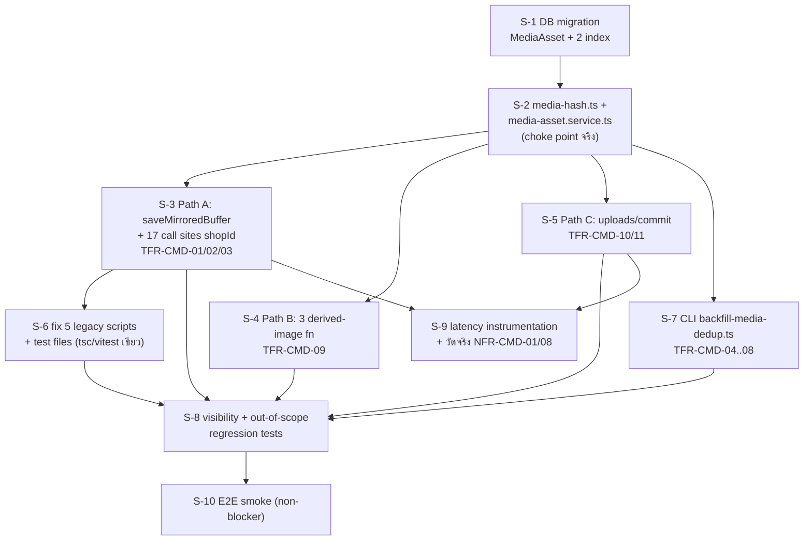

# Scope Baseline — feature 00051 Chat Media Deduplication (Implementation)

> **สถานะ:** `ACTIVE`
> **Phase:** Implementation เต็มรูป (feature เดียวจบใน 1 baseline)
> **วันที่ตั้ง baseline:** 2026-08-19
> **เจ้าของ scope:** `safepay-product` (Gate 0 ของ skill `agent-team-phase`)
> **แหล่งงานหลัก (ห้ามขยายเกิน):** `docs/20 - Features/00051 - Chat Media Deduplication/SDS.md` §3 Component Design + §8 ลำดับการ build (10 ขั้น)
> **เอกสารอ้างอิงครบชุด (user approve แล้ว):** PRD v1.0 · BRD v1.0 (FR-CMD-01..07, BR-CMD-01..09) · SRS v1.1 (TFR-CMD-01..11, NFR-CMD-01..09, R-1..R-7) · SDS v1.1 (TD-01..TD-10, §8) · DATABASE v1.0 (`MediaAsset` schema + migration SQL ล็อกแล้ว) · API v1.0 (ไม่มี endpoint ใหม่) · TestCase v1.0 (58 เคส ยังไม่เคยรัน)
> **repo:** `/Users/craftman/orca/workspaces/safepay/chat` branch `shinobu22/chat`, rebase บน `origin/main` แล้ว สะอาด

---

## 0. ข้อจำกัดสภาพแวดล้อมที่ทีมต้องรู้ (Controller ตรวจแล้ว)

| # | ข้อจำกัด |
|---|---|
| 1 | worktree นี้**ไม่มี `.env.local` ของตัวเอง** — symlink ไปที่ `/Users/craftman/Projects/safepay/.env.local` (dev DB = local Postgres port 5434) ไม่ใช่ prod/Supabase |
| 2 | `node_modules` เพิ่งติดตั้ง (worktree ใหม่) + `npx next typegen` รันแล้ว (`next-env.d.ts` เคยหาย ทำให้ tsc แดง 80 ตัวปลอม) — **baseline ปัจจุบัน `npx tsc --noEmit` = 0 error, exit 0** ใช้เป็นเส้นวัดได้ |
| 3 | 🛑 **ห้าม `prisma migrate dev` และห้าม `--shadow-database-url`** (shadow db url เคยล้างฐานปลายทาง, prod ถูกล้างทั้งฐาน 2026-07-31) — S-1 ต้อง **hand-author ไฟล์ SQL** ที่ `prisma/migrations/<timestamp>_chat_media_dedup_media_asset/migration.sql` แล้วใช้ `npx prisma migrate deploy` ชี้ dev DB local เพื่อทดสอบเท่านั้น — prod รันผ่าน `vercel.json` buildCommand ตอน deploy อยู่แล้ว |
| 4 | เทส integration ที่แตะ Postgres จริงต้องชี้ **local Docker Postgres** เท่านั้น — Hard Rule 13, `tests/setup.ts` มี allowlist บังคับ `localhost`/`127.0.0.1`/`host.docker.internal` |

---

## 1. Goal ของ phase

เพิ่ม content-addressed dedup (`writeDedupedFile()`/`reconcileUploadedFile()` ที่ `media-asset.service.ts` เป็น choke point เดียว) ครอบ 3 เส้นทางเขียนไฟล์สื่อในแชทที่ยืนยันจริงจากโค้ด (mirror จากภายนอก, transcode รูป derived, direct-upload purpose=CHAT) เพื่อหยุดสร้างสำเนาไฟล์ซ้ำต่อจากนี้ไป พร้อม CLI backfill แยก (dry-run ก่อนเสมอ, resumable, repoint-ก่อน-ลบ) เพื่อทวงพื้นที่ ~4.3 GB ที่ซ้ำอยู่แล้วคืน — โดย**ผู้ใช้ต้องไม่เห็นความเปลี่ยนแปลงใด ๆ เลย**

---

## 2. In-Scope — S-id list

> **กติกา CREEP:** ทุก commit ของ phase นี้ต้อง map กับ S-id อย่างน้อย 1 ตัว ไม่ map = CREEP (hard block)

### Dependency / Batch overview (ceiling = 3 concurrent developer ต่อ batch)

**Batch 0** (solo, blocking ทุกอย่าง): S-1
**Batch 1** (solo, depends S-1): S-2
**Batch 2** (3 ขนาน, depends S-2): S-3, S-4, S-5
**Batch 3** (2 ขนาน, depends S-3/S-2): S-6, S-7
**Batch 4** (3 ขนาน, depends batch 2+3): S-8, S-9, S-10

> **หมายเหตุ dependency:** S-3/S-4 แก้ `channel-chat.service.ts` ไฟล์เดียวกัน — **ต้อง serialize ภายใน batch 2** ถ้าจะแก้พร้อมกัน ส่วน S-5 คนละไฟล์ (`uploads/commit/route.ts`, `_shared.ts`) ขนานได้เต็มที่

---

### S-1 — DB migration: ตาราง `MediaAsset` + 2 index บนตารางเดิม

| หัวข้อ | รายละเอียด |
|---|---|
| **ทำ** | hand-author `prisma/migrations/<timestamp>_chat_media_dedup_media_asset/migration.sql` ตาม DATABASE.md §8.1 เป๊ะ (`CREATE TABLE MediaAsset` + `UNIQUE(fileId)` + `UNIQUE(shopId,hash)` + `INDEX(shopId,sourceKey)` + `INDEX ConversationAdReferral(photoFileId)` + `INDEX ExternalContact(avatarUrl)`, ทุกคำสั่งมี `IF NOT EXISTS`) · เพิ่ม `model MediaAsset` + 2 บรรทัด index ใน `prisma/schema.prisma` |
| **ไม่ทำ** | ห้าม `prisma migrate dev`, ห้าม `--shadow-database-url` (ดู §0.3) · ห้ามแตะคอลัมน์/type/nullable ของ `ChatMessage`/`ConversationAdReferral`/`ExternalContact` ที่มีอยู่แล้วแม้แต่บรรทัดเดียว |
| **FR/BR** | รองรับ FR-CMD-01/02, BR-CMD-01/02 |
| **T map** | DATABASE.md §3.1/§4/§8 |
| **ไฟล์** | `prisma/migrations/<ts>_chat_media_dedup_media_asset/migration.sql`, `prisma/schema.prisma` |
| **Acceptance** | `npx prisma migrate deploy` ชี้ local dev DB รันผ่านไม่มี error · `npx prisma generate` เขียว · query `information_schema` ยืนยัน `MediaAsset_shopId_hash_key` เป็น unique composite จริง (ไม่ใช่ unique เดี่ยว) |
| **user-facing** | ไม่ |
| **เจ้าของ** | `safepay-developer` |

---

### S-2 — `media-hash.ts` + `media-asset.service.ts` (choke point จริงของทั้งฟีเจอร์)

| หัวข้อ | รายละเอียด |
|---|---|
| **ทำ** | `src/lib/media-hash.ts::sha256Hex()` (pure, ห้าม import prisma) · `src/services/media-asset.service.ts`: `findMediaAssetByHash`/`findMediaAssetBySourceKey`/`claimSourceKey` (try/catch ภายในตัวเอง degrade เป็น miss/no-op เสมอ, TFR-CMD-07) + `claimMediaAsset()` (insert-then-catch-P2002-then-read-winner ใช้ `isUniqueViolationOn(e,'hash')` ที่มีอยู่แล้ว) + `writeDedupedFile()` (TFR-CMD-01) + `reconcileUploadedFile()` (TFR-CMD-10) |
| **ไม่ทำ** | ห้ามแก้ `src/lib/storage/*` (TD-09) · ห้ามให้ error หลุดออกจาก find-path ใด ๆ ไปถึง caller (TFR-CMD-07) |
| **FR/BR** | FR-CMD-01, BR-CMD-01/02, TD-02/TD-07/TD-08 |
| **T map** | TFR-CMD-01, TFR-CMD-05, TFR-CMD-10 |
| **ไฟล์** | `src/lib/media-hash.ts` (ใหม่), `src/services/media-asset.service.ts` (ใหม่) |
| **Acceptance** | `tests/integration/media-asset-dedup.test.ts` ผ่านทั้งหมด: TC-HASH-01/02/03, TC-CLAIM-01/02, **TC-RACE-01 (blocker ห้าม mock)**, TC-RACE-02/03, **TC-SCOPE-01 (blocker)**, TC-SCOPE-02 (grep gate), **TC-SAFE-01 (blocker)**, TC-SAFE-02/03/04 — เคส blocker ต้องพิสูจน์ด้วย mutation (mutate แล้วแดง revert แล้วเขียว) |
| **user-facing** | ไม่ |
| **เจ้าของ** | `safepay-developer` |
| **Dependency** | S-1 |

---

### S-3 — Path A: `saveMirroredBuffer` thin wrapper + TD-01 signature + thread `shopId` 17 call sites

| หัวข้อ | รายละเอียด |
|---|---|
| **ทำ** | `saveMirroredBuffer()` เป็น thin wrapper เรียก `writeDedupedFile()` (TD-07) · เปลี่ยน `mirrorRemoteImage`/`mirrorMediaBuffer` เป็น options-object บังคับ `shopId: string` (required, TD-01) · thread `shopId` ครบ 17 จุดตาม SRS TFR-CMD-02 (รวม `refreshPostStats` ที่ต้องขยาย `include: {channel:{select:{shopId:true}}}`, TD-06) · เพิ่ม `sourceKey` layer-2 ที่ `ingestAdReferral()` (TFR-CMD-03, `sourceKey='ad:{adId}'`, set-once) |
| **ไม่ทำ** | ห้ามเปลี่ยน default `filenamePrefix` เดิม (`'fb'`/`'line'`) · ห้ามแก้ contract "ห้าม throw" เดิม |
| **T map** | TFR-CMD-01, TFR-CMD-02, TFR-CMD-03 |
| **ไฟล์** | `channel-chat.service.ts`, `shop-channel.service.ts`, `shop-page-layout.service.ts`, `shop-video.service.ts`, `page-comment.service.ts` |
| **Acceptance** | TC-SRC-01/02/03 ผ่าน (**TC-SRC-02 blocker**: ad ซ้ำห้าม fetch ซ้ำ) · `tsc` แดงทันทีถ้าจุดใดยังไม่ thread `shopId` (TC-SIG-01/02/03) · **TC-SHOPID-01/02 (blocker)**, TC-SHOPID-03 ผ่าน |
| **user-facing** | ไม่ |
| **Dependency** | S-2 |

---

### S-4 — Path B: 3 derived-image functions + `sourceKey` namespace `derived:`

| หัวข้อ | รายละเอียด |
|---|---|
| **ทำ** | `resolveMetaCardImageUrl`/`resolveLineFlexImageUrl`/`resolveLinePreviewUrl` เพิ่ม `opts:{shopId}` + sourceKey-first check (`derived:{kind}:{originalFileId}`) ก่อน transcode + เรียก `writeDedupedFile()` แทน `saveFile()` ตรง (TFR-CMD-09) |
| **ไม่ทำ** | ห้ามแคช `originalFileId` ข้ามการเรียก (ต้องอ่านสดจาก DB ทุกครั้ง — กัน stale-pointer ตามประเด็นวิกฤตของ SRS TFR-CMD-09) |
| **T map** | TFR-CMD-09, NFR-CMD-09 |
| **ไฟล์** | `channel-chat.service.ts` (3 ฟังก์ชัน) |
| **Acceptance** | TC-DERIVED-01, **TC-DERIVED-02 (blocker — survivor เปลี่ยนหลัง backfill ต้องไม่คืนไฟล์ที่ถูกลบ)**, TC-DERIVED-03 ผ่าน |
| **user-facing** | ไม่ |
| **Dependency** | S-2 |

---

### S-5 — Path C: `resolveChatChannelForUser` คืน `shopId` + `POST /api/uploads/commit` reconcile

| หัวข้อ | รายละเอียด |
|---|---|
| **ทำ** | `ChatChannelResult` เพิ่ม field `shopId: string` (additive, TFR-CMD-11) · commit route เพิ่ม branch `purpose==='CHAT' && conversationId` เรียก `reconcileUploadedFile()` (catch แล้ว fallback `claim.fileId` เดิม, TFR-CMD-10) |
| **ไม่ทำ** | **ห้ามแตะ branch `purpose==='IMAGE'`/`'DOCUMENT'` เลย** (TD-09) · ห้ามเปลี่ยน response shape เดิม |
| **T map** | TFR-CMD-10, TFR-CMD-11 |
| **ไฟล์** | `src/app/api/uploads/commit/route.ts`, `src/app/api/uploads/_shared.ts` |
| **Acceptance** | **TC-COMMIT-01 (blocker)**, TC-COMMIT-02/03, **TC-PATHC-SCOPE-01/02 (blocker — purpose IMAGE/DOCUMENT ต้องไม่ถูกแตะ, `MediaAsset` count=0)**, TC-PATHC-SCOPE-03, TC-SHOPID-11 ผ่าน |
| **user-facing** | ไม่ (response shape เดิม แค่ค่า `fileId` อาจเปลี่ยนเมื่อซ้ำ) |
| **Dependency** | S-2 |

---

### S-6 — แก้ 5 สคริปต์ backfill เก่า + test files ให้ `tsc`/`vitest` เขียว (fallout ของ TD-01)

| หัวข้อ | รายละเอียด |
|---|---|
| **ทำ** | ไล่แก้ทุกจุดที่เรียก `mirrorRemoteImage`/`mirrorMediaBuffer` แบบ positional เดิม (5 สคริปต์ + test files ตาม SRS §7.2) ให้ตรง signature ใหม่ |
| **ไม่ทำ** | ห้ามเปลี่ยน business logic ของสคริปต์เดิม — แก้แค่ call signature |
| **Acceptance** | `npx tsc --noEmit` = 0 error ทั้ง repo · `npx vitest run` เขียวทั้งหมด |
| **user-facing** | ไม่ |
| **Dependency** | S-3 |

---

### S-7 — CLI `scripts/backfill-media-dedup.ts` (dry-run / apply / resume / report)

> 🛑 **สถานะ: DEFERRED (2026-08-20) — มติ user** ไม่ทำในรอบนี้
>
> **เหตุผล:** egress อยู่ที่ ~31 GB จากโควตา 250 GB (**12%**) และ storage 5.6 GB จาก 100 GB — ยังไม่มีแรงกดดันด้านต้นทุนให้ต้องรีบทวงคืน 4.3 GB ที่ซ้ำอยู่แล้ว
>
> **แผน:** ปล่อยระบบรันประมาณ 1 สัปดาห์ (S-1..S-5 ขึ้น prod แล้ว = หยุดสร้างของซ้ำใหม่ครบทั้ง 3 เส้นทาง) แล้วกลับมาดูผลลัพธ์จริงก่อนตัดสินใจว่าจะทำ backfill ไหม
>
> **สิ่งที่ต้องวัดตอนกลับมาดู:**
> - อัตราการโตของ storage ต่อวัน เทียบ baseline เดิม ~248 MB/วัน
> - สัดส่วนไฟล์ซ้ำที่เกิดใหม่ (ควรเป็น ~0 ถ้า S-3/S-4/S-5 ทำงานครบ)
> - dedup hit rate จาก `MediaAsset` (จำนวนแถว vs จำนวนการเรียก)
> - egress % ว่าขยับไหม
>
> **บริบทที่ต้องส่งต่อให้คนทำ S-7 รอบหน้า (อย่าให้หาย):**
> - prod มีไฟล์ **2 รูปแบบ path**: 15,567 ไฟล์ใต้ `YYYY/MM/DD/` (ตั้งแต่ 2026-07-25) และ **645 ไฟล์ที่ root level ไม่มีโฟลเดอร์** (ของเก่า 2026-04-18 → 07-25) — parser ที่สมมติว่าทุก path มี `/` จะข้ามของเก่าเงียบ ๆ แล้วรายงานว่า "สแกนครบ" ทั้งที่ไม่ครบ **รายงาน dry-run ต้องแยกนับ 2 กลุ่ม**
> - ไฟล์ที่เขียนค้างไว้ตอนหยุดกลางคันถูกลบทิ้งแล้ว (ยังไม่เสร็จ ไม่มีเทส และเป็นสคริปต์ที่ลบไฟล์จริงได้ — ปล่อยไว้เสี่ยงมีคนเผลอรัน) เริ่มใหม่จากศูนย์ตามสเปกเดิม
>
> **ผลกระทบต่อ S-id อื่น:** S-8 ที่ depends on S-7 ให้ตัด dependency นั้นออก (เทส visibility ของ S-8 ไม่จำเป็นต้องรอ backfill — พิสูจน์ได้จาก path A/B/C ที่ทำเสร็จแล้ว)

| หัวข้อ | รายละเอียด |
|---|---|
| **ทำ** | export ฟังก์ชันหลักแยกจาก CLI entry (`runDryRun`, `runApply`, `groupCandidatesByETagAndSize` — ข้อกำหนด testability ของ TestCase.md §1.3) · dry-run ไม่แตะ `MediaAsset` เลย (TD-03) · apply: query `NOT IN MediaAsset` (resumable โดยธรรมชาติ TD-04) → repoint 3 ตารางใน transaction → commit → **ค่อยลบไฟล์** (ลำดับ BR-CMD-07 บังคับ) → log แยก merged/failed/orphaned/unreadable · flags + exit code ตาม API.md |
| **ไม่ทำ** | ห้ามสร้างตาราง/ไฟล์ state แยก (TD-04) · ห้าม scan ไฟล์ที่ไม่มีตารางไหนอ้างอิง |
| **T map** | TFR-CMD-04..08 |
| **Acceptance** | TC-ETAG-01/**02 (blocker)**/03, **TC-DRY-01**, **TC-RESUME-01**, TC-RESUME-02, **TC-ORDER-01**, TC-ORDER-02, **TC-ORPHAN-01**, TC-CLI-REPORT-01, TC-CLI-EXIT-01, TC-CLI-FLAG-01/02, TC-SCAN-01, TC-UNREADABLE-01 ผ่าน |
| **user-facing** | ไม่ (CLI ทีมงานภายใน — ไม่มีหน้าจอ admin ตามมติ user) |
| **Dependency** | S-2 |

---

### S-8 — Visibility regression + out-of-scope guard tests

| หัวข้อ | รายละเอียด |
|---|---|
| **ทำ** | เทสยืนยัน BR-CMD-03/04 (ห้ามรูปหาย) + ยืนยันว่า 4 path นอกขอบเขต (KYC/badge/slip/legacy-chat-upload) และ `purpose=IMAGE/DOCUMENT` **ไม่ถูกแตะ** |
| **ไม่ทำ** | ไม่แก้ business logic ใด ๆ — เป็นเทสอย่างเดียว |
| **T map** | NFR-CMD-04, SRS §3.0.3 |
| **Acceptance** | **TC-VIS-01 (blocker — นับแถว ห้ามนับ distinct fileId)**, TC-VIS-02, TC-KYC-01, TC-BADGE-01, TC-SLIP-01, TC-LEGACY-01 ผ่าน |
| **Dependency** | S-3, S-4, S-5, S-6, S-7 |

---

### S-9 — Latency instrumentation + วัดจริง (NFR-CMD-01/08)

| หัวข้อ | รายละเอียด |
|---|---|
| **ทำ** | เพิ่ม `performance.now()` instrumentation รอบ hash+lookup ใน `writeDedupedFile` (warn ถ้า >200ms) และรอบ `reconcileUploadedFile` ที่ commit route · วัด p95 จริงบน dev เทียบ baseline |
| **ไม่ทำ** | ห้ามตั้ง threshold ตายตัวในเทส (TestCase.md ตรวจแค่ว่า instrumentation มีอยู่) |
| **Acceptance** | TC-PERF-01/02 ผ่าน + **บันทึกตัวเลข p95 จริงลงรายงานให้ Controller** (ไม่ใช่แค่โค้ด) |
| **Dependency** | S-3, S-5 |

---

### S-10 — E2E smoke (non-blocker)

| หัวข้อ | รายละเอียด |
|---|---|
| **ทำ** | `e2e/chat-media-dedup.spec.ts` — seller แนบไฟล์เดียวกัน 2 ครั้ง ต้องไม่เห็นความเปลี่ยนแปลง + query DB ยืนยัน `imageUrl` ทั้งสองข้อความชี้ fileId เดียวกัน |
| **Acceptance** | `npm run e2e` เขียว — **ถ้าไม่ทันเวลา ย้ายเป็น Deferred ได้โดยไม่ block sign-off** (ต้องแจ้ง Controller ก่อน) |
| **user-facing** | ใช่ (สิ่งที่เทสพิสูจน์) |
| **เจ้าของ** | `safepay-qa` |
| **Dependency** | S-8 |

---

## 3. Mapping table — TFR/NFR ↔ S-id

| ID | S-id | Coverage |
|---|---|---|
| TFR-CMD-01 | S-2, S-3 | ครบ |
| TFR-CMD-02 | S-3 | ครบ (17 จุด) |
| TFR-CMD-03 | S-3 | ครบ |
| TFR-CMD-04..08 | S-7 | ครบ (CLI) |
| TFR-CMD-09 | S-4 | ครบ |
| TFR-CMD-10 | S-2, S-5 | ครบ |
| TFR-CMD-11 | S-5 | ครบ |
| NFR-CMD-01..05, 09 | S-2, S-3, S-4, S-8 | ครบ |
| NFR-CMD-06 | — | **ไม่มี TC เจาะจง** (metric format ยังไม่ระบุ — ดู §6/D-05) |
| NFR-CMD-07 | — | **ไม่มี TC อัตโนมัติ** (infra/env access control — manual เท่านั้น) |
| NFR-CMD-08 | S-5, S-9 | ครบ |

TFR ที่ map ไม่ได้เลย: **0 รายการ**

---

## 4. Out-of-Scope ของ phase นี้

> แตะของในนี้ = **CREEP (hard block)** ถ้าจำเป็นต้องทำ → Controller ตัดสิน + ย้ายขึ้น In-Scope พร้อมจด Change Log

| ID | รายการ | เหตุผล |
|---|---|---|
| OOS-01 | **นโยบายลบไฟล์/data retention ใด ๆ** | PRD §5 — feature นี้แค่วางรากฐาน ไม่ใช่ retention เอง |
| OOS-02 | **Cross-shop / global dedup** | มติธุรกิจ (BR-CMD-01) แม้ทางเทคนิคทำได้ |
| OOS-03 | **บีบอัด/ลดขนาดไฟล์** | แก้แค่ "เขียนซ้ำ" ไม่แตะขนาด/คุณภาพ |
| OOS-04 | **แก้ `src/lib/storage/index.ts`/`local.ts`/`s3.ts`** | TD-09 — hook เฉพาะจุดเรียก 3 path ไม่แตะ `saveFile()` กลาง |
| OOS-05 | **`POST /api/upload` (KYC verification)** | SRS §3.0.3 ข้อ 1 — คนละ business domain |
| OOS-06 | **`POST /api/admin/badges/upload`** | SRS §3.0.3 ข้อ 2 — ไม่มี `shopId` ในบริบท |
| OOS-07 | **`POST /api/orders/[token]/slip`** | SRS §3.0.3 ข้อ 4 |
| OOS-08 | **`POST /api/app/upload`** | SRS §3.0.3 ข้อ 4 |
| OOS-09 | **`POST /api/chat/upload` (legacy)** | TD-10 — ไม่มี client เรียกอีก |
| OOS-10 | **commit route purpose `IMAGE`/`DOCUMENT`** | TD-09 — จำกัดที่ `CHAT` เท่านั้น |
| OOS-11 | **เปลี่ยน storage driver/ผู้ให้บริการ** | PRD §5 |
| OOS-12 | **เปลี่ยนนโยบาย mirror เดิม** | PRD §5 — mirror-then-store ยังถูกต้อง |
| OOS-13 | **หน้าจอ admin สำหรับ backfill** | มติ user 2026-08-19 — CLI เท่านั้น |
| OOS-14 | **เก็บ `refCount` ใน `MediaAsset`** | มติ PRD §4.1 |
| OOS-15 | **แก้ type/nullable/default ของ 3 คอลัมน์อ้างอิง** | DATABASE.md §3.2 — เพิ่มได้แค่ index |
| OOS-16 | **UI/UX ใหม่ใด ๆ** | BRD §1.5 — เบื้องหลังล้วน ๆ |

---

## 5. Known Risk ที่รับไว้แล้ว (SRS §8)

| ID | ความเสี่ยง | สถานะที่ยอมรับ |
|---|---|---|
| R-1 | ลืม/ใส่ `shopId` ผิดตัวใน 1 ใน 17 จุด — **`tsc` จับได้แค่ "ลืม" ไม่จับ "ผิดตัว"** | mitigated ผ่าน TC-SHOPID-01/02/03 + **TC-SHOPID-GREP เป็น reviewer gate ก่อน merge** สำหรับ 14 จุดที่เหลือ — **ไม่ automate ได้ครบ 100%** |
| R-2 | `refreshPostStats` เพิ่ม join ทุกครั้งที่เรียก | ต้นทุนต่ำ relation มีอยู่แล้ว |
| R-3 | orphan file จาก `deleteFile()` ล้มเหลวหลัง repoint สำเร็จ | ยอมรับใน v1 — log แยกประเภท, sweep tool เป็น P2 |
| R-4 | `isUniqueViolationOn` กับ composite unique ยังไม่เคยพิสูจน์จริง | mitigated เต็มที่ผ่าน **TC-RACE-01 (blocker ห้าม mock ยิง Postgres จริง)** |
| R-5 | latency ของ hash ยังไม่มีตัวเลขจริง | mitigated ผ่าน S-9 |
| R-7 | derived-image `MediaAsset` แถวตายค้างไม่มี sweep | ยอมรับใน v1 — หนี้สำหรับ retention feature อนาคต |

---

## 6. สิ่งที่ยังตัดสินใจไม่ได้จนกว่าจะวัดจริง (ไม่ใช่ scope creep)

| ID | เรื่อง | เงื่อนไขที่ต้องกลับมาถาม user |
|---|---|---|
| **R-6** | `reconcileUploadedFile` อ่านไฟล์เต็มทุกครั้งที่ commit purpose=CHAT — latency เพิ่มในเส้นทางอัปโหลดหลักที่มี traffic สูง | S-9 วัดค่าจริงก่อน ถ้า p95 เกิน 150ms **ห้าม dev ตัดสินใจเปลี่ยนเป็น async เอง** ต้องรายงาน Controller → ถาม user |

TestCase.md §6 มี 3 open question ที่เป็น**ช่องว่างของ spec เดิม** (ไม่ใช่ขยาย scope): พฤติกรรม `claimMediaAsset` เมื่อ error ไม่ใช่ P2002, orphaned มีผลต่อ exit code หรือไม่, รูปแบบ metric ของ NFR-CMD-06 — ต้อง confirm กับ Controller ระหว่าง implement S-2/S-7

---

## 7. Assumptions

- **A-01:** DATABASE.md §8.1 SQL/schema ที่ล็อกไว้ถูกต้อง 100% — S-1 hand-author ตามนั้นเป๊ะ ไม่ตีความใหม่
- **A-02:** ไม่มี merge ใหม่เข้า `main` ระหว่าง phase ที่แตะ `channel-chat.service.ts`/`uploads/commit/route.ts`/`uploads/_shared.ts` — ถ้ามีต้อง rebase ซ้ำและตรวจ diff ก่อน
- **A-03:** เทส blocker ทั้งหมดพิสูจน์ด้วย integration test บน local Postgres พอ — ไม่ต้องยิง prod snapshot ก่อน sign-off
- **A-04:** `STORAGE_DRIVER=local` เพียงพอสำหรับทุกเทสของ phase นี้ (s3 driver เป็น known-gap ไม่ block)

---

## 8. Deferred → Phase 2 / Debt

> ของที่จงใจไม่ทำใน phase นี้ — **ไม่นับเป็น GAP** ตอน audit/sign-off

| # | รายการ |
|---|---|
| D-01 | **Orphan file sweep tool** (R-3) — รอ feature retention |
| D-02 | **`STORAGE_DRIVER=s3` integration test เจาะจง** |
| D-03 | **dry-run บนข้อมูลปริมาณจริง prod (15,805 ไฟล์)** — ขั้นตอนปฏิบัติการแยกหลัง merge ก่อนอนุมัติ apply |
| D-04 | **`docs/SRS.md`/`docs/PRD.md` (product-level) backfill** |
| D-05 | **NFR-CMD-06 metric format ที่แท้จริง** — เขียน TC ย้อนหลังจากรูปแบบจริงที่เลือกใช้ |

---

## 9. Definition of Done ระดับ phase

- [ ] S-1..S-9 ทุกตัว DONE (S-10 อนุโลม deferred ได้ถ้าแจ้ง Controller)
- [ ] ทุก commit ของ phase map กับ S-id ได้อย่างน้อย 1 ตัว
- [ ] `npx tsc --noEmit` = 0 error, `npx vitest run` เขียวทั้งหมด
- [ ] เทส blocker ทั้งหมด (TC-RACE-01, TC-SCOPE-01, TC-SAFE-01, TC-HASH-02, TC-SIG-01, TC-SHOPID-01/02, TC-SRC-02, TC-DERIVED-02, TC-COMMIT-01, TC-PATHC-SCOPE-01/02, TC-DRY-01, TC-RESUME-01, TC-ORDER-01, TC-ORPHAN-01, TC-VIS-01) พิสูจน์ผ่าน mutation จริง
- [ ] TC-SHOPID-GREP (reviewer manual gate) ผ่านครบ 17/17 จุด
- [ ] `rg "prisma\.mediaAsset\." src/ scripts/` ทุก match มี `shopId` ใน `where` (TC-SCOPE-02)
- [ ] R-6 latency วัดจริงแล้วรายงาน Controller — ถ้าเกินงบ **ไม่ตัดสินใจเปลี่ยนเป็น async เอง**
- [ ] 3 open question (§6) confirm กับ Controller แล้วก่อนปิด S-2/S-7
- [ ] `safepay-reviewer` ผ่านทุก S-id + `safepay-security` ผ่าน S-5 (endpoint ที่มี traffic จริงสูง)
- [ ] regression feature 00018/00025 (Meta/LINE chat) ผ่าน 100% — S-3/S-4 แก้ไฟล์ที่ทั้งสอง feature ใช้งานจริงทุกวัน
- [ ] Change Log ปิดครบทุกการเปลี่ยน scope (ถ้ามี)
- [ ] retro ปลาย phase (`phase-retro`) + อัปเดต memory

---

## 10. Change Log

| วันที่ | การเปลี่ยน | เหตุผล | ใครอนุมัติ |
|---|---|---|---|
| 2026-08-19 | baseline สร้าง (`ACTIVE`) — S-1..S-10, map TFR-CMD-01..11 ครบ (ยกเว้น NFR-CMD-06/07 ที่ไม่มีพฤติกรรม runtime), OOS-01..16, Known Risk, Undecided R-6 | Gate 0 ของ phase implement feature 00051 — เอกสาร doc-first 7 ฉบับ approve แล้ว | `safepay-product` |
| 2026-08-20 | **S-7 → DEFERRED** (ไม่ใช่ GAP — ย้ายเข้า §8 Deferred) · ตัด dependency S-7 ออกจาก S-8 | egress 12% / storage 5.6% ของโควตา ยังไม่มีแรงกดดันด้านต้นทุน — ปล่อยระบบรัน ~1 สัปดาห์แล้วดูผลจริงก่อนตัดสินใจ | user (2026-08-20) |
| 2026-08-20 | **S-1..S-5 DONE** — path A/B/C ปิดครบ (S-1/S-2/S-3 ขึ้น prod แล้ว · S-4/S-5 รอ merge PR #29) | — | Controller |
