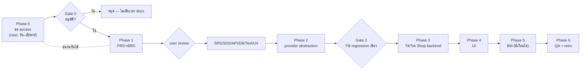

# แผน: เชื่อม TikTok Chat เข้า Deep Omnichannel Inbox

> **เลข feature:** `00020` — ตรวจ collision แล้วด้วย `git log --all --name-only | grep -oE '000[0-9]{2} - '` ครอบทุก branch
> (00007 / 00010 เป็นช่องว่างเดิมที่ไม่มีใครใช้ — ไม่ reuse เพื่อไม่ให้ลำดับเวลาสับสน)
>
> **เอกสารนี้ยังไม่ใช่ PRD** — เป็นแผนลำดับงาน (implementation plan) ที่ต้องผ่าน §2 (user ตัดสิน)
> ก่อนเข้า Hard Rule 11 doc-first (PRD+BRD)

---

## 1. สรุปผลวิจัย API (ฐานของแผนนี้)

TikTok มี messaging API ที่ใช้ได้จริง **2 ตัว คนละเรื่องกัน** และ **ไม่มี** general DM API สำหรับบัญชีทั่วไป

| | **A. TikTok Shop — Customer Service API** | **B. TikTok API for Business — Business Messaging v1.3** |
|---|---|---|
| คุยกับใคร | ลูกค้าในร้าน TikTok Shop | user ทั่วไปที่ทัก TikTok Business Account |
| Host | `https://open-api.tiktokglobalshop.com` | `business-api.tiktok.com` |
| Version | `202309` | `v1.3` (Beta) |
| ไทยรองรับ | **ใช่** (TikTok Shop TH live) | **ไม่ยืนยัน** (ไทยไม่อยู่ในลิสต์ห้าม แต่ไม่มีเอกสารยืนยันตรง) |
| Auth | `app_key`+`app_secret`, header `x-tts-access-token`, `shop_cipher` ต่อร้าน, `sign` = HMAC-SHA256 | OAuth, access token **~24 ชม.** / refresh ~30 วัน |
| หน้าต่างตอบ | ไม่มี window จำกัด | **48 ชม. + ≤10 ข้อความติด**, reset เมื่อลูกค้าตอบ |
| ทักก่อนได้ | ได้ (`POST conversations`) | **ไม่ได้** — ลูกค้าต้องทักมาก่อน |
| Media | text/image (`images/upload`) | text ≤6000, image JPG/PNG ≤3MB; **ไม่มี video/voice/sticker** |
| Region ห้าม | — | EEA, Switzerland, UK, **US** |
| Rate limit | ไม่ยืนยัน | 10 QPS |

**Endpoints ของ A** (ใต้ `customer_service/202309/`): `GET conversations` · `POST conversations` · `GET conversations/{id}/messages` · `POST conversations/{id}/messages` · `POST conversations/{id}/messages/read` · `POST images/upload` · `GET|PUT agents/settings`

**Webhook ของ A**: จัดการผ่าน `GET|PUT|DELETE webhooks` — event ที่เกี่ยวข้อง `NEW_MESSAGE`, `NEW_CONVERSATION`, `NEW_MESSAGE_LISTENER`; TikTok retry 72 ชม. exponential backoff

### 🛑 ข้อที่ยัง "ไม่ยืนยัน" — ต้องปิดใน Phase 0 ก่อนเขียน SDS

เอกสาร portal ของ TikTok (`partner.tiktokshop.com/docv2/*`, `business-api.tiktok.com/portal/docs/*`)
**เป็น JavaScript shell ทั้งหมด** — WebFetch อ่านได้แต่ title ว่าง endpoint ข้างบนจึงมาจาก SDK ชุมชน
([EcomPHP/tiktokshop-php](https://github.com/EcomPHP/tiktokshop-php)) + third-party integration docs ไม่ใช่หน้า official

| # | สิ่งที่ยังไม่ยืนยัน | ต้องได้มาจาก |
|---|---------------------|--------------|
| U-1 | payload shape ของ `POST messages` (`type`/`content` รับค่าอะไรได้บ้าง) | Partner Center หลัง login (เปิดใน browser จริง) |
| U-2 | วิธี verify signature ของ webhook ฝั่ง Shop | Partner Center |
| U-3 | rate limit จริงของ Customer Service API | Partner Center |
| U-4 | ไทยเปิด Business Messaging API หรือไม่ | ยื่น app แล้วดูผล / ถาม TikTok |
| U-5 | endpoint path จริงของ Business Messaging | Portal หลัง approve |
| U-6 | LIVE chat / comment มี official API ไหม | ยังไม่เจอ — **นอก scope แผนนี้** |

> **ห้าม** ใช้ third-party aggregator ที่อ้างว่าดึง DM จากบัญชี TikTok ธรรมดาได้ (UnifyPort/MessageGate ฯลฯ)
> — ไม่ใช่ official API เสี่ยง ToS/แบนบัญชีลูกค้า

---

## 2. 🛑 การตัดสินใจที่ต้องได้จาก user ก่อนเริ่ม Phase 1

**ข้อเสนอของผม (ถ้าไม่แก้ = ถือว่าเอาแบบนี้):**
ทำ **A ก่อน (TikTok Shop CS API)** แล้ว B เป็น Phase 5 แบบมีเงื่อนไข

เหตุผล: A ไทยรองรับแน่นอน · ไม่มี 48h window ให้จัดการ · ทักลูกค้าก่อนได้ · ตอบโจทย์ pain จริงที่
TikTok Shop บังคับ seller ตอบใน **12 ชม.** (ต่ำกว่า 1 ชม. ช่วง LIVE) เป็น store-health metric
— นี่คือ value prop ที่ขายได้ทันที ส่วน B ยังเป็น Beta + ไทยไม่ยืนยัน + ห้าม initiate

| ตัวเลือก | ครอบคลุม | ข้อแลก |
|---|---|---|
| **A เท่านั้น** ← เสนอ | seller ที่มีร้านบน TikTok Shop | seller ที่ขายผ่าน LIVE/โปรไฟล์แต่ไม่มี Shop ใช้ไม่ได้ |
| **B เท่านั้น** | seller ที่มี TikTok Business Account | Beta, ไทยไม่ยืนยัน, ติด 48h + ห้ามทักก่อน |
| **A + B พร้อมกัน** | ครบทั้งสองกลุ่ม | effort สูงสุด — 2 auth flow, 2 token lifecycle, 2 ชุดกฎการส่งใน UI เดียว |

---

## 3. Delta vs feat 00018 — อะไร reuse ได้ อะไรต้องทำใหม่

ข่าวดี: **สถาปัตยกรรม 00018 ออกแบบไว้รองรับหลายช่องทางอยู่แล้ว** `ShopChannel.provider` และ
`Conversation.channel` เป็น `String` ไม่ใช่ Prisma enum → เพิ่มค่า `"TIKTOK_SHOP"` **ไม่ต้อง DDL**

### 3.1 Reuse ได้ 100% (ไม่แตะ)

| ของเดิม | ใช้ต่อได้เพราะ |
|---|---|
| `ShopChannel` / `ExternalContact` (table) | โครง provider-agnostic อยู่แล้ว |
| `Conversation.channel` / `shopChannelId` / `externalContactId` | String — เพิ่มค่าใหม่ได้เลย |
| `Conversation.lastInboundAt` | ฐานคำนวณ window มีอยู่แล้ว (ใช้กับ B ที่ 48h ได้ตรง ๆ) |
| `ChatMessage.externalMessageId @unique` | กลไก idempotency กัน webhook redelivery — TikTok retry 72 ชม. **ยิ่งจำเป็น** |
| `ChatMessage.deliveryStatus` / `failureReason` | สถานะส่งออก |
| `isPinned`/`isHidden`/`isSpam`/`resolvedAt`/`alias`/`chatGroupId` | inbox state ทั้งชุด |
| `QuickMessage` + AI ช่วยร่าง (feat 00019) + `chat-crm.service` | ไม่ผูก provider |
| `Notification` (`kind='chat_message'`) | เหมือนกันทุกช่องทาง |
| `mirrorRemoteImage` | mirror media เข้า Supabase — reuse ได้ (ระวัง bucket MIME limit, ดู memory) |
| `token-crypto.ts` (AES-256-GCM) | เก็บ token TikTok ด้วยกลไกเดียวกัน |

### 3.2 ต้องทำใหม่ / แก้

| ไฟล์ | สภาพปัจจุบัน | ต้องทำ |
|---|---|---|
| `src/services/channel-chat.service.ts` (683 บรรทัด) | **hardcode Meta** — `MESSAGING_WINDOW_MS = 24h` เป็น const เดี่ยว, `sendOutboundMessage` เรียก `sendTextMessage`/`sendImageMessage` จาก `lib/facebook/graph` ตรง ๆ, จับ `GraphApiError.code === 190` | แยก provider adapter (Phase 2) |
| `src/services/shop-channel.service.ts` (323) | `connectPages`/`describePageStates`/`resubscribeShopChannels` = Meta-only | เพิ่ม TikTok connect path |
| `src/lib/facebook/graph.ts` | Meta HTTP client | สร้าง `src/lib/tiktok/` คู่ขนาน |
| `src/app/api/channels/facebook/webhook/route.ts` (108) | Meta signature + payload | route ใหม่ `/api/channels/tiktok/webhook` |
| `src/app/(paces)/seller/(dashboard)/settings/channels` | ปุ่มเชื่อม FB/IG | เพิ่มการ์ด TikTok |
| `src/app/(paces)/seller/(chat)/inbox` | badge/filter ตาม channel | เพิ่ม TikTok + แสดง window state ของ B |

### 3.3 Schema delta — **ต้องมี migration 1 ไฟล์** (additive ล้วน)

`ShopChannel` ปัจจุบันมีแค่ `accessTokenEnc` เพราะ **FB page token เป็น long-lived ไม่ต้อง refresh**
TikTok ต่างออกไปสิ้นเชิง:

| คอลัมน์ใหม่ | Type | ทำไม |
|---|---|---|
| `refreshTokenEnc` | `TEXT NULL` | TikTok BM access token อายุ ~24 ชม. / Shop token ก็มีวันหมด — ต้องเก็บ refresh token (เข้ารหัส) |
| `tokenExpiresAt` | `TIMESTAMP(3) NULL` | ให้ cron รู้ว่าต้อง refresh เมื่อไร ไม่ต้องรอ error |
| `externalMeta` | `JSONB NULL` | เก็บ `shop_cipher` (Shop API) + region/advertiser id — ไม่ต้องเพิ่มคอลัมน์ทีละ provider |

ทั้งสามเป็น nullable ไม่มี default → **metadata-only บน Postgres ≥11** ปลอดภัยกับ DB ที่ dev=prod แชร์กัน

> 🛑 **ห้าม `prisma migrate dev` / `prisma db pull`** — DB dev=prod ตัวเดียวกันและมี drift นอก git
> apply ด้วย `prisma migrate deploy -e .env.local` **หลังขอ user ยืนยันเท่านั้น** แล้ว **restart dev server**
> (ดู `docs/conventions/prisma-shared-db-drift.md` + memory `project_prisma_migration_env_targets`)

---

## 4. Phase Plan

### Phase 0 — ขอ access + ปิดข้อไม่ยืนยัน (🛑 blocking, ไม่มีโค้ด, เริ่มทันที)

Lead time เป็นวัน–สัปดาห์ **ทำขนานไปกับ Phase 1 ได้** และเป็นเหตุผลที่ต้องเริ่มก่อนอย่างอื่น
(บทเรียน FB App Review ที่เรายังติด scope `email` อยู่จนวันนี้ — memory `project_fb_login_app_review`)

| id | งาน | ใคร | ผลลัพธ์ |
|---|---|---|---|
| P0-1 | สมัคร TikTok Shop Partner app → `app_key`/`app_secret`, ขอ scope Customer Service API | **user** | credential + สถานะ approve |
| P0-2 | สมัคร app ที่ `business-api.tiktok.com/portal/apps` + ยื่นขอ Business Messaging access (เตรียม ToS/Privacy URL — ของเรามีอยู่แล้วจาก FB) | **user** | ผล approve + คำตอบ U-4 (ไทยเปิดไหม) |
| P0-3 | เปิด Partner Center ใน browser จริง แล้ว capture เอกสาร U-1/U-2/U-3 (payload `content`, webhook signature, rate limit) | user + Claude | ข้อมูลจริงใส่ SRS |
| P0-4 | ยืนยันว่ามี TikTok Shop ทดสอบ (sandbox หรือร้านจริง) ให้ E2E ได้ | user | test account |

**Gate 0:** ได้ผลอนุมัติแล้วอย่างน้อย 1 ทาง + ปิด U-1/U-2 → ถ้า A ไม่ผ่านและ B ก็ไม่เปิดไทย **หยุดทั้ง feature** ที่นี่ (ไม่เสียเวลาเขียน docs 7 ไฟล์)

---

### Phase 1 — Documentation-First (Hard Rule 11)

`docs/20 - Features/00020 - TikTok Chat Integration/`

| id | ไฟล์ | เจ้าของ | หมายเหตุ |
|---|---|---|---|
| P1-1 | `PRD.md` | `safepay-product` | goal, persona (seller TikTok Shop), user story, FR ระดับหัวข้อ, metric (เวลาตอบเฉลี่ย vs 12h) |
| P1-2 | `BRD.md` | `safepay-product` | BR-TTC-xx: 1 shop ผูกได้ร้านเดียว, PSID page-scoped equivalent, window rule, PII/AI |
| P1-3 | 🛑 **user review PRD+BRD** | user | **ห้าม implement ก่อนผ่าน gate นี้** — เร่งได้ที่การข้าม micro-approval ระหว่าง phase ไม่ใช่ข้าม gate นี้ |
| P1-4 | `SRS.md` + `SDS.md` + `API.md` | `safepay-planner` | ใส่ข้อมูลจริงจาก P0-3; SDS ต้องมีสัญญาของ provider adapter (§Phase 2) |
| P1-5 | `DATABASE.md` | `safepay-database` | migration 3 คอลัมน์ (§3.3) + เหตุผลว่าทำไมไม่ต้องแตะ table อื่น |
| P1-6 | `TestCase.md` | `safepay-qa` | รวม Playwright spec (memory `feedback_qa_playwright_e2e_mandatory`) |
| P1-7 | Design Spec (Hard Rule 8) | `safepay-ux` | ต้องมี `### Impeccable compliance`; อ้าง Paces docs + `paces-component-reference.md` |

diagram ทุกอันเป็น **Mermaid เท่านั้น**

---

### Phase 2 — Provider abstraction refactor (ไม่มี feature ใหม่, เตรียมทาง)

จุดสำคัญที่สุดของแผนนี้ — ถ้าข้ามไปเขียน TikTok ตรง ๆ จะได้ `if (provider === 'MESSENGER') ... else if ...`
กระจายทั่ว 683 บรรทัด แล้วพังทั้ง FB ด้วย

| id | งาน | ไฟล์ | สถานะ |
|---|---|---|---|
| P2-1 | นิยาม `ChannelProvider` interface + capability descriptor: `windowMs \| null`, `canInitiate`, `maxConsecutiveOutbound \| null`, `textLimit`, `outboundMediaTypes[]`, `sendText`, `sendImage`, `isTokenDeadError`, `isMirrorAllowedHost` + `resolveWindowState()` (pure) | `src/lib/channel-providers/types.ts` | ✅ done |
| P2-2 | ย้าย Meta ไปอยู่หลัง interface — **ห้ามเปลี่ยนพฤติกรรม** (24h window, error 190, ลำดับส่งรูป→caption best-effort, host allow-list กัน SSRF เหมือนเดิมเป๊ะ) | `src/lib/channel-providers/meta.ts` + `index.ts` (registry) | ✅ done |
| P2-3 | ~~`getWindowState(lastInboundAt, provider)`~~ → **แก้แผน:** คง `getWindowState(lastInboundAt, now)` เดิมไว้ **ไม่แตะลายเซ็น** แล้วเพิ่ม `getWindowStateForChannel(channel, lastInboundAt, now)` แยก | `channel-chat.service.ts` | ✅ done (ดู §4.1 แก้แผน) |
| P2-4 | `sendOutboundMessage` เรียกผ่าน registry แทน import Meta ตรง + `mirrorRemoteImage(url, isAllowedHost?)` รับ predicate ต่อ provider | `channel-chat.service.ts` | ✅ done |
| P2-5 | เทสเดิมต้องเขียวโดยไม่แก้ assertion + เพิ่มเทสของ capability/registry/window resolver | `channel-providers/__tests__/` (18 เทสใหม่) | ✅ done |

**ผลวัดจริง (2026-07-25):** `tsc` = **0 errors** · เทสที่เกี่ยวข้อง 96/96 ผ่าน · full suite **498 ผ่าน / 99 ล้ม**
เทียบ baseline ที่ HEAD สะอาด (stash แล้ววัด) = **480 ผ่าน / 99 ล้ม** → ล้มชุดเดิมเป๊ะ ไม่มี regression, +18 เทสใหม่

#### 🛑 แก้แผน P2-3 (บทเรียนจากการลงมือจริง)

แผนเดิมเขียนว่าเปลี่ยน `getWindowState` เป็น `(lastInboundAt, provider)` — **ทำไม่ได้** เพราะ argument
ที่สองของของเดิมคือ `now` และมี caller จริงส่งเข้ามา (`channel-chat-ingest.test.ts` + หน้า
`inbox/[conversationId]/page.tsx`) การเปลี่ยนตำแหน่งนี้จะพังเงียบ ๆ และ**ขัด BR-TTC-37 เอง**
(ชุดทดสอบเดิมต้องผ่านโดยไม่แก้ assertion) → คงของเดิมไว้ + เพิ่มฟังก์ชันใหม่แยกแทน

#### 🛑 แก้ Gate 2 (baseline ไม่เขียว)

Gate เดิมเขียนว่า "เทสเดิมเขียวครบ" — **เกณฑ์นี้ผ่านไม่ได้** เพราะ HEAD ของ branch นี้ (= `main`)
มีเทสล้มค้างอยู่ **99 ข้อ** ตั้งแต่ก่อนเริ่มงาน (`tests/services/badge.test.ts` 46 ข้อ,
`chat-service-filters`, `activity.service`, `getSellerPageTitle`, `expo-push`,
`api/chat/conversations/route`) — เป็นหนี้เทสเก่าที่ไม่เกี่ยวกับ feature นี้

**เกณฑ์ที่ใช้จริงแทน:** `tsc` 0 + **ไม่มี failure ใหม่เทียบ baseline ที่วัดด้วยการ stash** (วิธีนี้ตรวจ
ได้จริงและกัน regression ได้เท่ากัน) — ส่วนหนี้เทส 99 ข้อยกเป็นงานแยก ไม่ผูกกับ feature 00020

**Gate 2 (ยังไม่ผ่าน):** static verification ✅ แต่ยังขาด **regression QA แชท Messenger/IG บน dev
ว่ายังส่ง/รับได้จริง** — ต้องรัน dev server + Chrome DevTools MCP (user รัน dev server เอง)
ห้ามข้ามไป Phase 3 ก่อน เพราะ static ผ่านไม่ได้พิสูจน์ว่าใช้งานได้จริง
(memory `feedback_browser_qa_catches_what_static_misses`)

---

### Phase 3 — TikTok Shop CS API backend (ทาง A)

| id | งาน | ไฟล์ |
|---|---|---|
| P3-1 | HTTP client + signing: HMAC-SHA256 (`app_secret` + path + sorted `{k}{v}` + body + `app_secret`) → `sign` query, header `x-tts-access-token` | `src/lib/tiktok/shop-open-api.ts` (ใหม่) |
| P3-2 | OAuth + token lifecycle: authorize → access/refresh token → `shop_cipher` → เก็บลง `refreshTokenEnc`/`tokenExpiresAt`/`externalMeta` (เข้ารหัสทุกตัว) | `src/lib/tiktok/oauth.ts` (ใหม่) |
| P3-3 | provider adapter `TIKTOK_SHOP` (ไม่มี window, initiate ได้, text+image) | `src/lib/channel-providers/tiktok-shop.ts` (ใหม่) |
| P3-4 | migration 3 คอลัมน์ + `prisma generate` (**ยังไม่ apply** — รอ user ยืนยัน) | `prisma/migrations/2026072500XXXX_channel_token_lifecycle/` |
| P3-5 | ขยาย `shop-channel.service`: connect/disconnect/list สำหรับ TikTok + `markChannelTokenInvalid` ตาม error code ของ TikTok | `shop-channel.service.ts` |
| P3-6 | webhook receiver: verify signature (U-2), map `NEW_MESSAGE`/`NEW_CONVERSATION`/`NEW_MESSAGE_LISTENER` → `ingestInboundMessage`, **ตอบ 200 ทันที** แล้วประมวลผลต่อ (TikTok retry 72 ชม. — ตอบช้า = ถูกยิงซ้ำ) | `src/app/api/channels/tiktok/webhook/route.ts` (ใหม่) |
| P3-7 | cron refresh token ก่อนหมดอายุ (reuse pattern `api/cron/chat-response-metrics`) — ต้องมี `CRON_SECRET` (carry เดิมจาก feat 00003) | `src/app/api/cron/refresh-channel-tokens/` (ใหม่) |
| P3-8 | ส่งรูป: `POST images/upload` แล้วส่งด้วย id ที่ได้ (ต่างจาก Meta ที่ใช้ presigned URL) | `tiktok-shop.ts` |

**ห้ามลืม:** `guardApi` ใน `src/proxy.ts` มี Origin-check + rate-limit — webhook ของ TikTok เป็น request จากภายนอกที่ไม่มี Origin ต้องอยู่ใน allowlist เหมือน `/api/channels/facebook/webhook` (ตรวจว่าเดิมยกเว้นไว้อย่างไรแล้วทำตาม)

---

### Phase 4 — UI (ต้องผ่าน `safepay-ux` ก่อนเขียนโค้ด — Hard Rule 8)

| id | งาน |
|---|---|
| P4-1 | Design Spec จาก `safepay-ux` (P1-7) — ครอบการ์ดเชื่อมช่องทาง + badge/filter ใน inbox + composer state |
| P4-2 | `settings/channels`: การ์ด TikTok (เชื่อม/สถานะ/ถอด) — Paces primitive เท่านั้น ห้าม arbitrary value (HR7) |
| P4-3 | inbox: badge + filter ช่องทาง TikTok, โลโก้ช่องทาง (**ไม่ใช้ emoji — icon จริงเท่านั้น**, HR12) |
| P4-4 | composer: disable + ข้อความอธิบายเมื่อ window ปิด (ใช้กับ B; A ไม่มี window) |
| P4-5 | toast/dialog: `pacesToast` เท่านั้น (HR9) — chat ใช้ `pacesToast.chat.*` (bottom-right); confirm ใช้ Sweet Alerts |

**Gate 4 (Controller รันเอง):** `/impeccable critique` + `/impeccable clarify` ก่อน mark complete
+ grep gate: `rg "react-toastify" "src/app/(paces)/"` = 0, emoji grep = 0, `Base:` line ใน commit ที่แตะ UI

---

### Phase 5 — Business Messaging API (ทาง B) — **มีเงื่อนไข**

ทำเฉพาะเมื่อ P0-2 อนุมัติ **และ** U-4 ยืนยันว่าไทยใช้ได้

| id | งาน |
|---|---|
| P5-1 | adapter `TIKTOK_BM`: `windowMs = 48h`, `canInitiate = false`, `maxConsecutiveOutbound = 10`, `textLimit = 6000`, image ≤3MB JPG/PNG |
| P5-2 | นับ consecutive outbound ตั้งแต่ `lastInboundAt` (query จาก `ChatMessage` ที่มีอยู่ — ไม่ต้องเพิ่มคอลัมน์) |
| P5-3 | webhook BM (สมัคร subscription + verify) |
| P5-4 | cron refresh token 24 ชม. (reuse P3-7) + สถานะ "ต้องเชื่อมใหม่" เมื่อ refresh token 30 วันหมด |
| P5-5 | UI: แสดงเวลาที่เหลือของ window + จำนวนข้อความที่ส่งได้อีก |

---

### Phase 6 — QA + ปิดงาน

| id | งาน |
|---|---|
| P6-1 | `safepay-reviewer` 8-gate ทุก task |
| P6-2 | `safepay-security`: token เข้ารหัส/ไม่ leak เข้า client, webhook signature, **PII ไม่หลุดเข้า AI** (feat 00019: ห้ามส่ง phone/email/address), RSC neutralize-at-source |
| P6-3 | Playwright E2E + Chrome DevTools MCP บน `seller.deepth.local:4000` (user รัน dev server เอง) |
| P6-4 | regression: แชท FB/IG + Deep Chat เดิมยังทำงานครบ (Phase 2 แตะโค้ดร่วม) |
| P6-5 | doc-sync + `phase-retro` |

---

## 5. ความเสี่ยง

| # | ความเสี่ยง | ระดับ | การรับมือ |
|---|---|---|---|
| R-1 | Phase 2 refactor ทำ Messenger prod แตก | **สูง** | Gate 2 บังคับ regression QA จริง + เทสเดิมห้ามแก้ assertion |
| R-2 | TikTok ไม่อนุมัติ app / ไทยไม่เปิด B | **สูง** | Phase 0 เป็น gate — หยุดก่อนลงทุน docs |
| R-3 | U-1/U-2 (payload + webhook signature) ผิด → เขียน SDS ผิด | กลาง | ห้ามเข้า P1-4 ก่อนปิด U-1/U-2 (บทเรียน `feedback_spike_must_match_production_path`: spike ต้องตรง production path) |
| R-4 | migration บน DB ที่ dev=prod แชร์ | กลาง | additive nullable ทั้งหมด + `migrate deploy` + ขอ user ยืนยัน + restart dev server |
| R-5 | Supabase uploads bucket ปฏิเสธ media จาก TikTok | ต่ำ | แก้แล้วรอบ FB (MIME NULL + 25MB) — verify ซ้ำตอน mirror จริง |
| R-6 | token 24 ชม. หมดกลางดึก ไม่มีคน refresh | กลาง | cron P3-7 + สถานะ `TOKEN_INVALID` แสดงใน UI ให้ร้านเชื่อมใหม่ |
| R-7 | ตอบ webhook ช้า → TikTok retry 72 ชม. ยิงซ้ำ | ต่ำ | ตอบ 200 ก่อนประมวลผล + `externalMessageId @unique` กันซ้ำอยู่แล้ว |

---

## 6. ลำดับที่แนะนำ (critical path)

**เริ่มได้ทันทีวันนี้:** P0-1 / P0-2 (user สมัคร app) + P0-3 (capture เอกสารจาก Partner Center)
— ส่วน Claude เริ่ม P1-1/P1-2 (PRD+BRD) ขนานไปได้เลยเพราะไม่ต้องรอ credential

---

## 7. Open Questions

| # | คำถาม | ต้องการจาก |
|---|---|---|
| OQ-1 | เอาทาง A / B / A+B (§2) | user |
| OQ-2 | seller ของ Deep มีร้านบน TikTok Shop กี่ % — ถ้าน้อย A อาจไม่คุ้มเทียบ B | user |
| OQ-3 | ให้เก็บเงินเป็น add-on แบบ Deep Stock Pro หรือรวมในแพ็กเกจเดิม | user |
| OQ-4 | ทำ Phase 2 refactor เป็น commit/PR แยกก่อนเลยไหม (ลดความเสี่ยง R-1 และได้ประโยชน์กับ LINE ในอนาคตด้วย) | user |
| OQ-5 | LIVE chat/comment (U-6) เอาไว้ก่อน — ยืนยันว่านอก scope | user |
