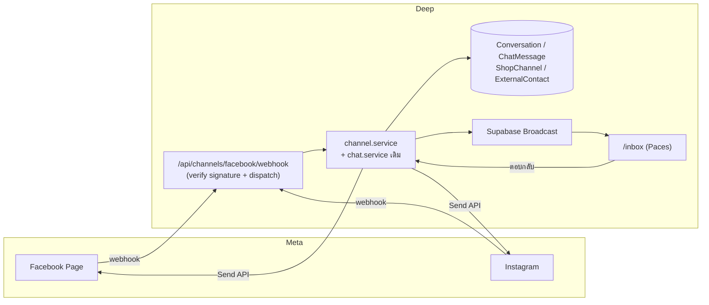
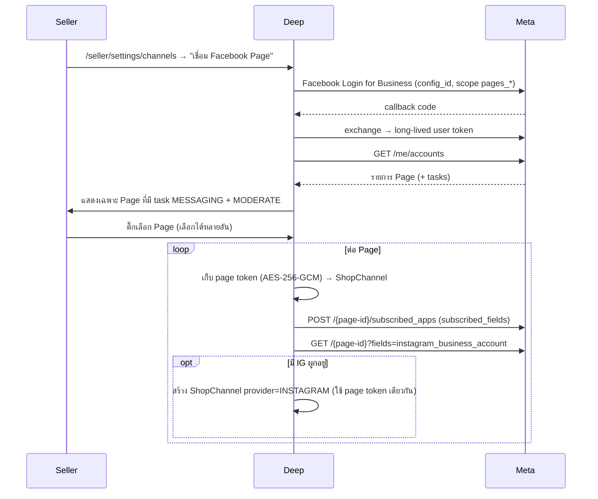
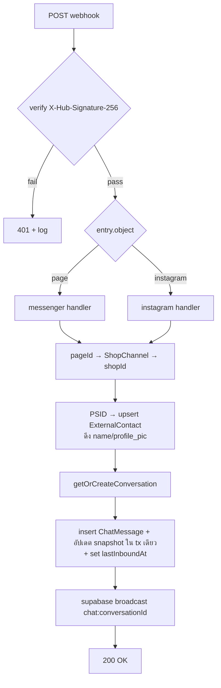

# Facebook / Instagram Chat Integration — Design Spec

- **วันที่:** 2026-07-22
- **Branch:** `feat/chats-facebook`
- **สถานะ:** DRAFT — รอ user review
- **Feature number (จอง):** `00017 - Facebook Chat Integration`
- **ต่อยอดจาก:** feature `00011 - Deep Chat` (in-app chat buyer↔seller)

---

## 1. เป้าหมาย

ให้ seller ตอบลูกค้าที่ทักเข้ามาทาง **Facebook Page (Messenger)** และ **Instagram DM** ได้จาก `/inbox` ของ Deep
โดยไม่ต้องสลับแอป — และต่อยอดเป็นออเดอร์ในระบบได้ทันทีจากในเธรด

**ปัญหาที่แก้:** ทุกวันนี้ลูกค้าส่วนใหญ่ทักผ่าน Messenger แต่ระบบ Deep เห็นเฉพาะแชทใน
แอปตัวเอง → seller ต้องสลับหน้าจอ, ประวัติลูกค้าขาดตอน, ตัวเลข response-time ของ Deep
ไม่สะท้อนความจริง

## 2. ขอบเขต

### 2.1 อยู่ใน scope (MVP)

| # | รายการ |
|---|---|
| S-1 | รับข้อความ **text + รูปภาพ** จาก Messenger และ Instagram DM เข้ามาแสดงใน `/inbox` |
| S-2 | ตอบกลับจาก Deep → ส่งออกไป Messenger/IG จริง (text + รูป) |
| S-3 | **24-hour window guard** — แสดงเวลาที่เหลือ + ปิดช่องพิมพ์เมื่อหมดเวลา |
| S-4 | **สร้างออเดอร์ / แนบสินค้าจากเธรด FB** (ผูกเข้า Customer Directory เมื่อได้เบอร์) |
| S-5 | หน้าเชื่อม/ถอด Page ที่ `/seller/settings/channels` (1 Shop : N Page) |
| S-6 | รองรับ `is_echo` — ข้อความที่ seller ตอบจากแอป Messenger โดยตรงต้องเข้ามาใน Deep ด้วย |

### 2.2 นอก scope (phase นี้)

- **Facebook Live comment integration** — user ยืนยันว่าอยากได้ในอนาคต แต่ไม่ใช่ phase นี้
  (ดู §9 รอยต่อที่วางไว้รองรับ)
- Human Agent tag (ยืด window เป็น 7 วัน) — ต้องขอ feature เพิ่มใน App Review → Phase 2
- Comment on post → private reply
- ข้อความเสียง / วิดีโอ / ไฟล์แนบทั่วไป
- Broadcast / message template / chatbot อัตโนมัติ
- WhatsApp

## 3. ข้อจำกัดจาก Meta (ยืนยันจาก docs แล้ว)

### 3.1 Permission ที่ต้องขอ

| Permission | ใช้ทำอะไร |
|---|---|
| `pages_messaging` | ส่ง/รับข้อความแทน Page |
| `pages_show_list` | ดึงรายการ Page ที่ user ดูแล |
| `pages_manage_metadata` | subscribe webhook ให้ Page |
| `pages_read_engagement` | อ่านข้อมูล Page |
| `business_management` | **dependency บังคับ** ของ `pages_messaging`, `pages_show_list`, `instagram_manage_messages` |
| `instagram_basic` + `instagram_manage_messages` | IG DM |

ผู้ที่กดเชื่อมต้องมีสิทธิ์ Page task **`MESSAGING` + `MODERATE`**

### 3.2 App Review / Advanced Access — blocker หลัก

- **Standard Access** (สถานะปัจจุบัน): ใช้ได้เฉพาะ Page ที่ admin/developer/tester ของ App เป็นเจ้าของ
  → **พอสำหรับ dev + QA แต่ร้านค้าคนนอกใช้ไม่ได้**
- **Advanced Access** (จำเป็นสำหรับ production จริง): ต้องผ่าน **App Review + Business Verification**
  ใช้เวลาโดยทั่วไป 1–4 สัปดาห์ ต้องมี screencast, privacy policy, verify นิติบุคคล
- **การตัดสินใจ:** ยอมรับความเสี่ยงนี้ — build ให้เสร็จ, QA ด้วย Page ของทีมเอง, ยื่น review ขนานกันไป

### 3.3 24-hour standard messaging window

หลังลูกค้าส่งข้อความล่าสุด ร้านตอบได้ภายใน 24 ชม. เท่านั้น เกินแล้วส่งไม่ออก
MVP **ไม่ใช้ message tag** เพราะมีแค่ 3 แบบ (`CONFIRMED_EVENT_UPDATE`, `POST_PURCHASE_UPDATE`,
`ACCOUNT_UPDATE`) และการใช้ผิดวัตถุประสงค์คือเหตุให้ Meta ระงับแอป

## 4. สถานะปัจจุบันของ Facebook App (ผลตรวจจริง 2026-07-22)

ตรวจผ่าน Graph API ด้วย app access token:

| รายการ | ผล |
|---|---|
| App ที่ระบบใช้ login ปัจจุบัน | `990205170388742` (`FACEBOOK_ID`) |
| App ที่ตั้งใจใช้ทำ chat | `1570859340799126` — ชื่อ **"Deep Chat & LIVE"** (category Business) |
| Webhook ของ app chat | มีอยู่: `object=page`, field `messages` (v24.0), `active: true` |
| Callback URL ที่ตั้งไว้ | `https://7429-124-122-138-213.ngrok-free.app/facebook/webhook` — **ตาย** (curl ได้ 404) |
| Roles | admin 1 คน (`3754113464724776`) ไม่มี tester |

### 4.1 สิ่งที่พบและต้องจัดการ

1. **App chat ยังไม่ได้ผูกกับ repo นี้เลย** — grep ทั้งโปรเจกต์ไม่เจอ app id `1570859340799126`
   และไม่มี webhook route ใด ๆ ใน `src/` (หา `hub.challenge` / `X-Hub-Signature` ได้ศูนย์)
   → subscription ที่มีอยู่ถูกตั้งจากนอก repo นี้ (prototype แยก)
2. 🔒 **ความเสี่ยงข้อมูลลูกค้า** — subscription ยัง `active: true` ชี้ไปโดเมน ngrok ฟรีที่ถูกเวียนใช้ใหม่ได้
   ถ้ามี Page ใด subscribe แอปนี้ค้างอยู่ ข้อความลูกค้าจะถูกยิงไปหาใครก็ไม่รู้ที่จับโดเมนนั้นได้
   (เขา verify signature ไม่ได้ แต่ payload ถึงมือแล้ว)
   → **ปิด/เปลี่ยน callback URL ทิ้งก่อนเริ่มงาน**
3. **`FACEBOOK_SECRET` ใน `.env.local` ใช้ไม่ได้แล้ว** — Graph API คืน `OAuthException code 190
   Invalid OAuth access token signature` (รูปแบบ secret ปกติ 32 ตัวอักษร) แปลว่าถูก regenerate
   ในหน้า dashboard แล้วไม่ได้อัปเดตกลับ → **FB login บน dev พังอยู่ตอนนี้**
4. **ยังขาด subscription ที่ scope นี้ต้องใช้** — มีแค่ field `messages`
   ยังไม่มี `messaging_postbacks`, `message_reactions` และ **ไม่มี `object=instagram`**

### 4.2 App settings ของ `1570859340799126` (ตรวจ 2026-07-22)

| field | ค่า | หมายเหตุ |
|---|---|---|
| `app_domains` | **ว่าง** | ยังไม่ได้ตั้งโดเมนสำหรับ web login |
| `privacy_policy_url` | Google Drive share link | ❌ Meta ต้องการ URL สาธารณะที่เปิดได้โดยไม่ต้อง login — ลิงก์ Drive ถูกตีตกเป็นประจำ |
| `terms_of_service_url` | `https://www.facebook.com/` | ❌ placeholder |
| ชื่อแอปที่ผู้ใช้เห็นตอนกดอนุญาต | "Deep Chat & LIVE" | ควรเปลี่ยนเป็นชื่อแบรนด์ "Deep" ก่อนยื่น review |

ทดสอบ OAuth dialog ด้วย `redirect_uri` ของ prod: ทั้งแอปนี้และแอป login เดิมตอบเหมือนกัน
(เด้งหน้า login ปกติ ไม่มี `Invalid App ID` / `App Not Setup`) → app ID ใช้การได้
แต่ **การทดสอบแบบไม่ล็อกอินยืนยัน redirect-URI whitelist ไม่ได้** เพราะ Meta เช็คขั้นนั้นหลัง user login

### 4.3 การตัดสินใจ: ใช้ 2 app แยก (Q-1 — ปิดแล้ว)

> ⚠️ **แก้ข้อมูลที่เคยระบุผิดในร่างแรก:** Business Verification ทำที่ระดับ **Business Portfolio**
> ไม่ใช่ราย app — แอปที่อยู่ portfolio เดียวกันใช้ผลร่วมกันได้ ต้นทุนของการมี 2 app จึงเป็นแค่
> **App Review เพิ่มอีก 1 รอบ** ไม่ใช่ verification ซ้ำ

**ข้อมูลประกอบการตัดสิน** — นับ `AuthAccount` ใน DB จริง: `PHONE 6 · LINE 4 · FACEBOOK 2 · EMAIL 1`
มี user ที่ผูก Facebook อยู่แค่ 2 คน ดังนั้นข้อโต้แย้งที่ว่า "ย้าย login ไปแอปใหม่แล้วผู้ใช้เก่าหลุด
เพราะ FB user ID เป็น app-scoped" (ข้อเท็จจริงที่ `src/lib/auth.ts:101` คอมเมนต์ไว้เอง)
**มีน้ำหนักน้อยมากในทางปฏิบัติ** — จึงไม่ใช่เหตุผลหลักของการตัดสินใจ

**สรุป: ใช้ 2 app แยก** — login คงอยู่ที่ `990205170388742`, chat ใช้ `1570859340799126`

1. ต้นทุนที่เพิ่มคือ App Review รอบเดียว ไม่ใช่ verification ซ้ำ
2. login ปัจจุบัน live บน prod อยู่แล้ว — ไม่มีเหตุผลให้ไปแตะของที่ทำงานอยู่
3. แอปเดิมมี App Review เรื่อง scope `email` ค้างอยู่ ([[project_fb_login_app_review]]) — เอา
   permission ชุด `pages_*` ไปยัดเพิ่มตอนนี้เสี่ยงกวนรอบที่ค้าง
4. ถ้า review messaging ตก **login ของทั้งระบบไม่ล้มตาม**

env ของ chat จึงแยกชุด (`FB_CHAT_APP_ID` / `FB_CHAT_APP_SECRET`) ไม่ปนกับ `FACEBOOK_ID` /
`FACEBOOK_SECRET` ของ login — ถ้าอนาคตเปลี่ยนใจไปรวมเป็น app เดียว แก้แค่ค่า env ไม่ต้องแก้โค้ด

#### ผลต่อ UX: seller จะเจอหน้าขออนุญาต 2 ครั้ง

seller เห็น consent dialog ของ Facebook 2 รอบ — ตอน login รอบหนึ่ง ตอนกดเชื่อม Page อีกรอบหนึ่ง

**สำคัญ: จำนวนนี้เท่ากันไม่ว่าจะใช้ 1 app หรือ 2 app** เพราะ login ขอแค่ `public_profile` +
`email` ส่วนการเชื่อม Page ต้องขอ `pages_messaging` / `pages_show_list` / `business_management`
เพิ่ม ซึ่ง Facebook บังคับให้ขอด้วย dialog ใหม่เสมอ (incremental authorization)

🛑 **ห้ามแก้ด้วยการยกไปขอ scope ชุด `pages_*` ตั้งแต่ตอน login** — คนที่แค่มาสมัครใช้งานจะโดนขอ
สิทธิ์จัดการเพจทั้งหมด ทำให้ conversion ตกและเป็นเหตุให้ App Review ไม่ผ่านเพราะขอเกินจำเป็น

ความต่างจริงระหว่าง 1 app กับ 2 app จึงไม่ใช่จำนวน dialog แต่คือ **ชื่อแอปที่แสดงใน dialog**
→ แก้ด้วยการตั้งชื่อ/โลโก้/Business Portfolio ให้เป็นแบรนด์เดียวกัน (§13 ข้อ 6)

## 5. สถาปัตยกรรม

### 5.1 ทางเลือกที่พิจารณา

| ทางเลือก | ข้อดี | ข้อเสีย | ผล |
|---|---|---|---|
| **A. ขยาย `Conversation`/`ChatMessage` ให้ channel-aware** | inbox เดียวจริง; reuse pagination / unread / broadcast / scam-detector / metrics cron / ปุ่มสร้างออเดอร์ ได้ฟรีทั้งชุด | query & UI เดิมต้องรับ `null` | ✅ **เลือก** |
| B. แยก model (`FbConversation`/`FbMessage`) แล้ว merge ที่ service | ไม่แตะของเดิม regression ต่ำสุด | inbox ต้อง merge 2 source พร้อม cursor pagination ข้าม source; duplicate logic ทุกอย่าง; "สร้างออเดอร์จากเธรด" ต้องทำ 2 path | ❌ |
| C. ต่อผ่านตัวกลาง (Chatwoot / n8n) | POC เร็ว | ไม่ได้ inbox เดียว, ค่าใช้จ่ายรายเดือน, **ยังต้อง App Review อยู่ดี** | ❌ |

**เหตุผลที่เลือก A:** สิ่งที่อยู่ใน MVP (24h guard, สร้างออเดอร์จากเธรด, IG DM) ราคาขึ้นเป็น
2 เท่าถ้าไปทาง B — และการรองรับ IG DM บังคับให้ต้องออกแบบแบบ channel-agnostic ตั้งแต่แรกอยู่แล้ว
ซึ่งก็คือ A พอดี

### 5.2 ภาพรวม



## 6. Data model

### 6.1 Model ใหม่

```prisma
// ShopChannel — Page/IG ที่ร้านผูกไว้ (1 Shop : N channel)
model ShopChannel {
  id                String    @id @default(uuid())
  shopId            String
  provider          String    // "MESSENGER" | "INSTAGRAM"
  externalId        String    // Page ID หรือ IG Business Account ID
  name              String    // ชื่อ Page ณ เวลาเชื่อม (cache ไว้แสดงใน UI)
  avatarUrl         String?
  accessTokenEnc    String    // Page access token — AES-256-GCM ก่อนเก็บเสมอ
  connectedByUserId String
  status            String    @default("ACTIVE") // ACTIVE | TOKEN_INVALID | DISCONNECTED
  createdAt         DateTime  @default(now())

  shop Shop @relation(fields: [shopId], references: [id], onDelete: Cascade)

  @@unique([provider, externalId]) // 1 Page ผูกได้ร้านเดียวทั้งระบบ — กันสองร้านแย่ง inbox เดียวกัน
  @@index([shopId, status])
}

// ExternalContact — ลูกค้าจากช่องทางนอก (ไม่ใช่ User ของ Deep)
model ExternalContact {
  id             String   @id @default(uuid())
  shopChannelId  String
  externalUserId String   // PSID / IGSID
  name           String?
  avatarUrl      String?
  customerId     String?  // link → Customer (feature 00014) เมื่อได้เบอร์
  createdAt      DateTime @default(now())

  channel  ShopChannel @relation(fields: [shopChannelId], references: [id], onDelete: Cascade)
  customer Customer?   @relation(fields: [customerId], references: [id], onDelete: SetNull)

  @@unique([shopChannelId, externalUserId]) // PSID เป็น page-scoped — ห้าม dedup ข้าม Page
}
```

> **ทำไมไม่สร้าง `User` เงาให้ลูกค้า FB:** จะทำให้ `User` table เต็มไปด้วย ghost account และ
> logic ทุกตัวที่นับจาก `User` (trust score, badge, admin list, auth surface) ต้องมาไล่กันทีหลัง
>
> **ทำไมไม่สร้าง `Customer` ทันที:** `Customer.phone` เป็น `required @unique` — เป็นแกนของ
> cross-shop dedup ทั้งระบบ (feature 00014) การทำให้ nullable เพื่อรองรับ FB จะพังกลไกนั้น

### 6.2 แก้ model เดิม (additive ล้วน — ไม่ลบ/ไม่เปลี่ยนชนิดคอลัมน์เดิม)

| Model | เปลี่ยน | เหตุผล |
|---|---|---|
| `Conversation` | `buyerUserId` → `String?` | เธรด FB ไม่มี User |
| | `+ channel String @default("DEEP")` | backfill row เดิมปลอดภัยโดยอัตโนมัติ |
| | `+ shopChannelId String?` / `+ externalContactId String?` | |
| | `+ lastInboundAt DateTime?` | ฐานคำนวณ 24h window |
| | `+ @@unique([shopChannelId, externalContactId])` | 1 เธรดต่อ (Page, PSID) — กัน race แบบเดียวกับ BR-CHAT-02 |
| `ChatMessage` | `senderUserId` → `String?` | |
| | `+ externalMessageId String? @unique` | **idempotency** — Meta redeliver webhook ได้ตลอด |
| | `+ deliveryStatus String?` / `+ failureReason String?` | ส่งไม่ออกต้องเห็นในเธรด ห้าม fail เงียบ |

**คงไว้ไม่แตะ:** `senderRole` ยังเป็น `"BUYER"` / `"SHOP"` เหมือนเดิม — ฝั่งลูกค้า FB นับเป็น
`BUYER` ทำให้ unread logic, inbox preview, scam-link detector และ response-metrics cron
**ไม่ต้องแก้แม้แต่บรรทัดเดียว**

**`@@unique([buyerUserId, shopId])` เดิมยังอยู่ได้** เพราะ PostgreSQL ไม่บังคับ unique กับค่า `NULL`
→ เธรด FB ทุกแถวมี `buyerUserId = NULL` จึงไม่ชนกันเอง

### 6.3 Migration

🛑 **ห้าม `prisma migrate dev`** — DB dev กับ prod เป็นตัวเดียวกันและมี drift อยู่
(ดู `docs/conventions/prisma-shared-db-drift.md`) → เขียน SQL เอง แล้ว
`prisma migrate deploy -e .env.local` **หลังขอ user ยืนยัน** เพราะเป็นการแตะ prod

ลำดับ: สร้าง table ใหม่ 2 ตัว → `ALTER TABLE` เพิ่มคอลัมน์ nullable → drop NOT NULL ของ
`buyerUserId` / `senderUserId` → เพิ่ม unique index ใหม่ (ไม่มี backfill เพราะ default ครอบให้แล้ว)

## 7. Flow

### 7.1 เชื่อม Page (OAuth แยกจาก login)

🛑 **ห้ามเอา scope เหล่านี้ไปใส่ `FacebookProvider` ของ NextAuth ที่มีอยู่** — นั่นคือ login
ของผู้ใช้ทั่วไป ถ้าเอา scope จัดการเพจไปใส่ ผู้ใช้ทุกคนจะโดนขอสิทธิ์เกินจำเป็น และถ้า
App Review ตก **login ของทั้งระบบพังตามไปด้วย**



Page access token ที่ออกจาก long-lived user token ไม่หมดอายุเอง แต่ **ตายทันที** ถ้าเจ้าของ
ถอนสิทธิ์ / เปลี่ยนรหัสผ่าน / ลบแอป → ต้องจับ error แล้วตั้ง `status = TOKEN_INVALID`
พร้อมแบนเนอร์ "เชื่อมต่อใหม่" ในหน้า channels

### 7.2 Webhook ขาเข้า

Route เดียว: `src/app/api/channels/facebook/webhook/route.ts`

- **`GET`** — `hub.mode=subscribe` เทียบ `FB_WEBHOOK_VERIFY_TOKEN` → คืน `hub.challenge`
- **`POST`** — verify `X-Hub-Signature-256` = `HMAC-SHA256(raw body, app secret)`
  เทียบแบบ **timing-safe** แล้วตอบ `200` ให้เร็วที่สุด (Meta retry ถ้าช้าหรือพัง)

🛑 **ต้องยกเว้น route นี้จาก `guardApi` ใน `src/proxy.ts`** (Origin-check + rate limit)
เพราะ Meta ไม่ส่ง header `Origin` — ยกเว้นรูปแบบเดียวกับที่ `/api/auth/*` ทำอยู่ แล้วใส่
rate-limit เฉพาะทางแทน **ลายเซ็นคือ authentication จริงของ route นี้**



**Dispatcher แยกตาม `object` + `field`** — นี่คือรอยต่อที่เตรียมไว้ให้ LIVE ในอนาคต (§9)

**สองจุดที่มักพลาด:**

1. **`message.is_echo`** — ข้อความที่ seller ตอบจากแอป Messenger ในมือถือโดยตรง Meta จะยิง
   echo กลับมา ต้องบันทึกเป็น `senderRole = "SHOP"` ไม่งั้น inbox ใน Deep จะไม่ตรงกับความจริง
   (seller ไทยส่วนใหญ่ยังตอบจากมือถือ — **ถ้าไม่ทำข้อนี้ระบบใช้งานจริงไม่ได้**)
2. **รูปภาพ** — URL ที่ Meta ส่งมาหมดอายุ ต้องดาวน์โหลดแล้วอัปโหลดเข้า storage ของเราเอง
   (reuse `lib/storage` เดิม) แล้วเก็บลง `imageUrl`

### 7.3 ขาออก + 24h window

`POST /api/chat/conversations/{id}/messages` เดิม → ถ้า `channel != "DEEP"` แตกไป channel adapter
→ `POST /{page-id}/messages` (`messaging_type: RESPONSE`, `recipient: { id: PSID }`)

**ลำดับสำคัญ — ส่งออกก่อน แล้วค่อยเขียน DB:**

```
send ผ่าน Send API → ได้ mid → insert ChatMessage พร้อม externalMessageId = mid
```

เพราะ echo webhook จะยิง `mid` เดียวกันกลับมา แล้ว unique constraint บน `externalMessageId`
จะ dedupe ให้อัตโนมัติ — ได้กลไกกันซ้ำฟรีจากการออกแบบ ไม่ต้องเขียน logic แยก

**24h window:**

- `windowExpiresAt = lastInboundAt + 24h`
- ใกล้หมด → แบนเนอร์เตือนเวลาที่เหลือ
- หมดแล้ว → **ปิดช่องพิมพ์ + บอกเหตุผลตรง ๆ** (ไม่ปล่อยให้กดส่งแล้วค่อย error)
- ส่งไม่ออกด้วยเหตุอื่น (ลูกค้าบล็อก, token ตาย) → `deliveryStatus = "FAILED"` +
  `failureReason` **แสดงในเธรด** ห้าม fail เงียบ

## 8. UI

🛑 ทุกหน้าต้องผ่าน `safepay-ux` ออก Design Spec **ก่อน** เขียนโค้ด (Hard Rule 8)
และประกอบจาก Paces primitive ล้วน ห้าม arbitrary Tailwind value (Hard Rule 7)
ห้าม emoji ใช้ tabler icon จริง (Hard Rule 12)

| หน้า | เปลี่ยนอะไร |
|---|---|
| `/inbox` (seller) | badge ช่องทาง (`tabler-brand-messenger` / `tabler-brand-instagram`), filter ตาม Page, แบนเนอร์ 24h |
| `/seller/settings/channels` | **หน้าใหม่** — รายการ Page ที่เชื่อม, สถานะ token, ปุ่มเชื่อม/ถอด |
| `/orders/new` | รับ prefill จากเธรด FB |
| buyer app `/messages` | **ไม่เปลี่ยนอะไรเลย** — เธรด FB ไม่โผล่ฝั่ง buyer |

**สร้างออเดอร์จากเธรด:** reuse `/orders/new` แบบ prefill — บังคับกรอกเบอร์ (เพราะ
`Customer.phone` required + unique) → สร้าง/ผูก `Customer` → เซ็ต `ExternalContact.customerId`
ครั้งเดียว ครั้งถัดไปรู้จักลูกค้าคนนี้ทันที

> **หมายเหตุเรื่อง HTML mockup:** ตาม convention ของโปรเจกต์ spec ที่มี UI ต้องมาคู่กับ HTML
> mockup 3 device (mobile/tablet/desktop) — spec ฉบับนี้ **ยังไม่แนบ** เพราะ UI ทั้งหมดต้อง
> ผ่าน `safepay-ux` ก่อนตาม Hard Rule 8 mockup จะออกในขั้น feature docs `00017` ไม่ใช่ที่นี่

## 9. รอยต่อที่เตรียมไว้สำหรับ Facebook Live (อนาคต)

user ยืนยันว่าอยากได้ LIVE ในอนาคต แต่ **phase นี้ไม่ทำ** และ **ไม่สร้าง model เผื่อ** (YAGNI)
สิ่งที่ทำคือวางรอยต่อ 2 จุดที่แพงถ้าต้องย้อนกลับมาแก้:

1. **webhook เป็น route เดียว + dispatcher แยกตาม `object`/`field`** → เพิ่ม `feed` /
   `live_videos` ทีหลังได้โดยไม่แตะ handler เดิม
2. **`ShopChannel` ถือ Page + token อยู่แล้ว** → LIVE ใช้ record เดิมได้เลย ไม่ต้องเชื่อม Page ซ้ำ

**สิ่งที่ตั้งใจ *ไม่* ทำ:** ยัดคอมเมนต์ LIVE ลง `Conversation` — คอมเมนต์เป็น public thread
บนวิดีโอ ไม่ใช่บทสนทนา 1:1 คนละ shape กัน การบังคับให้ใช้ model เดียวกันจะทำให้ทั้งสองฝั่งเพี้ยน

## 10. Security

| ประเด็น | มาตรการ |
|---|---|
| Page access token | AES-256-GCM ก่อนเก็บ (key = env `CHANNEL_TOKEN_KEY`), ห้าม log, ห้ามส่งกลับ client |
| Webhook auth | `X-Hub-Signature-256` timing-safe compare — **นี่คือ authentication เดียวของ route นี้** |
| CSRF / rate limit | ยกเว้น webhook จาก `guardApi` แต่ใส่ rate-limit เฉพาะทางแทน |
| PII ใน RSC | ชื่อ/PSID/avatar ลูกค้าต้อง neutralize ที่ server boundary ก่อนส่งเข้า flight (บทเรียน `feedback_rsc_pii_neutralize_at_source` — หน้า seller อยู่ใต้ client layout) |
| Authorization | ทุก query filter `shopId` + เช็คสิทธิ์ staff (feature 00012) |
| Input validation | Valibot ทุก payload ที่มาจาก webhook — ห้ามเชื่อ shape จาก Meta ตรง ๆ |

## 11. Testing

- **Playwright E2E บังคับ** (convention ของโปรเจกต์) ครอบ: เชื่อม Page, รับข้อความ, ตอบกลับ,
  24h หมดอายุ, สร้างออเดอร์จากเธรด
- **สคริปต์ยิง webhook ปลอมที่เซ็น signature จริง** เพื่อทดสอบ handler โดยไม่ต้องพึ่ง Meta
  (ครอบ: ข้อความปกติ, `is_echo`, รูปภาพ, redelivery ซ้ำ, signature ผิด)
- Dev ต้องใช้ **ngrok** (webhook ต้องเป็น public HTTPS) — ตั้ง callback ชี้
  `/api/channels/facebook/webhook` **ไม่ใช่** `/facebook/webhook` แบบที่ตั้งค้างไว้ตอนนี้
- QA ระดับ visual ผ่าน Chrome DevTools MCP ที่ `*.deepth.local:4000`

## 12. Env vars ใหม่

| Key | ใช้ทำอะไร |
|---|---|
| `FB_CHAT_APP_ID` | App ID ของแอป chat (แยกจาก `FACEBOOK_ID` ที่ใช้ login) |
| `FB_CHAT_APP_SECRET` | App Secret — ใช้ทั้ง exchange token และ verify webhook signature |
| `FB_WEBHOOK_VERIFY_TOKEN` | ค่าสุ่มที่ตั้งเองสำหรับ handshake ตอน subscribe webhook |
| `CHANNEL_TOKEN_KEY` | key 32 byte สำหรับ AES-256-GCM เข้ารหัส page token |

## 13. งานที่ต้องทำก่อนเริ่มเขียนโค้ด

1. **ปิด/เปลี่ยน callback URL ngrok ที่ค้างอยู่** (ความเสี่ยงข้อมูลลูกค้า — §4.1 ข้อ 2)
2. **อัปเดต `FACEBOOK_SECRET` ใน `.env.local`** ให้ FB login บน dev กลับมาใช้ได้ (§4.1 ข้อ 3)
3. **เปิดโฟลเดอร์ `docs/20 - Features/00017 - Facebook Chat Integration/`** แล้วออก PRD + BRD
   ให้ user review — Hard Rule 11 ห้าม implement ก่อนมี PRD+BRD ผ่าน review

**งานฝั่ง Meta dashboard ที่ทำขนานไปได้ (ไม่บล็อกการเขียนโค้ด แต่บล็อกการใช้งานจริง)** — §4.2:

4. เปลี่ยน `privacy_policy_url` จากลิงก์ Google Drive → หน้าสาธารณะบนโดเมนตัวเอง
   (มีอยู่แล้วในระบบ ใช้ซ้ำได้)
5. เปลี่ยน `terms_of_service_url` จาก placeholder `https://www.facebook.com/` → หน้าจริง
6. เปลี่ยนชื่อแอปจาก "Deep Chat & LIVE" → ชื่อแบรนด์ "Deep" (ผู้ใช้เห็นชื่อนี้ตอนกดอนุญาต)
7. ตั้ง `app_domains` + Valid OAuth Redirect URIs
8. เริ่ม Business Verification (ระดับ Business Portfolio) + ยื่น App Review permission ชุด `pages_*`

## 14. Open questions

| # | คำถาม | สถานะ |
|---|---|---|
| Q-1 | ใช้ 1 app หรือ 2 app (login vs chat) | ✅ **ปิดแล้ว — 2 app แยก** (เหตุผลใน §4.3) |
| Q-2 | Page ที่ทีมใช้ QA คือ Page ไหน (ต้องมี admin เป็น role ในแอป) | รอ user |
| Q-3 | ถ้าลูกค้าคนเดิมทักมาทั้ง Messenger และ IG จะ merge เธรดไหม | **ไม่ merge ใน MVP** — PSID กับ IGSID ไม่มีตัวเชื่อม เว้นแต่ได้เบอร์แล้วผูก `Customer` เดียวกัน |
