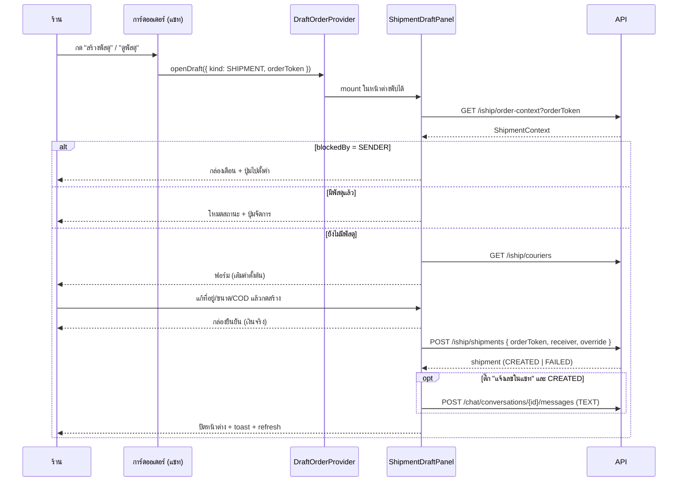

# โมดัลสร้าง/ดูพัสดุในหน้าแชท

> ส่วนขยายของ feature 00022 — ไม่ใช่ feature ใหม่ ไม่ต้องจองเลขใหม่
> เอกสารเจ้าของเรื่องที่ต้อง sync ตอนจบ: `SRS.md` §5, `SDS.md` §4, `API.md`

---

## 1. ปัญหา

ปุ่ม **"สร้างพัสดุ"** บนการ์ดออเดอร์ในห้องแชท (`CustomerPanel.tsx` → `OrderCard`) ยิง
`POST /api/seller/iship/shipments` ตรงหลังกล่องยืนยัน โดยส่งไปแค่ `{ orderToken }` — ไม่มีทางแก้อะไรได้เลย

ผลที่ตามมา 3 อย่าง:

1. **ที่อยู่ผู้รับผิดแล้วแก้ไม่ได้** ทั้งที่ร้านเพิ่งคุยกับลูกค้าเรื่องที่อยู่อยู่ในห้องนั้นเอง — ต้องออกไปหน้าคำสั่งซื้อ แก้ แล้วเดินกลับมา
2. **ปรับขนาด/น้ำหนัก/ขนส่ง/COD รายใบไม่ได้** ใช้ค่าตั้งต้นร้านล้วน (known-gap ที่ `RESUME.md` §6 บันทึกไว้)
3. **ออเดอร์ที่มีพัสดุแล้ว กดปุ่มก็ยังยิงซ้ำ** ได้ 409 กลับมาเป็น toast แดง แทนที่จะบอกว่า "มีอยู่แล้ว เลขนี้"

ระหว่างสำรวจยังพบบั๊ก 3 จุดที่ต้องปิดไปพร้อมกัน เพราะโมดัลนี้พึ่งข้อมูลชุดเดียวกัน — ดู §3

---

## 2. ขอบเขต

### ทำ
- กดปุ่มบนการ์ดออเดอร์ในแชท → เปิด **หน้าต่างพับได้ตัวเดียวกับโมดัลสร้าง/แก้ไขคำสั่งซื้อ** (`DraftOrderProvider`)
- โมดัลมี 3 โหมดตามสถานะจริงของออเดอร์ (§5)
- แก้ได้: ผู้รับ (ชื่อ/เบอร์/ที่อยู่/ตำบล-อำเภอ-จังหวัด-รหัส) · ขนส่ง · น้ำหนัก · กว้าง×ยาว×สูง · ประเภทสินค้า · COD · หมายเหตุ · ตัวเลือกเสริม
- checkbox **"แจ้งเลขติดตามในแชทหลังสร้าง"** ติ๊กไว้เป็นค่าตั้งต้น ร้านเอาออกได้
- สกัดส่วนสร้าง/สถานะเป็น component กลาง แล้ว **หน้าคำสั่งซื้อเปลี่ยนมาใช้ตัวเดียวกัน** (ทางเลือก B)

### ไม่ทำ
- เรียกรถเข้ารับ (pickup) จากโมดัลแชท — ยังอยู่ที่หน้าตั้งค่า
- แก้ที่อยู่**ผู้ส่ง**ในโมดัล — เป็นค่าระดับร้าน แก้ที่เดียวจบที่หน้าตั้งค่า โมดัลแค่พาไป
- เปิด webhook (ยังพักตามมติ 2026-07-26)
- แตะ `Order.status` / `ShipmentTracking` (BR-ISHIP ห้ามไว้ — ดู `RESUME.md` §4.2)

---

## 3. บั๊กที่ต้องปิดไปพร้อมกัน

### 3.1 `findMissingSenderFields` ใช้คำของผู้รับ (blocker)

`src/lib/iship/mapping.ts:102-114` — ฟังก์ชันตรวจที่อยู่**ผู้ส่ง** push คำว่า `"ชื่อผู้รับ"` / `"เบอร์โทรผู้รับ"`
เพราะ type `MissingAddressField` มีแค่ 7 ค่าที่เป็นคำของผู้รับ

ผลจริงที่วัดได้ (ร้าน `d8cf8116…`, `ShopShippingAccount.status = ACTIVE`, sender ทั้ง 7 ช่อง = `null`):
หน้าคำสั่งซื้อขึ้น *"ยังขาด ชื่อผู้รับ, เบอร์โทรผู้รับ, ที่อยู่, ตำบล, อำเภอ, จังหวัด, รหัสไปรษณีย์"*
ทั้งที่ข้อมูลผู้รับครบทุกช่อง

**แก้:** แยกเป็น 2 type
```ts
export type MissingReceiverField = "ชื่อผู้รับ" | "เบอร์โทรผู้รับ" | "ที่อยู่"
  | "ตำบล" | "อำเภอ" | "จังหวัด" | "รหัสไปรษณีย์"
export type MissingSenderField = "ชื่อผู้ส่ง" | "เบอร์โทรผู้ส่ง" | "ที่อยู่ผู้ส่ง"
  | "ตำบล (ผู้ส่ง)" | "อำเภอ (ผู้ส่ง)" | "จังหวัด (ผู้ส่ง)" | "รหัสไปรษณีย์ (ผู้ส่ง)"
```
และ `EligibilityResult` สาขา `NEEDS_FIX` เพิ่ม `field: "SENDER" | "RECEIVER"` — ปลายทางจะได้เลือกได้ว่า
"พาไปตั้งค่า" หรือ "ให้กรอกตรงนี้" แทนที่จะเดาจากข้อความ

### 3.2 UI แยกไม่ออกว่าใครขาด → ทางตัน

`ShipmentPanel.tsx:231` เห็นแค่ `missing: string[]` เลยกางฟอร์มผู้รับให้กรอกเสมอ
แต่ `checkEligibility` ตรวจผู้ส่ง**ก่อน**และ return ทันที (`eligibility.ts:65-68`) — และ `createShipment`
ก็ตรวจลำดับเดียวกัน (`iship.service.ts:641`)

⇒ ร้านกรอกผู้รับครบแค่ไหน กดปุ่มก็ได้ข้อความเดิมกลับมา **วนไม่จบ** ทางแก้จริงอยู่คนละหน้า

### 3.3 label ซ้ำ 2 บรรทัด

`ShipmentPanel.tsx:260` เขียน `<label>ตำบล / อำเภอ / จังหวัด / รหัสไปรษณีย์</label>` เอง
ทั้งที่ `AddressSearchPanel.tsx:109` มี label ตัวเดียวกันอยู่ในตัว (`CartPanel.tsx:316` เรียกถูกแล้ว — ไม่ใส่ครอบ)

---

## 4. สถาปัตยกรรม

### 4.1 หลักการ

ตรรกะ "ออเดอร์ใบนี้เปิดพัสดุได้ไหม / ขาดอะไร / มีพัสดุอยู่หรือยัง" ต้องมีชุดเดียว
หน้าคำสั่งซื้อ (server component) กับโมดัลแชท (client) ต่างกันแค่**วิธีได้ข้อมูลมา** ไม่ใช่ตัวข้อมูล

- หน้าคำสั่งซื้อ → เรียก `getShipmentPanel()` ตอน render แล้วส่งเป็น prop
- โมดัลแชท → เรียก `GET /api/seller/iship/order-context` ตอนเปิด (การ์ดในแชทถือแค่ token)

ทั้งสองได้ **object รูปเดียวกัน** แล้วส่งต่อให้ component กลางชุดเดียวกัน

### 4.2 ไฟล์

```
src/components/safepay/iship/                    ← ใหม่ (component กลาง)
├── ShipmentCreateForm.tsx    ฟอร์มสร้างพัสดุ (ผู้รับ + พัสดุ + COD/ตัวเลือก)
├── ShipmentStatusView.tsx    สถานะพัสดุ + ปุ่มจัดการ
├── SenderIncompleteNotice.tsx  เตือนที่อยู่ผู้ส่งไม่ครบ + ปุ่มไปตั้งค่า
└── types.ts                  ShipmentContext (สัญญาร่วมของทั้ง 2 ที่)

src/lib/iship/mapping.ts          แยก MissingReceiverField / MissingSenderField (§3.1)
src/lib/iship/eligibility.ts      NEEDS_FIX เพิ่ม field: SENDER|RECEIVER
src/services/iship.service.ts     getShipmentPanel() คืน blockedBy + defaults เพิ่ม
src/app/api/seller/iship/order-context/route.ts   ← ใหม่ (GET)

src/app/(paces)/seller/(dashboard)/orders/[token]/components/ShipmentPanel.tsx
    → บางลงเป็น wrapper ที่ประกอบ component กลาง 3 ตัว (ลบ label ซ้ำ §3.3)

src/app/(paces)/seller/(chat)/_components/
├── DraftOrderProvider.tsx    รองรับ draft 2 ชนิด (ORDER | SHIPMENT)
└── ShipmentDraftPanel.tsx    ← ใหม่ (fetch context + ประกอบ + checkbox แจ้งเลข)

src/app/(paces)/seller/(chat)/inbox/[conversationId]/components/CustomerPanel.tsx
    → ปุ่มเปลี่ยนจาก "ยิง API" เป็น "เปิด draft kind=SHIPMENT"; คำบนปุ่มตามสถานะ
```

### 4.3 สัญญาร่วม `ShipmentContext`

```ts
export interface ShipmentContext {
  orderId: string
  orderToken: string
  /** null = เปิดพัสดุได้ / มีค่า = ติดที่ระดับร้าน ต้องไปแก้ที่หน้าตั้งค่า */
  blockedBy: { kind: "SENDER"; missing: MissingSenderField[] } | null
  /** ช่องผู้รับที่ยังขาด — กรอกในโมดัลได้เลย */
  missingReceiver: MissingReceiverField[]
  receiver: ReceiverData
  shipment: ShipmentView | null
  /** ค่าตั้งต้นของร้าน — เติมฟอร์มพัสดุ ร้านแก้รายใบได้ */
  defaults: ParcelDefaults
}
```

`ShipmentCreateForm` **ไม่รู้จักแชท** — checkbox "แจ้งเลขในแชท" เป็น `extraFields` slot ที่ผู้เรียกใส่เอง
และการส่งข้อความเกิดใน `onCreated(shipment)` ของฝั่งแชท ไม่ใช่ในฟอร์ม

---

## 5. สามโหมดของโมดัล

| เงื่อนไข | โหมด | เนื้อหา |
|---|---|---|
| `blockedBy !== null` | **ติดที่ร้าน** | กล่องเตือนสีส้ม บอกว่าที่อยู่ผู้ส่งยังไม่ครบ (ระบุช่อง) + ปุ่ม "ไปตั้งค่าที่อยู่ผู้ส่ง" → `/settings/shipping` · ไม่มีฟอร์ม เพราะกรอกไปก็สร้างไม่ได้ |
| `shipment === null` | **สร้าง** | ฟอร์ม 4 บล็อก (§5.1) + ปุ่ม "สร้างพัสดุ" |
| `shipment !== null` | **สถานะ** | เลขติดตาม/ขนส่ง/สถานะ/เวลา + ปุ่มจัดการ (§5.2) |

### 5.1 ฟอร์มสร้าง — 4 บล็อก

1. **ผู้รับ** — ชื่อ · เบอร์โทร · ที่อยู่ (บ้านเลขที่/ถนน) · ช่องค้นหาตำบล-อำเภอ-จังหวัด-รหัส
   ช่องที่อยู่ใน `missingReceiver` ติดกรอบเตือน + ข้อความใต้ช่อง
2. **พัสดุ** — ขนส่ง (select จาก `GET /couriers`) · น้ำหนัก (กก.) · กว้าง × ยาว × สูง (ซม.) · ประเภทสินค้า
3. **เพิ่มเติม** (พับไว้ ปิดเป็นค่าตั้งต้น) — เก็บเงินปลายทาง (COD) · หมายเหตุ · ส่งตรงเวลา · กล่องกันกระแทก · ประกันสินค้า + มูลค่า
4. **แจ้งเลขในแชท** — checkbox ติ๊กไว้ + ข้อความตัวอย่างที่ลูกค้าจะได้รับ

ทุกช่องเติมค่าตั้งต้นจาก `defaults` มาให้แล้ว ร้านที่ไม่แก้อะไรกดปุ่มเดียวจบเหมือนเดิม

### 5.2 โหมดสถานะ — ปุ่มจัดการ

คัดลอกเลข · แจ้งเลขในแชท · พิมพ์ใบปะหน้า · ดูสถานะล่าสุด (traces) · ยกเลิกพัสดุ
(ยกเลิกมีกล่องยืนยันแบบ danger; ยกเลิกสำเร็จ → โมดัลกลับเป็นโหมดสร้าง)

สถานะ `FAILED` → แสดงข้อความผิดพลาด + ปุ่ม "ลองใหม่" (`POST /shipments/{id}/retry` — ใช้คีย์เดิม ไม่เปิดใบที่สอง)

---

## 6. Data flow



---

## 7. Error handling

| กรณี | ทำอะไร |
|---|---|
| `order-context` โหลดไม่ได้ | โมดัลแสดงข้อความ + ปุ่มลองใหม่ ไม่ปิดหน้าต่างทิ้ง (ข้อมูลที่ร้านกรอกยังอยู่) |
| `GET /couriers` ล้ม | select ว่าง + ข้อความ "โหลดรายชื่อขนส่งไม่ได้ จะใช้ขนส่งค่าตั้งต้นของร้าน" — ยังกดสร้างได้ |
| สร้างพัสดุแล้ว **แต่ส่งข้อความไม่ผ่าน** | toast **warning** พร้อมเลขติดตาม + บอกให้แจ้งลูกค้าเอง — ห้ามบอกว่า "ล้มเหลว" (พัสดุเปิดจริงไปแล้ว = เงินออกแล้ว) — คงพฤติกรรมเดิมจาก `CustomerPanel.tsx:227` |
| `SHIPMENT_EXISTS` (409) | ไม่ขึ้น toast แดง แต่ refetch context แล้วสลับเป็นโหมดสถานะ |
| `INCOMPLETE_DATA` (422) | ไฮไลต์ช่องที่ขาดในฟอร์ม (map จาก `error.missing` ที่ `route-helpers.ts:51` ส่งมาอยู่แล้ว) แทน toast ลอย |
| ปิดหน้าต่างตอนกรอกค้าง | กล่องยืนยันแบบเดียวกับ draft order ("ถ้าอยากเก็บไว้ทำต่อ กดย่อ (−) แทน") |

---

## 8. การทดสอบ

**Unit (Vitest)** — 57 เคสเดิมต้องยังเขียว + เพิ่ม
- `findMissingSenderFields` คืนคำของ**ผู้ส่ง** ไม่ใช่ผู้รับ
- `checkEligibility` คืน `field: "SENDER"` เมื่อผู้ส่งขาด และ `"RECEIVER"` เมื่อผู้รับขาด
- ผู้ส่งขาด + ผู้รับขาดพร้อมกัน → ต้องได้ `SENDER` (ลำดับสำคัญ)
- เคส BR-ISHIP-31 เดิม (ตำบล/อำเภอลงคนละช่อง) ต้องยังคุมอยู่ — ค่าทดสอบต้อง**ต่างกัน** ไม่งั้นหลอกผ่าน

**E2E (Playwright, `ISHIP_DRY_RUN=1`)** — ต่อจาก `e2e/iship-shipping.spec.ts`
1. ร้านที่ผู้ส่งไม่ครบ → เห็นกล่องเตือน + ปุ่มไปตั้งค่า (ไม่เห็นฟอร์มผู้รับ)
2. แก้ที่อยู่ในโมดัล → สร้าง → ที่อยู่ใหม่ถูกเขียนกลับเข้าออเดอร์
3. ติ๊กแจ้งเลข → มีข้อความเลขติดตามโผล่ในเธรด
4. เอาติ๊กออก → ไม่มีข้อความ
5. กดปุ่มบนออเดอร์ที่มีพัสดุแล้ว → ได้โหมดสถานะ ไม่ใช่ฟอร์ม
6. ย่อหน้าต่าง แล้วขยายกลับ → ค่าที่กรอกยังอยู่

**Browser QA (Chrome DevTools MCP)** — บังคับ ไม่ใช่ทางเลือก
บทเรียนโปรเจกต์: grep + tsc ผ่าน ≠ ใช้งานได้ (POS เคยหลุด 4 บั๊กที่ static มองไม่เห็น)
จุดที่ static จับไม่ได้ในงานนี้: ช่องค้นหาที่อยู่ในโมดัลแคบ, z-index ของ sheet ซ้อนโมดัล, การย่อ/ขยายแล้ว state ค้าง

---

## 9. ข้อควรระวังตอน implement

1. **`AddressSearchSheet` ไม่ใช่ `AddressSearchPanel`** — โมดัลกว้าง `w-96` และมี `transform-gpu`
   (ทำให้ลูก `position:fixed` ยึดกับโมดัลแทน viewport) ช่องค้นหาแบบ dropdown+portal จะวางตำแหน่งเพี้ยน
   ใช้แบบ bottom-sheet เหมือน `CustomerQuickBlock.tsx:222` แทน
2. **ห้ามใช้ `updateOrder()` เขียนที่อยู่กลับ** — ใช้ `applyReceiverPatch()` (เขียนทับทั้งใบจะพังสต็อก)
3. **ห้ามแตะ `ShipmentTracking`** — `orderId` เป็น unique และเป็นของปุ่ม "แจ้งจัดส่ง" ของร้าน
4. **Hard Rule 7** — หน้าอยู่ใน `(paces)/**` ต้องประกอบจาก Paces primitive ห้าม arbitrary value
   (`z-80` ของโมดัลเป็น carve-out เดิมที่มี comment กำกับแล้ว — ไม่ต้องเพิ่มใหม่)
5. **Hard Rule 9** — toast ทุกตัวผ่าน `pacesToast`; กล่องยืนยันผ่าน `pacesConfirm` (Sweet Alerts)
6. **Hard Rule 12** — ห้าม emoji ใช้ icon จริง (`@iconify/react` tabler)
7. **ทดสอบด้วย `ISHIP_DRY_RUN=1` เท่านั้น** — ไม่มีระบบทดสอบแยกของ iShip ทุกครั้งที่สร้างจริง = เงินจริงของร้าน

---

## 10. ผลพลอยได้จากทางเลือก B

- หน้าคำสั่งซื้อได้ความสามารถปรับขนส่ง/ขนาด/COD รายใบไปด้วย (ตอนนี้ทำไม่ได้ทั้งสองที่)
- ปิด known-gap ใน `RESUME.md` §6 ("ปุ่มสร้างพัสดุในแชทใช้ค่าตั้งต้นร้านล้วน") ได้จริง ไม่ใช่ย้ายที่
- บั๊ก §3 ทั้ง 3 ข้อหายจากทั้งสองหน้าพร้อมกัน เพราะเหลือโค้ดชุดเดียว

**ต้นทุน:** หน้าคำสั่งซื้อกลายเป็นพื้นที่ regression ด้วย — QA ต้องครอบทั้งสองหน้า ไม่ใช่แค่แชท
