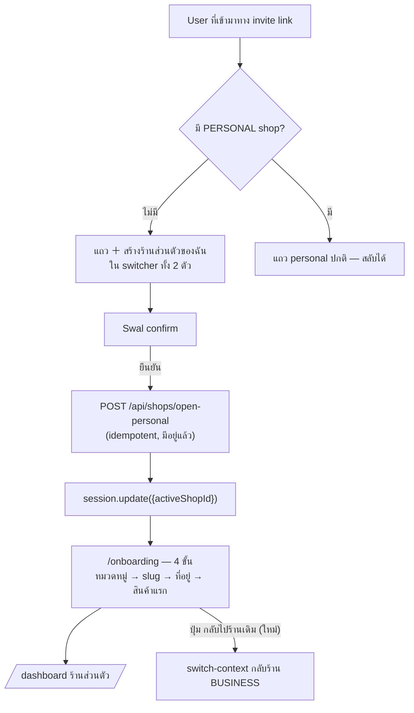

# Design Spec — Personal Account & Connections (feature 00026)

- **วันที่:** 2026-08-02
- **Branch:** `feature/create-personal-profile`
- **สถานะ:** design approved (2026-08-02) — implement **A + B** รอบนี้; **C ออกแบบไว้ ยังไม่ implement**
- **Feature number:** 00026 (ตรวจ `git log --all --name-only -- 'docs/20 - Features/*'` แล้ว — 00025 คือเลขสูงสุดที่ถูกใช้ทุก branch)

---

## 1. ปัญหาที่ต้องแก้

user ที่เข้าระบบมาทาง **invite link** (feature 00012 Lazy Personal shop) ถูกพาเข้าร้าน BUSINESS
ของคนอื่นทันที และ **สร้างร้านส่วนตัวของตัวเองไม่ได้เลย** — อยากขายของเองก็ทำไม่ได้

สาเหตุจริง (ไม่ใช่ backend หาย):

- `POST /api/shops/open-personal` มีอยู่แล้วและ idempotent (`src/app/api/shops/open-personal/route.ts`)
- แต่ **มี UI เรียกที่เดียวคือ `/seller/choose-shop`** (`ChooseShopClient.tsx:101`)
- ผู้ถูกเชิญที่มี business membership แล้วจะไม่ถูกพาไป `/choose-shop` อีก → ไม่มีทางกลับไปกดปุ่มนั้น

ปัญหาพ่วงที่ user ร้องขอมาพร้อมกัน:

- ไม่มีหน้าแก้ **ข้อมูลส่วนตัวของ user** — `/shop` แก้ `Shop` (ผูก active shop) ไม่ใช่ `User`
- คนที่ login มาด้วย LINE/Facebook เปลี่ยนรูปโปรไฟล์ใน Deep ไม่ได้ (ติดรูปจาก provider)
- ไม่มีทาง "เชื่อมบัญชี" — ถ้า user ที่สมัครด้วยเบอร์ไป login ด้วย LINE จะกลายเป็น **user ใหม่คนละใบ**

---

## 2. การตัดสินใจที่ user เคาะแล้ว (2026-08-02)

| # | ประเด็น | มติ |
|---|---------|-----|
| D1 | ที่อยู่ของเมนู | **หน้าใหม่ `/account` แยกจาก `/shop`** — เป็นการตั้งค่า *ของ user คนนั้น* ไม่ใช่ของร้าน อยู่ร้าน BT หรือธนภัทรก็เห็นหน้าเดียวกัน |
| D2 | บัญชี provider ซ้ำ | **บล็อก + บอกวิธีแก้** — ไม่ย้ายข้อมูล ไม่ลบ ไม่ merge |
| D3 | ตั้งรหัสผ่านตอนไม่มีเบอร์ | **ต้องยืนยันเบอร์ก่อนเสมอ** — reuse `set-phone` + `set-password` เดิม ได้ recovery path ฟรี |
| D4 | กับดัก onboarding หลังสร้างร้าน | **เข้า wizard ทันที + มีปุ่ม "กลับไปร้านเดิม"** — บังคับ onboarding เฉพาะตอน active = ร้านส่วนตัว |
| D5 | ลำดับส่ง | **1 feature เดียว ทำ A→B→C ต่อเนื่อง** — A ขึ้น prod ได้ก่อนโดยไม่ต้องรอ C |
| D6 | งาน console ของ C | **user รับไปทำเอง** (เพิ่ม redirect URI ที่ LINE Developers Console + Meta App) |

---

> **เอกสารนี้เป็น design/architecture spec ไม่ใช่ UI spec** — หน้าตาของ `/account` และแถวใหม่ใน
> switcher จะออกเป็น Design Spec + HTML mockup (Mobile/Tablet/Desktop) จาก `safepay-ux`
> (Hard Rule 8) ก่อนลงมือเขียน frontend ของส่วน A/B

## 3. สถาปัตยกรรม

หน้า `/account` (route file: `src/app/(paces)/seller/(dashboard)/account/page.tsx` — proxy strip
prefix `/seller` อยู่แล้ว) resolve ข้อมูลจาก **`session.user.id` อย่างเดียว**

🛑 **ห้ามเรียก `requireActiveShop` / อ่าน `activeShopId` ในหน้านี้** — นี่คือเส้นแบ่งหลักของ feature นี้:
`/shop` = ตั้งค่า *ร้านที่ active อยู่*, `/account` = ตั้งค่า *ตัวคน* ซึ่งคงที่ไม่ว่าจะสลับไปร้านไหน

ทางเข้า 2 ทาง — `UserDropdownDetailed.tsx` (desktop, ใต้กล่อง active account) และ
`AccountSwitcherSheet.tsx` (มือถือ)



---

## 4. ส่วน A — สร้างร้านส่วนตัวจาก account switcher

### A1. แถวใหม่ใน switcher ทั้ง 2 ตัว

เงื่อนไข render: `context.personal === null` (fetch จาก `/api/business/context` ที่มีอยู่แล้ว —
คืน `personal: null` เมื่อไม่มี PERSONAL shop)

- label: `＋ สร้างร้านส่วนตัวของฉัน` / subtitle: `ขายของในนามตัวเอง`
- กด → Swal confirm (ตาม convention `feedback_sweet_alerts_modal` — dialog ที่ต้องตัดสินใจใช้ Swal
  ไม่ใช่ toast) อธิบายว่าจะพาไปตั้งค่าร้านต่อ
- ยืนยัน → `POST /api/shops/open-personal` → `update({ activeShopId })` → `router.push('/onboarding')`
- ระหว่างรอ: reuse `ShopSwitchOverlay` ตัวเดิม (มี overlay z-[1070] อยู่แล้ว)

**"สร้างได้ครั้งเดียว" ไม่ต้องเขียนโค้ดกันเพิ่ม** — บังคับ 2 ชั้นที่มีอยู่แล้ว:

1. partial unique index `Shop_userId_personal_key ON "Shop"("userId") WHERE "kind" = 'PERSONAL'`
   (unmanaged SQL — ห้าม `prisma db pull`/`migrate dev`)
2. `ensurePersonalShop()` = resolve-before-create (idempotent)

เมื่อสร้างแล้ว `context.personal` ไม่เป็น null อีก → แถวนี้หายไปเอง กลายเป็นแถว personal ปกติ

### A2. แก้กับดัก force-redirect (D4)

ปัญหา: ทันทีที่ร้านส่วนตัวเกิดขึ้น ร้านยังไม่มี `slug` → `needsOnboarding = true` →
`proxy.ts:175` เด้งไป `/onboarding` **ทุก route** → คนที่กำลังทำงานในร้าน BT หลุดทันที ออกไม่ได้

และร้ายกว่านั้น: ถ้า user คนนั้น login มาด้วย LINE/FB ยังไม่มีเบอร์ → `needsRegistration = true`
→ `proxy.ts:170` เด้งไป `/register` ล็อกหนักกว่าเดิมอีกชั้น

**วิธีแก้ — แก้สูตรที่ต้นทาง ไม่แตะ `proxy.ts`:**

ใน `src/lib/auth.ts` ทั้ง `jwt` callback (บรรทัด ~594) และ `session` callback (~646) เปลี่ยนจาก

```ts
token.needsRegistration = !!personal && !u?.phone;
token.needsOnboarding   = !!personal && !personal.slug;
```

เป็น (mirror ทั้ง 2 ที่ให้ตรงกันเสมอ — เป็นกับดักที่มีคอมเมนต์เตือนไว้อยู่แล้วในไฟล์)

```ts
const onPersonal = !!personal && token.activeShopId === personal.id;
token.needsRegistration = onPersonal && !u?.phone;
token.needsOnboarding   = onPersonal && !personal.slug;
```

ผลลัพธ์: บังคับ setup **เฉพาะตอนที่ user เลือกอยู่ในร้านส่วนตัวจริง ๆ**; สลับกลับไปร้าน business
เมื่อไหร่ flag ตกเป็น false เอง แล้ว `proxy.ts:178` (guard "setup เสร็จแล้วยังค้างที่ /onboarding → ออก")
พาออกจาก `/onboarding` ให้เอง — ไม่ต้องเพิ่ม exempt path ใหม่

⚠️ ต้องคำนวณ `onPersonal` **หลัง** block ที่ resolve `token.activeShopId` ใน `jwt` callback
(ลำดับปัจจุบันคำนวณ flag ก่อน) — ไม่งั้นรอบ sign-in แรก `activeShopId` ยังไม่ถูกเซ็ต

### A3. ปุ่ม "กลับไปร้านเดิม" บนหน้า onboarding

`src/app/(paces)/seller/onboarding/page.tsx` — แสดงเฉพาะเมื่อ user มี business membership
(`session.user.hasBusinessMembership`) กด → `switch-context` ไป business shop แรก →
`update({activeShopId})` → `/dashboard`

### A4. Regression ที่ต้องเฝ้า

- คนที่มีร้านส่วนตัวอยู่แล้วและยังไม่ setup slug (active = personal) ต้องยัง **ถูกบังคับ** onboarding เหมือนเดิม
- `/choose-shop` flow เดิมต้องไม่พัง (มันสร้างร้านแล้ว push `/onboarding` เหมือนกัน)
- `AccountSwitcherLauncher.tsx` ไม่ mount sheet เลยเมื่อ `!hasBusinessMembership` — ไม่กระทบเคสนี้
  (ผู้ถูกเชิญมี membership เสมอ) แต่ **ห้ามแก้ให้ mount เสมอ** โดยไม่ตั้งใจ

---

## 5. ส่วน B — หน้า `/account` การ์ด "ข้อมูลส่วนตัว"

### B0. 🛑 ปิดช่องโหว่ `PATCH /api/users/me` ก่อน (งานชิ้นแรกของ B)

พบระหว่างสำรวจ — **อยู่บน prod แล้ว**:

```ts
// src/app/api/users/me/route.ts:26-27
const body = await request.json();
const user = await updateProfile((session.user as any).id, body);
// → src/services/user.service.ts:38-39
//   prisma.user.update({ where: { id: userId }, data });   // data = body ดิบ
```

TS type `{ displayName?, username?, avatar? }` **ไม่กรองอะไรตอน runtime** — user ที่ล็อกอินคนไหนก็ได้
ยิง `PATCH /api/users/me {"isAdmin": true}` แล้วกลายเป็นแอดมินระบบ; เซ็ต `trustScore`,
`passwordHash`, `phone` (ทับกฎ phone-immutable), `successfulBidCount` ได้หมด
`guardApi` ใน `proxy.ts` กันไม่ได้เพราะ request มาจาก origin ตัวเองและมี session จริง

นอกจากนี้ `GET` ตัวเดียวกัน `findUnique` แบบไม่ `select` → คืน **`passwordHash`** ออก response

**แก้:**

- `PATCH` → Valibot allow-list `{ displayName, username, avatar }` เท่านั้น + ความยาว/รูปแบบ
- `username` — normalize + เช็คซ้ำ (`User.username @unique`) คืน 409 พร้อมข้อความไทย, จับ P2002 กัน TOCTOU
- `updateProfile()` — pick field เองในตัว service ไม่ spread ของที่รับมา (defense-in-depth 2 ชั้น)
- `GET` → `select` เฉพาะ field ที่ UI ใช้ ตัด `passwordHash` ออก
- Vitest ครอบ: PATCH `{isAdmin:true}` ต้องไม่เปลี่ยน `isAdmin`

### B1. การ์ด "ข้อมูลส่วนตัว"

| field | สถานะ | หมายเหตุ |
|-------|-------|----------|
| `avatar` | แก้ได้ | อัปโหลด/เปลี่ยน/ลบ — ตอบโจทย์คน login LINE/FB ที่ติดรูปจาก provider |
| `displayName` | แก้ได้ | |
| `username` | แก้ได้ | เตือนว่า `/u/{username}` เดิมจะใช้ไม่ได้ + เช็คซ้ำ realtime |
| `email` | แก้ได้ | optional |
| `phone` | **read-only** | immutable rule เดิม; ยังไม่มี → ปุ่มพาไป flow เพิ่มเบอร์ (`/api/account/set-phone`) |

อัปโหลดรูป: reuse `POST /api/upload` เดิม (`saveFile` → Supabase/S3) → เก็บ `/api/files/{fileId}`
ลง `User.avatar` — pattern เดียวกับ `(marketing)/m/settings/profile/AvatarEditable.tsx` เป๊ะ
(flow: `/api/upload` → `PATCH /api/users/me`) ต่างแค่ skin เป็น Paces

หลังบันทึกต้องเรียก `update()` ของ next-auth เพื่อให้ session callback อ่าน avatar/ชื่อสดจาก DB
— ไม่งั้นชื่อ/รูปบน topbar ยังเป็นของเก่าจนกว่าจะ re-login

### B2. สิ่งที่จงใจไม่ทำในรอบนี้

- **username cooldown 30 วัน** — หนี้เดิมค้างมาตั้งแต่ seller auth (2026-06-17) ไม่รวมใน scope นี้
- ไม่ทำ redirect ของ `/u/{username}` เก่า → ใหม่

---

## 6. ส่วน C — การ์ด "การเชื่อมต่อบัญชี" (ออกแบบไว้ ยังไม่ implement)

3 แถว: **รหัสผ่าน** · **LINE** · **Facebook** — แต่ละแถวแสดงสถานะเชื่อมแล้ว/ยังไม่เชื่อม + ปุ่ม

### C1. รหัสผ่าน (D3)

ไม่มีเบอร์ → การ์ดพาไปตั้งเบอร์ + OTP (`POST /api/account/set-phone` เดิม — สร้าง L1 PHONE_OTP
ให้อัตโนมัติ ได้ trust score เพิ่ม) แล้วค่อยตั้งรหัสผ่านด้วย `POST /api/account/set-password` เดิม
**ไม่ต้องเขียน API ใหม่เลย** และได้ recovery path (ลืมรหัส = OTP) มาฟรี

### C2. เชื่อม LINE / Facebook

NextAuth v4 ที่นี่ใช้ JWT strategy **ไม่มี adapter** — การ login provider ทั้งที่ session ยังอยู่
จึงกลายเป็นสร้าง user ใหม่ (ตรงกับอาการที่ user รายงาน)

**วิธีที่เลือก — เขียน OAuth link flow แยกจาก NextAuth ทั้งเส้น:**

- `GET /api/account/link/{line|facebook}/start` — set state cookie HMAC ด้วย `NEXTAUTH_SECRET`
  (pattern เดียวกับ `src/lib/sms-unlock-cookie.ts`) แล้ว redirect ไป authorize endpoint
- `GET /api/account/link/{line|facebook}/callback` — verify state → แลก code เป็น token →
  ได้ `providerAccountId` → เขียนแถว `AuthAccount` ผูกกับ `session.user.id`

session เดิมไม่ถูกแตะเลย → ตัดความเสี่ยง "session สลับเป็น user อื่นกลางคัน" ทิ้งทั้งหมด

**วิธีที่ปฏิเสธ:** ยืม provider ของ NextAuth + เช็ค intent cookie ใน `signIn` callback —
โค้ดน้อยกว่า แต่ callback ของ v4 ไม่ได้รับ `req` ต้องพึ่ง `cookies()` จาก next/headers ใน
async context ของ NextAuth handler ซึ่งเปราะ และถ้าพลาด = สลับ session ทันที (failure mode ที่ยอมไม่ได้)

### C3. กฎของ C

- **บัญชีซ้ำ (D2):** ก่อนเขียน `AuthAccount` เช็ค `(provider, providerAccountId)` — ถ้าผูกกับ user
  อื่นอยู่แล้ว → บล็อก + ข้อความบอกวิธีแก้ ("LINE นี้ผูกกับบัญชี Deep อื่นอยู่แล้ว — ออกจากระบบแล้ว
  login ด้วย LINE นั้น หรือติดต่อแอดมิน") ไม่ย้าย ไม่ลบ ไม่ merge
- **ยกเลิกการเชื่อมต่อ:** ห้ามถอดวิธี login สุดท้าย — ต้องเหลืออย่างน้อย 1 ทาง
  (เบอร์+รหัสผ่าน หรือ provider อื่น)

### C4. งานนอกโค้ดที่ user รับไปทำ (D6)

เพิ่ม redirect URI ที่ LINE Developers Console + Meta App:
`https://seller.deepthailand.app/api/account/link/{line|facebook}/callback`
(+ URI ของ dev ถ้าจะเทสในเครื่อง)

---

## 7. Data model

**ไม่มี migration ในทั้ง A, B, C** — ของที่ต้องใช้มีครบใน schema แล้ว:

| ต้องการ | มีอยู่แล้ว |
|---------|-----------|
| ร้านส่วนตัว 1 ต่อ user | partial unique index `Shop_userId_personal_key` (unmanaged SQL) |
| ผูกบัญชี provider | `model AuthAccount` + `@@unique([provider, providerAccountId])` |
| รหัสผ่าน | `User.passwordHash` |
| รูป/ชื่อ/username | `User.avatar` / `displayName` / `username @unique` |

🛑 ห้าม `prisma db pull` / `migrate dev` — จะทำ partial unique index หาย
(ดู memory `project_shared_db_drift_no_migrate_dev`)

---

## 8. การทดสอบ

**Vitest**

- `PATCH /api/users/me {"isAdmin":true}` ต้องไม่เปลี่ยน `isAdmin` (regression ของ B0)
- `GET /api/users/me` ต้องไม่มี `passwordHash` ใน response
- username ซ้ำ → 409
- สูตร `needsRegistration`/`needsOnboarding` ใหม่: ครบ 4 เคส
  (personal+active / personal+ไม่ active / ไม่มี personal / ไม่มี shop เลย)

**Playwright E2E** (บังคับตาม memory `feedback_qa_playwright_e2e_mandatory`; bypass login ด้วย
`e2e/helpers/auth.ts`; 🛑 ห้ามคำสั่งลบข้อมูลไม่ scope ตาม Hard Rule 13)

- invited user (ไม่มี personal) → เห็นแถวสร้างร้าน → สร้าง → เข้า onboarding → **กดกลับร้าน business ได้**
- invited user ที่ไม่มีเบอร์ → สร้างร้านแล้วต้องไม่ถูกล็อกที่ `/register` ตอน active = business
- user ที่มีร้านส่วนตัวแล้ว → **ไม่เห็น** แถวสร้างร้าน
- แก้ชื่อ + อัปโหลดรูป → เห็นผลบน topbar ทันที (session update)

**Browser QA** — Chrome DevTools MCP ที่ `seller.deepth.local:4000` ทั้ง desktop + mobile
(switcher มี 2 implementation แยกกัน ต้องกดจริงทั้งคู่ — memory `feedback_browser_qa_catches_what_static_misses`)

---

## 9. ความเสี่ยง

| ความเสี่ยง | การรับมือ |
|-----------|----------|
| แก้สูตร `needsOnboarding` ผิด → seller ปกติหลุด onboarding gate | Vitest ครบ 4 เคส + E2E เคส "มีร้านแล้วไม่มี slug ต้องยังโดนบังคับ" |
| แก้ `jwt` callback แล้วลืม mirror ที่ `session` callback | ไฟล์มีคอมเมนต์เตือนอยู่แล้ว; reviewer gate ต้อง grep ทั้ง 2 จุด |
| B0 เป็น security fix ที่แตะ API ซึ่ง buyer app ใช้อยู่ | grep call-site `PATCH /api/users/me` ทั้งโปรเจกต์ก่อนแก้ (buyer `ProfileForm.tsx`, `AvatarEditable.tsx`) |
| หน้า `/account` เผลอผูกกับ active shop | reviewer gate: grep `requireActiveShop`/`activeShopId` ในไฟล์ใหม่ = 0 |

---

## 10. Out of scope

- merge บัญชีซ้ำ (D2 เลือกบล็อก) — ถ้าจะทำต้องเป็น feature หลัก (ชน partial-unique PERSONAL shop,
  ต้องย้าย order/review/wallet/แชท, trust score คำนวณใหม่)
- username cooldown 30 วัน
- Instagram linking (provider ปิด flag อยู่)
- แก้เบอร์โทร (immutable rule)
