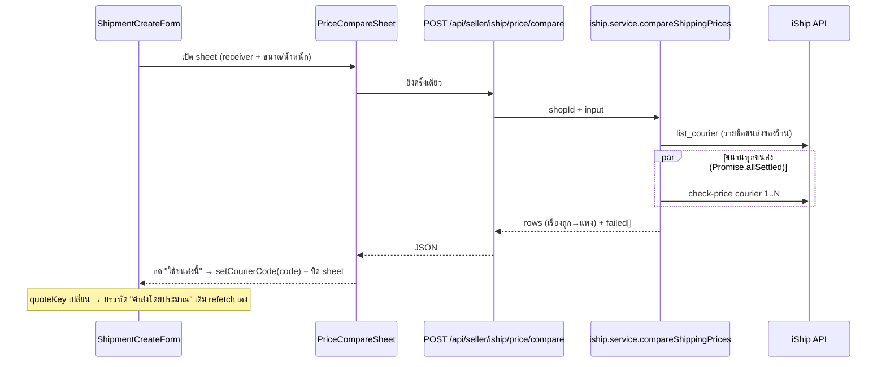

# เปรียบเทียบราคาขนส่ง iShip — Design Spec (ส่วนขยาย feature 00022)

- **วันที่:** 2026-08-05
- **สถานะ:** user อนุมัติ mockup แล้ว ("ตามนี้เลย") — รอ review spec ฉบับนี้
- **Mockup คู่กัน:** `docs/superpowers/specs/2026-08-05-iship-price-compare-mockup.html` (3 จอ: Mobile/Tablet/Desktop + สถานะโหลด/ล้มเหลว)
- **Reference จาก user:** ภาพหน้า "เปรียบเทียบราคาขนส่ง" ของ iShip — ตาม Hard Rule 6 เอา IA/ลำดับข้อมูลตาม ref แต่ skin/สี/component = Paces ปัจจุบันทั้งหมด

## 1. ปัญหาและเป้าหมาย

ตอนเปิดพัสดุ iShip ร้านเห็น "ค่าส่งโดยประมาณ" เฉพาะขนส่งตัวที่เลือกใน dropdown ทีละตัว —
อยากรู้ว่าเจ้าไหนถูกสุดต้องนั่งสลับ dropdown เอง 17 รอบ. เป้าหมาย: กดปุ่มเดียวเห็นราคาทุกขนส่ง
ของร้านเทียบกันจบในหน้าเดียว แล้วเลือกขนส่งจากราคาได้เลย

ของที่มีอยู่แล้วและ **ไม่แตะ**: `checkPrice` (`src/lib/iship/client.ts:279`), `quoteShipping`
(iship.service), route `POST /api/seller/iship/price`, บรรทัด "ค่าส่งโดยประมาณ" ใน
`ShipmentCreateForm.tsx` (debounce 700ms) — ทั้งหมดทำงานต่อเหมือนเดิม

## 2. Scope

**ทำ:**
- ปุ่ม "เทียบราคา" ข้าง dropdown ขนส่งใน `ShipmentCreateForm` (ได้ทั้ง 2 ทางเข้าอัตโนมัติ:
  modal หน้า order detail + แผงสร้างพัสดุในแชท)
- Sheet/หน้าเปรียบเทียบราคา component ใหม่ `PriceCompareSheet`
- Endpoint ใหม่ `POST /api/seller/iship/price/compare` + service `compareShippingPrices`
- กด "ใช้ขนส่งนี้" = ตั้งค่า dropdown ขนส่งในฟอร์ม + ปิด sheet (บรรทัดค่าส่งโดยประมาณเดิม
  refetch เองเพราะ `quoteKey` เปลี่ยน)

**ไม่ทำ (YAGNI):**
- ไม่จำ/บันทึกขนส่งที่เลือกเป็นค่าตั้งต้นของร้าน (มีหน้า settings อยู่แล้ว)
- ไม่ cache ราคาข้ามการเปิด sheet (เปิดใหม่ = ยิงใหม่; ภายใน session ของ sheet เดียวกัน
  ถ้า input ไม่เปลี่ยนไม่ยิงซ้ำ)
- ไม่ทำเปรียบเทียบในโหมด "ส่งเอง" หรือ "เลือกจาก iShip" (สองแท็บนั้นไม่มีการเปิดพัสดุใหม่)

## 3. UX (สรุปจาก mockup ที่อนุมัติแล้ว)

- **ปุ่ม:** `btn border-primary text-primary` icon `tabler:arrows-sort` ข้าง `form-select` ขนส่ง.
  disabled + ข้อความใต้ช่อง "กรอกที่อยู่ปลายทางและขนาดพัสดุให้ครบเพื่อเทียบราคาทุกขนส่ง"
  จนกว่าเงื่อนไขพร้อม (เงื่อนไขเดียวกับ quote เดิม: ตำบล/อำเภอ/จังหวัด/รหัสไปรษณีย์ + น้ำหนัก
  + กว้าง/ยาว/สูง ครบ)
- **หัว sheet:** ชื่อ "เปรียบเทียบราคาขนส่ง" + บรรทัดปลายทางย่อ + น้ำหนัก/ขนาด +
  คำเตือน `text-warning-ink` "ราคาประมาณการ…" (+ ประโยคพื้นที่ห่างไกลเมื่อปลายทางเป็น remote)
- **รายการ:** เรียงราคารวม ถูก → แพง. ใบถูกที่สุด = ขอบ/แถบ `border-primary` + badge
  `bg-primary text-white` "ถูกที่สุด" + ปุ่ม primary ทึบ; ใบอื่น = ขอบเทา + ปุ่ม outline
  (ห้ามใช้แดงตาม ref — แดงใน skin เรา = danger)
- **Breakdown ต่อใบ:** ค่าส่ง / ค่าน้ำมัน / พื้นที่ห่างไกล (field ที่ response ไม่ส่ง แสดง "—")
  · mobile แผ่ 3 ช่องใต้การ์ด · tablet ยุบเหลือราคารวม · desktop แผ่เป็นคอลัมน์ในแถว
- **โหลด:** skeleton โครงเดียวกับการ์ดจริง — รอครบชุดแล้วค่อยแสดง (ไม่ทยอยโผล่ กันรายการ
  กระโดดตอนเรียง)
- **ขนส่งที่ประเมินไม่ได้:** ไม่แสดงการ์ด แต่สรุปท้ายรายการ "ประเมินไม่ได้ N ขนส่ง: …" ไม่หายเงียบ
- **ล้มเหลวทั้งชุด:** error state ใน sheet + ปุ่มลองใหม่ (ไม่ใช่ toast — user อยู่ในบริบท sheet อยู่แล้ว)
- **โลโก้:** `courierLogoUrl()` + ตัวย่อ fallback จาก `src/lib/iship/courier.ts` (mapping ระดับแบรนด์
  ตัวเดียวกับแถวออเดอร์) — ไม่หาโลโก้ใหม่

## 4. สถาปัตยกรรม

ตัดสินใจแล้ว (user เลือก): **endpoint ใหม่ ยิงครั้งเดียว server fan-out** — client วนยิง route เดิม
17 ครั้งจะชน rate-limit ของเราเอง (authenticated 30 req/นาที ใน `guardApi`)



### 4.1 Service — `compareShippingPrices(shopId, input)` (iship.service.ts)

- Reuse ของเดิมทั้งหมด: `loadAccount` / `senderOf` / `findMissingSenderFields` /
  `normalizeProvince` / mapping อำเภอ→`amphure` ตำบล→`district` (**กับดัก dst_area เดิม** —
  ใช้ helper เดียวกับ `quoteShipping` ห้ามเขียน mapping ซ้ำ; refactor แกน mapping ของ
  `quoteShipping` ออกมาเป็น helper ภายในไฟล์ให้สองตัวเรียกร่วมกัน)
- ขั้นตอน: validate sender/receiver ครบ (โยน `INCOMPLETE_DATA` แบบเดิม) → `listCouriers(token)`
  → fan-out `checkPrice` ทุกตัวด้วย `Promise.allSettled` ภายใต้ `withTokenGuard` ครั้งเดียว
  (token เดียวกันทุก call) → รวมผล
- ตัวที่ reject/timeout (`TIMEOUT_MS.price` = 12s ต่อ call มีอยู่แล้ว) → เข้า `failed[]`
  พร้อมชื่อ; ไม่ล้มทั้งชุด. ทุกตัว fail → โยน error ให้ route ตอบ 502 พร้อมข้อความ
- ผลลัพธ์เรียง `totalPrice` น้อย→มาก; แถวแรก = ถูกที่สุด (client ไม่ต้องเรียงซ้ำ)

### 4.2 Response shape (ตาม convention `external-payload-schema` — ทุก field จาก iShip เป็น optional)

```ts
type CompareRow = {
  courierCode: string
  courierName: string
  totalPrice: number          // ต้องมี — ไม่มี = ถือว่า fail
  basePrice: number | null    // price
  fuelFee: number | null      // fuel_surcharge_fee
  remoteFee: number | null    // remote_area (จำนวนเงิน; "0"/ไม่ส่ง = null)
  estimateDays: number | null // estimate_shipping_date (ทรงเดียวกับ quoteShipping)
}
type CompareResult = {
  rows: CompareRow[]
  failed: { courierCode: string; courierName: string }[]
}
```

- 🛑 **ก่อนสรุปคอลัมน์จริงต้อง smoke test check-price กับบัญชี iShip จริง 1 ครั้ง**
  (นิสัย lock schema): หน้า iShip เองมีช่อง "ค่าขนส่ง(ปริมาตร)" กับ "พื้นที่ท่องเที่ยว" ซึ่ง
  ไม่อยู่ใน `IShipPrice` ที่เรา type ไว้ — ถ้า response จริงส่งมา ให้เพิ่มเป็น optional field
  + คอลัมน์ในการ์ด; ถ้าไม่ส่ง ตัดจบด้วย 3 ช่องตาม mockup

### 4.3 Route — `POST /api/seller/iship/price/compare`

- โฟลเดอร์ `src/app/api/seller/iship/price/compare/route.ts` — โครง/auth/validation
  ตามพี่น้อง `price/route.ts` เดิมทุกประการ (sibling-surface-parity): Valibot schema
  ตัวเดียวกันตัด `courierCode` ออก (input = receiver 4 ช่อง + weight/width/length/height)
- นับเป็น 1 คำขอใน rate-limit ปกติ — ไม่ต้องมี limit พิเศษ (check-price ฝั่ง iShip ฟรี)
- error mapping ตาม `IShipServiceError` เดิม (`INCOMPLETE_DATA` → 400, token → 401/409
  ตาม catch เดิมของ namespace นี้)

### 4.4 Client — `PriceCompareSheet` (src/components/safepay/iship/)

- state ธรรมดาใน React (ห้าม Preline collapse/overlay — โมดัลแชทซ่อนด้วย `hidden`
  ไม่ unmount ทำให้ Preline ที่ init ตอน mount ใช้ไม่ได้ — บทเรียนเดิมในไฟล์นี้)
- เปิด = ยิงทันที; เก็บ `compareKey` (receiver+ขนาด join) — เปิดซ้ำโดย key ไม่เปลี่ยน
  ใช้ผลเดิม ไม่ยิงใหม่; มีปุ่มลองใหม่ตอน error
- มือถือ: sheet เต็มจอทับเนื้อหา modal เดิม (ปุ่มกลับมุมซ้าย) · เดสก์ท็อป: กล่อง ~760px
  กลางจอใน layer เดียวกับ modal เดิม
- เลือกแล้ว: `onPick(courierCode)` → parent `setCourierCode` + ปิด sheet

## 5. Edge cases

| กรณี | พฤติกรรม |
|---|---|
| ร้านยังตั้งที่อยู่ผู้ส่งไม่ครบ | 400 `INCOMPLETE_DATA` — sheet แสดงข้อความ + ลิงก์ไปตั้งค่า (ข้อความเดียวกับ quote เดิม) |
| ขนส่งบางตัวไม่ตอบ/timeout | ตัดออกจากรายการ + สรุปชื่อท้ายรายการ |
| ทุกตัวไม่ตอบ | error state ใน sheet + ปุ่มลองใหม่ |
| `estimate_shipping_date` ไม่ส่ง/ไม่ใช่เลข | ไม่แสดงบรรทัดวัน (ทรงเดียวกับ quoteShipping) |
| ปลายทาง remote (`remote_area` > 0) | ค่าเพิ่มแสดงในช่อง "พื้นที่ห่างไกล" ต่อใบ + ประโยคเตือนรวมที่หัว sheet |
| ราคารวมเท่ากันหลายเจ้า | เรียงตามลำดับที่ iShip คืน (stable sort) — badge ให้ใบแรกใบเดียว |
| ร้านกดเทียบระหว่าง quote เดิมกำลังยิง | อิสระต่อกัน — คนละ state คนละ request |

## 6. การทดสอบ

- **Vitest (service):** mock `iship` client — เรียงถูก→แพง, ตัวที่ reject เข้า `failed[]`,
  ทุกตัว fail = โยน, mapping อำเภอ/ตำบล→amphure/district ถูกข้าง (กัน dst_area กลับหัว),
  field ขาด → null
- **Vitest (route):** validation reject input ขาด; auth guard ตามพี่น้อง
- **Smoke test บัญชีจริง:** lock response fields ก่อนสรุปคอลัมน์ (§4.2)
- **Browser QA (Chrome DevTools MCP ที่ `seller.deepth.local:4000`):** เปิดจาก order detail
  + จากแชท, disabled→enabled, เลือกขนส่งแล้วค่าใน dropdown/quote เดิมเปลี่ยนตาม,
  จอมือถือ 375px + เดสก์ท็อป

## 7. ผลกระทบเอกสาร 00022 (อัปเดตตอน implement — HR11)

- `PRD.md`/`BRD.md`: เพิ่ม requirement เปรียบเทียบราคา (safepay-product)
- `SRS.md`/`API.md`: endpoint compare + response shape (safepay-planner)
- `TestCase.md`: เคสตาม §6 (safepay-qa)
- `DATABASE.md`: ไม่แตะ (ไม่มี schema change)

## 8. ลำดับงาน implement (ให้ writing-plans แตกละเอียดต่อ)

1. Smoke test check-price บัญชีจริง → lock response fields (ปรับ `IShipPrice` เป็น optional เพิ่ม)
2. Service `compareShippingPrices` + refactor mapping ร่วมกับ `quoteShipping` + Vitest
3. Route `price/compare` + Vitest
4. `safepay-ux` gate (Hard Rule 8) → Design Spec จาก mockup นี้ → `PriceCompareSheet` + ปุ่มใน `ShipmentCreateForm`
5. Impeccable gate (`/impeccable critique` + `clarify`) + Browser QA + อัปเดตเอกสาร 00022
