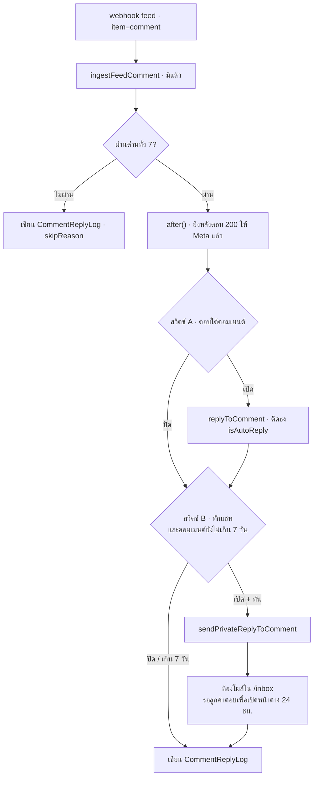

# 00038 — ตอบกลับคอมเมนต์ (Comment Auto-Reply & Private Reply)

- **วันที่:** 2026-08-08
- **สถานะ:** design อนุมัติแล้ว (user เคาะ 2026-08-08) — รอทำ PRD/BRD ตาม Hard Rule 11
- **mockup:** `2026-08-08-00038-comment-auto-reply-mockup.html` (Mobile / Tablet / Desktop)
- **ขอบเขตรอบนี้:** Facebook Page เท่านั้น · Instagram = เฟส 2
- **เลขฟีเจอร์:** 00038 (00037 = Unified Multi-Shop Inbox)

---

## 1. ปัญหาที่แก้

ร้านที่ยิงโฆษณามีคอมเมนต์เข้าหลักร้อยต่อโพสต์ (โพสต์ตัวอย่างจาก prod: 365 คอมเมนต์) แต่คนที่คอมเมนต์
ส่วนใหญ่ไม่ได้กดเข้าแชทเอง ร้านต้องไล่กด "ทักแชท" ทีละคนภายใน 7 วันก่อนสิทธิ์หมด

ปัจจุบันระบบทำได้แค่ **เห็น** คอมเมนต์ (feature 00029) — ตอบใต้คอมเมนต์ด้วยมือได้ แต่ปุ่ม "ทักแชท"
ยังเป็นแค่ป้ายนับถอยหลัง ไม่ใช่ปุ่มกดได้ (`CommentsClient.tsx:1572` เขียนยอมรับไว้เอง)

งานนี้ปิดสองช่องพร้อมกัน: **ทำให้ปุ่มทักแชทกดได้จริง** และ **ให้ตั้งค่าให้ระบบทำแทนอัตโนมัติต่อเพจได้**

---

## 2. มติที่ user เคาะแล้ว

| # | คำถาม | มติ |
|---|---|---|
| D-1 | ขอบเขตช่องทาง | **Facebook ก่อน** · IG เฟส 2 — แต่โครงสร้างต้องแยก `provider` ออกจาก hardcode `'MESSENGER'` ตั้งแต่วันแรก |
| D-2 | ตรรกะเลือกคำตอบ | **ข้อความคงที่ต่อเพจ** — ไม่แตะเครื่องยนต์กลุ่มคำของ 00023 |
| D-3 | คอมเมนต์แบบไหนโดนยิง | **คอมเมนต์ระดับบนของลูกค้า · 1 ครั้ง/คน/โพสต์** |
| D-4 | จำนวนสวิตช์ต่อเพจ | **2 สวิตช์แยกกัน** (ตอบใต้คอมเมนต์ / ทักแชท) แต่ละตัวมีข้อความของตัวเอง |
| D-5 | คำตอบของบอทนับเป็น "ตอบแล้ว" ไหม | **แยกสถานะที่ 3** — ยังไม่ตอบ / บอทตอบแล้ว / คนตอบแล้ว |
| D-6 | ปุ่มแมนนวล | ต้องใช้ได้**แม้ไม่เปิดออโต้** (user สั่งตรง ๆ พร้อมภาพหน้าจอ) |

---

## 3. ข้อจำกัดของ Meta ที่กำหนดรูปร่างฟีเจอร์

ล็อกจากเอกสารก่อนออกแบบ ไม่ได้เดา:

| ข้อจำกัด | ผลต่อดีไซน์ |
|---|---|
| private reply ส่งได้ **ครั้งเดียวต่อคอมเมนต์** | ต้องกันซ้ำที่ระดับ DB ไม่ใช่ที่ระดับโค้ด · ยิงพลาด = เสียสิทธิ์ถาวรของคอมเมนต์นั้น |
| ต้องส่งภายใน **7 วัน** นับจากเวลาคอมเมนต์ | ปุ่ม/ตัวยิงต้องเช็คหน้าต่างก่อนเสมอ (ตรรกะนี้มีแล้วใน `page-comment.service.ts:339`) |
| หน้าต่าง 24 ชม. เปิด **ก็ต่อเมื่อลูกค้าตอบกลับ** | "เปิด inbox" ≠ "คุยต่อได้" — ห้ามออกแบบให้ระบบส่งอะไรตามหลัง private reply |
| endpoint = `POST /{PAGE_ID}/messages` body `recipient: {comment_id}` | ใช้ `pages_messaging` ที่มีใน `CONNECT_SCOPES` อยู่แล้ว — **ไม่ต้องขอ scope ใหม่ ไม่ต้องให้ร้านเชื่อมเพจใหม่** |
| IG ต้องมี `instagram_manage_comments` + subscribe field `comments` | scope ผูกกับ token ตอน grant → เฟส 2 ต้องให้ทุกร้านกดเชื่อม IG ใหม่ (บทเรียนเดิม 00029) |

อ้างอิง: [Private Replies — Messenger](https://developers.facebook.com/docs/messenger-platform/discovery/private-replies/) ·
[Private Replies — Instagram](https://developers.facebook.com/docs/instagram-platform/private-replies/)

---

## 4. สถาปัตยกรรม

### 4.1 ชิ้นส่วนใหม่

```
src/services/comment-private-reply.service.ts        [ใหม่] แกนกลาง
src/services/comment-auto-reply.service.ts           [ใหม่] ตัวตัดสินอัตโนมัติ
src/app/api/chat/comments/[commentId]/private-reply/route.ts   [ใหม่] ปุ่มแมนนวล
src/app/api/shops/comment-reply/config/route.ts      [ใหม่] อ่าน/บันทึกตั้งค่าต่อเพจ
src/app/(paces)/seller/(dashboard)/settings/comment-reply/     [ใหม่] หน้าตั้งค่า
```

### 4.2 ชิ้นที่แก้ของเดิม

| ไฟล์ | แก้อะไร |
|---|---|
| `src/app/api/channels/facebook/webhook/route.ts` | ต่อสายใน feed loop → เก็บ commentId ใส่ set แล้วประมวลผลใน `after()` |
| `src/services/page-comment.service.ts` | `replyToComment` รับ system actor · `countUnansweredForShop` + `getPostComments` แยก 3 สถานะ · `ingestFeedComment` ห้ามทับ `isAutoReply` |
| `src/app/(paces)/seller/(chat)/inbox/comments/CommentsClient.tsx` | ป้าย "ทักแชท" → ปุ่มจริง + ชิปกรองสถานะที่ 3 |
| `src/lib/seller-menu.ts` | เพิ่มรายการเมนูในกลุ่ม CHAT |

### 4.3 ทำไมไม่ยัดเข้า `auto-reply.service.ts` ของ 00023

เครื่องยนต์ 00023 ผูกกับ `ChatMessage`/`Conversation` ทั้งเส้น — `AutoReplyJob.chatMessageId` เป็น
**FK + `@unique`** ซึ่งคือกลไกกันตอบซ้ำ "หนึ่งข้อความ หนึ่งคำตอบ" (BR-AR-21) ที่ใช้งานได้ดีอยู่
คอมเมนต์ไม่มี `ChatMessage` การยัดเข้าไปแปลว่าต้องคลาย constraint นั้น = รื้อของที่ยังดีอยู่
จึงสร้างเส้นขนานที่ยืม **แพตเทิร์น** เดียวกันแทน (unique key กันซ้ำที่ระดับ DB) ไม่ยืมตาราง

---

## 5. Data model (additive ล้วน)

### 5.1 `ShopChannel` — 4 คอลัมน์ใหม่

```prisma
commentPublicReplyEnabled   Boolean @default(false)
commentPublicReplyText      String? @db.Text
commentPrivateReplyEnabled  Boolean @default(false)
commentPrivateReplyText     String? @db.Text
```

ตั้งค่า "ต่อเพจ" จึงอยู่กับแถวเพจ ไม่ต้องมีตารางแยก และ `AutoReplyRule.shopChannelId` ของ 00023
พิสูจน์แพตเทิร์น "เงื่อนไขระดับเพจ" ไว้แล้ว

> ⚠️ `ShopChannel` มี `accessTokenEnc` อยู่ในแถวเดียวกัน — ทุก query ที่ส่งค่าเหล่านี้ออกไปหา client
> ต้อง `select` ระบุคอลัมน์เสมอ ห้ามคืนทั้งแถว

### 5.2 `PageComment` — 1 คอลัมน์

```prisma
/// คอมเมนต์นี้ถูกเขียนโดยระบบตอบอัตโนมัติ (ไม่ใช่คนในทีมร้าน) — ใช้แยกสถานะที่ 3
isAutoReply Boolean @default(false)
```

> 🛑 **คอลัมน์นี้มีผู้เขียน 2 ราย** — เราเขียนตอน `replyToComment()` คืน comment id กลับมา และ
> webhook เขียนอีกครั้งเมื่อ Meta ส่ง echo ของคอมเมนต์เดียวกันกลับเข้ามา ถ้า `ingestFeedComment`
> ใส่ `isAutoReply` ลงใน `update` block ของ upsert ธงจะถูกรีเซ็ตเป็น `false` แล้วป้าย "บอทตอบ"
> จะกะพริบหายไปเอง — คลาสเดียวกับบั๊กรีแอ็กชันเมื่อ 2026-08-04
> (`docs/conventions/external-payload-schema.md`: "ค่าที่หายจาก payload = ไม่รู้ ไม่ใช่ถูกลบ")

### 5.3 `CommentReplyLog` — ตารางใหม่

บันทึกทุกครั้ง **ทั้งที่ตอบและที่ข้าม** (มิเรอร์ `AutoReplyLog` ของ 00023) และทำหน้าที่กันซ้ำไปในตัว

```prisma
model CommentReplyLog {
  id             String @id @default(uuid())
  shopChannelId  String
  postId         String
  commentId      String   // PageComment.id ที่เป็นต้นเหตุ
  fromExternalId String?  // ผู้คอมเมนต์ (null = payload ไม่ส่ง from มา)

  trigger        String   // "AUTO" | "MANUAL"
  actorUserId    String?  // MANUAL = คนที่กด · AUTO = null

  publicReplyStatus  String? // "SENT" | "SKIPPED" | "FAILED"
  privateReplyStatus String? // "SENT" | "SKIPPED" | "FAILED"
  skipReason         String? // ดู §6.2
  errorMessage       String? @db.Text
  conversationId     String? // ห้องที่เกิดจาก private reply

  createdAt DateTime @default(now())

  @@index([shopChannelId, createdAt])
  @@index([commentId])
}
```

**กันซ้ำ 2 ระดับ ที่ไม่ใช่กฎเดียวกัน** — จุดนี้เคยเขียนรวมเป็นกฎเดียวแล้วผิด:

| ระดับ | ขอบเขต | บังคับด้วย |
|---|---|---|
| **AUTO** | 1 ครั้ง / คน / โพสต์ (D-3) | partial unique index: `UNIQUE (shopChannelId, postId, fromExternalId) WHERE trigger = 'AUTO'` |
| **MANUAL** | 1 ครั้ง / **คอมเมนต์** (เพดานของ Meta) | `UNIQUE (commentId) WHERE trigger = 'MANUAL'` |

เหตุผลที่แยก: D-3 เป็นกฎ**ของเรา** ไว้กันบอทดูเป็นสแปม ส่วน "ครั้งเดียวต่อคอมเมนต์" เป็นเพดาน
**ของ Meta** ถ้าเอากฎ AUTO ไปครอบ MANUAL ด้วย คนที่คอมเมนต์ 2 ครั้งบนโพสต์เดียวจะถูกร้าน
ทักด้วยมือได้แค่ครั้งเดียว ทั้งที่ Meta อนุญาต 2 ครั้ง — เป็นการเอากฎกันสแปมของบอทไปมัดมือคน

> Prisma ประกาศ partial unique index ไม่ได้ → เขียนเป็น SQL มือในไฟล์ migration แบบเดียวกับ
> `20260722000200_shopchannel_active_partial_unique` (มีแบบให้ลอกในรีโปแล้ว)

**ข้อควรระวังของ unique ฝั่ง AUTO:** `fromExternalId` เป็น nullable และ Postgres ถือว่า
`NULL <> NULL` แถวที่ไม่มี `from` จึงลอดได้ทุกครั้ง — ต้อง **ข้ามคอมเมนต์ที่ไม่มี `fromExternalId`
ตั้งแต่ด่านแรก** (`skipReason = 'NO_SENDER_ID'`) ห้ามพึ่ง constraint กับแถวกลุ่มนี้

---

## 6. ทางเดินของคอมเมนต์หนึ่งอัน

### 6.1 ภาพรวม



### 6.2 ด่านคัดกรอง (เรียงตามลำดับที่ตรวจ)

| # | เงื่อนไขที่ทำให้ข้าม | `skipReason` |
|---|---|---|
| 1 | `isFromPage = true` — คอมเมนต์ของเพจเอง (รวมคำตอบของบอทเอง) | `FROM_PAGE` |
| 2 | `parentExternalId != null` — เป็น reply ซ้อน ไม่ใช่คอมเมนต์ระดับบน (D-3) | `NOT_TOP_LEVEL` |
| 3 | `verb = remove` / `isDeleted = true` | `COMMENT_DELETED` |
| 4 | `fromExternalId = null` — ไม่มีตัวตนให้ผูกกับ unique key (§5.3) | `NO_SENDER_ID` |
| 5 | `ShopChannel.status != 'ACTIVE'` | `CHANNEL_INACTIVE` |
| 6 | ปิดทั้ง 2 สวิตช์ / เปิดแต่ข้อความว่าง | `DISABLED` |
| 7 | มีแถว `CommentReplyLog` **แบบ AUTO** ของ (เพจ, โพสต์, คนนี้) แล้ว | `ALREADY_HANDLED` |
| 8 | คอมเมนต์นี้มีคำตอบจาก **คนในทีมร้าน** อยู่แล้ว (`isFromPage ∧ ¬isAutoReply`) | `HUMAN_ANSWERED` |

ด่านที่ 7 ตรวจสองชั้น: อ่านก่อนเพื่อ short-circuit และ **พึ่ง partial unique index เป็นชั้นตัดสิน**
เมื่อสองเธรดวิ่งพร้อมกัน (P2002 = มีคนทำไปแล้ว ไม่ใช่ error)

ด่านที่ 8 มีเพราะคนอาจตอบเร็วกว่าบอท (webhook หน่วง / ร้านเปิดหน้าจอค้างอยู่พอดี) — ปล่อยให้บอท
ตอบทับคำตอบของคนคือสิ่งที่ร้านจะโกรธที่สุด

### 6.3 ทำไมต้องอยู่ใน `after()`

webhook ต้องตอบ 200 ให้ Meta เสมอ ถ้าล้ม Meta จะ retry **ทั้ง batch** แล้วปัญหาบานปลาย —
กติกาเดียวกับ 00023 (`enqueueAutoReplyJob` ห้าม throw ทุกกรณี) และเหตุผลเดียวกับที่
`ingestFeedComment` ทุกวันนี้ห่อ `.catch()` ไว้แล้ว

### 6.4 system actor

`replyToComment()` ปัจจุบันบังคับ `actorUserId` เพื่อเรียก `canAccessShop()` แต่ตอนบอทยิงไม่มีคนกด
→ เพิ่มทางเข้าแบบ system actor ที่ **ข้าม `canAccessShop` ได้เฉพาะเมื่อ caller เป็น service ฝั่ง server**
และเขียน `repliedByUserId = null` + `isAutoReply = true`

ต้องทำแบบเดียวกับ TD-005 ของ 00023: shopId ที่ใช้ cross-check ต้องมาจากแถวในฐาน (ผ่าน
`PageComment → FacebookPost → ShopChannel`) **ห้ามรับจากพารามิเตอร์ของ caller**

---

## 7. แกนกลาง — `sendPrivateReplyToComment`

```
sendPrivateReplyToComment({ commentId, text, trigger, actorUserId? })
  1. โหลด PageComment → post → channel (แหล่งความจริงของ shopId/pageId)
  2. MANUAL → canAccessShop(actorUserId) · AUTO → ข้าม (system actor)
  3. เช็คหน้าต่าง 7 วันจาก comment.createdTime
  4. เช็ค/สร้าง CommentReplyLog (unique = กันซ้ำ)
  5. POST /{pageId}/messages { recipient: { comment_id }, message: { text } }
  6. ได้ recipient_id (PSID) + message_id
  7. upsert ExternalContact(PSID) → Conversation → ChatMessage(senderRole=SHOP)
  8. อัปเดต log: privateReplyStatus + conversationId
```

**ข้อ 7 สำคัญ:** ห้องต้องถูกสร้างด้วยเส้นทางเดียวกับที่แชทปกติใช้ ไม่ใช่ insert เอง —
ไม่งั้นห้องนี้จะขาด `shopChannelId`/`lastMessageAt`/denormalized snapshot แล้วไปโผล่ผิดที่ในกล่องรวม
หลายร้าน (00037 `resolveChatScope` ผูกบริบทกับ `conversation.shopId`)

**ห้องใหม่ต้องไม่ขึ้นเป็น "ยังไม่อ่าน"** เพราะฝั่งเราเป็นคนเริ่ม — `lastSenderRole = 'SHOP'`
ทำให้เข้าเกณฑ์นี้อยู่แล้วตามกลไก unread เดิม (unread = `lastMessageAt > shopLastReadAt` ของฝั่งนั้น)

---

## 8. ปุ่มแมนนวล (D-6)

`CommentsClient.tsx:1572` เปลี่ยนป้ายเป็นปุ่มจริง — สถานะของปุ่มมี 4 แบบ

| สภาพ | หน้าตา |
|---|---|
| ทักได้ | ปุ่มกดได้ + นับถอยหลัง `ทักแชท (คงเหลือ 6 วัน 22 ชั่วโมง 42 นาที)` |
| กำลังส่ง | ปุ่ม disabled + spinner |
| ทักแล้ว | `ทักแล้ว` + ลิงก์เข้าห้องแชท — ตัดสินจาก **แถว log ของคอมเมนต์นี้** (`commentId`) ที่ `privateReplyStatus = 'SENT'` ไม่ใช่จากคีย์ คน+โพสต์ |
| เกิน 7 วัน | ปุ่มปิด `หมดเวลาทักแชท` |

กดแล้วเปิดกล่องพิมพ์ข้อความ (prefill จาก `commentPrivateReplyText` ของเพจถ้ามี) ไม่ส่งทันที —
เพราะสิทธิ์มีครั้งเดียวต่อคอมเมนต์ การกดพลาดย้อนไม่ได้

ปุ่มนี้ **ไม่ขึ้นกับสวิตช์อัตโนมัติ** ร้านที่ปิดออโต้ทั้งหมดก็ใช้ได้

---

## 9. เมนู + หน้าตั้งค่า

### 9.1 เมนู

`src/lib/seller-menu.ts` กลุ่ม **CHAT** เพิ่มรายการที่ 4 ต่อจาก "ตอบกลับอัตโนมัติ":

```ts
{ url: '/settings/comment-reply', slug: 'seller:settings-comment-reply',
  label: 'ตอบกลับคอมเมนต์', icon: 'message-reply' }
```

> **รอ user ยืนยันไอคอน** — เสนอ `tabler-message-reply` (เพื่อนบ้านคือ `message-circle` /
> `message-bolt` / `robot`) ตามกฎห้ามเดาไอคอนเอง (`docs/conventions/no-emoji-use-icons.md`)

🛑 **ห้ามใส่ slug นี้ลงใน array ใด ๆ ของ vertical gating** (แก้ 2026-08-08 — ฉบับแรกของเอกสารนี้
เขียนกลับด้าน): `applyVerticalMenu` (`seller-menu.ts:339`) ซ่อนเฉพาะ slug ที่อยู่ใน
`ALL_VERTICAL_SCOPED_SLUGS` (= `LODGING_ONLY_SLUGS` + `ONLINE_SALES_ONLY_SLUGS` +
`SERVICE_QUEUE_ONLY_SLUGS` + `SHARED_PRODUCT_SLUGS`) **slug ที่ไม่อยู่ในนั้นเลยเห็นได้ทุก vertical
โดยอัตโนมัติ** — `seller:inbox` เองก็ไม่ปรากฏใน array ไหนเลย เมนูนี้ต้องเห็นทุก vertical
จึงต้องไม่แตะ array พวกนี้ การใส่เข้าไปคือการซ่อนเมนูจาก vertical อื่น ซึ่งตรงข้ามกับเจตนา

### 9.2 หน้าตั้งค่า

การ์ดหนึ่งใบต่อเพจที่เชื่อมไว้ (ยกโครงจาก `/settings/auto-reply`) แต่ละใบมี:

- รูปเพจ + ชื่อเพจ + ป้ายสถานะ (`TOKEN_INVALID` → ขึ้นเตือนให้เชื่อมใหม่ ปิดสวิตช์ทั้งใบ)
- **สวิตช์ A** ตอบใต้คอมเมนต์ + ช่องข้อความ
- **สวิตช์ B** ทักแชท + ช่องข้อความ + หมายเหตุว่า Meta ให้ครั้งเดียว/คอมเมนต์ ภายใน 7 วัน
- ตารางประวัติการยิงย้อนหลัง (จาก `CommentReplyLog`) พร้อมเหตุผลที่ข้าม

ร้านที่ยังไม่เชื่อมเพจเลย → empty state ชี้ไปหน้าเชื่อมช่องทาง

---

## 10. สถานะ 3 ชั้นในแท็บความคิดเห็น (D-5)

ปัจจุบัน "ตอบแล้ว" = *มีคอมเมนต์ลูกที่ `isFromPage = true`* (`page-comment.service.ts:735`)
พอบอทตอบ Meta จะ echo คำตอบกลับมาเป็นคอมเมนต์ของเพจ → ทุกอันกลายเป็น "ตอบแล้ว" เอง
ตัวนับ `ยังไม่ตอบ` จะเป็น 0 เกือบตลอด แล้วคำถามที่ต้องการคนจริงจะจมหาย
(คลาสเดียวกับ `feedback_dead_tile_change_what_it_counts`)

**สถานะใหม่** คำนวณจากคอมเมนต์ลูกที่ `isFromPage = true`:

| สถานะ | เกณฑ์ |
|---|---|
| ยังไม่ตอบ | ไม่มีคอมเมนต์ลูกของเพจเลย |
| บอทตอบแล้ว | มีลูกของเพจ **ทุกอัน** `isAutoReply = true` |
| คนตอบแล้ว | มีลูกของเพจอย่างน้อยหนึ่งอันที่ `isAutoReply = false` |

**สถานะระดับโพสต์** (ชิปกรองอยู่เหนือ *รายการโพสต์* ไม่ใช่รายการคอมเมนต์ — โพสต์เดียวมีคอมเมนต์
คละสถานะได้) ใช้กติกา **ตัวที่แย่ที่สุดชนะ** เพื่อให้ 3 กลุ่มไม่ทับกันและรวมกันได้เท่ายอดทั้งหมด:

```
ยังไม่ตอบ    ← มีคอมเมนต์ "ยังไม่ตอบ" อย่างน้อย 1 อัน
บอทตอบแล้ว   ← ไม่มีอันที่ยังไม่ตอบ แต่มี "บอทตอบแล้ว" อย่างน้อย 1 อัน
คนตอบแล้ว    ← ที่เหลือ
```

- **badge บนแท็บนับเฉพาะ "ยังไม่ตอบ" เหมือนเดิม** — หน่วยยังเป็น *จำนวนโพสต์* ไม่ใช่จำนวนคอมเมนต์
  (`countUnansweredForShop` อธิบายเหตุผลไว้แล้ว: ต้องเป็นหน่วยเดียวกับ badge แท็บ "ข้อความ")
- ชิปกรองเพิ่มมา 1 อัน — ปัจจุบันมี "ทั้งหมด / ยังไม่ตอบ" อยู่แล้ว
- **ทั้งตัวนับและตัวกรองต้องมาจาก symbol เดียว** (`docs/conventions/sibling-surface-parity.md`) —
  จอนี้เคยโชว์ "ยังไม่ตอบ 7 กับ 8" พร้อมกันมาแล้ว

---

## 11. ข้อที่ตัดสินใจแทน (user รับทราบแล้ว)

| # | ข้อ | เหตุผล |
|---|---|---|
| A-1 | **ไม่มีหน่วงเวลา** ยิงทันทีหลังคอมเมนต์เข้า | เพิ่มทีหลังได้โดยไม่กระทบ schema |
| A-2 | คอมเมนต์ที่ไม่มีข้อความ (รูป/สติกเกอร์ล้วน) ก็ยิง | ข้อความคงที่ไม่ต้องอ่านคอมเมนต์ ต่างจาก 00023 ที่ต้องมี `hasCustomerText` เพราะต้องจับคู่คำ |
| A-3 | ห้องจาก private reply **ไม่นับเป็นยังไม่อ่าน** | เราเป็นฝ่ายเริ่ม — นับเมื่อลูกค้าตอบ |
| A-4 | **ไม่ retry อัตโนมัติ** เมื่อ private reply ถูกปฏิเสธ | สิทธิ์มีครั้งเดียว การลองซ้ำอัตโนมัติมีแต่เสีย → บันทึกเหตุผลลง log ให้ร้านกดเองจากปุ่มแมนนวล |

---

## 12. ความเสี่ยงที่รู้ตัว

| ความเสี่ยง | การรับมือ |
|---|---|
| ร้านตั้งข้อความที่ดูเป็นสแปม → เพจโดน Meta ลดการมองเห็น | หน้าตั้งค่าขึ้นคำเตือน + ค่าตั้งต้นทั้ง 2 สวิตช์ = **ปิด** |
| คอมเมนต์ที่เป็นคำต่อว่า ก็จะได้คำตอบขายของ | ยอมรับในเฟสนี้ (D-2 เลือกข้อความคงที่) — เฟสถัดไปค่อยต่อกลุ่มคำ/AI ได้เพราะ schema เผื่อไว้ที่ `trigger` |
| ยิงรัวเกิน rate limit ของ Graph | 1 ครั้ง/คน/โพสต์ กดปริมาณลงมากแล้ว · บันทึก error ลง log ไม่ retry |
| คอมเมนต์เก่าที่ backfill เข้ามาทีหลังถูกยิงย้อนหลัง | **ยิงเฉพาะที่มาจาก webhook สด** — `backfillPostComments()` ต้องไม่ trigger |
| IG (เฟส 2) | เอกสารระบุขอบเขต FB ชัดเจน · โครง `provider` แยกไว้แล้วเพื่อไม่ต้องรื้อ |

---

## 13. Hard Rules ที่ต้องผ่านก่อน merge

| กฎ | สิ่งที่ต้องทำ |
|---|---|
| HR11 doc-first | PRD + BRD ผ่าน user review **ก่อนเขียนโค้ด** → SRS/SDS/DATABASE/API/TestCase ครบ 7 ไฟล์ (นับด้วย `diff <(ls template) <(ls feature)` ไม่ใช่นับจำนวน) + sync `docs/SRS.md` เพราะงานนี้แตะ data model/API |
| HR8 ux gate | `safepay-ux` ออก Design Spec ก่อนแตะไฟล์ frontend ทุกไฟล์ + `### Impeccable compliance` |
| HR1/HR3 | หน้าตั้งค่าต้อง copy จาก `/settings/auto-reply` · commit มี `Base:` line |
| HR7 | ไม่มี arbitrary Tailwind value ใน `(paces)/**` |
| HR9 | ใช้ `pacesToast` เท่านั้น |
| HR12 | ไม่มี emoji ใน UI — ไอคอนเมนูรอ user ยืนยัน (§9.1) |
| HR15 | migration ขึ้น prod อัตโนมัติตอน push main — ต้องแจ้ง user ก่อนรัน |
| Controller | รัน `/impeccable critique` + `/impeccable clarify` ก่อน mark complete |

---

## 14. ลำดับงาน

1. PRD + BRD → **user review** ← จุดหยุดถัดไป
2. SRS / SDS / DATABASE / API / TestCase
3. `safepay-ux` Design Spec (HR8)
4. Migration + service layer (แกนกลาง → ตัวตัดสิน)
5. ปุ่มแมนนวล (ปิดหนี้ 00029)
6. หน้าตั้งค่า + เมนู
7. สถานะ 3 ชั้น + ชิปกรอง
8. impeccable critique/clarify → deploy

**เฟส 2 (นอกขอบเขตรอบนี้):** Instagram · หน่วงเวลา · เลือกคำตอบตามกลุ่มคำ/AI · ตอบคอมเมนต์บนโฆษณา
