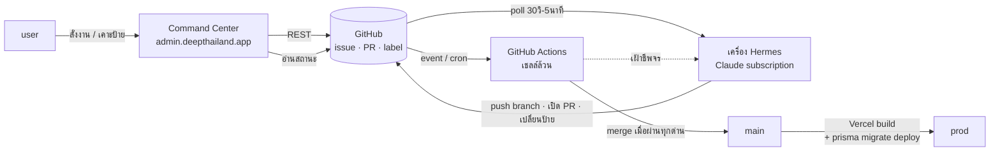
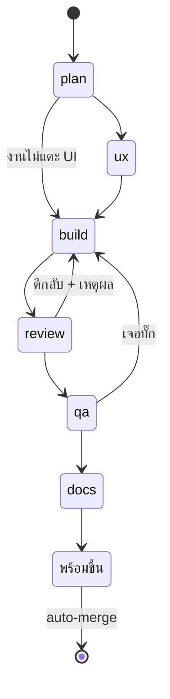

# AI Command Center + Agent Chain — Design Spec

- **วันที่:** 2026-08-16
- **สถานะ:** รอ user รีวิว (ยังไม่เริ่ม implement)
- **Feature ที่จะเปิด:** `docs/20 - Features/00049 - AI Command Center/`
- **ที่มา:** user เห็นระบบของ `CodeCooLTH/12tees` (จอที่ `crm-v2.12tees.com/ai`) แล้วต้องการของแบบเดียวกัน

---

## 1. ที่มาและสิ่งที่เราลอก / ไม่ลอก

ต้นแบบคือระบบใน `CodeCooLTH/12tees` (repo ปิด — อ่านผ่านสิทธิ์ของ user) ซึ่งประกอบด้วย
agent หลายตัวบนเครื่องจริง + คิวเป็นไฟล์ `workspace/agent-bus/QUEUE-*.md` + สะพานยิงสถานะขึ้นหน้าเว็บ CRM
+ `.github/workflows/auto-merge.yml` ที่เก็บ PR ซึ่งคนติดป้าย `พร้อมขึ้น`

**สิ่งที่ลอก:** โครงประตูอนุมัติ (คนติดป้าย → เครื่องเก็บ), ปรัชญา fail-closed ทุกด่าน,
การวางด่านตัดสินไว้นอกกล่องที่มันเฝ้า

**สิ่งที่ไม่ลอก และเหตุผล:**

| ของเขา | เหตุผลที่เราไม่เอา |
|---|---|
| คิวเป็นไฟล์ `QUEUE-*.md` | เขาต้องสร้างเพราะ agent อยู่บนเครื่องจริง 6 เครื่อง — เราใช้ GitHub issue/label ซึ่งมี state machine ให้ฟรี |
| สะพานยิงสถานะทุก 2 วิ | สะพานอยู่ในกล่องเดียวกับสิ่งที่มันเฝ้า — จอเราอ่าน GitHub ตรง |
| ออฟฟิศพิกเซล 6 ตัวละคร | เขามีเครื่องจริง 6 เครื่องที่หลับ/ตื่นได้จริง เราไม่มีใครนั่งอยู่ ⇒ ตัวละครจะเป็นภาพที่โกหก (HR6: IA ตาม ref · skin ตาม theme) |
| `ADVISORY_PATTERN` ข้ามด่านที่แดงถาวร | คอมเมนต์ในโค้ดเขาเขียนเองว่า "นี่คือการยอมรับหนี้ ไม่ใช่การแก้" — เราใช้ baseline ที่โตไม่ได้แทน (§4.1) |

**บทเรียนสำคัญที่สุดจากคอมเมนต์ในไฟล์เขา** (เก็บมาเป็นหลักออกแบบ): cron เดิมอยู่บนเครื่องเดียวกับ
webhook และคนที่จะสังเกตว่าพัง ⇒ ตายพร้อมกันทั้งชุด **เงียบไป 178 รอบโดยไม่มีใครรู้**

---

## 2. เป้าหมาย

1. สั่งงานให้ AI จากหน้าเว็บ แล้วมันไปทำต่อกันเป็นทอด ๆ จนได้ PR
2. มีด่านอัตโนมัติที่ตรวจงานก่อนถึงมือ user
3. user อนุมัติจากที่เดียว แล้วของขึ้น prod เอง
4. เห็นได้ตลอดว่าอะไรค้างอยู่ตรงไหน และอะไรพัง

### ไม่ทำในรอบนี้ (YAGNI)

- แชตโต้ตอบกับ agent บนจอ (คุยผ่าน PR comment)
- สตรีม terminal ขึ้นจอ
- ตัวละคร/อวตาร
- ให้ agent หางานเอง (user สั่งเท่านั้น)
- blocking ask/reply ระหว่าง agent

---

## 3. มติที่ตัดสินแล้ว

| # | หัวข้อ | มติ | เหตุผล |
|---|---|---|---|
| D-1 | อำนาจ agent | **เปิด PR ได้อย่างเดียว** — merge / push main / แตะ DB / แตะ env = คนเท่านั้น | รีโปนี้เคยถูกล้างฐาน prod ทั้ง 64 ตาราง (2026-07-31) · ขยายอำนาจทีหลังได้เมื่อมีหลักฐาน |
| D-2 | แหล่งงาน | **user สั่งเท่านั้น** | ไม่มีงาน = ไม่ตื่น = ไม่เสียเงิน · คุมขอบเขตได้ |
| D-3 | AI รันที่ไหน | **เครื่อง Hermes ของ user** (Claude subscription) | ไม่มีค่า API · `anthropics/claude-code-action` ไม่รองรับ subscription (ยืนยันแล้ว) |
| D-4 | ด่านรันที่ไหน | **GitHub Actions — เชลล์ล้วน ไม่มีโมเดลอยู่ในเส้นทางตัดสิน** | ความเสียหายไม่สมมาตร: เครื่องตาย = งานไม่เดิน (ดังเอง) · ด่านตาย = ของแย่ขึ้น prod (เงียบ) |
| D-5 | bus | **GitHub เอง** (issue / PR / label / comment) | agent เปิด PR ได้อย่างเดียวอยู่แล้ว ⇒ PR คือใบงานโดยธรรมชาติ |
| D-6 | ทางส่งคำสั่ง | **เครื่อง poll GitHub** ทุก 30 วิ–5 นาที | ไม่ต้องเปิด inbound เข้าเครื่องส่วนตัว · อยู่หลัง NAT ได้ · ปิดเครื่องแล้วเปิดใหม่ไล่เก็บงานค้างเอง |
| D-7 | แบ่ง agent | **ตามขั้นของงาน 6 ขั้น** | แมป 1:1 กับ `.claude/agents/` ที่มีอยู่แล้ว ไม่ต้องสร้างใหม่ |
| D-8 | จอเก็บ state | **ไม่เก็บเลย — ไม่มีตาราง Prisma ใหม่ ไม่มี migration** | ไม่แตะฐาน prod · ไม่มีทางเกิดค่าเดียวกันสองที่ (HR16) |
| D-9 | ที่อยู่จอ | `admin.deepthailand.app/command-center` | โดเมนจริงคือ `.app` (ยืนยันกับ Vercel: `deepthailand.app` + `deepth.co` ไม่มี `.com`) |

---

## 4. สถาปัตยกรรม



**สามชั้น แยกหน้าที่ชัด:**

| ชั้น | อยู่ที่ | ตายแล้วเกิดอะไร |
|---|---|---|
| AI ทำงาน | เครื่อง Hermes | งานใหม่ไม่โผล่ — user เห็นเองเพราะจอว่าง |
| ด่านตัดสิน | GitHub Actions | **ห้ามตาย** — ถ้าตาย ของแย่ไหลขึ้น prod เงียบ ๆ |
| จอ | Vercel (`admin.*`) | ไม่มีอะไรเสีย งานยังเดินผ่าน GitHub |

---

## 5. ส่วนที่ 1 — สายงานและการส่งต่อ

### 5.1 ขั้นงานและ agent

| ขั้น | ป้าย | subagent ที่มีอยู่แล้ว | ผลลัพธ์ |
|---|---|---|---|
| ① วางแผน | `stage:plan` | `safepay-planner` | comment: แผน + ไฟล์ที่ต้องแตะ |
| ② ออกแบบ UX | `stage:ux` | `safepay-ux` | comment: Design Spec + Theme Source |
| ③ เขียน | `stage:build` | `safepay-developer` | branch + PR |
| ④ รีวิว | `stage:review` | `safepay-reviewer` | comment: ผ่าน/ตีกลับ + เหตุผล |
| ⑤ QA | `stage:qa` | `safepay-qa` | comment: หลักฐานการทดสอบ |
| ⑥ เอกสาร | `stage:docs` | `safepay-docs` | sync feature docs + `docs/SRS.md` (HR11) |
| — อนุมัติ | `พร้อมขึ้น` | **user** | `auto-merge.yml` เก็บ |

`safepay-ux` อยู่ในสายเพราะ **HR8 บังคับว่างาน frontend ทุกชิ้นต้องผ่าน ux ก่อน** — หนี้ข้อนี้ค้างมา
3 รอบติด (2026-08-11, 08-12, 08-15) เพราะไม่มีที่บังคับ ตอนนี้มีแล้ว

งานที่ไม่แตะ frontend ข้ามขั้น ② ได้ — ตัดสินจาก path ที่แผนขั้น ① ระบุ ไม่ใช่ให้ agent เดาเอง

### 5.2 agent "คุยกัน" ยังไง

**ไม่มี broker และไม่มี blocking ask/reply โดยตั้งใจ** — การ "หยุดรอ" แปลว่าถ้าอีกฝ่ายไม่ตอบ
งานค้างเงียบโดยไม่มีใครรู้ ซึ่งคือคลาสความล้มเหลวที่ระบบนี้ทั้งระบบพยายามหนี

สามชิ้นทำหน้าที่แทน bus:

| ชิ้น | หน้าที่ |
|---|---|
| ป้าย `stage:*` | ตอนนี้อยู่ในมือใคร (routing) |
| comment โครงตายตัว | เนื้อความที่ส่งต่อ (payload) |
| ตัว PR / issue | กล่องที่รวมทุกอย่าง (thread) |

**รูปแบบ comment ที่ทุกขั้นต้องเขียน:**

```
<!-- deep:stage=<ขั้น> from=<agent> at=<ISO8601> -->
## ผลของขั้น<ชื่อ>
สรุป: ...
ไฟล์ที่ต้องแตะ: ...
Theme Source: ...            (เฉพาะงาน UI — HR1/HR3)
ข้อควรระวังสำหรับขั้นถัดไป: ...
→ ส่งต่อ: stage:<ขั้นถัดไป>
```

⚠️ **ข้อจำกัดที่ยอมรับ:** context ไม่ถูกส่งต่อ — แต่ละขั้นเปิด session ใหม่ อ่านจาก PR เอา
ข้อดีคือบังคับให้มีหลักฐานเป็นลายลักษณ์ (บทที่ 9 ของ ai-agent-book) ข้อเสียคือจ่ายค่าอ่านซ้ำทุกขั้น
และถ้าขั้นไหนเขียน comment ลวก ขั้นถัดไปจะทำงานบนข้อมูลที่ขาด — จะรู้ตอน QA ตีกลับ

### 5.3 ทางย้อน



การตีกลับ **คือ**การคุยกัน แค่เป็นแบบไม่ต้องรอ: ตัวตีกลับเขียนเหตุผลแล้วเปลี่ยนป้าย จบงานตัวเอง
ถ้าไม่มีใครมารับต่อ ใบค้างอยู่ที่ป้ายนั้น **ซึ่งเห็นได้ทั้งบน GitHub และบนจอ**

---

## 6. ส่วนที่ 2 — ด่านบน GitHub Actions

ปัจจุบันรีโปนี้ **ไม่มี `.github/workflows/` เลยแม้แต่ไฟล์เดียว** — ทุก gate (tsc, vitest,
`theme-guard.sh`, blocker tests) รันเฉพาะบนเครื่อง dev เฉพาะตอนที่คนนึกได้

### 6.1 `verify.yml` — ด่านบน PR

รัน `tsc --noEmit` · `vitest run src/` · `.claude/hooks/theme-guard.sh`

**ปัญหา:** เทสแดงค้างอยู่ (CLAUDE.md อ้าง 98 ข้อ ณ 08-09 — **ยังไม่มีใครวัดจริง**)
ถ้าปล่อยไว้จะถูกบังคับให้ทำ advisory escape hatch แบบ 12tees ซึ่งอยู่ตลอดกาล

**ทางแก้ — baseline ที่ลดได้อย่างเดียว:**

```
.github/known-failures.txt   = รายชื่อเทสที่แดง ณ วันตั้งด่าน

ผ่าน  เมื่อ  เทสที่แดง ⊆ known-failures
แดง   เมื่อ  มีเทสแดงตัวใหม่ที่ไม่อยู่ในลิสต์
แดง   เมื่อ  ลิสต์ยาวขึ้น            ← ห้ามโตเด็ดขาด
```

ต่างจาก advisory ตรงที่ดูดซับของพังใหม่ไม่ได้ · หนี้เป็นตัวเลขที่นับได้ · ลบชื่อออก = PR ที่มีคนเห็น
· cron รายสัปดาห์รายงานได้ว่าเหลือเท่าไร

### 6.2 `auto-merge.yml` — เก็บ PR ที่ติดป้าย

ยกโครงจาก 12tees ทั้ง 6 ด่าน + fail-closed (อ่านค่าไม่ได้ = ไม่ merge)

🛑 **เดิมพันของเราสูงกว่าเขา:** `vercel.json` ของเราคือ
`prisma migrate deploy && prisma generate && next build`
⇒ **merge = migration รันบน prod ทันที** (HR15) ของเขา merge แล้วแค่ deploy โค้ด

| ด่าน | รายละเอียด |
|---|---|
| 0 | หน้าต่างเวลา 08:00–22:00 น. ไทย (พังตี 3 = ไม่มีใครเห็นจนเช้า) |
| 1 | หาใบติดป้าย — **ห้ามเชื่อ `gh pr list --label`** (พิสูจน์แล้วว่าคืนใบที่ไม่มีป้ายออกมาด้วย) ให้กรองจาก `.labels` ของใบเอง |
| 2 | main สงบ ≥ N นาที — **ต้องวัดเวลา merge→live ของ Vercel เราเอง** ห้ามลอกเลข 20 มาดื้อ ๆ |
| 3 | main ไม่แดง — ผูกกับ `head_sha` ของ main ปัจจุบันเท่านั้น (ไม่เอา run ล่าสุดของ branch เฉย ๆ) |
| 4 | CI ของใบเขียวครบ · **ข้าม check-run ของ job ตัวเอง** (ไม่งั้นเห็นตัวเองเป็น pending ตลอด) |
| **5** | 🛑 **แตะ `prisma/migrations/**` ไหม → ถ้าแตะ ไม่ auto-merge เด็ดขาด** ให้คนกด merge เองพร้อมอ่าน SQL |
| 6 | ตรวจป้ายซ้ำจากตัวใบเองเป็นด่านสุดท้ายก่อนแตะ prod |

รอบละ 1 ใบ · `concurrency: cancel-in-progress: false` · `permissions:` เป็น allow-list
(ตกไป 1 บรรทัด = 403 = fail-closed = ไม่ merge อะไรเลยแบบเงียบ — เกิดกับเขาจริง 3 วัน)

### 6.3 `watchdog.yml` — เฝ้าเครื่อง Hermes

เครื่องเขียนชีพจรผ่าน repo variable (ไม่สร้าง commit ไม่สร้าง notification):

```bash
gh api -X PATCH repos/:owner/:repo/actions/variables/HERMES_HEARTBEAT -f value="$(date -u +%s)"
```

cron ทุก 30 นาที อ่านค่า → เก่ากว่า 2 ชม. → เปิด/อัปเดต issue "เครื่อง Hermes ขาดการติดต่อ" → จอขึ้นแถบแดง

🛑 **ตัวเฝ้าอยู่บน Actions ไม่ใช่บนเครื่อง** — วางบนเครื่องคือทำซ้ำบั๊ก 178 รอบ

### 6.4 รากความปลอดภัย

ตาม ai-agent-book บทที่ 9: *safety mechanisms must not be self-modifiable* — ไม่งั้น agent
ลดเกณฑ์เทสแล้วเรียกการถอยหลังว่าความก้าวหน้าได้

**PR ที่มาจาก agent ห้ามแตะ:**

```
.github/workflows/**          ด่านเอง
.github/known-failures.txt    เกณฑ์
.claude/hooks/**              prod-db-guard, test-db-guard
เทสที่มี [blocker]             ด่านที่พิสูจน์ด้วย mutation แล้ว (143 ไฟล์ · 629 จุด)
```

บังคับ 2 ชั้น: `verify.yml` ตกทันทีถ้า PR ของบอทแตะ path เหล่านี้ + `CODEOWNERS` บังคับให้ user รีวิว

### 6.5 ความลับ

| | |
|---|---|
| `ANTHROPIC_API_KEY` | **ไม่ต้องมี** — AI อยู่บนเครื่อง ใช้ subscription |
| PAT ของเครื่อง Hermes | fine-grained · เขียน issue/PR/label ได้ · **ห้ามมีสิทธิ์ `workflows`** |

---

## 7. ส่วนที่ 3 — หน้าจอ Command Center

### 7.1 ที่อยู่

```
src/app/(paces)/admin/(dashboard)/command-center/page.tsx
+ เพิ่มรายการใน _admin-menu.ts
```

`admin.*` → `/admin/*` ที่ `src/proxy.ts:251` · guard `isAdmin` อยู่ที่ `(dashboard)/layout.tsx` แล้ว
หน้าลูกไม่ต้องเช็คซ้ำ · ธีม Paces (HR1/HR7 — ห้าม arbitrary Tailwind value)

### 7.2 อ่าน

RSC เรียก GitHub API ฝั่ง server (token ห้ามหลุดไป client) → client poll ผ่าน API route ของเรา
ทุก **15–30 วินาที** พร้อม **ETag / conditional request** (304 ไม่นับโควตา)

⚠️ ไม่ใช่ 2–3 วิแบบ 12tees: GitHub ให้ 5,000 req/ชม. — poll 3 วิ = 1,200/ชม. ต่อแท็บที่เปิดค้าง

### 7.3 เขียน

ทุก write ผ่าน API route ฝั่งเรา ไม่ยิงจาก client

| ปุ่ม | ทำอะไร |
|---|---|
| สั่งงานใหม่ | สร้าง issue + ป้าย `stage:plan` |
| **เคาะ "พร้อมขึ้น"** | ติดป้าย → `auto-merge.yml` เก็บให้ ← **ประตูอนุมัติ** |
| ตีกลับ | เปลี่ยนป้ายกลับ + comment เหตุผล |
| หยุด | ถอดป้าย `stage:*` |

### 7.4 โครงหน้าจอ

7 คอลัมน์ตามขั้น + แถบสถานะบน · ใบที่ **รอ user เคาะ** เด่นที่สุดเพราะเป็นคอขวดจริง
(จอ 12tees แสดง "รอเคาะ 16" ขณะที่ใบล่าสุดปิดไป 3 วัน — สัญญาณที่เราควรเห็นตั้งแต่วันแรก)

หลักการมาจาก Agent Status Bar (ai-agent-book บทที่ 2): กลั่นสถานะที่กระจัดกระจายให้มองปราดเดียวรู้
โดยเอา**หลักการ** ไม่เอา**รูปแบบพิกเซล** ของต้นแบบ (HR6)

🛑 **ต้องผ่าน `safepay-ux` ออก Design Spec + ม็อกอัพ HTML 3 จอ ก่อนเขียนโค้ดบรรทัดแรก** (HR8)
สเปกฉบับนี้ไม่ใช่ Design Spec และไม่แทนมัน

---

## 8. สิ่งที่ user ต้องทำเองบน GitHub (agent ทำแทนไม่ได้)

1. เปิด branch protection บน `main` — บังคับผ่าน `verify.yml` ก่อน merge
2. ออก fine-grained PAT ให้เครื่อง Hermes (ไม่มีสิทธิ์ `workflows`)
3. สร้างป้าย `stage:plan` `stage:ux` `stage:build` `stage:review` `stage:qa` `stage:docs` `พร้อมขึ้น`
4. ตั้ง `CODEOWNERS`

---

## 9. ความเสี่ยงและข้อจำกัดที่รู้ตัว

| # | เรื่อง | ผลกระทบ | ท่าที |
|---|---|---|---|
| R-1 | เทสแดงค้างจำนวนไม่ทราบ | ตั้งด่านไม่ได้จนกว่าจะวัด | **P0 — ต้องรันวัดก่อนทุกอย่าง** |
| R-2 | "24 ชม." ในดีไซน์นี้ = ลูป poll + cron ไม่ใช่ agent นั่งตื่น | ต่างจากภาพในจอต้นแบบ | แจ้ง user แล้ว — ยอมรับ |
| R-3 | context ไม่ส่งต่อระหว่างขั้น | ขั้นที่เขียน comment ลวกทำให้ขั้นถัดไปข้อมูลขาด | QA เป็นตัวจับ · ทบทวนรูปแบบ comment เมื่อเจอบ่อย |
| R-4 | เครื่อง Hermes ตาย | งานไม่เดิน | `watchdog.yml` แจ้งภายใน 2 ชม. |
| R-5 | merge = migration บน prod | ผิดพลาดแล้วแก้ยาก | ด่าน 5 กันไว้ — migration ไม่ auto-merge |
| R-6 | rate limit GitHub API | จอค้าง/ว่าง | poll 15–30 วิ + ETag |
| R-7 | ยังไม่รู้วิธี dispatch งานเข้า Hermes แบบ headless | อาจต้องเขียน wrapper เอง | **ต้อง spike ก่อน P5** |

---

## 10. ลำดับงาน

| เฟส | ได้อะไร | พึ่งอะไร |
|---|---|---|
| **P0** | รันเทสเต็ม บันทึกเลขจริง → สร้าง `known-failures.txt` | — |
| **P1** | `verify.yml` ทำงานบน PR | P0 |
| **P2** | branch + PR แทน push ตรง main · `auto-merge.yml` · ป้าย `พร้อมขึ้น` | P1 |
| **P3** | สายงาน 6 ขั้น + รูปแบบ comment + ป้าย `stage:*` (ยังสั่งด้วยมือผ่าน GitHub) | P2 |
| **P4** | Command Center — ผ่าน ux gate ก่อน | P3 |
| **P5** | ลูป poll บนเครื่อง Hermes + `watchdog.yml` | P3, R-7 |

P0–P2 คือของที่ให้ผลทันทีแม้ไม่มี agent เลย — มันคือการย้ายด่านออกจากเครื่อง dev

---

## 11. เกณฑ์วัดว่าสำเร็จ

1. `known-failures.txt` มีอยู่จริง และ**สั้นลง**อย่างน้อย 1 ครั้งภายใน 2 สัปดาห์แรก
2. มี PR อย่างน้อย 1 ใบที่ถูก `verify.yml` ตีตกโดยที่คนไม่ได้สังเกตเอง
3. มี PR อย่างน้อย 1 ใบที่เดินครบ 6 ขั้นจนถึงป้าย `พร้อมขึ้น` โดย user ไม่ต้องแทรกกลาง
4. `watchdog.yml` เคยแจ้งเตือนจริงตอนปิดเครื่อง Hermes (ทดสอบโดยตั้งใจปิด)
5. ตัวเลข "รอ user เคาะ" บนจอตรงกับจำนวนป้ายบน GitHub เสมอ

---

## 12. อ้างอิง

- ai-agent-book บทที่ 2 (Context Engineering / Agent Status Bar), บทที่ 7 (Evaluation), บทที่ 9 (Continual Evolution) — https://github.com/bojieli/ai-agent-book
- `CodeCooLTH/12tees` → `.github/workflows/auto-merge.yml` (repo ปิด)
- `docs/conventions/rule-must-be-enforced-not-described.md`
- CLAUDE.md Hard Rule 1 / 3 / 6 / 7 / 8 / 11 / 13 / 14 / 15 / 16 / 17
