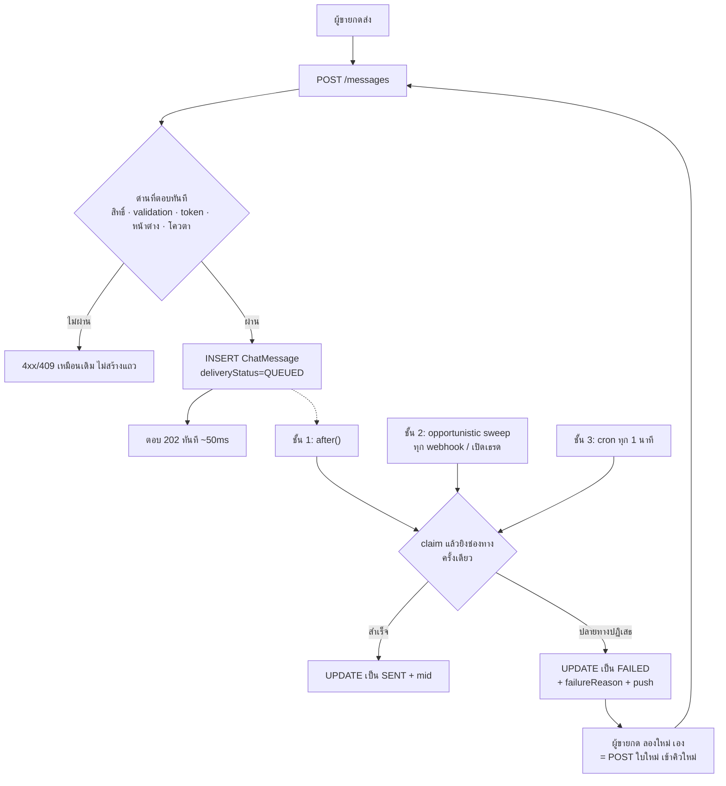
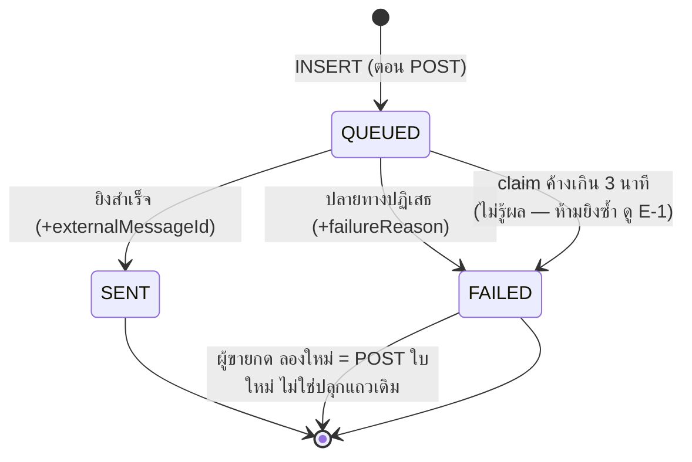

# ส่งข้อความแชทผู้ขายแบบเข้าคิว (Outbound Queue) — Design

- **วันที่:** 2026-08-23
- **ชนิดงาน:** CR ของแชทเดิม (feature 00018) — **ไม่ใช่ feature ใหม่** ไม่เปิดเลข 00053
- **เอกสารปลายทาง:** `docs/20 - Features/00018 - Facebook Chat Integration/EXTENSIONS-2026-08-23-outbound-queue.md`
- **สถานะ:** รอ user รีวิว → เข้า writing-plans

---

## 1. ที่มา

ผู้ขายรายงานว่า กดส่งข้อความแล้วไม่รอให้เสร็จ (กด back ไปแชทอื่น / ปิดแอป) ข้อความนั้น
**ไม่ไปถึงลูกค้าบน Facebook แต่ในแอปกลับขึ้นว่าส่งสำเร็จ**

### 1.1 🛑 สาเหตุยังไม่ถูกยืนยัน — และเอกสารฉบับนี้ไม่ได้อ้างว่ายืนยันแล้ว

สืบสวนแล้ว (2026-08-23) ได้ข้อเท็จจริง 3 ข้อ แต่ยังชี้ตัวการไม่ได้:

| # | ข้อเท็จจริง | หลักฐาน |
|---|---|---|
| F-1 | โค้ดยิง Meta **ก่อน** เขียน DB | `channel-chat.service.ts:3653` → `:3820` → `:3844` |
| F-2 | บนฐาน prod **ไม่มีแถว `deliveryStatus='SENT'` ที่ไม่มี `externalMessageId` เลยสักแถว** (30 วัน) | 24,567 MESSENGER + 194 LINE + 17 IG — ทุกแถวมี mid ครบ |
| F-3 | trigger realtime ของ `ChatMessage` เป็น `AFTER INSERT` เท่านั้น | `20260703000400_chat_realtime_broadcast/migration.sql:52` |

กลไกที่เป็นไปได้ 3 แบบ ให้ร่องรอยต่างกัน และยังแยกไม่ออกจากข้อมูลรวม:

- **กลไก A** — Meta รับแล้วดรอปเอง (AI ถือห้อง / standby) → มีแถว `SENT` + mid
- **กลไก B** — ฟังก์ชันตายหลังยิง Meta ก่อนเขียน DB → แถวมาจาก echo (`rawMessage->>'source'='webhook'`)
- **กลไก C** — คำขอตายก่อนถึง Meta → ไม่มีแถวเลย จอโชว์บับเบิลค้าง

**งานนี้แก้กลไก B และ C. ถ้าเป็นกลไก A งานนี้ไม่ช่วยอะไรเลย** — จึงต้องมีตัววัดใน §9
ที่ตอบคำถามนี้ให้ได้หลัง deploy โดยไม่ต้องเดาอีกรอบ

🛑 ห้ามเขียนที่ไหนว่า "แก้บั๊ก X แล้ว" จนกว่าตัวเลขใน §9 จะยืนยัน — บทเรียน
`docs/conventions/value-fate-decided-at-write-site.md`

---

## 2. ขอบเขต

### อยู่ในขอบเขต
- เส้นทางเดียว: `POST /api/chat/conversations/[id]/messages` **ที่มาจากคนกดในช่องพิมพ์ผู้ขาย**
- ช่องทาง MESSENGER / INSTAGRAM / LINE

### นอกขอบเขต (ยังเป็น synchronous เหมือนเดิมทุกประการ)

🛑 **แก้ไข 2026-08-23 (fix round 1):** ร่างแรกเขียนว่ามีผู้เรียก 8 ที่และอ้างว่ายืนยันด้วย grep แล้ว —
ไม่จริง (ใช้ `grep -l` ซึ่งจับไฟล์ที่แค่พูดถึงชื่อฟังก์ชันในคอมเมนต์ปนมาด้วย) รายการที่ถูกต้อง ยืนยันด้วย
`grep -rn "sendOutboundMessage(" src/` แล้วเปิดดูบริบทแต่ละจุด:

**ผู้เรียกภายนอกจริงมี 2 ไฟล์เท่านั้น** — ไม่มีคนถือมือถืออยู่ตรงนั้น จึงไม่มีอะไรให้ปิด:
`auto-reply-send.service.ts:134,165` · `line-rich-menu-reply.service.ts:112`

**บวกการเรียกซ้อนภายในไฟล์ตัวเอง 3 จุด** — `channel-chat.service.ts:2797,2812,2879` ทั้งหมดอยู่ใน
`sendOutboundImageGrid()` (นิยามที่ `:2683`) ซึ่งมีผู้เรียกภายนอกจุดเดียวคือ `.../messages/route.ts:1055`
ที่อยู่**ในขอบเขต**ของงานนี้ ⇒ หลังงานนี้เสร็จเส้นทางนี้จะไม่ถูกเรียกแบบ synchronous อีก และ Task 7 จะลบทิ้ง

**ไม่ใช่ผู้เรียก — แค่พูดถึงชื่อฟังก์ชันในคอมเมนต์** (ร่างแรกระบุผิดว่าเป็นผู้เรียก): `comment-private-reply.service.ts`
(คอมเมนต์ห้าม reuse ตรง ๆ) · `auto-reply-takeover.service.ts` (เป็นฝ่ายถูกเรียก ไม่ใช่ผู้เรียก) ·
`page-comment.service.ts` (import แค่ `mirrorRemoteImage`) · `api/orders/[token]/appointment-summary/route.ts` ·
`api/files/[...fileId]/route.ts`

แชท DEEP (`chat.service.sendMessage` — เขียนลง DB ของเราตรง ๆ ไม่มีอะไรให้คิว) นอกขอบเขตเหมือนเดิม

---

## 3. มติ

| ID | มติ | เหตุผล |
|---|---|---|
| D-1 | ใช้ **`ChatMessage` เป็นคิวในตัวเอง** (`deliveryStatus='QUEUED'`) ไม่สร้างตารางคิวแยก | งานคือแถวข้อความนั้นเอง — แยกตารางแล้วได้ "สถานะการส่ง" 2 ที่ที่ต้องตรงกันตลอดกาล = HR16 รอเกิด (ต่างจาก `AutoReplyJob` ที่ตัวกระตุ้นกับผลลัพธ์เป็นคนละแถว) |
| D-2 | "การันตี" = **คำสั่งไม่หาย + ยิงครั้งเดียว** — **ไม่มี auto-retry** (user เคาะ 2026-08-23 กลับมติเดิม) ล้ม = ขึ้นบับเบิลแดง + `(i)` เหตุผล + ปุ่ม "ลองใหม่" ให้คนกดเอง | Meta ปฏิเสธได้อย่างถูกต้อง (เกิน 24 ชม./ลูกค้าบล็อก/AI ถือห้อง) การลองซ้ำอัตโนมัติจึงไร้ผลโดยนิยามในเคสที่พบบ่อยที่สุด · และ auto-retry คือสิ่งเดียวที่เคยทำให้ลูกค้าเสี่ยงได้ข้อความซ้ำ (E-1) |
| D-3 | **ล็อกลำดับต่อห้อง** — ใบที่ 2 ไม่ออกก่อนใบที่ 1 ถึง SENT | ลูกค้าต้องอ่านเรียงตามที่ร้านพิมพ์ ("ตัวนี้มีสีดำครับ" → "300 บาท") |
| D-4 | ล้มถาวร → **push เข้าแอป + บับเบิลแดง** | สมมติฐานทั้งหมดของงานคือผู้ขายไม่ได้ดูจออยู่ |
| D-5 | ด่านที่ตอบได้ทันทีและแน่นอน **ยังอยู่ใน POST** (สิทธิ์/validation/token ตาย/หมดหน้าต่าง/โควตา) | ย้ายทั้งหมดไปหลังบ้าน = ผู้ขายเสียคำเตือนที่เคยได้ตอนกดส่ง |
| D-6 | 🛑 **แถวที่เคยถูก claim แล้ว (มี `sendLockedAt`) ห้ามยิงซ้ำโดยอัตโนมัติเด็ดขาด** — ดู §8 E-1 | ข้อความซ้ำถึงลูกค้าคือความเสียหายที่ผู้ขายแก้ไม่ได้และลูกค้าเห็น. เกณฑ์ปลอดภัยคือ `sendLockedAt IS NULL` = ยังไม่เคยแตะ Meta แน่นอน |
| D-7 | `pauseForHumanTakeover` **ยังทำที่ "ส่งสำเร็จ" เหมือนเดิม** ไม่ย้ายมาตอนเข้าคิว | โค้ดมีมติเขียนไว้แล้วที่ `channel-chat.service.ts:3914` ("ส่งไม่ผ่าน = ลูกค้าไม่ได้รับอะไร ไม่ใช่การรับช่วงต่อ") — งานนี้ไม่มีเหตุผลใหม่ที่จะกลับมติ |
| D-8 | ตัวเลข: **ไม่มี backoff ไม่มีจำนวนครั้ง** · cron **ทุก 1 นาที** · เพดานห้องค้าง **3 นาที** | ไม่มี retry มาช่วยกลบความช้า ⇒ latency ของชั้น 3 ต้องต่ำ. ถ้าแพลนจำกัดความถี่ cron ให้ถอยเป็น `*/2` แล้วขยับเพดานห้องค้างเป็น 5 นาที |

---

## 4. สถาปัตยกรรม



**ชั้น 3 คือตัวการันตี ชั้น 1-2 คือตัวทำให้เร็ว** — เพราะแถวถูกเขียนลง DB **ก่อน**ตอบ client
ต่อให้ทุกอย่างหลังจากนั้นถูกฆ่า ชั้น 3 เก็บได้เสมอ

### 4.1 State machine



ปลายทางมีแค่ `SENT` / `FAILED` **เหมือนเดิม** — ไม่เพิ่มสถานะปลายทางใหม่ให้ทั้งระบบต้องรู้จัก

---

## 5. Data model (migration additive ล้วน — ไม่มีการลบ ไม่แตะ CHECK)

ยืนยันแล้ว: `ChatMessage.deliveryStatus` เป็น `String?` เปล่า **ไม่มี CHECK constraint** ในรีโป

```prisma
model ChatMessage {
  // ...
  /// 🛑 เกณฑ์ความปลอดภัยของทั้งงาน: NULL = **ยังไม่เคยแตะ Meta แน่นอน** → ยิงได้
  /// มีค่า = เคยเริ่มยิงไปแล้ว ผลไม่แน่ชัด → **ห้ามยิงซ้ำอัตโนมัติ** (D-6 / E-1)
  sendLockedAt      DateTime?
  /// ใครหยิบงานนี้ไปทำเป็นคนสุดท้าย: 'after' | 'sweep' | 'cron'
  /// 🛑 ไม่เคลียร์เมื่อสำเร็จ โดยตั้งใจ — บนแถว SENT มันจึงตอบว่า "ใครส่งสำเร็จ" (ดู §9)
  sendLockedBy      String?
  /// เจตนาการส่งที่ไม่มีที่อยู่ในคอลัมน์อื่น: sticker / template / messageTag
  /// (imageUrl=fileId และ replyToMid มีคอลัมน์ของตัวเองอยู่แล้ว)
  /// มีความหมายเฉพาะตอน QUEUED — เคลียร์เมื่อถึงปลายทาง
  sendPayload       Json?
}
```

```sql
CREATE INDEX "ChatMessage_send_queue_idx"
  ON "ChatMessage" ("conversationId", "createdAt")
  WHERE "deliveryStatus" = 'QUEUED';
```

🛑 **partial index บังคับ** — ตารางนี้โต ~24,000 แถว/เดือน แต่แถวที่ค้างจริงมีหลักสิบ
index เต็มคือการจ่ายค่าเขียนทุกแถวเพื่อ query ที่แตะหลักสิบ. คีย์เป็น `(conversationId, createdAt)` เพราะ worker หยิบงาน **เป็นห้อง แล้วเรียงเก่าสุดก่อน** (D-3)

### 5.1 การเติมค่าที่ 3 ให้ฟิลด์ที่วันนี้ถูกใช้เป็น binary

`ChatThread.tsx:2910` เขียน `failedPersisted = mExt.deliveryStatus === 'FAILED'` — ตรรกะ binary
แบบนี้ **ไม่พังเสียงดัง** เมื่อมีค่าที่ 3 มันเงียบ ๆ ตกเข้า branch "ไม่ FAILED = ปกติ"

วิธีที่พิสูจน์แล้วว่าได้ผล (บทเรียน 00028 → `docs/conventions/enum-value-removal.md`):
1. ขยาย type union เป็น `'SENT' | 'FAILED' | 'QUEUED' | null` ให้ **`tsc` บังคับให้ครบ**
2. grep **ทั้ง repo** (`src/ e2e/ scripts/ prisma/ docs/`) ไม่ใช่แค่ `src/` — คอลัมน์เป็น `String`
   ไม่มี type ให้ TS จับที่ชั้น DB
3. grep จับ object key ไม่ได้ → ต้องพึ่ง type union เป็นด่านสอง

---

## 6. สัญญา API

| | เดิม | ใหม่ |
|---|---|---|
| status | `200` | `202 Accepted` |
| body | แถวที่ส่งแล้ว (`SENT` + mid) | แถวที่เข้าคิว (`QUEUED`, `externalMessageId=null`) |
| เวลา | รอ Meta ~1-3 วิ | ~50ms |
| `partialError` (IMAGE_GRID) | มี | **ไม่มีแล้ว** — สถานะย้ายไปอยู่รายแถว |

`202` ปลอดภัยเพราะ client ทุกตัวเช็ค `res.ok` — **แต่ต้อง grep ยืนยันซ้ำก่อนแก้ ไม่ใช่เชื่อบรรทัดนี้**

`SEND_FAILED` + `savedMessage` **ยังต้องอยู่**: เป็นเส้นทางของกรณีที่ชั้น 1 ล้มแบบ non-retryable
ภายในคำขอเดียวกัน (ผู้ขายยังอยู่หน้าจอ ควรได้รู้ทันทีเหมือนเดิม)

---

## 7. จอผู้ขาย · realtime · push

### 7.1 🛑 จุดที่จะสร้างบั๊กเดิมขึ้นมาใหม่ด้วยมือเรา

`useSellerChatThread.postMessage` วันนี้เขียน `{...real, _status: 'sent'}` ทับบับเบิล optimistic
ถ้าปล่อยไว้ **แถวที่เพิ่งเข้าคิวจะขึ้นเช็คถูกทันที** = "Deep บอกว่าส่งสำเร็จทั้งที่ยังไม่ออก" เป๊ะ ๆ

⇒ ต้องเป็น `_status: undefined` แล้วให้ `ChatThread` อ่าน `deliveryStatus` เป็น SSOT

| deliveryStatus | จอแสดง |
|---|---|
| `QUEUED` | "กำลังส่ง" + สปินเนอร์ (คำ/ไอคอนชุดเดิม ไม่คิดคำใหม่) · ไม่ขึ้น "ส่งแล้ว" · ไม่นับเป็น `lastShopMsgId` · ไม่มีปุ่ม "ลองใหม่" · ห้าม unsend/react/reply |
| `SENT` / `FAILED` | เหมือนเดิมทุกประการ |

**HR8:** ส่วนนี้แตะ UI ⇒ ผ่าน `safepay-ux` ก่อนแก้ frontend + รัน `/impeccable critique` และ
`/impeccable clarify` ก่อน mark complete

### 7.2 Realtime — ไม่แก้ trigger = พังเงียบ

`QUEUED → SENT` เป็น **UPDATE** แต่ trigger ปัจจุบันเป็น `AFTER INSERT` เท่านั้น (F-3)
⇒ จอเครื่องอื่น/แท็บอื่นจะค้าง "กำลังส่ง" ตลอดกาล

```sql
-- AFTER INSERT OR UPDATE OF "deliveryStatus" ON "ChatMessage"
--   + guard: TG_OP='UPDATE' และค่าไม่เปลี่ยน → RETURN NEW (ไม่ broadcast)
--   + channel 2 (chat:shop:{id}) ยังคง INSERT + senderRole='BUYER' เท่านั้น — ห้ามยิงตอน UPDATE
--   + คง EXCEPTION WHEN OTHERS THEN RETURN NEW (Realtime ล่มต้องไม่ rollback)
```

`UPDATE OF "deliveryStatus"` แคบไว้โดยตั้งใจ — `AFTER UPDATE` เปล่า ๆ จะทำให้ทุกรีแอ็กชัน/
ทุกการแก้ข้อความยิง broadcast แล้ว client refetch รัว

### 7.3 Push ตอนล้มถาวร

- ยิง **เฉพาะ `QUEUED → FAILED`** (ไม่ยิงตอนเข้าคิว ไม่ยิงตอน retry)
- ผ่าน `shopAudience()` ⇒ เคารพสวิตช์ปิดแจ้งเตือนรายร้านที่มีอยู่แล้ว
- ถ้อยคำจาก `describeSendFailure()` ตัวเดิม — ไม่พิมพ์คำใหม่ (HR16)
- 🛑 **throttle key ต้องคนละตัวกับ `chat:${conversationId}`** ของ noti ข้อความใหม่ ไม่งั้น noti
  "ส่งไม่สำเร็จ" ถูกกลืนเพราะห้องเดียวกันเพิ่งมี noti ข้อความเข้า — คลาสเดียวกับ
  `docs/conventions/log-row-collides-with-the-guard-it-explains.md`

---

## 8. Edge cases

| # | สถานการณ์ | การตัดสิน |
|---|---|---|
| **E-1** | 🛑 **claim แล้วตายกลางทาง — ไม่รู้ว่า Meta ได้รับหรือยัง** | หลังตัดสิน D-2 (ไม่มี auto-retry) เคสนี้เหลือทางเดียวและเป็นทางที่ถูก: **`sendLockedAt` มีค่า = ห้ามยิงซ้ำ** → เมื่อค้างเกิน 3 นาที ปิดเป็น `FAILED` พร้อม `failureReason` ที่พูดความจริงว่า **"ไม่แน่ใจว่าส่งออกไปหรือยัง — เปิดดูในแชทก่อนกดส่งใหม่"** แล้วให้คนกด "ลองใหม่" เอง. 🛑 ห้ามเขียนเหตุผลกลาง ๆ อย่าง "ส่งไม่สำเร็จ" เฉย ๆ — มันชวนให้กดซ้ำทันทีโดยไม่ตรวจ ซึ่งเป็นวิธีเดียวที่จะเกิดข้อความซ้ำในดีไซน์นี้ |
| **E-2** | `after()` อาจไม่รันเมื่อ client ตัดการเชื่อมต่อก่อน response ถูกส่ง | **ยังไม่ยืนยัน — ห้ามเขียนว่ารู้แล้ว** ผลกระทบจำกัด: ชั้น 3 เก็บได้ใน ≤1 นาที |
| **E-3** | หน้าต่าง 24 ชม. ปิดระหว่างอยู่ในคิว | Meta ปฏิเสธ → FAILED + เหตุผลของ `describeSendFailure` ซึ่งมี `retryable:false` อยู่แล้ว ⇒ บับเบิลขึ้น "ส่งไม่สำเร็จ" **ไม่ใช่ "ลองใหม่"** (ปุ่มที่กดแล้วไม่มีวันผ่าน = UI โกหก) |
| **E-4** | LINE reply token (60 วิ) หมดระหว่างอยู่ในคิว | ความเสี่ยงลดลงมากหลังตัด auto-retry (คิวไม่ยืดเป็นนาที) แต่ยังเกิดได้ถ้าชั้น 1 ตายแล้วรอ cron → ตกไปเป็น `PUSH` = **เสียโควตาจริงของร้าน** ⇒ ต้องนับ (ตัววัด §9) และเป็นเหตุผลที่ cron ตั้งไว้ที่ 1 นาที |
| **E-5** | ร้านถอดการเชื่อมต่อเพจ / token ตาย ระหว่างอยู่ในคิว | `CHANNEL_NOT_ACTIVE` → non-retryable → FAILED |
| **E-6** | ไฟล์แนบถูกลบระหว่างอยู่ในคิว | transmit ล้ม → FAILED |
| **E-7** | deploy ระหว่างมีแถวค้างคิว | คิวอยู่ใน DB จึงรอด — แต่ `sendPayload` ต้อง **tolerate shape เก่า** (อ่านไม่ออก = FAILED ไม่ใช่ throw ทั้ง worker) |
| **E-8** | cron กวาดหลายห้องพร้อมกัน → Meta rate limit | จำกัด concurrency **ต่อ `shopChannelId`** ไม่ใช่ต่อรอบ |
| **E-9** | cron รอบใหม่มาก่อนรอบเก่าจบ | claim ด้วย conditional `updateMany` + limit ต่อรอบ + `maxDuration` |
| **E-10** | unsend / react / reply บนแถวที่ยัง QUEUED | ปิดไว้ทั้งหมด (ยังไม่มี mid ให้อ้าง) |
| **E-11** | ดับเบิลคลิกส่งการ์ดสินค้า | `isDuplicateProductSend`: `QUEUED` = **บล็อก** (กำลังส่งอยู่) · `SENT` = บล็อก · `FAILED` = **ไม่บล็อก** (คงเจตนาเดิมของไฟล์นั้น: ด่านกันซ้ำที่บล็อกการกู้คืน แย่กว่าไม่มีด่าน) |
| **E-12** | `IMAGE_GRID` / การ์ดสินค้าหลายชุด | สร้างหลายแถว QUEUED เรียงกัน worker ส่งตามลำดับ — `partialError` หายจาก response ไปอยู่ที่สถานะรายแถวแทน |
| **E-13** | caption ที่ตามหลังไฟล์แนบ (วันนี้เป็น `.catch(() => {})` = เงียบ) | ต้องกลายเป็น **แถวคิวของตัวเอง** ไม่งั้นยังหายเงียบเหมือนเดิม (บั๊กที่มีอยู่ก่อน แต่ไม่ควรยกมาทั้งดุ้น) |
| **E-14** | บอทตอบแทรกระหว่างข้อความของคนอยู่ในคิว | ช่องว่างกว้างขึ้นจาก ~0 เป็น **ปกติ ~1-2 วิ / กรณีแย่สุด ~1 นาที** (รอ cron) — **ยอมรับตาม D-7** บันทึกเป็นหนี้ §10 |
| **E-15** | `chat-metrics.service.ts:91` นับข้อความ SHOP แรกเป็น "ตอบแล้ว" **โดยไม่ดู `deliveryStatus`** | **บั๊กที่มีอยู่ก่อนงานนี้** (แถว FAILED ก็ถูกนับวันนี้) — งานนี้ทำให้เวลาเร็วขึ้น ~1-2 วิ ไม่มีนัยสำคัญ **ไม่แก้ในรอบนี้** บันทึกเป็นหนี้ §10 |
| **E-16** | แถว QUEUED โผล่เป็นข้อความล่าสุดในรายการแชท | ถูกแล้ว — ร้านควรเห็นสิ่งที่ตัวเองเพิ่งพิมพ์ |
| **E-17** | echo ของ Meta มาก่อนเราเขียน mid → บับเบิลซ้ำ | **ไม่แย่ลงกว่าเดิม** — วันนี้ก็เขียน mid หลัง Graph ตอบเหมือนกัน จังหวะเท่าเดิม |
| **E-18** | พนักงานหลายคนส่งในห้องเดียวกันพร้อมกัน | เรียงด้วย `createdAt` + `seq` ที่มีอยู่แล้ว — ถูกต้องโดยไม่ต้องทำอะไรเพิ่ม |
| **E-19** | ผู้ขายอยากยกเลิกข้อความที่ยังอยู่ในคิว | **ไม่ทำในรอบนี้** — บันทึกเป็นคำถามค้าง §10 |
| **E-20** | conversation / shop ถูกลบระหว่างอยู่ในคิว | FK cascade ลบแถวทิ้งเอง ไม่ต้องจัดการ |

---

## 9. ตัววัดที่ตอบคำถามใน §1.1

`sendLockedBy` ไม่ถูกเคลียร์เมื่อสำเร็จ (นิยามเดียว: "ใครหยิบงานนี้ไปทำเป็นคนสุดท้าย")
บนแถวที่ `SENT` แล้ว มันจึงแปลว่า **ใครเป็นคนส่งสำเร็จ**

```sql
-- จำนวนข้อความที่ "คำขอเดิมตายจริง" แล้วถูกกู้คืน
select "sendLockedBy", count(*)
from "ChatMessage"
where "deliveryStatus" = 'SENT' and "createdAt" > now() - interval '7 days'
group by 1;
```

| ผลลัพธ์ | แปลว่า |
|---|---|
| `sweep`/`cron` > 0 | บั๊กเดิมคือกลไก **B/C** จริง — งานนี้แก้ตรงจุด |
| `sweep`/`cron` ≈ 0 แต่ผู้ขายยังบ่นเหมือนเดิม | เป็นกลไก **A** (Meta รับแล้วดรอป) — งานนี้ไม่ได้แก้ ต้องไปทางอื่น **และเรารู้ทันทีโดยไม่ต้องเดาอีกรอบ** |

ตัววัดที่สอง (E-4): จำนวนข้อความ LINE ที่ `sendMethod='PUSH'` ทั้งที่ตอนเข้าคิวยังมี reply token
— ถ้าตัวเลขนี้สูง แปลว่าคิวกำลังกินเงินร้าน ต้องเพิ่มความถี่ cron ไม่ใช่ปล่อยไว้

---

## 10. หนี้ที่รู้ตัว (บันทึกไว้ ไม่ใช่ซ่อนไว้)

| # | หนี้ | ทำไมไม่แก้รอบนี้ |
|---|---|---|
| KG-1 | E-15 `chat-metrics` นับแถว FAILED เป็น "ตอบแล้ว" | บั๊กที่มีอยู่ก่อน ไม่ได้เกิดจากงานนี้ และไม่ได้กินเคสของงานนี้ (`known-limitation-vs-unfinished.md` ผ่าน) |
| KG-2 | E-14 ช่องว่างที่บอทตอบแทรกกว้างขึ้นเป็นสูงสุด ~1 นาที | กลับมติ D-7 ต้องมีเหตุผลใหม่ ซึ่งงานนี้ไม่มี |
| KG-3 | E-19 ไม่มีปุ่มยกเลิกข้อความที่อยู่ในคิว | ยังไม่รู้ว่าผู้ขายต้องการจริงไหม — รอดูจากการใช้งานจริง |
| KG-4 | E-2 ยังไม่ยืนยันว่า `after()` รอดเมื่อ client ตัดการเชื่อมต่อ | วัดยาก ผลกระทบจำกัด (ชั้น 3 รับใน ≤1 นาที) |

---

## 11. ไฟล์ที่แตะ

| ไฟล์ | งาน |
|---|---|
| migration ×2 | คอลัมน์ + partial index · trigger realtime (§7.2) |
| `src/lib/chat-send-queue.ts` **ใหม่** | SSOT: เกณฑ์ claim (`sendLockedAt IS NULL`) / เพดานห้องค้าง / การแปล error เป็นสถานะปลายทาง — ฟังก์ชันบริสุทธิ์ทั้งหมด |
| `src/services/channel-chat.service.ts` | แตก `sendOutboundMessage` → guard / transmit / persist ให้ผู้เรียกที่เหลือ (`auto-reply-send.service.ts`, `line-rich-menu-reply.service.ts`, และ `sendOutboundImageGrid` ภายในไฟล์เดียวกัน) ใช้ **ส่วนกลางร่วมกัน** (ไม่งั้นได้ตรรกะการส่ง 2 ชุดที่ค่อย ๆ ห่างกัน) |
| `src/services/chat-outbox.service.ts` **ใหม่** | claim · deliver · sweep |
| `.../messages/route.ts` | POST เขียนคิว + `after()` |
| `src/app/api/cron/chat-outbox/route.ts` **ใหม่** + `vercel.json` | ชั้น 3 |
| webhook route | ชั้น 2 opportunistic |
| `ChatThread.tsx` · `useSellerChatThread.ts` | สถานะ QUEUED + `keepalive: true` |
| `seller-push.service.ts` | push ตอนล้มถาวร (throttle key ใหม่) |

---

## 12. แผนพิสูจน์

### unit `[blocker]` — `src/lib/chat-send-queue.ts`
ยกเป็นฟังก์ชันบริสุทธิ์เพราะ **ต้องมีบ้านให้เทสจับ** (`ui-boolean-needs-a-testable-home.md`)

- 🛑 **แถวที่ `sendLockedAt` ไม่ null ต้องไม่ถูก claim ซ้ำเด็ดขาด** (D-6/E-1) — เทสสำคัญที่สุดของงานนี้ เพราะ mutation ที่ผ่อนเงื่อนไขนี้แปลว่า "ลูกค้าได้ข้อความซ้ำ"
- เพดานห้องค้าง 3 นาที → ปิดเป็น FAILED พร้อมเหตุผล **"ไม่แน่ใจว่าส่งออกไปหรือยัง"** (ไม่ใช่ข้อความกลาง ๆ)
- `retryable` แมปจาก `describeSendFailure()` **ตัวจริง ไม่ mock** — mock แล้วเทสยืนยันแค่ความคิดของคนเขียนเทส
- ลำดับต่อห้อง: ใบที่ 2 **ห้าม**ออกก่อนใบที่ 1 ถึงปลายทาง
- throttle key ของ push ล้มเหลว **≠** key ของ noti ข้อความใหม่
- E-11: `QUEUED` บล็อกการส่งซ้ำ · `FAILED` ไม่บล็อก

### integration
POST → เกิดแถว `QUEUED` จริง → รัน worker → `SENT` + mid

🛑 อย่างน้อย 1 เคส **ห้าม mock adapter ทิ้ง** ต้องยืนยันว่า transport ถูกเรียกจริง —
บทเรียน 00038: เทสที่ mock เพื่อนบ้านทิ้งจะเขียวตลอดไม่ว่าเพื่อนบ้านทำอะไร

### mutation
ทุกข้อต้องพิสูจน์ด้วย mutation. 🛑 **mutation แล้วเทสยังเขียว = ชุด input อ่อน ไม่ใช่ "mutation ไม่เกี่ยว"**
ต้องเติม input แล้วรันซ้ำจนแดง (`mutation-silence-means-weak-corpus.md` — พลาดมาแล้ว 2 ครั้งใน session เดียว 2026-08-21)

### หลัง deploy
รัน query §9 — **นี่คือ feedback loop ตัวจริงของบั๊กที่ตั้งต้น** ไม่ใช่การที่ tsc/build เขียว
