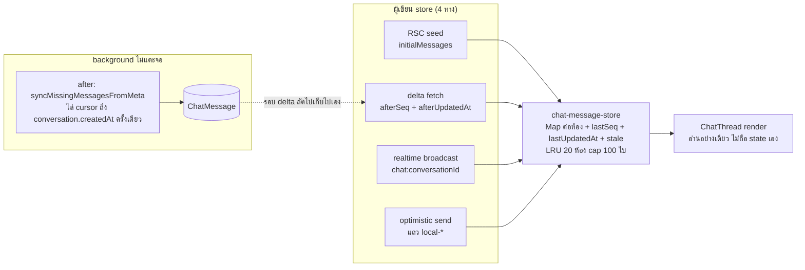

# ห้องแชทเปิดแล้วเห็นทันที ไม่โหลดซ้ำ ไม่เด้ง — Design

- **วันที่:** 2026-09-14
- **ขอบเขต:** `/inbox` และ `/inbox/[conversationId]` ฝั่งผู้ขาย (Paces) + `useSellerChatThread` (ใช้ร่วมกับ ChatWidget) + backfill จาก Meta
- **ฟีเจอร์แม่:** 00018 (Facebook Chat Integration) — เอกสารนี้เป็นส่วนขยาย ไม่ใช่ฟีเจอร์ใหม่
- **สถานะ:** รออนุมัติ spec ก่อนทำแผน implementation

---

## 1. ปัญหา

ผู้ใช้รายงาน 3 อาการ ซึ่งไล่แล้วมาจากรากเดียวกัน: **จอเป็นผู้บริโภคของ network โดยตรง แล้วทุกการโหลดคือการ "แทนที่" ไม่ใช่ "เติม"**

| อาการที่ผู้ใช้เห็น | รากจริงในโค้ด |
|---|---|
| เข้าห้องแล้วข้อความไม่ตรงกับที่เห็นในรายการ | `staleTimes.dynamic = 30` (`next.config.ts:43`) + `prefetch` เต็ม (`InboxList.tsx:1741`) ⇒ RSC payload ที่ใช้ตอนกด เป็นภาพ ณ ตอน prefetch ไม่ใช่ตอนกด |
| กล่องแชท "เด้งตลอดเวลา" | `refetchNewer()` ยิง `GET …/messages?take=30` **ทุก 6 วินาที** แล้ว `setMessages(ก้อนใหม่ทั้งชุด)` — ทั้ง array ถูกแทน ไม่ใช่ต่อเติม (`useSellerChatThread.ts`) |
| บรรทัด `X replied to an ad.` โผล่ทีหลัง | Meta ไม่ยิง webhook ให้ข้อความอัตโนมัติของตัวเอง ⇒ รู้จักได้เมื่อ `syncMissingMessagesFromMeta` ตอบกลับหลังจอวาดไปแล้ว |

และเมื่อไล่ต่อพบปัญหาที่ยังไม่มีใครรายงานอีก 3 ข้อ:

- **auto-loadOlder** — `IntersectionObserver` ที่ topSentinel ยิง `loadOlder()` ทันทีถ้า sentinel อยู่ในจอ (เธรดสั้น / จอสูง) โดยผู้ใช้ไม่ได้เลื่อนเลย
- **backfill ตื้นและไม่มีขอบล่าง** — `fetchThreadMessages()` (`src/lib/facebook/graph.ts:294`) ขอ `messages.limit(50)` หน้าเดียว แล้ว **โยน `paging` ทิ้ง** ⇒ เธรดที่ขาดเกิน 50 ใบ เติมไม่ครบตลอดกาล
- **บับเบิลไม่บอกเวลาจริง** — มีเวลาเฉพาะระดับกลุ่ม ข้อความกลางกลุ่มจึงตอบไม่ได้ว่าเข้ามากี่โมง และไม่มี `title` ให้ hover

---

## 2. เป้าหมาย

1. กดเข้าห้อง **เห็นข้อความทันที ไม่มีสเกเลตัน ไม่มีจอว่าง**
2. สิ่งที่เห็นต้อง **ตรงกับข้อความล่าสุดที่รายการแสดง** เสมอ
3. **ไม่กระพริบ ไม่เด้ง** — ทั้งตอน poll, ตอนข้อความใหม่เข้า, ตอนโหลดของเก่า, ตอนใบ backfill ถูกแทรกกลางเธรด
4. โหลดข้อความเก่า **เฉพาะตอนผู้ใช้เลื่อนถึงบนสุดจริง ๆ**
5. backfill จาก Meta ไล่ย้อนถึง `Conversation.createdAt` **ครั้งเดียวจบ** แล้วไม่ทำซ้ำ
6. ลด query ที่เสียเปล่า

### ไม่ใช่เป้าหมายรอบนี้

- การเรียงรายการ / unread ลอยขึ้นบน (**user เคาะให้แยกรอบ**)
- ย้ายการจำแนก "ข้อความระบบ" ไปเก็บตอน ingest (คงไว้เป็น regex ตอน render)
- backfill ของ Instagram และ LINE (ข้อจำกัดฝั่งแพลตฟอร์ม — IG ตอบ error 2207085, LINE ไม่มี endpoint)
- ส่งข้อความ / อัปโหลด / AI / auto-reply

---

## 3. มติที่ผู้ใช้เคาะแล้ว

| # | มติ | เหตุผล |
|---|---|---|
| **D-1** | ภาพแรกตอนเข้าห้องมาจาก **cache ข้อความจริงฝั่ง client** ไม่ใช่จาก `lastMessagePreview` ของแถวในรายการ | preview เป็นสตริงย่อ ไม่มี `id`/ชนิด/ไฟล์แนบ/สถานะส่ง ⇒ ถ้า render จากมันแล้วแทนด้วยของจริง คือการกระพริบที่ข้อ 3 ห้ามไว้เอง |
| **D-2** | เพิ่ม `ChatMessage.updatedAt` + index แล้ว delta ดึง **สองแกน** (`seq` + `updatedAt`) | ตารางไม่มี `updatedAt` เลย แต่มีฟิลด์ที่แก้ทีหลัง 6 ตัว (`reactionEmoji`, `isDeleted`, `body`, `deliveryStatus`, `failureReason`, `cards`) — ทุกวันนี้การดึง 30 ใบทั้งก้อนทุก 6 วิ ทำหน้าที่นี้อยู่ **โดยบังเอิญ** ตัดทิ้งเฉย ๆ = กดลบข้อความแล้วค้างในจอร้าน |
| **D-3** | backfill **ครั้งแรกไล่จนสุดถึง `conversation.createdAt` แล้วปักธง** รอบถัดไปดึงหน้าเดียว | จ่ายแพงครั้งเดียวต่อเธรด อยู่ใน `after()` ผู้ใช้ไม่รอ |
| **D-4** | เข้าห้องแล้ว **จอเด้งล่างสุดเสมอ** | ตรงกับเป้าหมายข้อ 2 — ข้อความล่าสุดต้องอยู่บนจอ |
| **D-5** | ข้อความระบบของ Meta **นับรวมในโควตา 30 ใบต่อหน้า** | ฐานข้อมูลไม่รู้ว่าแถวไหนเป็นข้อความระบบ (จำแนกด้วย regex ตอน render — `meta-system-notice.ts:30`) ⇒ กรองใน SQL ไม่ได้ การจะ "ไม่นับ" บังคับให้ต้องเก็บชนิดตอน ingest ซึ่งอยู่นอกขอบเขตรอบนี้ |
| **D-6** | รายการซ้ายใช้หลักการเดียวกัน — **patch รายแถว ไม่ `setItems` ก้อนใหม่** | ต้นเหตุ "กล่องแชทเด้งตลอดเวลา" |
| **D-7** | เพิ่ม badge **"Meta AI"** บนบับเบิลที่ AI ของ Meta ตอบ โดย **derive จาก marker ไม่เพิ่มคอลัมน์** | marker มีอยู่แล้วเป็นข้อความจริงในเธรด และ `readMetaAiControlMarker()` อ่านได้อยู่แล้ว |
| **D-8** | delta merge ต้อง **แทรกตามเวลา ไม่ใช่ต่อท้าย** | ใบที่ backfill มามี `seq` ใหม่ (autoincrement ตอน insert) แต่ `createdAt` เก่า ⇒ ต่อท้ายจะไปโผล่ล่างสุดทั้งที่ควรอยู่กลางเธรด |

---

## 4. สถาปัตยกรรมใหม่

**กฎเดียวที่คุมทั้งหมด: จอไม่เคยอ่านจาก network โดยตรง — จออ่านจาก store, network เขียนลง store แบบเติมเท่านั้น**



---

## 5. องค์ประกอบ

### 5.1 `src/lib/chat-message-store.ts` (ไฟล์ใหม่)

```ts
type ThreadCache = {
  items: ChatMessageView[]      // เรียงเก่า→ใหม่ เสมอ
  lastSeq: number               // watermark แกนที่ 1
  lastUpdatedAt: string         // watermark แกนที่ 2 (ISO)
  oldestCursor: string | null   // ไว้ต่อ loadOlder
  stale: boolean                // realtime บอกว่ามีของใหม่ ตอนยังไม่ได้เปิดห้อง
  touchedAt: number             // สำหรับ LRU
}
```

- **LRU 20 ห้อง** · **cap 100 ใบ/ห้อง** (ตัดหัวทิ้ง เก็บใบใหม่สุดเสมอ) · **TTL 30 นาที** (เกินนั้นถือว่าไม่มี cache ให้ RSC seed แทน)
- อยู่ใน memory ของแท็บเท่านั้น **ไม่ลง localStorage** — ข้อความลูกค้าเป็น PII ไม่ควรค้างบนดิสก์ของเครื่องร้าน
- 🛑 **store คือภาพนิ่ง ไม่ใช่แหล่งความจริง** (HR16) — ทุกครั้งที่เปิดห้องต้องยิง delta ไป reconcile เสมอ ห้ามเชื่อ cache อย่างเดียว

### 5.2 delta API

`GET /api/chat/conversations/[id]/messages` รับพารามิเตอร์เพิ่ม 2 ตัว (เพิ่มใน `ChatMessagesQuerySchema` — `src/lib/validations.ts:940`):

| พารามิเตอร์ | ความหมาย |
|---|---|
| `afterSeq` | คืนแถวที่ `seq > afterSeq` = ข้อความที่เกิดใหม่ |
| `afterUpdatedAt` | คืนแถวที่ `updatedAt > afterUpdatedAt` = ข้อความเก่าที่เพิ่งถูกแก้ค่า |

- ทั้งคู่ระบุพร้อมกัน = `OR` กัน; ไม่ระบุเลย = พฤติกรรมเดิม (หน้าแรก 30 ใบ) เพื่อไม่ทำ ChatWidget พัง
- คำขอที่มี `afterSeq` **ไม่ trigger `after(syncMissingMessagesFromMeta)`** — ตัวนั้นผูกกับ "เปิดห้อง" ไม่ใช่ "poll"
- ความถี่ poll: **6 วิ → 12 วิ** (realtime เป็นตัวหลักอยู่แล้ว poll เหลือหน้าที่กันกรณี realtime หลุด)

### 5.3 migration `ChatMessage.updatedAt`

```prisma
updatedAt DateTime @updatedAt @default(now())
@@index([conversationId, updatedAt])
```

- **additive ล้วน** ไม่แตะคอลัมน์เดิม ไม่มี CHECK constraint (ไม่ชนกฎ migration-check-constraint-additive)
- แถวเก่าได้ `updatedAt = createdAt` จาก default ตอน backfill column
- `@updatedAt` ให้ Prisma เขียนเองทุก write path — **ไม่มีทางหลุด** ต่างจากการไล่เติมมือทีละจุด

### 5.4 กฎ merge และ scroll (หัวใจของ "ห้ามเด้ง")

| สถานการณ์ | กฎ |
|---|---|
| ใบใหม่ที่เวลา **ใหม่กว่าใบสุดท้าย** | ต่อท้าย · ถ้าจอ**อยู่ล่างสุด**อยู่แล้ว → เลื่อนตาม · ถ้าผู้ใช้เลื่อนขึ้นไปอ่านของเก่าอยู่ → **ห้ามเลื่อน** ขึ้นปุ่ม "ข้อความใหม่" แทน |
| ใบที่เวลา **อยู่กลางเธรด** (backfill / D-8) | แทรกตามตำแหน่งเวลา · ต้อง **ตรึงตำแหน่งอ่าน** ด้วยการชดเชย `scrollTop` เท่าความสูงที่งอกเหนือจุดอ่าน |
| ใบเดิมที่ **ค่าเปลี่ยน** (reaction/ลบ/สถานะส่ง) | แทนที่เฉพาะ object ใบนั้น **object ใบอื่นต้องเป็นตัวเดิมเป๊ะ** (`Object.is` ผ่าน) เพื่อให้ React ไม่ re-render ทั้งลิสต์ |
| `loadOlder` | prepend + ชดเชย `scrollTop` (มีอยู่แล้ว) · **ยิงเฉพาะตอนผู้ใช้เลื่อนถึง sentinel จริง** — เพิ่มเงื่อนไข "เคยมี scroll event จากผู้ใช้แล้ว" ก่อนติด observer |

ลำดับการเรียงยึด `[createdAt asc, seq asc]` ที่เดียวทั้งระบบ (ตรงกับ `orderBy` ของ `getMessages` — `chat.service.ts:687`)

### 5.5 รายการซ้าย — patch รายแถว

`refreshFirstPage` (`InboxList.tsx:933`) เปลี่ยนจาก `setItems([...ก้อนใหม่, ...ของเดิมที่ไม่ซ้ำ])` เป็น:

1. เทียบทีละแถวด้วย `id`
2. แถวที่ทุกฟิลด์เท่าเดิม → **คืน object เดิม** (ไม่สร้างใหม่)
3. แถวที่เปลี่ยน → สร้างใหม่เฉพาะแถวนั้น
4. ลำดับเปลี่ยน → จัดลำดับใหม่ได้ แต่ object ยังเป็นตัวเดิม

ผลคือ React re-render เฉพาะแถวที่ข้อมูลเปลี่ยนจริง แถวที่เหลือนิ่งสนิท

### 5.6 backfill ที่มีขอบเขต

```
เปิดห้อง (คำขอที่ไม่มี cursor)
  └─ after():
       ถ้า conversation.metaBackfilledAt != null → ดึงหน้าเดียว (พฤติกรรมเดิม) จบ
       ถ้ายังไม่เคย:
         หน้า = 1
         cursor = null
         loop:
           ดึง GET /{thread_id}/messages?limit=100&after=<cursor>
           insert เฉพาะ externalMessageId ที่ยังไม่มี (createMany skipDuplicates)
           ถ้า ใบเก่าสุดของหน้านี้ <= conversation.createdAt → หยุด แล้วตั้ง metaBackfilledAt = now()
           ถ้า ไม่มี paging.next → หยุด แล้วตั้ง metaBackfilledAt = now()
           ถ้า หน้า >= 20 → หยุด **ไม่ตั้งธง** (ไปต่อรอบหน้า)
           หน้า++
```

- เพิ่ม `Conversation.metaBackfilledAt DateTime?` (additive)
- คง throttle 5 นาที/เธรดไว้ตามเดิม
- `createdAt: m.createdTime` เหมือนเดิม ⇒ ใบที่เติมเข้ามาไปนั่งตรงเวลาจริงของมัน (D-8 ฝั่ง client รับช่วงต่อ)
- **ยังไม่ bump `lastMessageAt`** สำหรับใบเก่า (กฎเดิม ถูกอยู่แล้ว — รายการต้องไม่ดูเหมือนมีความเคลื่อนไหวใหม่)

### 5.7 badge "Meta AI" (D-7)

กฎตัดสิน — เขียนเป็น **ฟังก์ชันบริสุทธิ์** ใน `src/lib/meta-system-notice.ts` (อยู่ติดกับ `readMetaAiControlMarker` ตาม HR16):

```
attributeMetaAi(messages) →
  ไล่จากบนลงล่าง จำ control ล่าสุดที่เจอ (AI | HUMAN)
  ข้อความที่ติดป้าย = senderRole 'SHOP'
                    ∧ control ปัจจุบัน === 'AI'
                    ∧ senderUserId === null      (ไม่ได้ส่งจากแอปเรา)
                    ∧ autoReplyKind == null      (ไม่ใช่บอทของเรา)
```

- 🛑 **ไม่มี marker = ไม่ติดป้าย** ห้ามเดา (บทเรียน `viaStandby` 2026-08-09 ที่บล็อกช่องพิมพ์ผิด 18 เธรด)
- ใช้ `AutoReplyTag` เป็นฐาน แต่ **ห้ามใช้ไอคอน `robot` (=DeepBot) หรือ `sparkles` (=DeepAI)** ต้องเป็นตัวที่สาม — ตัวไอคอนจริงให้ `safepay-ux` เลือกและถาม user (HR12: จุดที่ควรมี icon แต่สเปกไม่ระบุ ต้องถามก่อน)
- Messenger เท่านั้น

### 5.8 เวลาบนบับเบิล

ทุกบับเบิลได้ `title` + `aria-label` เป็นวัน+เวลาเต็มจาก `formatDateTimeTH` (`src/lib/format-date.ts` — ห้ามเรียก `Intl` เองตาม `date-format.md`)
🛑 `title=` ใช้แทนไม่ได้บนมือถือ (ไม่มี hover) ⇒ ต้องมี `aria-label` คู่กันเสมอ และต้องอยู่บน element ที่ role รองรับชื่อจากผู้เขียน (`aria-name-requires-supporting-role.md`)

---

## 6. เคสขอบที่ต้องจัดการ

| เคส | พฤติกรรมที่ต้องการ |
|---|---|
| เข้าห้องที่ไม่เคยเปิด (ไม่มี cache) | ใช้ `initialMessages` จาก RSC เหมือนเดิม แล้วยิง delta |
| cache มี 60 ใบ (เคย loadOlder) แล้วกลับเข้ามา | แสดงทั้ง 60 · จออยู่ล่างสุด (D-4) · delta เติมเฉพาะที่ขาด |
| แท็บเปิดค้างข้ามคืน | TTL 30 นาทีหมดอายุ → ถือว่าไม่มี cache |
| ข้อความ optimistic (`local-*`) ที่ยังไม่ลงฐาน | ต้องรอดจากการ merge ทุกชนิด และถูกจับคู่ทิ้งเมื่อของจริงมาถึง (ตรรกะ reconcile เดิมคงไว้) |
| delta คืนใบที่ `isDeleted = true` | แทนที่ใบเดิมในตำแหน่งเดิม ไม่ใช่ลบออกจาก array (ไม่งั้นเนื้อหาเลื่อนขึ้นทั้งเธรด) |
| ผู้ใช้เลื่อนอ่านของเก่าอยู่แล้วมีข้อความใหม่ | ไม่เลื่อนจอ · ขึ้นปุ่ม "ข้อความใหม่" ให้กดลงเอง |
| 2 แท็บเปิดห้องเดียวกัน | ต่างคนต่าง store ไม่ sync กัน — ยอมรับได้ เพราะทั้งคู่ reconcile จาก DB ชุดเดียวกัน |
| `seq` ของใบ backfill ใหม่กว่าใบที่ผู้ใช้เห็นอยู่ | delta คว้ามาได้ → แทรกตามเวลา (D-8) ไม่ใช่ต่อท้าย |

---

## 7. การทดสอบ

เทส `[blocker]` ที่ต้องมีและ **ต้องพิสูจน์ด้วย mutation ทุกตัว** (ถอดบรรทัดที่บังคับออกแล้วต้องแดง — `rule-must-be-enforced-not-described.md`):

1. **merge แทรกตามเวลา** — ป้อนใบที่ `seq` สูงสุดแต่ `createdAt` เก่าสุด ⇒ ต้องไปอยู่ตำแหน่งแรก ไม่ใช่ท้ายสุด (mutation: เปลี่ยนเป็น `[...prev, ...next]` → ต้องแดง)
2. **object identity** — merge ที่ไม่มีอะไรเปลี่ยน ต้องคืน object เดิมทุกใบตาม `Object.is` (mutation: `map(m => ({...m}))` → ต้องแดง)
3. **cap + LRU** — เกิน 100 ใบตัดหัว, เกิน 20 ห้องไล่ห้องที่เก่าสุด
4. **`attributeMetaAi`** — ไม่มี marker → ไม่ติดป้ายสักใบ · มี marker AI แล้วตามด้วย HUMAN → ใบหลัง HUMAN ไม่ติดป้าย · ใบที่มี `senderUserId` ไม่ติดป้าย
5. **ขอบเขต backfill** — หยุดเมื่อถึง `conversation.createdAt` · ไม่ตั้งธงเมื่อชนเพดาน 20 หน้า (mutation: ตั้งธงเสมอ → ต้องแดง)
6. **delta สองแกน** — ใบที่ `seq` เท่าเดิมแต่ `updatedAt` ใหม่กว่า ต้องถูกคืน (mutation: ตัดแกน `updatedAt` ออก → ต้องแดง)

🛑 **ถ้า mutation แล้วเทสยังเขียว = ชุด input อ่อน ไม่ใช่ mutation ไม่เกี่ยว** — ต้องเติม input แล้วรันซ้ำจนแดง (`mutation-silence-means-weak-corpus.md`)

**Browser QA** (user ตรวจเอง): เปิดห้องซ้ำ 3 รอบดูว่ามีกระพริบไหม · เลื่อนอ่านของเก่าแล้วให้ข้อความใหม่เข้า · กดลบข้อความจากมือถือลูกค้าแล้วดูว่าจอร้านอัปเดตใน 12 วิ · เปิดเธรดที่ไม่เคยเปิดแล้วดูว่า `replied to an ad.` โผล่แบบไม่กระตุก

---

## 8. ความเสี่ยง

| ความเสี่ยง | การรับมือ |
|---|---|
| delta พลาดการเปลี่ยนแปลงที่ไม่ผ่าน Prisma (raw SQL update) | **ตรวจแล้ว 2026-09-14: ไม่มี `$executeRaw`/`$queryRaw` ที่เขียน `ChatMessage` เลยทั้ง `src/`** ⇒ `@updatedAt` ครอบทุก write path จริง · ต้องมีเทสสแกนซอร์สกันคนเพิ่มทีหลัง |
| backfill 20 หน้าชนเพดานอัตราของ Graph | อยู่ใน `after()` + throttle 5 นาที + เพดานหน้า; ถ้ายังโดน ให้ลดเป็น 10 หน้า |
| cache ทำให้เห็นข้อความที่ถูกลบไปแล้วค้าง | delta แกน `updatedAt` จับ `isDeleted` ได้ภายใน 1 รอบ poll |
| ChatWidget (ผู้ใช้ hook ตัวเดียวกัน) พังตาม | พารามิเตอร์ delta เป็น optional ทั้งคู่ — ไม่ส่ง = พฤติกรรมเดิมทุกประการ; ต้องมีเทสยืนยัน |
| `staleTimes: 30` ยังทำให้ RSC payload เก่า | ยอมรับได้แล้ว เพราะ cache + delta reconcile ทันทีตอน mount โดยไม่แทนที่ทั้งก้อน |

---

## 9. ลำดับงาน

1. migration `ChatMessage.updatedAt` + `Conversation.metaBackfilledAt` (additive, apply ฐาน local ก่อน — HR15)
2. `chat-message-store.ts` + เทส `[blocker]` (ฟังก์ชันบริสุทธิ์ล้วน ไม่แตะ React)
3. delta API + schema + เทส
4. ต่อ store เข้า `useSellerChatThread` + กฎ scroll
5. `refreshFirstPage` patch รายแถว
6. backfill ไล่ cursor + ธง
7. badge Meta AI + เวลาบนบับเบิล (**ผ่าน `safepay-ux` ก่อน — HR8** แล้ว Controller รัน `/impeccable critique` + `/impeccable clarify` เป็น gate)
8. เอกสาร: `EXTENSIONS-2026-09-14` ใต้ `docs/20 - Features/00018 …/` + sync `docs/SRS.md` (data model เปลี่ยน 2 คอลัมน์ + API รับพารามิเตอร์ใหม่ — HR11)
