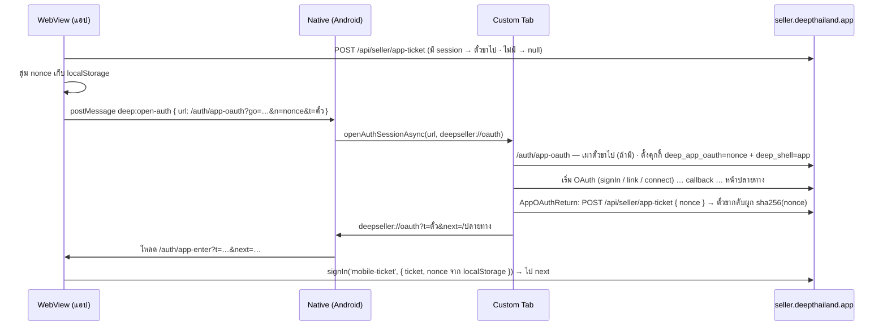

# ล็อกอิน/เชื่อมบัญชีผ่าน Facebook · LINE · Instagram · Apple ในแอปผู้ขาย Android

> 2026-10-01 · มติ user: "เบราว์เซอร์ระบบ + ตั๋ว (แนะนำ)" (ไม่ใช้ Facebook SDK native เพราะมี 2 แอป Meta —
> `FACEBOOK_ID` สำหรับล็อกอิน กับ `FB_CHAT_APP_ID` สำหรับเชื่อมเพจ)

## ปัญหา

iOS ทำ OAuth ทั้งสายใน WebView (`OAUTH_HOSTS` ใน `SellerWebView.tsx`) แต่บน Android
**Facebook ปิดการล็อกอินใน WebView ตั้งแต่ 2021** ⇒ ต้องออกไป Custom Tab (Chrome) ซึ่งเป็น
**cookie jar คนละใบ** กับ WebView:

- เริ่ม OAuth ใน WebView แล้วไปจบใน Custom Tab ไม่ได้ — คุกกี้ `state`/`pkce` ของ NextAuth อยู่คนละใบ
- จบใน Custom Tab แล้ว session ก็อยู่ใน Custom Tab ไม่ใช่ใน WebView

## แนวทาง: เริ่มและจบใน Custom Tab ทั้งสาย แล้ว "ส่งตั๋ว" ข้ามสองทาง

- **ตั๋วขากลับผูกกับ nonce** — URL `deepseller://` ถูกแอปอื่นที่จดทะเบียน scheme เดียวกันดักได้
  แต่ nonce อยู่ใน localStorage ของ WebView เท่านั้น ⇒ ดักได้ตั๋วก็แลกไม่ได้ (หลักเดียวกับ PKCE)
  ตั๋วเดิม (`mobile-ticket` purpose `enter`) อายุ 60 วิ ใช้ครั้งเดียว — เพิ่มฟิลด์ `nh` ในส่วนที่เซ็นแล้ว ไม่ต้อง migration
- **ตั้ง `deep_shell=app` ใน Custom Tab** — แท็บแสดงหน้าเว็บของเรา (เช่น หน้าเลือกเพจ) ต้องซ่อนการจ่ายเงิน
  เหมือนในแอป (Google Payments policy) · อายุ 15 นาที ลบตอนส่งกลับ
- **หน้าที่ยังอยู่กลางสาย ห้ามส่งกลับ**: `/auth/app-oauth`, `/auth/callback/*`, `/settings/channels/select`
  (หน้าเลือกเพจอ่าน token จากคุกกี้ในแท็บ — ต้องเลือกให้จบในแท็บ)

## ทางเข้า (ฝั่งผู้ขายเท่านั้น — แอปผู้ขายโหลดแค่ `seller.*`)

| จุด | เดิม | Android |
|---|---|---|
| หน้าล็อกอิน (FB/LINE/IG/Apple) | `signIn(provider)` | `go=signin:<provider>` |
| หน้าคำเชิญ `/i/[slug]` | `signIn(provider)` | `go=signin:<provider>` |
| `/account` เชื่อมบัญชี | `link/start` + `signIn` | `go=link:<provider>` |
| เชื่อมเพจ Facebook (5 ลิงก์) | `href=/api/channels/facebook/connect` | ดักคลิกที่ `AppOAuthBridge` |

`go` ผ่าน allow-list (`parseAppOAuthGo`) — ห้ามเป็น URL อิสระ (open redirect ในแท็บที่ถือ session)

## แอป (deep-seller-app)

- `onMessage` รับ `deep:open-auth` เฉพาะ Android · URL ต้องเป็นโฮสต์ผู้ขาย + path `/auth/app-oauth` เท่านั้น
- `+native-intent`: `deepseller://oauth?…` → `/auth/app-enter?…` (ผ่าน `requestNavigate` — รองรับ cold start)
- App Links แคบลงเหลือ `/inbox` `/orders` `/i/` `/products` `/queues` — **ห้ามครอบ `/api/*` และ `/auth/*`**
  ไม่งั้น Chrome อาจส่ง callback ของ OAuth เข้าแอปกลางสาย (คุกกี้ state ไม่ตรง ⇒ ล็อกอินล้ม)

## สิ่งที่ไม่ทำ

- ไม่แตะ iOS (iOS ยังทำใน WebView + Apple native เหมือนเดิม) · ไม่แตะฝั่งผู้ซื้อ
